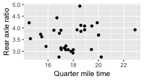
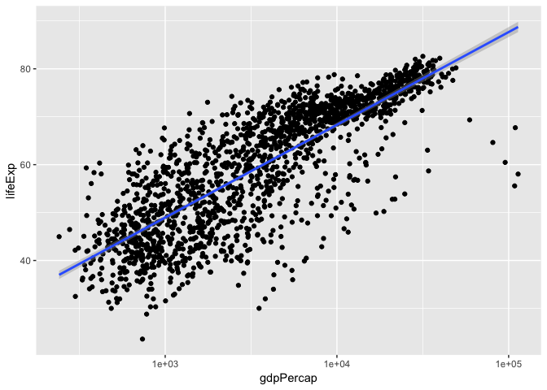

cm014 Worksheet: The Model-Fitting Paradigm in R
================

``` r
suppressPackageStartupMessages(library(tidyverse))
```

    ## Warning: package 'ggplot2' was built under R version 3.4.4

``` r
library(gapminder)
library(broom)
```

    ## Warning: package 'broom' was built under R version 3.4.4

So you want to fit a model to your data. How can you achieve this with R?

Topics:

1.  What *is* model-fitting?
2.  How do we fit a model in R?
3.  How can we obtain tidy results from the model output?

What is Model-Fitting?
----------------------

When variables are not independent, then we can gain information about one variable if we know something about the other.

Examples: Use the scatterplot below:

1.  A car weighs 4000 lbs. What can we say about its mpg?
2.  A car weights less than 3000 lbs. What can we say about its mpg?

``` r
library(tidyverse)
ggplot(mtcars, aes(wt, mpg)) +
  geom_point() +
  labs(x = "Weight (1000's of lbs)")
```


Example: What can we say about rear axle ratio if we know something about quarter mile time?

``` r
ggplot(mtcars, aes(qsec, drat)) + 
  geom_point() +
  labs(x = "Quarter mile time",
       y = "Rear axle ratio")
```



If EDA isn't enough, we can answer these questions by fitting a model: a curve that predicts Y given X. Aka, a **regression curve** or a **machine learning model**.

(There are more comprehensive models too, such as modelling entire distributions, but that's not what we're doing here)

There are typically two goals of fitting a model:

1.  Make predictions.
2.  Interpret variable relationships.

Fitting a model in R
--------------------

Model fitting methods tend to use a common format in R:

    method(formula, data, options)

They also tend to have a common output: a special *list*.

**Method**:

A function such as:

-   Linear Regression: `lm`
-   Generalized Linear Regression: `glm`
-   Local regression: `loess`
-   Quantile regression: `quantreg::rq`
-   ...

**Formula**:

In R, takes the form `y ~ x1 + x2 + ... + xp` (use column names in your data frame).

**Data**: The data frame.

**Options**: Specific to the method.

Exercise:

1.  Fit a linear regression model to life expectancy ("Y") from log(GDP per capita) ("X") by filling in the formula. Notice what appears as the output.
2.  On a new line, use the `unclass` function to uncover the object's true nature: a list. Note: it might be easier to use the `names` function to see what components are included in the list.

``` r
(my_lm <- lm(lifeExp ~ gdpPercap, data=gapminder))
```

    ## 
    ## Call:
    ## lm(formula = lifeExp ~ gdpPercap, data = gapminder)
    ## 
    ## Coefficients:
    ## (Intercept)    gdpPercap  
    ##   5.396e+01    7.649e-04

``` r
summary(my_lm)
```

    ## 
    ## Call:
    ## lm(formula = lifeExp ~ gdpPercap, data = gapminder)
    ## 
    ## Residuals:
    ##     Min      1Q  Median      3Q     Max 
    ## -82.754  -7.758   2.176   8.225  18.426 
    ## 
    ## Coefficients:
    ##              Estimate Std. Error t value Pr(>|t|)    
    ## (Intercept) 5.396e+01  3.150e-01  171.29   <2e-16 ***
    ## gdpPercap   7.649e-04  2.579e-05   29.66   <2e-16 ***
    ## ---
    ## Signif. codes:  0 '***' 0.001 '**' 0.01 '*' 0.05 '.' 0.1 ' ' 1
    ## 
    ## Residual standard error: 10.49 on 1702 degrees of freedom
    ## Multiple R-squared:  0.3407, Adjusted R-squared:  0.3403 
    ## F-statistic: 879.6 on 1 and 1702 DF,  p-value: < 2.2e-16

``` r
unclass(my_lm)
```

    ## $coefficients
    ##  (Intercept)    gdpPercap 
    ## 5.395556e+01 7.648826e-04 
    ## 
    ## $residuals
    ##            1            2            3            4            5 
    ## -25.75074507 -24.25141712 -22.61108281 -20.57515356 -18.43355958 
    ##            6            7            8            9           10 
    ## -16.11884535 -14.84962486 -13.78554374 -12.77823084 -12.67852245 
    ##           11           12           13           14           15 
    ## -12.38242715 -10.87300047   0.04981907   3.83881961   9.09535049 
    ##           16           17           18           19           20 
    ##  10.15321238  11.20005998  12.27210573  13.68724146  15.18459435 
    ##           21           22           23           24           25 
    ##  15.71519221  16.55212706  18.17375745  17.92630825 -12.75176474 
    ##           26           27           28           29           30 
    ## -10.57589884  -7.60363645  -5.03212854  -2.63680782   0.30254655 
    ##           31           32           33           34           35 
    ##   3.01806576   7.49786656   9.94626787  11.52707138  12.99370879 
    ##           36           37           38           39           40 
    ##  13.58529333 -26.63341459 -24.88448612 -23.22105658 -22.19483670 
    ##           41           42           43           44           45 
    ## -20.21398390 -16.77382303 -16.12230690 -15.90838505 -15.31855444 
    ##           46           47           48           49           50 
    ## -14.73430643 -15.07380022 -14.89387983   4.00797681   5.19874878 
    ##           51           52           53           54           55 
    ##   5.73040420   5.51887509   5.88662280   6.81616645   9.10410352 
    ##           56           57           58           59           60 
    ##   9.82766306  10.79259116  10.93075546  13.65527639  11.58971337 
    ##           61           62           63           64           65 
    ##   7.48532662   7.99924214   7.62969428   6.03365842   5.13310774 
    ##           66           67           68           69           70 
    ##   5.51092957   5.88681267   5.62200770   5.68724142   4.22418589 
    ##           71           72           73           74           75 
    ##   2.94190800   0.94042406   8.15029580   6.76088932   7.36139908 
    ##           76           77           78           79           80 
    ##   6.36747444   3.93025080   3.10844868   2.70520460   2.86603197 
    ##           81           82           83           84           85 
    ##   1.40046825   1.29947426   0.22877349  -1.75908830 -10.56372281 
    ##           86           87           88           89           90 
    ##  -9.02358198  -6.78731975  -5.35639815  -4.62894070  -3.15546929 
    ##           91           92           93           94           95 
    ##   0.40216588   2.62573453   4.08545491   4.44842757   2.93846272 
    ##           96           97           98           99          100 
    ##  -1.11104125 -16.99492737 -15.11363589 -13.26453162 -11.05418360 
    ##          101          102          103          104          105 
    ##  -9.18561564  -7.53728952  -4.46437256  -1.71173687   1.42161267 
    ##          106          107          108          109          110 
    ##   4.71238420   7.18823380   9.04229324   7.66294277   7.85363431 
    ##          111          112          113          114          115 
    ##   7.88745578   6.92696567   4.73220580   4.22143216   3.92731903 
    ##          116          117          118          119          120 
    ##   4.16502677   2.94212887   2.49335804   1.04631561  -0.28544990 
    ##          121          122          123          124          125 
    ## -16.54544159 -14.33154309 -12.06381624  -9.86285035  -7.77206807 
    ##          126          127          128          129          130 
    ##  -5.55274846  -4.02900259  -2.55619687  -0.94769496  -0.12164228 
    ##          131          132          133          134          135 
    ##  -0.59965138   1.67002533 -15.58940134 -13.69299123 -12.19574893 
    ##          136          137          138          139          140 
    ## -10.90222513  -9.52116461  -6.64643934  -2.51092095   1.18918828 
    ##          141          142          143          144          145 
    ##   3.73608642   5.55032991   7.31669372   8.67495279  -0.88019953 
    ##          146          147          148          149          150 
    ##   3.45879630   6.66673174   9.17284445  11.30674491  13.20556500 
    ##          151          152          153          154          155 
    ##  13.57806432  13.88464760  16.27445019  15.64273619  15.53062940 
    ##          156          157          158          159          160 
    ##  15.20089437  -6.98466045  -5.03990101  -3.18794074  -1.58667094 
    ##          161          162          163          164          165 
    ##   0.33704226   2.90445016   4.04734946   4.91966625   2.70547714 
    ##          166          167          168          169          170 
    ##  -8.01360999 -15.73802748 -12.84202239  -4.65165582  -2.57310396 
    ##          171          172          173          174          175 
    ##  -0.84265746   1.05299539   1.73495493   2.43922993   4.00267475 
    ##          176          177          178          179          180 
    ##   5.27792699   7.78528824   9.34551767  10.83101551  11.50016538 
    ##          181          182          183          184          185 
    ##   3.77484668  10.35315909  12.30036993  12.19868645  11.89813013 
    ##          186          187          188          189          190 
    ##  11.03196849  10.83389763  11.08191714  12.41367181  11.79779235 
    ##          191          192          193          194          195 
    ##  12.29730739  10.87988602 -22.39608738 -19.52163380 -16.69419778 
    ##          196          197          198          199          200 
    ## -13.86650992 -11.01833359  -8.38716472  -6.45097307  -5.09618215 
    ##          201          202          203          204          205 
    ##  -4.40824241  -4.35536547  -4.09923770  -2.59144830 -15.18408285 
    ##          206          207          208          209          210 
    ## -13.71288327 -12.18224966 -10.72344021 -10.25354253  -8.47091461 
    ##          211          212          213          214          215 
    ##  -6.91259168  -6.22017930  -9.70273715  -8.98378962  -6.93700718 
    ##          216          217          218          219          220 
    ##  -4.70451449 -14.82039664 -12.92154927 -10.92064150  -8.94092517 
    ##          221          222          223          224          225 
    ## -13.96105378 -23.13710299  -3.47621133  -0.56466073   1.32555726 
    ##          226          227          228          229          230 
    ##   2.01679714   2.11093140   4.45659954 -16.32951402 -14.53188858 
    ##          231          232          233          234          235 
    ## -12.38309632 -10.31035052  -8.19473533  -5.96467774  -2.80579020 
    ##          236          237          238          239          240 
    ##  -0.96129357  -1.01312035  -3.05253021  -5.57885268  -5.08752409 
    ##          241          242          243          244          245 
    ##   6.09989482   6.45109304   7.04721752   5.87773589   4.41417863 
    ##          246          247          248          249          250 
    ##   3.35750597   4.28955034   2.53827978   3.84522403   2.50731871 
    ##          251          252          253          254          255 
    ##   0.32169204  -1.08251355 -19.31198785 -17.40241704 -15.39311846 
    ##          256          257          258          259          260 
    ## -13.34651087 -11.31699546  -8.02910206  -6.39236464  -4.11679214 
    ##          261          262          263          264          265 
    ##  -5.13162084  -8.45596132 -11.21257250  -9.75458068 -16.76510199 
    ##          266          267          268          269          270 
    ## -15.07540644 -13.30260826 -11.26998051  -9.23107086  -7.43992629 
    ##          271          272          273          274          275 
    ##  -5.04886694  -3.63302450  -3.04085590  -3.15123838  -4.31490432 
    ##          276          277          278          279          280 
    ##  -4.60796965  -2.22418229  -1.18250582   0.51186228   2.66144785 
    ##          281          282          283          284          285 
    ##   5.28315516   9.45807300  12.71185282  14.29358631  14.36029418 
    ##          286          287          288          289          290 
    ##  14.12131581  15.65993438  14.52268111 -10.26185707  -3.84716334 
    ##          291          292          293          294          295 
    ##  -9.82721427   3.95691117   8.64556999   9.44483944  10.83329971 
    ##          296          297          298          299          300 
    ##  12.26373937  13.46795855  14.71944365  15.68655529  15.21229822 
    ##          301          302          303          304          305 
    ##  -4.95255731  -0.61499944   2.00108301   3.95852515   5.17035730 
    ##          306          307          308          309          310 
    ##   6.96279389   9.33380981  10.06205191  10.30092187  11.67837527 
    ##          311          312          313          314          315 
    ##  13.32434064  13.57422733 -14.08421951 -12.42194739 -10.56448174 
    ##          316          317          318          319          320 
    ##  -8.91850340  -6.49358042  -3.91346460  -1.99174374  -0.03613177 
    ##          321          322          323          324          325 
    ##   3.02970131   5.80675890   8.19556953  10.44215172 -15.40958416 
    ##          326          327          328          329          330 
    ## -13.99643765 -12.51913639 -10.55857860  -8.65870018  -6.76022181 
    ##          331          332          333          334          335 
    ##  -6.68689889  -7.05815466  -8.75766234 -11.60734838  -9.17402447 
    ##          336          337          338          339          340 
    ##  -7.70585548 -13.47041182 -10.67330748  -7.40583075  -3.96387044 
    ##          341          342          343          344          345 
    ##  -1.50624561  -0.82345033  -0.99281151   0.30101801  -0.59451281 
    ##          346          347          348          349          350 
    ##  -3.65853775  -3.65045942  -1.41204131   1.24108516   3.78343174 
    ##          351          352          353          354          355 
    ##   6.23922844   8.28520571   9.97865734  12.26107377  15.46906463 
    ##          356          357          358          359          360 
    ##  16.49021458  17.04544357  18.19728302  18.25990838  17.44909900 
    ##          361          362          363          364          365 
    ## -14.54067289 -12.63457013 -10.34794310  -8.17513868  -5.97360564 
    ##          366          367          368          369          370 
    ##  -3.50733388  -1.96332872  -0.95037915  -3.17214392  -7.33084429 
    ##          371          372          373          374          375 
    ##  -8.38470002  -6.80911343   4.86858923   7.49620103   8.98449610 
    ##          376          377          378          379          380 
    ##   9.22062806   8.64498559   8.03714617   6.39129701   6.99178451 
    ##          381          382          383          384          385 
    ##  12.10986740  12.17076058  12.02608618  10.61044933   1.19239254 
    ##          386          387          388          389          390 
    ##   3.70964066   7.32776882   9.98205185  12.70939610  13.81310923 
    ##          391          392          393          394          395 
    ##  14.16485542  14.45663568  16.18056982  18.04060391  18.35258849 
    ##          396          397          398          399          400 
    ##  17.47319046   7.65499876   8.75930492   8.19092534   7.70520152 
    ##          401          402          403          404          405 
    ##   6.30801041   5.43405307   5.24266382   5.14886397   7.50889566 
    ##          406          407          408          409          410 
    ##   7.77920904   8.09540324   5.06563763   9.41090182   9.36450228 
    ##          411          412          413          414          415 
    ##   8.00479831   6.81434278   5.08400458   5.11331613   4.08563327 
    ##          416          417          418          419          420 
    ##   1.63351204   1.17638200  -0.64238774  -1.37915864  -2.60741125 
    ##          421          422          423          424          425 
    ## -21.18543765 -18.81892601 -16.57326315 -14.19154511 -12.41519981 
    ##          426          427          428          429          430 
    ##  -9.79374641  -7.34601604  -6.11850136  -4.16980640  -2.24802649 
    ##          431          432          433          434          435 
    ##  -2.04215650  -0.75741489  -9.09665046  -5.30884793  -1.76790090 
    ##          436          437          438          439          440 
    ##   1.53053509   4.00044212   5.78103235   7.58303920   9.87240016 
    ##          441          442          443          444          445 
    ##  12.17297249  13.23707576  13.40066145  13.67073452  -8.29256225 
    ##          446          447          448          449          450 
    ##  -5.49123541  -2.44095864  -0.78001529   0.80109790   2.24531119 
    ##          451          452          453          454          455 
    ##   4.86873535   8.31764037  10.22394027  12.67377723  15.80173755 
    ##          456          457          458          459          460 
    ##  15.78120003 -13.14779355 -10.62745985  -8.25876409  -6.05073165 
    ##          461          462          463          464          465 
    ##  -4.36668959  -2.76713659  -0.62950288   2.86951764   6.81589672 
    ##          466          467          468          469          470 
    ##  10.06944478  12.21372471  13.11349062 -11.02515487  -8.00262462 
    ##          471          472          473          474          475 
    ##  -4.53737244  -1.43437487   0.79398138  -1.19023343  -0.48631322 
    ##          476          477          478          479          480 
    ##   6.03148681   9.44312341  11.63660254  12.68511711  13.54092091 
    ##          481          482          483          484          485 
    ## -19.76088378 -18.29847463 -16.91636659 -15.66888437 -13.95387734 
    ##          486          487          488          489          490 
    ## -12.66475200 -11.00323838  -9.03112347  -7.27645013  -7.86330837 
    ##          491          492          493          494          495 
    ## -10.49983123 -11.67301324 -18.27916180 -16.17180433 -14.08897799 
    ##          496          497          498          499          500 
    ## -12.12513401 -10.20695854  -9.80740319 -10.46702931  -7.90116733 
    ##          501          502          503          504          505 
    ##  -4.41037924  -1.27625883   0.69903619   3.59386670 -20.15456028 
    ##          506          507          508          509          510 
    ## -17.57837810 -14.21739581 -12.23533107 -10.87367104  -9.87145395 
    ##          511          512          513          514          515 
    ##  -9.48155654  -7.71040565  -6.18684683  -4.94815573  -3.63598963 
    ##          516          517          518          519          520 
    ##  -1.53694608   7.68043596   7.76308182   7.62607936   7.52066905 
    ##          521          522          523          524          525 
    ##   5.93158409   6.62812197   6.41874844   4.70404569   5.95178088 
    ##          526          527          528          529          530 
    ##   5.02840125   2.84123718  -0.04208355   8.07745995   8.34838702 
    ##          531          532          533          534          535 
    ##   8.47690698   7.65102767   6.10432766   5.88271990   5.41198908 
    ##          536          537          538          539          540 
    ##   5.50620041   4.60893409   4.88179190   3.50941889   3.39545204 
    ##          541          542          543          544          545 
    ## -20.23656654 -18.76276846 -18.53884897 -15.75103289 -13.98671338 
    ##          546          547          548          549          550 
    ## -17.79837257  -8.95150919  -2.84044103  -2.93242454  -4.75580717 
    ##          551          552          553          554          555 
    ##  -6.77220259  -7.32197174 -24.32670539 -22.28900868 -20.51822297 
    ##          556          557          558          559          560 
    ## -18.66058358 -16.22587858 -12.79029482  -9.01485715  -5.15840813 
    ##          561          562          563          564          565 
    ##  -1.82068544   1.40541226   3.58016866   4.91667392   8.08002998 
    ##          566          567          568          569          570 
    ##   7.35194729   6.47556912   5.56576595   3.26417544   2.85446160 
    ##          571          572          573          574          575 
    ##   2.99290200   2.04535353   1.84099263   2.12920380   1.74057535 
    ##          576          577          578          579          580 
    ##   0.84387792 -11.50359762  -9.97476299  -8.41380268  -6.74458710 
    ##          581          582          583          584          585 
    ##  -4.98176375  -2.95926065  -0.88162299   1.12557884   2.83787666 
    ##          586          587          588          589          590 
    ##   3.83154404   3.64690141   5.05097410   9.20387555  10.14404664 
    ##          591          592          593          594          595 
    ##  10.95199434  10.53291893   8.65143778   8.86652891   9.60588891 
    ##          596          597          598          599          600 
    ##  10.38412667   9.65725294   9.57365011   7.07967628   4.46378570 
    ##          601          602          603          604          605 
    ## -13.78987781 -11.81537806  -9.10526692  -6.41971669  -3.30111511 
    ##          606          607          608          609          610 
    ##  -1.65918266   0.49432630   3.57837568   6.02178021   8.78348877 
    ##          611          612          613          614          615 
    ##  11.30637342  12.33671946 -20.73680132 -19.83833752 -18.72755619 
    ##          616          617          618          619          620 
    ## -17.30067875 -15.68084851 -13.86259292 -11.72025680  -9.01972928 
    ##          621          622          623          624          625 
    ##  -5.98714421  -3.16558792  -1.00282135   1.33041927 -21.68491118 
    ##          626          627          628          629          630 
    ## -20.79682990 -19.86685591 -19.01089609 -18.09693643 -17.07548650 
    ##          631          632          633          634          635 
    ## -15.26962736 -13.27383223 -11.25981139  -9.69191570  -8.89190743 
    ##          636          637          638          639          640 
    ##  -8.01060519 -17.78422562 -14.58042745 -11.73974065  -8.82321459 
    ##          641          642          643          644          645 
    ##  -7.17902629  -5.46617961  -4.03286192  -1.71395418   0.01953324 
    ##          646          647          648          649          650 
    ##   1.68917547   3.20975903   6.04132771 -13.72242185 -10.98897338 
    ##          651          652          653          654          655 
    ##  -7.66702699  -4.97303907  -2.00659339   0.99636085   4.56565846 
    ##          656          657          658          659          660 
    ##   8.22412491  10.08630439  11.28606200  12.23851046  13.52838243 
    ##          661          662          663          664          665 
    ##   4.66816534   8.01862151  10.10511388  11.30372491  11.68372998 
    ##          666          667          668          669          670 
    ##  11.08835377  10.35734198   6.91735905   4.70877816   4.33888065 
    ##          671          672          673          674          675 
    ##   4.43308759  -2.13250779   6.04834635   7.83441024   8.22929986 
    ##          676          677          678          679          680 
    ##   8.41065044   8.02661050   7.06455859   5.83822856   5.69130592 
    ##          681          682          683          684          685 
    ##   7.15591965   8.12553938   7.28057037   5.60771000  12.97551035 
    ##          686          687          688          689          690 
    ##  12.44386284  11.80778205   9.58628203   8.42077438   7.12069937 
    ##          691          692          693          694          695 
    ##   5.23592010   2.68134579   5.58192996   3.53099089   2.70824666 
    ##          696          697          698          699          700 
    ##   0.12738125 -17.00061953 -14.15788906 -10.85411919  -7.29856816 
    ##          701          702          703          704          705 
    ##  -3.85836079  -0.36966848   1.98591104   3.85052152   5.37680456 
    ##          706          707          708          709          710 
    ##   6.69361497   7.58736548   8.86678593 -17.06097937 -14.69451879 
    ##          711          712          713          714          715 
    ## -12.08716789  -8.57473171  -5.60242804  -2.31116569   1.04320929 
    ##          716          717          718          719          720 
    ##   4.84415122   6.90261600   9.69951345  12.43423304  13.98625618 
    ##          721          722          723          724          725 
    ## -11.40822907  -9.29122186  -7.83337679  -6.00451755  -6.07500392 
    ##          726          727          728          729          730 
    ##  -5.34694097  -0.15504400   4.00341442   6.25201355   7.76576229 
    ##          731          732          733          734          735 
    ##   8.42734063   8.13142948 -11.79434728 -10.28327003  -8.87901139 
    ##          736          737          738          739          740 
    ##  -6.32807951  -4.33010588  -4.77733702  -3.02205612   2.18247241 
    ##          741          742          743          744          745 
    ##   2.64046355   2.50247668  -0.26794436   2.16960145   8.96918611 
    ##          746          747          748          749          750 
    ##  10.66180161  11.26204540  11.26882726  10.03451631   9.54524714 
    ##          751          752          753          754          755 
    ##   9.49290402   9.79332423   8.08100578   3.41002725  -2.23750468 
    ##          756          757          758          759          760 
    ##  -6.18292471   8.30872925   9.76533308   9.99946549  10.37421197 
    ##          761          762          763          764          765 
    ##   7.89393653   8.92643698   8.74046512   8.54775137   9.16714275 
    ##          766          767          768          769          770 
    ##   8.32998530   8.98522949   7.26712733   8.21249365   9.07495039 
    ##          771          772          773          774          775 
    ##   8.97906603   9.43847826   8.84988450   8.62028375   8.37520494 
    ##          776          777          778          779          780 
    ##   7.77315848   6.64658413   5.99094106   4.89212611   4.73795624 
    ##          781          782          783          784          785 
    ##   2.35740315   5.01625509   7.64178250   8.86975972   9.35838619 
    ##          786          787          788          789          790 
    ##  11.06781992  12.61309193  12.95648777  12.14654148  12.85900249 
    ##          791          792          793          794          795 
    ##  12.74125720  13.01182484   6.61384503   8.24190962   9.74407406 
    ##          796          797          798          799          800 
    ##   9.94203649   8.16040187   8.71944996   8.32787300   7.59946942 
    ##          801          802          803          804          805 
    ##   4.88654230   4.69313327   6.16528310   4.43426194 -11.98076382 
    ##          806          807          808          809          810 
    ##  -9.72919119  -7.62551234  -4.42371326   0.95788176   4.99672490 
    ##          811          812          813          814          815 
    ##   6.60044426   8.51072105  11.43467269  13.02815154  14.36652868 
    ##          816          817          818          819          820 
    ##  15.12258169 -12.33841952  -9.99194536  -6.69263489  -4.10984026 
    ##          821          822          823          824          825 
    ##  -1.33152281   1.22986378   3.77920461   4.34171725   4.30302648 
    ##          826          827          828          829          830 
    ##  -0.58917226  -3.94835855  -0.96477486  -4.73196565  -1.07629451 
    ##          831          832          833          834          835 
    ##   1.46003383   4.34688210   7.19613306  10.06260055  12.00342918 
    ##          836          837          838          839          840 
    ##  13.55045440  13.17243780  12.47820857  11.44686239  12.12293098 
    ##          841          842          843          844          845 
    ##  -7.29084299  -2.41239536   0.16131596   2.20831773   6.33817416 
    ##          846          847          848          849          850 
    ##   7.24821157   8.86654800   9.32762756   9.03008635   8.45826709 
    ##          851          852          853          854          855 
    ##   8.37769530   6.80885216 -81.29034205 -82.75443547 -66.49981425 
    ##          856          857          858          859          860 
    ## -51.20665346 -69.88184703 -29.94369601  -6.62871878  -1.28886008 
    ##          861          862          863          864          865 
    ##  -5.48514494  -8.62480582  -3.90667149 -12.55185653  -1.72561862 
    ##          866          867          868          869          870 
    ##   0.87546676   3.76747087   5.31980202   5.73923364   5.51978727 
    ##          871          872          873          874          875 
    ##   7.18333831   9.85759527  10.06578052   9.61291918   9.94836892 
    ##          876          877          878          879          880 
    ##  10.03595685 -12.04614316  -9.16555924  -6.52354003  -5.84496122 
    ##          881          882          883          884          885 
    ##  -4.56838752  -2.31768111   0.51262641   2.63242514   4.98177683 
    ##          886          887          888          889          890 
    ##   0.69517510 -10.33792743 -12.56391527 -15.91580667 -14.94453005 
    ##          891          892          893          894          895 
    ## -13.93864575 -12.96538393 -11.95576581 -10.68133240  -9.54122640 
    ##          896          897          898          899          900 
    ##  -8.31567858 -13.64050270 -12.20050746 -10.60908252  -8.59461035 
    ##          901          902          903          904          905 
    ## -13.05875496 -11.30409378 -11.31589650 -18.08751291 -17.25389052 
    ##          906          907          908          909          910 
    ## -13.30366187  -5.08219382   3.27531922   7.42586445  10.35795391 
    ##          911          912          913          914          915 
    ##  11.48852977  10.77386714 -18.37829550 -16.30611449 -14.36455916 
    ##          916          917          918          919          920 
    ## -12.32441529 -10.44200636  -8.25571453  -5.98311016  -5.48933837 
    ##          921          922          923          924          925 
    ##  -2.53755604   0.26803851   2.64614674   4.68831258 -17.98192884 
    ##          926          927          928          929          930 
    ## -17.06703492 -15.87285499 -14.84757153 -12.63672808 -10.69584916 
    ##          931          932          933          934          935 
    ##  -8.79758162  -6.98465708  -4.96634280  -6.99007063  -9.45553147 
    ##          936          937          938          939          940 
    ##  -6.23337445  -6.89316265  -3.23804971   0.22346117   3.67323349 
    ##          941          942          943          944          945 
    ##   6.87521596   8.37252833  10.28094423  11.52895616  11.17068990 
    ##          946          947          948          949          950 
    ##  10.23195236  11.28129880  10.76138365 -20.61654558 -19.02364570 
    ##          951          952          953          954          955 
    ## -17.39907602 -15.88542948 -14.42323984 -12.76657271 -10.51226911 
    ##          956          957          958          959          960 
    ##  -8.11487183  -6.13282015  -4.65701550  -2.86527769  -0.28601342 
    ##          961          962          963          964          965 
    ## -13.98095734 -12.26474358 -10.51519743  -8.75357018  -6.73231627 
    ##          966          967          968          969          970 
    ##  -4.24896669  -1.48946696   1.10207921   3.33615100   5.34001403 
    ##          971          972          973          974          975 
    ##   7.08367447   8.82923983  -4.47481605   2.57763876   4.35599929 
    ##          976          977          978          979          980 
    ##   5.70805813   7.01849598   8.13597265   9.93452305  11.12555650 
    ##          981          982          983          984          985 
    ##  11.15558587  11.10064599  11.09780869  10.46462673  -5.82691874 
    ##          986          987          988          989          990 
    ##  -1.92570921   0.83904560   1.75274303   3.19704210   5.20601902 
    ##          991          992          993          994          995 
    ##   6.09803913   8.89701935  10.25417673  12.24360272  12.72973276 
    ##          996          997          998          999         1000 
    ##  13.07799986 -12.31319222  -9.40564067  -6.51254769  -3.64033846 
    ##         1001         1002         1003         1004         1005 
    ##  -1.28902664   0.27528604   2.00321250   4.47813714   5.94981610 
    ##         1006         1007         1008         1009         1010 
    ##   8.21443950   9.44002476  10.47953663   3.18334684   4.67594242 
    ##         1011         1012         1013         1014         1015 
    ##   6.21604551   8.70362645  10.73086521  11.77067884  11.56147658 
    ##         1016         1017         1018         1019         1020 
    ##  11.93544567  16.12270661  16.54400366  15.00995499  13.50929455 
    ##         1021         1022         1023         1024         1025 
    ## -12.37383849  -9.78849996  -7.22963749  -4.92930933  -2.56993352 
    ##         1026         1027         1028         1029         1030 
    ##  -0.03880696   3.62725171   6.61415148   9.18252893  11.42348116 
    ##         1031         1032         1033         1034         1035 
    ##  13.16707239  14.28645337 -23.02792831 -20.55562665 -18.22036061 
    ##         1036         1037         1038         1039         1040 
    ## -16.27599628 -14.18203793 -11.84477652 -11.51409837 -11.39277041 
    ##         1041         1042         1043         1044         1045 
    ##  -9.98584873  -7.97285019 -10.41420425 -12.50358372 -17.88973703 
    ##         1046         1047         1048         1049         1050 
    ## -12.31826980  -9.14433534  -4.84350492  -1.15862398   1.81966766 
    ##         1051         1052         1053         1054         1055 
    ##   3.77612888   4.08895930   5.09902484   6.05501282   5.48509583 
    ##         1056         1057         1058         1059         1060 
    ##   7.39138990 -14.08446848 -10.73466101  -7.99669843  -5.69829217 
    ##         1061         1062         1063         1064         1065 
    ##  -2.95387319  -0.48361772   1.80673906   4.05416811   5.13341402 
    ##         1066         1067         1068         1069         1070 
    ##   1.97076068  -5.59141142  -4.72945752 -18.21608410 -16.72691202 
    ##         1071         1072         1073         1074         1075 
    ## -15.06156791 -13.00095980 -10.50069461  -7.73847544  -4.91103199 
    ##         1076         1077         1078         1079         1080 
    ##  -2.01182868   1.08477310   4.69722527   6.57580036   8.99467697 
    ##         1081         1082         1083         1084         1085 
    ##  11.33518596  10.40947442   9.49094023   8.11335473   5.41866427 
    ##         1086         1087         1088         1089         1090 
    ##   5.06199774   5.72636312   4.78395207   2.97250662   0.93969861 
    ##         1091         1092         1093         1094         1095 
    ##  -1.22104294  -2.33966158   7.35989757   6.93661895   7.20659164 
    ##         1096         1097         1098         1099         1100 
    ##   6.50123850   5.66110363   5.84755013   6.39771435   5.82616830 
    ##         1101         1102         1103         1104         1105 
    ##   8.32865050   7.49334288   7.41696244   6.98486265 -14.02215406 
    ##         1106         1107         1108         1109         1110 
    ## -11.16807834  -8.10342315  -5.62321202  -2.39078451  -0.68199093 
    ##         1111         1112         1113         1114         1115 
    ##   2.68803768   5.79145797  10.22752772  12.74714092  14.98769967 
    ##         1116         1117         1118         1119         1120 
    ##  16.84053122 -17.09430919 -15.99663823 -15.23173486 -14.64404158 
    ##         1121         1122         1123         1124         1125 
    ## -14.13941896 -13.28327221 -12.05339155  -9.91173197  -7.00909746 
    ##         1126         1127         1128         1129         1130 
    ##  -3.08642626   0.08068767   2.43745902 -18.45555508 -16.99538503 
    ##         1131         1132         1133         1134         1135 
    ## -15.47588533 -13.69154511 -12.43362903 -10.95752142  -9.33576074 
    ##         1136         1137         1138         1139         1140 
    ##  -8.12894596  -7.72255467  -7.73445026  -8.58306541  -8.63701717 
    ##         1141         1142         1143         1144         1145 
    ##  10.99262622  10.57051736   9.22646039   7.60952371   5.87839723 
    ##         1146         1147         1148         1149         1150 
    ##   3.58399246   1.89906929  -2.19070523  -2.61530575  -7.21233696 
    ##         1151         1152         1153         1154         1155 
    ##  -9.08355822 -11.51201923 -17.77594252 -15.59099880 -13.02756582 
    ##         1156         1157         1158         1159         1160 
    ## -10.57852802  -9.93411433  -5.65115356  -1.13645574  -0.07758073 
    ##         1161         1162         1163         1164         1165 
    ##   3.00184303   3.47367849   5.11200952   4.61517041 -11.04319735 
    ##         1166         1167         1168         1169         1170 
    ##  -8.96999211  -6.90002380  -4.87639260  -2.82964099  -0.81200259 
    ##         1171         1172         1173         1174         1175 
    ##   1.09838469   2.98555393   5.37422098   6.29492647   8.05375969 
    ##         1176         1177         1178         1179         1180 
    ##   9.53419504  -0.66176076   2.98000900   5.15640081   6.73388599 
    ##         1181         1182         1183         1184         1185 
    ##   8.15741763  10.63185439  11.15491649  12.18665861  13.44387741 
    ##         1186         1187         1188         1189         1190 
    ##  14.34129935  15.12993793  14.07856323   7.20015207   7.67537089 
    ##         1191         1192         1193         1194         1195 
    ##   8.76245043   9.23668608   9.92938169   9.91281474   9.66118361 
    ##         1196         1197         1198         1199         1200 
    ##  10.36376849  11.05967710  12.19567636  13.90537235  14.60470739 
    ##         1201         1202         1203         1204         1205 
    ## -12.92839024 -10.93968406  -8.65111322  -6.93777303  -3.04930194 
    ##         1206         1207         1208         1209         1210 
    ##  -0.31301126   2.52880035   5.31306385   9.10147950   9.96478830 
    ##         1211         1212         1213         1214         1215 
    ##  11.43073220  11.79849581  -7.17716546  -3.80555703  -0.46027470 
    ##         1216         1217         1218         1219         1220 
    ##   1.04984453   2.58780142   4.28921634   6.13524019   8.52062531 
    ##         1221         1222         1223         1224         1225 
    ##  10.75902373  12.66828757  14.31979560  15.29209555   4.27247475 
    ##         1226         1227         1228         1229         1230 
    ##   8.19329113   9.60092024  10.63898674  10.77040085   9.44182670 
    ##         1231         1232         1233         1234         1235 
    ##  10.90000970  10.07750630  11.11510314  11.02354985  11.53413470 
    ##         1236         1237         1238         1239         1240 
    ##   9.83595277   3.51753450   4.66733469   6.81810846   7.77862439 
    ##         1241         1242         1243         1244         1245 
    ##   8.40347862   8.67368130   9.82412863  10.13089810   8.50778209 
    ##         1246         1247         1248         1249         1250 
    ##   8.52112018   8.05903821   8.45496541   7.96710156  11.59592315 
    ##         1251         1252         1253         1254         1255 
    ##  11.75715495  11.84435483  11.22638279  12.01113414  11.89244478 
    ##         1256         1257         1258         1259         1260 
    ##  11.28065379   8.75634319   7.95886755   9.40011312  10.00624498 
    ##         1261         1262         1263         1264         1265 
    ##  -3.31118906  -0.98386654   1.28291321   3.51071157   6.45757267 
    ##         1266         1267         1268         1269         1270 
    ##   9.80429595  11.90063443  13.90097770  14.99269441  16.17211649 
    ##         1271         1272         1273         1274         1275 
    ##  16.95731396  16.61969546   4.68917906   7.12822366   9.22272163 
    ##         1276         1277         1278         1279         1280 
    ##   7.89498558   9.12664726   8.34789322   8.35750107   8.15792792 
    ##         1281         1282         1283         1284         1285 
    ##  10.35742988  10.14519237  11.33506402  10.25322367 -14.33289575 
    ##         1286         1287         1288         1289         1290 
    ## -12.86881886 -11.41255766 -10.24638816  -9.80728578  -9.46809390 
    ##         1291         1292         1293         1294         1295 
    ##  -8.41185897 -10.58417464 -30.92033186 -18.31979919 -11.14349381 
    ##         1296         1297         1298         1299         1300 
    ##  -8.37372227  -8.15733910  -5.66892360  -2.88217173  -0.58980142 
    ##         1301         1302         1303         1304         1305 
    ##   1.35188530   3.26540836   4.94964408   6.61247512   7.69359176 
    ##         1306         1307         1308         1309         1310 
    ##   8.32620310   9.34648223  10.34982386 -19.02136228 -17.32716088 
    ##         1311         1312         1313         1314         1315 
    ## -16.93440761 -16.98340966 -19.06727909 -21.39988964 -16.71488601 
    ##         1316         1317         1318         1319         1320 
    ##  -3.87474318  -4.18848328   0.83103700   3.12654650   2.25803391 
    ##         1321         1322         1323         1324         1325 
    ## -17.78691377 -15.82563146 -13.76743303 -11.62586120  -9.36262311 
    ##         1326         1327         1328         1329         1330 
    ##  -6.27113097  -2.73801987   0.71069196   3.19415663   5.16644073 
    ##         1331         1332         1333         1334         1335 
    ##   6.48209648   7.79659890   1.30104293   3.91948913   5.76461091 
    ##         1336         1337         1338         1339         1340 
    ##   6.84572105   6.69629227   6.41575021   4.59468473   5.12307953 
    ##         1341         1342         1343         1344         1345 
    ##  10.57085623  12.22291285  13.72269072  12.56088853 -24.29749525 
    ##         1346         1347         1348         1349         1350 
    ## -23.15387359 -22.04265934 -20.76504260 -19.59102823 -18.19884080 
    ##         1351         1352         1353         1354         1355 
    ## -16.63112221 -14.93966153 -16.43998812 -14.49809928 -13.47858842 
    ##         1356         1357         1358         1359         1360 
    ## -12.04730333   4.66963006   7.04879789   9.03169765  10.18329805 
    ##         1361         1362         1363         1364         1365 
    ##   8.98916459   8.26503619   6.20181099   5.17758148   2.88637913 
    ##         1366         1367         1368         1369         1370 
    ##  -2.43602692  -2.73900915 -10.04256099   6.52292043   8.83380800 
    ##         1371         1372         1373         1374         1375 
    ##  10.65226973  10.58955605   8.99483616   8.13988292   8.16413331 
    ##         1376         1377         1378         1379         1380 
    ##   7.91734201  10.15922597   9.47929570   9.41237420   6.42072057 
    ##         1381         1382         1383         1384         1385 
    ##   8.39042683   9.41048545   9.53254570   8.03034348   6.39252540 
    ##         1386         1387         1388         1389         1390 
    ##   5.32930382   3.44149367   4.00755186   8.81184888   8.04820588 
    ##         1391         1392         1393         1394         1395 
    ##   6.90194879   4.26074600 -21.84627622 -19.94089600 -18.02205874 
    ##         1396         1397         1398         1399         1400 
    ## -15.96123099 -13.94216439 -13.09139987 -11.90068016 -10.29076498 
    ##         1401         1402         1403         1404         1405 
    ## -15.00657672 -10.87235794  -8.69424996  -6.50495011 -12.56085744 
    ##         1406         1407         1408         1409         1410 
    ## -10.16755169  -8.41696214  -7.47030163  -6.19961095  -4.56953706 
    ##         1411         1412         1413         1414         1415 
    ##  -2.34827904   0.89260259   2.40610901   0.55973781  -6.48853002 
    ##         1416         1417         1418         1419         1420 
    ## -11.70676129   8.05185247   9.21290097  11.37931674  11.37034027 
    ##         1421         1422         1423         1424         1425 
    ##  10.96704284  10.30974780  11.69255335  10.88607707   9.38527786 
    ##         1426         1427         1428         1429         1430 
    ##   9.17618470   6.82821778   4.94070758   2.80866427   6.68006684 
    ##         1431         1432         1433         1434         1435 
    ##   7.41459416   9.44190392  10.15833394  10.96178403  13.54085149 
    ##         1436         1437         1438         1439         1440 
    ##  13.61993274  14.77608136  14.46342670  14.55302817  15.40378203 
    ##         1441         1442         1443         1444         1445 
    ## -16.55660445 -15.68566099 -14.58442015 -12.38868098 -10.14200049 
    ##         1446         1447         1448         1449         1450 
    ##  -7.84058850  -5.06742965  -3.36486559  -1.54091650   0.16898943 
    ##         1451         1452         1453         1454         1455 
    ##   0.88872334   2.60991235 -13.42693423 -11.48361671 -10.38332238 
    ##         1456         1457         1458         1459         1460 
    ##  -9.32127700  -6.97726603  -4.31089625  -1.37407252   0.67450429 
    ##         1461         1462         1463         1464         1465 
    ##   1.80079394  -2.63183380 -13.24408590 -17.79484391  11.38163871 
    ##         1466         1467         1468         1469         1470 
    ##  10.95301545   9.98386293   8.53363252   7.12503288   7.06202208 
    ##         1471         1472         1473         1474         1475 
    ##   6.65631781   5.19320619   5.93902860   6.10845902   3.64153474 
    ##         1476         1477         1478         1479         1480 
    ##   1.02970512   4.39448015   2.90578118   1.73705082   1.24803382 
    ##         1481         1482         1483         1484         1485 
    ##  -0.97663097   0.79615328   0.53351956   0.29248871  -0.30354139 
    ##         1486         1487         1488         1489         1490 
    ##   0.83468814   0.29055286  -0.94257004  -9.32963431  -7.29099711 
    ##         1491         1492         1493         1494         1495 
    ##  -5.32797693  -1.74001161   1.37360228   4.79526841   7.75707473 
    ##         1496         1497         1498         1499         1500 
    ##  10.63447255  12.73831592  14.50101739  15.96836132  16.98675090 
    ##         1501         1502         1503         1504         1505 
    ##   3.62126561   7.29110219   9.85015058  11.52219749  12.32708508 
    ##         1506         1507         1508         1509         1510 
    ##  12.35375822  12.52414921  10.98899665   8.66624641   5.83859237 
    ##         1511         1512         1513         1514         1515 
    ##   5.26206701   2.47832747 -13.28871408 -11.51585864 -10.26180906 
    ##         1516         1517         1518         1519         1520 
    ##  -8.84734861  -7.03618195  -4.77275453  -4.01625388  -3.05680715 
    ##         1521         1522         1523         1524         1525 
    ##  -4.14711106  -6.09319573  -4.99224714  -2.28565478  -3.68718697 
    ##         1526         1527         1528         1529         1530 
    ##  -0.93255447   1.33887437   3.33856374   5.28348342   7.03833243 
    ##         1531         1532         1533         1534         1535 
    ##   8.81090684   9.84705901   9.81105507   9.08886743  10.08554458 
    ##         1536         1537         1538         1539         1540 
    ##  10.95564119 -16.01721360 -13.45577208 -10.85009973  -8.31674900 
    ##         1541         1542         1543         1544         1545 
    ##  -5.45835733  -2.24095541   0.48699478   2.06589616   3.31432184 
    ##         1546         1547         1548         1549         1550 
    ##   3.68310490   2.92758438   3.78907073   2.83199088   4.70811936 
    ##         1551         1552         1553         1554         1555 
    ##   7.12191975   7.14475192   6.88125910   8.30220718   7.90106993 
    ##         1556         1557         1558         1559         1560 
    ##   9.97502885  10.26849606   8.78415250   6.25442486   2.08904288 
    ##         1561         1562         1563         1564         1565 
    ## -10.47877241  -7.92274998  -5.64649799  -3.38058964  -0.45950156 
    ##         1566         1567         1568         1569         1570 
    ##   3.49433460   7.36927854  10.02391552  12.73141665  14.28726048 
    ##         1571         1572         1573         1574         1575 
    ##  14.70909554  14.54218537 -11.87669205  -7.57364751  -3.63428376 
    ##         1576         1577         1578         1579         1580 
    ##  -1.78139184   0.41006134   2.28606153   3.83629925   5.25991791 
    ##         1581         1582         1583         1584         1585 
    ##   7.84716906   9.83011992  11.91151728  11.35185028 -14.53956107 
    ##         1586         1587         1588         1589         1590 
    ## -11.97686387  -9.19843372  -6.59977688  -3.66676225  -4.25091771 
    ##         1591         1592         1593         1594         1595 
    ##  -4.62841448  -2.91904756  -5.62327594 -10.00213275  -6.85215857 
    ##         1596         1597         1598         1599         1600 
    ##  -3.22156770   7.59128624   7.83413209   7.26086288   6.58681787 
    ##         1601         1602         1603         1604         1605 
    ##   5.89654038   5.47349184   6.13877396   4.48041894   5.09770780 
    ##         1606         1607         1608         1609         1610 
    ##   3.31848251   1.96746414   0.07284069   3.78336213   4.17812921 
    ##         1611         1612         1613         1614         1615 
    ##   3.88388048   1.86600137   0.70538059   1.01170050   1.56506128 
    ##         1616         1617         1618         1619         1620 
    ##  -1.79358198  -2.34481334  -4.50344979  -6.55025394  -8.56653506 
    ##         1621         1622         1623         1624         1625 
    ##   7.74278343   8.38381960  10.01152803  10.34794405  10.35500062 
    ##         1626         1627         1628         1629         1630 
    ##  10.55038257  11.55628059  12.26222846  12.57258536  13.20738816 
    ##         1631         1632         1633         1634         1635 
    ##  15.44118936  14.31191520  -4.74935529  -3.54629744   0.37185233 
    ##         1636         1637         1638         1639         1640 
    ##   2.22533107   3.72114829   3.44685911   6.07115414   8.67465672 
    ##         1641         1642         1643         1644         1645 
    ##   8.98424514  10.41502824  12.22858735  11.05968743 -14.00636574 
    ##         1646         1647         1648         1649         1650 
    ## -11.58583988  -9.18308788  -6.60488543  -4.23659755   1.26266696 
    ##         1651         1652         1653         1654         1655 
    ##   4.31948674   8.23662387  12.94995248  15.65639073  17.71183683 
    ##         1656         1657         1658         1659         1660 
    ##  18.42591970 -11.95481115  -9.68205329  -7.51050440  -4.35128191 
    ##         1661         1662         1663         1664         1665 
    ##   0.17974874   3.99250522   7.13388342   9.18403246  11.15963941 
    ##         1666         1667         1668         1669         1670 
    ##  11.70161284  14.96062103  17.15240156 -22.00548309 -20.60116173 
    ##         1671         1672         1673         1674         1675 
    ## -19.40706574 -17.63122791 -15.07517340 -11.18011651  -6.35515992 
    ##         1676         1677         1678         1679         1680 
    ##  -2.54171177   0.20584473   2.44481195   4.64306345   6.99791780 
    ##         1681         1682         1683         1684         1685 
    ## -12.79517868 -10.88205384  -9.04372561  -7.54681648  -5.20507893 
    ##         1686         1687         1688         1689         1690 
    ##  -3.78472099  -3.21203467  -4.06260456  -8.78174552 -14.53702082 
    ##         1691         1692         1693         1694         1695 
    ## -15.58221978 -12.54388857  -5.81577948  -3.88335466  -2.00086222 
    ##         1696         1697         1698         1699         1700 
    ##  -0.39638724   1.06802087   3.19404500   5.80405759   7.85531165 
    ##         1701         1702         1703         1704 
    ##   5.89105360  -7.75269210 -14.48059156 -10.82783337 
    ## 
    ## $effects
    ##   (Intercept)     gdpPercap                                           
    ## -2.455077e+03  3.111479e+02 -2.164656e+01 -1.960966e+01 -1.746256e+01 
    ##                                                                       
    ## -1.515049e+01 -1.389225e+01 -1.282098e+01 -1.180204e+01 -1.170153e+01 
    ##                                                                       
    ## -1.141067e+01 -9.915430e+00  9.715299e-01  4.740998e+00  9.976316e+00 
    ##                                                                       
    ##  1.100857e+01  1.202375e+01  1.308323e+01  1.449276e+01  1.598393e+01 
    ##                                                                       
    ##  1.658559e+01  1.738271e+01  1.892357e+01  1.859982e+01 -1.187859e+01 
    ##                                                                       
    ## -9.735065e+00 -6.736291e+00 -4.204632e+00 -1.862870e+00  1.034827e+00 
    ##                                                                       
    ##  3.702565e+00  8.186018e+00  1.067209e+01  1.226583e+01  1.370437e+01 
    ##                                                                       
    ##  1.424242e+01 -2.582158e+01 -2.409024e+01 -2.245208e+01 -2.149761e+01 
    ##                                                                       
    ## -1.951392e+01 -1.593268e+01 -1.526676e+01 -1.503414e+01 -1.445562e+01 
    ##                                                                       
    ## -1.385130e+01 -1.421919e+01 -1.415512e+01  4.682965e+00  5.819614e+00 
    ##                                                                       
    ##  6.335453e+00  6.071275e+00  6.359453e+00  7.252592e+00  9.602414e+00 
    ##                                                                       
    ##  1.031786e+01  1.127313e+01  1.131634e+01  1.416505e+01  1.187157e+01 
    ##                                                                       
    ##  7.924010e+00  8.385833e+00  7.943728e+00  6.215529e+00  5.185471e+00 
    ##                                                                       
    ##  5.474824e+00  5.785291e+00  5.382429e+00  5.359748e+00  3.692161e+00 
    ##                                                                       
    ##  2.198676e+00 -1.732434e-02  8.812362e+00  7.268089e+00  7.759377e+00 
    ##                                                                       
    ##  6.646169e+00  3.989884e+00  2.991334e+00  2.482329e+00  2.523480e+00 
    ##                                                                       
    ##  8.659204e-01  6.473596e-01 -6.134769e-01 -2.813638e+00 -1.011517e+01 
    ##                                                                       
    ## -8.676267e+00 -6.503970e+00 -5.190472e+00 -4.661295e+00 -3.249154e+00 
    ##                                                                       
    ##  3.158626e-01  2.578763e+00  4.009201e+00  4.300255e+00  2.612183e+00 
    ##                                                                       
    ## -1.803232e+00 -1.602074e+01 -1.413815e+01 -1.229046e+01 -1.008211e+01 
    ##                                                                       
    ## -8.208334e+00 -6.561705e+00 -3.489767e+00 -7.414242e-01  2.387012e+00 
    ##                                                                       
    ##  5.670059e+00  8.136542e+00  9.976013e+00  8.198734e+00  8.310900e+00 
    ##                                                                       
    ##  8.271668e+00  7.187662e+00  4.791237e+00  4.140462e+00  3.739774e+00 
    ##                                                                       
    ##  3.889004e+00  2.491522e+00  1.929092e+00  3.146385e-01 -1.200682e+00 
    ##                                                                       
    ## -1.559292e+01 -1.337311e+01 -1.110481e+01 -8.908786e+00 -6.820863e+00 
    ##                                                                       
    ## -4.598302e+00 -3.088794e+00 -1.613009e+00 -2.524070e-03  8.211378e-01 
    ##                                                                       
    ##  3.351206e-01  2.600882e+00 -1.472930e+01 -1.280143e+01 -1.130723e+01 
    ##                                                                       
    ## -1.003694e+01 -8.678404e+00 -5.836179e+00 -1.678245e+00  2.044921e+00 
    ##                                                                       
    ##  4.579913e+00  6.373296e+00  8.134673e+00  9.469527e+00  7.743121e-02 
    ##                                                                       
    ##  4.394649e+00  7.582225e+00  1.006185e+01  1.215638e+01  1.401695e+01 
    ##                                                                       
    ##  1.435521e+01  1.465106e+01  1.714203e+01  1.638326e+01  1.619946e+01 
    ##                                                                       
    ##  1.578802e+01 -6.020030e+00 -4.079105e+00 -2.230889e+00 -6.428453e-01 
    ##                                                                       
    ##  1.220828e+00  3.733786e+00  4.800195e+00  5.577794e+00  3.263535e+00 
    ##                                                                       
    ## -7.495222e+00 -1.535453e+01 -1.254817e+01 -3.759017e+00 -1.702126e+00 
    ##                                                                       
    ## -2.028954e-02  1.870024e+00  2.462926e+00  3.071356e+00  4.613581e+00 
    ##                                                                       
    ##  5.844400e+00  8.400806e+00  9.903354e+00  1.137894e+01  1.199459e+01 
    ##                                                                       
    ##  4.648290e+00  1.119430e+01  1.307021e+01  1.289281e+01  1.253384e+01 
    ##                                                                       
    ##  1.160959e+01  1.137650e+01  1.162362e+01  1.306626e+01  1.246940e+01 
    ##                                                                       
    ##  1.287009e+01  1.128187e+01 -2.141383e+01 -1.854361e+01 -1.572220e+01 
    ##                                                                       
    ## -1.289865e+01 -1.005390e+01 -7.416360e+00 -5.483821e+00 -4.135033e+00 
    ##                                                                       
    ## -3.448220e+00 -3.396176e+00 -3.145277e+00 -1.647756e+00 -1.419015e+01 
    ##                                                                       
    ## -1.272125e+01 -1.118923e+01 -9.733723e+00 -9.266751e+00 -7.489390e+00 
    ##                                                                       
    ## -5.931267e+00 -5.242416e+00 -8.725540e+00 -7.996942e+00 -5.949203e+00 
    ##                                                                       
    ## -3.715776e+00 -1.382813e+01 -1.193304e+01 -9.935729e+00 -7.957530e+00 
    ##                                                                       
    ## -1.297183e+01 -2.215380e+01 -2.498600e+00  4.095491e-01  2.299858e+00 
    ##                                                                       
    ##  2.988123e+00  3.072987e+00  5.371858e+00 -1.538328e+01 -1.359369e+01 
    ##                                                                       
    ## -1.144985e+01 -9.383339e+00 -7.277781e+00 -5.053406e+00 -1.927979e+00 
    ##                                                                       
    ## -9.691545e-02 -1.024058e-01 -2.136159e+00 -4.676200e+00 -4.191059e+00 
    ##                                                                       
    ##  6.462587e+00  6.749516e+00  7.289972e+00  5.970857e+00  4.341646e+00 
    ##                                                                       
    ##  3.106365e+00  3.992164e+00  2.027516e+00  3.350695e+00  1.863275e+00 
    ##                                                                       
    ## -5.727251e-01 -2.148096e+00 -1.835995e+01 -1.645723e+01 -1.444805e+01 
    ##                                                                       
    ## -1.239818e+01 -1.036489e+01 -7.079247e+00 -5.433773e+00 -3.151797e+00 
    ##                                                                       
    ## -4.161075e+00 -7.484992e+00 -1.024150e+01 -8.781637e+00 -1.581921e+01 
    ##                                                                       
    ## -1.413695e+01 -1.236881e+01 -1.032513e+01 -8.280914e+00 -6.491480e+00 
    ##                                                                       
    ## -4.081183e+00 -2.674183e+00 -2.088064e+00 -2.195407e+00 -3.367729e+00 
    ##                                                                       
    ## -3.692155e+00 -1.436353e+00 -4.161787e-01  1.266543e+00  3.382496e+00 
    ##                                                                       
    ##  5.982030e+00  1.019915e+01  1.343353e+01  1.498942e+01  1.493884e+01 
    ##                                                                       
    ##  1.455551e+01  1.605631e+01  1.478208e+01 -9.271423e+00 -2.866777e+00 
    ##                                                                       
    ## -8.841773e+00  4.935196e+00  9.620180e+00  1.041577e+01  1.179157e+01 
    ##                                                                       
    ##  1.319817e+01  1.438654e+01  1.560176e+01  1.652136e+01  1.594179e+01 
    ##                                                                       
    ## -4.061932e+00  2.653407e-01  2.871776e+00  4.818549e+00  5.996842e+00 
    ##                                                                       
    ##  7.757731e+00  1.009545e+01  1.079474e+01  1.100262e+01  1.234157e+01 
    ##                                                                       
    ##  1.400826e+01  1.418652e+01 -1.313400e+01 -1.147792e+01 -9.631643e+00 
    ##                                                                       
    ## -8.012532e+00 -5.591132e+00 -2.967229e+00 -1.050917e+00  9.018970e-01 
    ##                                                                       
    ##  3.971684e+00  6.752937e+00  9.147346e+00  1.139906e+01 -1.444091e+01 
    ##                                                                       
    ## -1.303493e+01 -1.155709e+01 -9.594540e+00 -7.697141e+00 -5.792415e+00 
    ##                                                                       
    ## -5.712108e+00 -6.083308e+00 -7.770506e+00 -1.061186e+01 -8.174473e+00 
    ##                                                                       
    ## -6.708386e+00 -1.257873e+01 -9.792466e+00 -6.533560e+00 -3.103801e+00 
    ##                                                                       
    ## -6.768123e-01  3.348422e-03 -2.587615e-01  1.073895e+00  1.889513e-01 
    ##                                                                       
    ## -2.844617e+00 -2.836533e+00 -6.066150e-01  2.104070e+00  4.625638e+00 
    ##                                                                       
    ##  7.054478e+00  9.060342e+00  1.069905e+01  1.293517e+01  1.618118e+01 
    ##                                                                       
    ##  1.718131e+01  1.770617e+01  1.882844e+01  1.883117e+01  1.791037e+01 
    ##                                                                       
    ## -1.360680e+01 -1.170713e+01 -9.433548e+00 -7.279243e+00 -5.096379e+00 
    ##                                                                       
    ## -2.638094e+00 -1.098953e+00 -6.048838e-02 -2.253124e+00 -6.419735e+00 
    ##                                                                       
    ## -7.465722e+00 -5.884180e+00  5.703398e+00  8.261234e+00  9.684294e+00 
    ##                                                                       
    ##  9.835572e+00  9.133783e+00  8.403374e+00  6.647827e+00  7.213926e+00 
    ##                                                                       
    ##  1.263967e+01  1.261883e+01  1.237383e+01  1.078699e+01  1.885972e+00 
    ##                                                                       
    ##  4.374277e+00  8.044575e+00  1.066969e+01  1.341907e+01  1.446124e+01 
    ##                                                                       
    ##  1.475939e+01  1.503880e+01  1.687379e+01  1.874303e+01  1.900300e+01 
    ##                                                                       
    ##  1.797435e+01  8.274760e+00  9.300062e+00  8.624040e+00  8.066046e+00 
    ##                                                                       
    ##  6.571030e+00  5.600238e+00  5.375817e+00  5.228599e+00  7.703880e+00 
    ##                                                                       
    ##  7.873937e+00  8.101540e+00  4.771999e+00  9.869459e+00  9.742506e+00 
    ##                                                                       
    ##  8.240636e+00  6.915442e+00  5.017446e+00  4.957651e+00  3.857551e+00 
    ##                                                                       
    ##  1.209201e+00  6.781979e-01 -1.335053e+00 -2.207035e+00 -3.613417e+00 
    ##                                                                       
    ## -2.032489e+01 -1.796956e+01 -1.573283e+01 -1.335106e+01 -1.161330e+01 
    ##                                                                       
    ## -8.956792e+00 -6.497482e+00 -5.270004e+00 -3.292520e+00 -1.343142e+00 
    ##                                                                       
    ## -1.138030e+00  1.367388e-01 -8.163300e+00 -4.383894e+00 -8.496864e-01 
    ##                                                                       
    ##  2.449231e+00  4.888449e+00  6.640870e+00  8.432625e+00  1.071977e+01 
    ##                                                                       
    ##  1.301208e+01  1.404356e+01  1.415278e+01  1.433919e+01 -7.480814e+00 
    ##                                                                       
    ## -4.694280e+00 -1.661494e+00 -2.876828e-02  1.512166e+00  2.876321e+00 
    ##                                                                       
    ##  5.469169e+00  8.959975e+00  1.083068e+01  1.326187e+01  1.648464e+01 
    ##                                                                       
    ##  1.640113e+01 -1.221565e+01 -9.697613e+00 -7.342335e+00 -5.141260e+00 
    ##                                                                       
    ## -3.469189e+00 -1.913224e+00  1.832976e-01  3.660468e+00  7.612039e+00 
    ##                                                                       
    ##  1.084393e+01  1.295492e+01  1.380738e+01 -1.018629e+01 -7.185119e+00 
    ##                                                                       
    ## -3.740203e+00 -6.705075e-01  1.548596e+00 -4.710325e-01  2.924511e-01 
    ##                                                                       
    ##  6.807841e+00  1.020209e+01  1.235489e+01  1.339215e+01  1.422638e+01 
    ##                                                                       
    ## -1.876903e+01 -1.730951e+01 -1.593637e+01 -1.470794e+01 -1.297901e+01 
    ##                                                                       
    ## -1.170626e+01 -1.004299e+01 -8.073113e+00 -6.327893e+00 -7.011055e+00 
    ##                                                                       
    ## -9.927428e+00 -1.135537e+01 -1.728463e+01 -1.517815e+01 -1.309743e+01 
    ##                                                                       
    ## -1.113861e+01 -9.223042e+00 -8.822996e+00 -9.483717e+00 -6.917641e+00 
    ##                                                                       
    ## -3.430386e+00 -3.151901e-01  1.668583e+00  4.570511e+00 -1.916193e+01 
    ##                                                                       
    ## -1.658671e+01 -1.322805e+01 -1.125152e+01 -9.892727e+00 -8.889970e+00 
    ##                                                                       
    ## -8.501277e+00 -6.729891e+00 -5.197609e+00 -3.964329e+00 -2.652974e+00 
    ##                                                                       
    ## -5.631318e-01  8.326048e+00  8.344533e+00  8.102985e+00  7.908863e+00 
    ##                                                                       
    ##  6.123028e+00  6.748213e+00  6.371254e+00  4.507276e+00  5.783279e+00 
    ##                                                                       
    ##  4.683782e+00  2.240143e+00 -9.295242e-01  8.688425e+00  8.865877e+00 
    ##                                                                       
    ##  8.885774e+00  7.920260e+00  6.195697e+00  5.848993e+00  5.263708e+00 
    ##                                                                       
    ##  5.256458e+00  4.208228e+00  4.413199e+00  2.867029e+00  2.664683e+00 
    ##                                                                       
    ## -1.946897e+01 -1.803425e+01 -1.790508e+01 -1.521614e+01 -1.362601e+01 
    ##                                                                       
    ## -1.802975e+01 -8.803252e+00 -2.506212e+00 -2.693086e+00 -4.585197e+00 
    ##                                                                       
    ## -6.475598e+00 -7.064564e+00 -2.334112e+01 -2.130547e+01 -1.953919e+01 
    ##                                                                       
    ## -1.768929e+01 -1.525580e+01 -1.182758e+01 -8.049343e+00 -4.180063e+00 
    ##                                                                       
    ## -8.454298e-01  2.381349e+00  4.555713e+00  5.886942e+00  8.684452e+00 
    ##                                                                       
    ##  7.782145e+00  6.750379e+00  5.735072e+00  3.246273e+00  2.693644e+00 
    ##                                                                       
    ##  2.745158e+00  1.648346e+00  1.337167e+00  1.551905e+00  1.034661e+00 
    ##                                                                       
    ##  1.577933e-02 -1.054240e+01 -9.021141e+00 -7.468565e+00 -5.795666e+00 
    ##                                                                       
    ## -4.035850e+00 -2.002757e+00  8.158875e-02  2.090452e+00  3.798282e+00 
    ##                                                                       
    ##  4.787360e+00  4.596607e+00  5.988337e+00  1.001513e+01  1.087599e+01 
    ##                                                                       
    ##  1.162092e+01  1.105898e+01  8.936416e+00  9.067323e+00  9.745270e+00 
    ##                                                                       
    ##  1.047473e+01  9.666522e+00  9.513875e+00  6.804301e+00  3.900824e+00 
    ##                                                                       
    ## -1.291552e+01 -1.095183e+01 -8.249343e+00 -5.591965e+00 -2.518519e+00 
    ##                                                                       
    ## -9.251604e-01  1.231754e+00  4.348660e+00  6.781019e+00  9.528712e+00 
    ##                                                                       
    ##  1.204163e+01  1.305322e+01 -1.975265e+01 -1.885797e+01 -1.775349e+01 
    ##                                                                       
    ## -1.632789e+01 -1.470995e+01 -1.289930e+01 -1.075597e+01 -8.052484e+00 
    ##                                                                       
    ## -5.019257e+00 -2.201999e+00 -4.359076e-02  2.289818e+00 -2.068872e+01 
    ##                                                                       
    ## -1.980819e+01 -1.888338e+01 -1.803850e+01 -1.713053e+01 -1.610590e+01 
    ##                                                                       
    ## -1.430425e+01 -1.230263e+01 -1.028913e+01 -8.724161e+00 -7.911505e+00 
    ##                                                                       
    ## -7.030404e+00 -1.687621e+01 -1.366592e+01 -1.082922e+01 -7.892975e+00 
    ##                                                                       
    ## -6.260372e+00 -4.560109e+00 -3.134626e+00 -8.049484e-01  9.495295e-01 
    ##                                                                       
    ##  2.625731e+00  4.150399e+00  6.985902e+00 -1.283470e+01 -1.010272e+01 
    ##                                                                       
    ## -6.784818e+00 -4.104975e+00 -1.138047e+00  1.826363e+00  5.400323e+00 
    ##                                                                       
    ##  9.064437e+00  1.092326e+01  1.211851e+01  1.307444e+01  1.433863e+01 
    ##                                                                       
    ##  5.506685e+00  8.824247e+00  1.084986e+01  1.196231e+01  1.222108e+01 
    ##                                                                       
    ##  1.146141e+01  1.053724e+01  6.783699e+00  4.304992e+00  3.727881e+00 
    ##                                                                       
    ##  3.717259e+00 -3.393037e+00  6.760406e+00  8.502023e+00  8.810468e+00 
    ##                                                                       
    ##  8.890143e+00  8.457906e+00  7.409639e+00  6.133444e+00  5.961307e+00 
    ##                                                                       
    ##  7.566209e+00  8.468448e+00  7.444249e+00  5.590222e+00  1.357286e+01 
    ##                                                                       
    ##  1.292809e+01  1.222869e+01  9.837198e+00  8.529838e+00  7.008992e+00 
    ##                                                                       
    ##  4.917308e+00  2.153599e+00  5.156004e+00  2.938110e+00  1.937799e+00 
    ##                                                                       
    ## -9.302763e-01 -1.601855e+01 -1.317831e+01 -9.878447e+00 -6.325324e+00 
    ##                                                                       
    ## -2.886448e+00  5.971320e-01  2.950285e+00  4.807982e+00  6.323510e+00 
    ##                                                                       
    ##  7.623468e+00  8.500736e+00  9.739776e+00 -1.609054e+01 -1.373033e+01 
    ##                                                                       
    ## -1.112243e+01 -7.605017e+00 -4.652672e+00 -1.376956e+00  1.969739e+00 
    ##                                                                       
    ##  5.757430e+00  7.779560e+00  1.053432e+01  1.328308e+01  1.479694e+01 
    ##                                                                       
    ## -1.056862e+01 -8.466202e+00 -7.059706e+00 -5.329267e+00 -5.611949e+00 
    ##                                                                       
    ## -5.014096e+00  4.228060e-01  4.636528e+00  6.851196e+00  8.306105e+00 
    ##                                                                       
    ##  8.911749e+00  8.480467e+00 -1.101738e+01 -9.626485e+00 -8.343142e+00 
    ##                                                                       
    ## -5.825966e+00 -3.864889e+00 -4.604746e+00 -2.839715e+00  2.529343e+00 
    ##                                                                       
    ##  3.439417e+00  3.339747e+00  4.940843e-01  2.927031e+00  9.684302e+00 
    ##                                                                       
    ##  1.135466e+01  1.189580e+01  1.184397e+01  1.050232e+01  9.920314e+00 
    ##                                                                       
    ##  9.783979e+00  1.001259e+01  8.089283e+00  3.019730e+00 -3.174743e+00 
    ##                                                                       
    ## -7.497891e+00  9.088170e+00  1.047043e+01  1.060609e+01  1.090710e+01 
    ##                                                                       
    ##  8.175360e+00  9.178113e+00  8.874202e+00  8.581005e+00  9.147217e+00 
    ##                                                                       
    ##  8.147205e+00  8.744694e+00  6.819513e+00  8.943573e+00  9.730629e+00 
    ##                                                                       
    ##  9.520554e+00  9.878145e+00  9.160939e+00  8.817618e+00  8.441944e+00 
    ##                                                                       
    ##  7.687079e+00  6.399864e+00  5.591882e+00  4.304569e+00  4.115962e+00 
    ##                                                                       
    ##  3.204846e+00  5.757345e+00  8.354848e+00  9.532534e+00  9.946222e+00 
    ##                                                                       
    ##  1.170051e+01  1.327911e+01  1.360629e+01  1.273603e+01  1.346469e+01 
    ##                                                                       
    ##  1.335423e+01  1.360613e+01  7.443061e+00  9.008118e+00  1.038098e+01 
    ##                                                                       
    ##  1.039170e+01  8.327810e+00  8.782017e+00  8.231670e+00  7.332011e+00 
    ##                                                                       
    ##  4.364423e+00  4.057008e+00  5.541292e+00  3.635603e+00 -1.105595e+01 
    ##                                                                       
    ## -8.823795e+00 -6.746558e+00 -3.567299e+00  1.850411e+00  5.846811e+00 
    ##                                                                       
    ##  7.375598e+00  9.269432e+00  1.225160e+01  1.383284e+01  1.515980e+01 
    ##                                                                       
    ##  1.587724e+01 -1.137392e+01 -9.032649e+00 -5.730621e+00 -3.156972e+00 
    ##                                                                       
    ## -3.881351e-01  2.170661e+00  4.715388e+00  5.277115e+00  5.239570e+00 
    ##                                                                       
    ##  3.463091e-01 -3.008700e+00 -3.517582e-02 -3.780903e+00 -1.528709e-01 
    ##                                                                       
    ##  2.380563e+00  5.237541e+00  7.997606e+00  1.084091e+01  1.278173e+01 
    ##                                                                       
    ##  1.432875e+01  1.397251e+01  1.339478e+01  1.236596e+01  1.304510e+01 
    ##                                                                       
    ## -6.336478e+00 -1.484190e+00  1.086731e+00  3.105520e+00  7.178041e+00 
    ##                                                                       
    ##  7.994985e+00  9.558043e+00  9.852544e+00  9.350585e+00  8.556143e+00 
    ##                                                                       
    ##  8.290085e+00  6.485745e+00 -8.648087e+01 -8.823922e+01 -7.095055e+01 
    ##                                                                       
    ## -5.482378e+01 -7.512764e+01 -3.232274e+01 -7.410090e+00 -1.885022e+00 
    ##                                                                       
    ## -6.471374e+00 -9.918285e+00 -4.903042e+00 -1.424639e+01 -9.890098e-01 
    ##                                                                       
    ##  1.540240e+00  4.453722e+00  5.989315e+00  6.324064e+00  6.037457e+00 
    ##                                                                       
    ##  7.759346e+00  1.056316e+01  1.068470e+01  1.012514e+01  1.042859e+01 
    ##                                                                       
    ##  1.045051e+01 -1.104989e+01 -8.171435e+00 -5.533755e+00 -4.860147e+00 
    ##                                                                       
    ## -3.583456e+00 -1.346990e+00  1.480347e+00  3.601478e+00  5.939181e+00 
    ##                                                                       
    ##  1.640636e+00 -9.397563e+00 -1.164039e+01 -1.493540e+01 -1.396672e+01 
    ##                                                                       
    ## -1.296159e+01 -1.199287e+01 -1.098837e+01 -9.704628e+00 -8.560623e+00 
    ##                                                                       
    ## -7.331292e+00 -1.266359e+01 -1.122202e+01 -9.626148e+00 -7.604981e+00 
    ##                                                                       
    ## -1.218206e+01 -1.048812e+01 -1.068932e+01 -1.814872e+01 -1.744325e+01 
    ##                                                                       
    ## -1.354681e+01 -5.062781e+00  3.614919e+00  7.887413e+00  1.082939e+01 
    ##                                                                       
    ##  1.195611e+01  1.109704e+01 -1.744754e+01 -1.538373e+01 -1.344527e+01 
    ##                                                                       
    ## -1.140459e+01 -9.528739e+00 -7.330751e+00 -5.044331e+00 -4.542120e+00 
    ##                                                                       
    ## -1.583769e+00  1.224939e+00  3.608294e+00  5.641866e+00 -1.698970e+01 
    ##                                                                       
    ## -1.607751e+01 -1.488399e+01 -1.386258e+01 -1.165684e+01 -9.720456e+00 
    ##                                                                       
    ## -7.820447e+00 -6.007678e+00 -3.985224e+00 -6.016341e+00 -8.480264e+00 
    ##                                                                       
    ## -5.263484e+00 -5.984622e+00 -2.328303e+00  1.120225e+00  4.556210e+00 
    ##                                                                       
    ##  7.725488e+00  9.166772e+00  1.101266e+01  1.224181e+01  1.176745e+01 
    ##                                                                       
    ##  1.066529e+01  1.171040e+01  1.106200e+01 -1.962908e+01 -1.803836e+01 
    ##                                                                       
    ## -1.641412e+01 -1.490327e+01 -1.344316e+01 -1.179251e+01 -9.534288e+00 
    ##                                                                       
    ## -7.140678e+00 -5.161765e+00 -3.688894e+00 -1.906381e+00  6.676649e-01 
    ##                                                                       
    ## -1.301014e+01 -1.129982e+01 -9.562281e+00 -7.821561e+00 -5.809792e+00 
    ##                                                                       
    ## -3.321328e+00 -5.608926e-01  2.034062e+00  4.271582e+00  6.268475e+00 
    ##                                                                       
    ##  8.006647e+00  9.739383e+00 -3.574107e+00  3.474565e+00  5.224590e+00 
    ##                                                                       
    ##  6.579722e+00  7.884430e+00  8.936910e+00  1.073677e+01  1.186510e+01 
    ##                                                                       
    ##  1.182216e+01  1.168895e+01  1.159475e+01  1.085080e+01 -5.012653e+00 
    ##                                                                       
    ## -1.148845e+00  1.590147e+00  2.436694e+00  3.820623e+00  5.780057e+00 
    ##                                                                       
    ##  6.561247e+00  9.413060e+00  1.072533e+01  1.269787e+01  1.312818e+01 
    ##                                                                       
    ##  1.340575e+01 -1.134486e+01 -8.444526e+00 -5.559658e+00 -2.697161e+00 
    ##                                                                       
    ## -3.570517e-01  1.194338e+00  2.902053e+00  5.357664e+00  6.860975e+00 
    ##                                                                       
    ##  9.118910e+00  1.033084e+01  1.131569e+01  4.045154e+00  5.478524e+00 
    ##                                                                       
    ##  6.963256e+00  9.378813e+00  1.129898e+01  1.223476e+01  1.193244e+01 
    ##                                                                       
    ##  1.227722e+01  1.673519e+01  1.718726e+01  1.564797e+01  1.399295e+01 
    ##                                                                       
    ## -1.145712e+01 -8.869133e+00 -6.305940e+00 -4.013894e+00 -1.667063e+00 
    ##                                                                       
    ##  8.388535e-01  4.485908e+00  7.469807e+00  1.002714e+01  1.226614e+01 
    ##                                                                       
    ##  1.399391e+01  1.508114e+01 -2.204139e+01 -1.957064e+01 -1.723887e+01 
    ##                                                                       
    ## -1.529508e+01 -1.321018e+01 -1.086017e+01 -1.052720e+01 -1.040173e+01 
    ##                                                                       
    ## -8.996012e+00 -6.986531e+00 -9.437117e+00 -1.153738e+01 -1.689533e+01 
    ##                                                                       
    ## -1.132495e+01 -8.153188e+00 -3.850125e+00 -1.657024e-01  2.811788e+00 
    ##                                                                       
    ##  4.765215e+00  5.080278e+00  6.092519e+00  7.044614e+00  6.463478e+00 
    ##                                                                       
    ##  8.350711e+00 -1.320985e+01 -9.871358e+00 -7.164979e+00 -4.902089e+00 
    ##                                                                       
    ## -2.154945e+00  3.078459e-01  2.580194e+00  4.856093e+00  5.928996e+00 
    ##                                                                       
    ##  2.760906e+00 -4.811158e+00 -3.991490e+00 -1.723397e+01 -1.574778e+01 
    ##                                                                       
    ## -1.408556e+01 -1.202632e+01 -9.525963e+00 -6.764850e+00 -3.938796e+00 
    ##                                                                       
    ## -1.042870e+00  2.046742e+00  5.652718e+00  7.528642e+00  9.945563e+00 
    ##                                                                       
    ##  1.183672e+01  1.077737e+01  9.772139e+00  8.247308e+00  5.356196e+00 
    ##                                                                       
    ##  4.861333e+00  5.514799e+00  4.443490e+00  2.452330e+00  2.217451e-01 
    ##                                                                       
    ## -2.138116e+00 -3.432645e+00  7.768988e+00  7.248926e+00  7.465763e+00 
    ##                                                                       
    ##  6.686670e+00  5.755974e+00  5.931677e+00  6.401779e+00  5.751540e+00 
    ##                                                                       
    ##  8.290877e+00  7.301759e+00  7.102918e+00  6.556611e+00 -1.318695e+01 
    ##                                                                       
    ## -1.035263e+01 -7.298100e+00 -4.875647e+00 -1.645806e+00  1.732176e-02 
    ##                                                                       
    ##  3.502750e+00  6.635612e+00  1.111666e+01  1.363153e+01  1.585941e+01 
    ##                                                                       
    ##  1.769651e+01 -1.612456e+01 -1.503111e+01 -1.427549e+01 -1.369104e+01 
    ##                                                                       
    ## -1.318068e+01 -1.231622e+01 -1.109211e+01 -8.936629e+00 -6.029008e+00 
    ##                                                                       
    ## -2.106287e+00  1.059638e+00  3.415345e+00 -1.750386e+01 -1.604503e+01 
    ##                                                                       
    ## -1.452841e+01 -1.273626e+01 -1.151749e+01 -1.005761e+01 -8.412671e+00 
    ##                                                                       
    ## -7.194870e+00 -6.801919e+00 -6.814107e+00 -7.662169e+00 -7.738942e+00 
    ##                                                                       
    ##  1.142811e+01  1.091679e+01  9.469906e+00  7.686315e+00  5.806180e+00 
    ##                                                                       
    ##  3.262991e+00  1.407073e+00 -2.982777e+00 -3.546168e+00 -8.562058e+00 
    ##                                                                       
    ## -1.062794e+01 -1.332390e+01 -1.686724e+01 -1.470602e+01 -1.218162e+01 
    ##                                                                       
    ## -9.835402e+00 -9.528542e+00 -5.316005e+00 -8.646407e-01 -1.011525e-01 
    ##                                                                       
    ##  2.949566e+00  3.359275e+00  4.993440e+00  4.351132e+00 -1.006903e+01 
    ##                                                                       
    ## -7.999399e+00 -5.932651e+00 -3.916980e+00 -1.876384e+00  1.340433e-01 
    ##                                                                       
    ##  2.029118e+00  3.901333e+00  6.274709e+00  7.190977e+00  8.947328e+00 
    ##                                                                       
    ##  1.039839e+01  2.096170e-01  3.823830e+00  5.967323e+00  7.494181e+00 
    ##                                                                       
    ##  8.863721e+00  1.133886e+01  1.176704e+01  1.279734e+01  1.407837e+01 
    ##                                                                       
    ##  1.494746e+01  1.572223e+01  1.453043e+01  8.101757e+00  8.571604e+00 
    ##                                                                       
    ##  9.652852e+00  1.011842e+01  1.079830e+01  1.074023e+01  1.043078e+01 
    ##                                                                       
    ##  1.114823e+01  1.183283e+01  1.296591e+01  1.470215e+01  1.537921e+01 
    ##                                                                       
    ## -1.213017e+01 -1.016933e+01 -7.921501e+00 -6.255731e+00 -2.375831e+00 
    ##                                                                       
    ##  3.407997e-01  3.173841e+00  5.962315e+00  9.860322e+00  1.064395e+01 
    ##                                                                       
    ##  1.210585e+01  1.238776e+01 -6.236670e+00 -2.880806e+00  4.586602e-01 
    ##                                                                       
    ##  1.959359e+00  3.487285e+00  5.166729e+00  6.999583e+00  9.408646e+00 
    ##                                                                       
    ##  1.164191e+01  1.353645e+01  1.518141e+01  1.612283e+01  5.055190e+00 
    ##                                                                       
    ##  8.935656e+00  1.030868e+01  1.127701e+01  1.132546e+01  9.910930e+00 
    ##                                                                       
    ##  1.142959e+01  1.057098e+01  1.168548e+01  1.145536e+01  1.186047e+01 
    ##                                                                       
    ##  9.968379e+00  4.355258e+00  5.464632e+00  7.560833e+00  8.427843e+00 
    ##                                                                       
    ##  8.900395e+00  9.104757e+00  1.016469e+01  1.039788e+01  8.593423e+00 
    ##                                                                       
    ##  8.524691e+00  7.929246e+00  8.294335e+00  8.804044e+00  1.238563e+01 
    ##                                                                       
    ##  1.247811e+01  1.246107e+01  1.171753e+01  1.246522e+01  1.231445e+01 
    ##                                                                       
    ##  1.159102e+01  8.931605e+00  7.999164e+00  9.334161e+00  9.913212e+00 
    ##                                                                       
    ## -2.453464e+00 -1.290355e-01  2.114603e+00  4.293893e+00  7.181998e+00 
    ##                                                                       
    ##  1.057038e+01  1.261249e+01  1.461077e+01  1.565681e+01  1.683791e+01 
    ##                                                                       
    ##  1.760913e+01  1.719401e+01  5.522536e+00  7.915859e+00  9.965043e+00 
    ##                                                                       
    ##  8.537945e+00  9.681425e+00  8.825683e+00  8.821043e+00  8.616263e+00 
    ##                                                                       
    ##  1.099309e+01  1.073803e+01  1.189706e+01  1.064790e+01 -1.334778e+01 
    ##                                                                       
    ## -1.188639e+01 -1.043340e+01 -9.262280e+00 -8.827735e+00 -8.493093e+00 
    ##                                                                       
    ## -7.448964e+00 -9.619358e+00 -2.994917e+01 -1.734021e+01 -1.017511e+01 
    ##                                                                       
    ## -7.409770e+00 -7.194331e+00 -4.704836e+00 -1.930152e+00  3.442858e-01 
    ##                                                                       
    ##  2.277493e+00  4.179306e+00  5.854803e+00  7.539025e+00  8.625164e+00 
    ##                                                                       
    ##  9.262910e+00  1.028239e+01  1.127168e+01 -1.837776e+01 -1.678075e+01 
    ##                                                                       
    ## -1.658656e+01 -1.693760e+01 -1.947563e+01 -2.234232e+01 -1.763015e+01 
    ##                                                                       
    ## -4.074790e+00 -4.597079e+00  6.659967e-01  3.051497e+00  2.031852e+00 
    ##                                                                       
    ## -1.685658e+01 -1.490201e+01 -1.284881e+01 -1.070480e+01 -8.440721e+00 
    ##                                                                       
    ## -5.347171e+00 -1.811582e+00  1.641523e+00  4.129214e+00  6.100097e+00 
    ##                                                                       
    ##  7.408468e+00  8.711932e+00  2.109394e+00  4.647724e+00  6.417945e+00 
    ##                                                                       
    ##  7.401627e+00  7.107358e+00  6.686084e+00  4.739065e+00  5.227976e+00 
    ##                                                                       
    ##  1.105044e+01  1.278325e+01  1.432185e+01  1.301406e+01 -2.333450e+01 
    ##                                                                       
    ## -2.219801e+01 -2.109322e+01 -1.982072e+01 -1.865516e+01 -1.726266e+01 
    ##                                                                       
    ## -1.570162e+01 -1.400040e+01 -1.548780e+01 -1.351764e+01 -1.250527e+01 
    ##                                                                       
    ## -1.108332e+01  5.550466e+00  7.899413e+00  9.834710e+00  1.091174e+01 
    ##                                                                       
    ##  9.510379e+00  8.636719e+00  6.346874e+00  5.111291e+00  2.481889e+00 
    ##                                                                       
    ## -3.341349e+00 -3.787641e+00 -1.172771e+01  7.245800e+00  9.498382e+00 
    ##                                                                       
    ##  1.123740e+01  1.112135e+01  9.454436e+00  8.528018e+00  8.527891e+00 
    ##                                                                       
    ##  8.241677e+00  1.062888e+01  9.798538e+00  9.645037e+00  6.364917e+00 
    ##                                                                       
    ##  9.162511e+00  1.008828e+01  1.012219e+01  8.505323e+00  6.697042e+00 
    ##                                                                       
    ##  5.468192e+00  3.432146e+00  3.951736e+00  9.011545e+00  8.079248e+00 
    ##                                                                       
    ##  6.732711e+00  3.799109e+00 -2.089793e+01 -1.899956e+01 -1.708709e+01 
    ##                                                                       
    ## -1.502141e+01 -1.300062e+01 -1.216110e+01 -1.095468e+01 -9.339987e+00 
    ##                                                                       
    ## -1.404628e+01 -9.912269e+00 -7.731384e+00 -5.544607e+00 -1.181798e+01 
    ##                                                                       
    ## -9.468281e+00 -7.733812e+00 -6.864183e+00 -5.630784e+00 -4.015746e+00 
    ##                                                                       
    ## -1.825376e+00  1.458003e+00  3.005897e+00  1.144980e+00 -5.916554e+00 
    ##                                                                       
    ## -1.122401e+01  8.845746e+00  9.964965e+00  1.206675e+01  1.192614e+01 
    ##                                                                       
    ##  1.137143e+01  1.056541e+01  1.190877e+01  1.099703e+01  9.333782e+00 
    ##                                                                       
    ##  9.019238e+00  6.419974e+00  4.304326e+00  3.759999e+00  7.632030e+00 
    ##                                                                       
    ##  8.366447e+00  1.039026e+01  1.110223e+01  1.189794e+01  1.445987e+01 
    ##                                                                       
    ##  1.452586e+01  1.566616e+01  1.532427e+01  1.539378e+01  1.618989e+01 
    ##                                                                       
    ## -1.563575e+01 -1.477364e+01 -1.368323e+01 -1.147195e+01 -9.223644e+00 
    ##                                                                       
    ## -6.953333e+00 -4.162575e+00 -2.437818e+00 -6.129745e-01  1.088917e+00 
    ##                                                                       
    ##  1.787976e+00  3.474306e+00 -1.247931e+01 -1.054151e+01 -9.476215e+00 
    ##                                                                       
    ## -8.457496e+00 -6.156515e+00 -3.513990e+00 -5.836906e-01  1.459766e+00 
    ##                                                                       
    ##  2.610773e+00 -1.840386e+00 -1.246703e+01 -1.703984e+01  1.190686e+01 
    ##                                                                       
    ##  1.139901e+01  1.029147e+01  8.673593e+00  7.117672e+00  6.996063e+00 
    ##                                                                       
    ##  6.486659e+00  4.856430e+00  5.585476e+00  5.675538e+00  2.975355e+00 
    ##                                                                       
    ##  1.049056e-01  4.564439e+00  2.893986e+00  1.580917e+00  9.467919e-01 
    ##                                                                       
    ## -1.519942e+00  2.650243e-01 -7.862934e-02 -4.275011e-01 -1.114534e+00 
    ##                                                                       
    ##  8.595912e-03 -6.698052e-01 -2.076108e+00 -8.410352e+00 -6.398833e+00 
    ##                                                                       
    ## -4.440151e+00 -8.343778e-01  2.239769e+00  5.625713e+00  8.555101e+00 
    ##                                                                       
    ##  1.146942e+01  1.356046e+01  1.528460e+01  1.674755e+01  1.776058e+01 
    ##                                                                       
    ##  4.565536e+00  8.218148e+00  1.075916e+01  1.238422e+01  1.310790e+01 
    ##                                                                       
    ##  1.304677e+01  1.311242e+01  1.136958e+01  8.808648e+00  5.695296e+00 
    ##                                                                       
    ##  4.945411e+00  1.847829e+00 -1.231638e+01 -1.054249e+01 -9.289781e+00 
    ##                                                                       
    ## -7.882545e+00 -6.075257e+00 -3.814492e+00 -3.052940e+00 -2.091065e+00 
    ##                                                                       
    ## -3.181017e+00 -5.125013e+00 -4.030354e+00 -1.335691e+00 -2.717207e+00 
    ##                                                                       
    ##  3.537706e-02  2.294864e+00  4.277767e+00  6.209585e+00  7.939427e+00 
    ##                                                                       
    ##  9.687274e+00  1.068969e+01  1.056014e+01  9.767215e+00  1.076043e+01 
    ##                                                                       
    ##  1.154207e+01 -1.505307e+01 -1.249542e+01 -9.897850e+00 -7.387971e+00 
    ##                                                                       
    ## -4.539429e+00 -1.315336e+00  1.423387e+00  3.010438e+00  4.268474e+00 
    ##                                                                       
    ##  4.640235e+00  3.890213e+00  4.751885e+00  3.672293e+00  5.486766e+00 
    ##                                                                       
    ##  7.849214e+00  7.836337e+00  7.515708e+00  8.863388e+00  8.392418e+00 
    ##                                                                       
    ##  1.056546e+01  1.085993e+01  9.294216e+00  6.611768e+00  2.071579e+00 
    ##                                                                       
    ## -9.549473e+00 -6.989258e+00 -4.728178e+00 -2.477843e+00  3.962549e-01 
    ##                                                                       
    ##  4.329050e+00  8.178845e+00  1.081916e+01  1.349677e+01  1.502147e+01 
    ##                                                                       
    ##  1.539487e+01  1.514954e+01 -1.097605e+01 -6.687294e+00 -2.753890e+00 
    ##                                                                       
    ## -9.298180e-01  1.225897e+00  3.055050e+00  4.606877e+00  5.981974e+00 
    ##                                                                       
    ##  8.535493e+00  1.046561e+01  1.255235e+01  1.188105e+01 -1.356826e+01 
    ##                                                                       
    ## -1.100783e+01 -8.228996e+00 -5.638448e+00 -2.707827e+00 -3.285857e+00 
    ##                                                                       
    ## -3.654111e+00 -1.941050e+00 -4.646792e+00 -9.035517e+00 -5.891906e+00 
    ##                                                                       
    ## -2.268679e+00  8.033409e+00  8.201631e+00  7.560017e+00  6.790628e+00 
    ##                                                                       
    ##  6.000049e+00  5.489214e+00  6.108494e+00  4.253668e+00  4.811409e+00 
    ##                                                                       
    ##  2.839314e+00  1.293422e+00 -8.143811e-01  3.995893e+00  4.341626e+00 
    ##                                                                       
    ##  3.971475e+00  1.761426e+00  4.705441e-01  6.471224e-01  1.146853e+00 
    ##                                                                       
    ## -2.490827e+00 -3.163385e+00 -5.537447e+00 -7.774843e+00 -1.001176e+01 
    ##                                                                       
    ##  8.428908e+00  9.045101e+00  1.070414e+01  1.104965e+01  1.104189e+01 
    ##                                                                       
    ##  1.119143e+01  1.217352e+01  1.284900e+01  1.312017e+01  1.369240e+01 
    ##                                                                       
    ##  1.601225e+01  1.471786e+01 -4.176168e+00 -3.094041e+00  9.030718e-01 
    ##                                                                       
    ##  2.692527e+00  4.133176e+00  3.707846e+00  6.446139e+00  9.122270e+00 
    ##                                                                       
    ##  9.383184e+00  1.084650e+01  1.274938e+01  1.141960e+01 -1.302764e+01 
    ##                                                                       
    ## -1.061119e+01 -8.213924e+00 -5.627998e+00 -3.263281e+00  2.235180e+00 
    ##                                                                       
    ##  5.292361e+00  9.202997e+00  1.390670e+01  1.659042e+01  1.862419e+01 
    ##                                                                       
    ##  1.929952e+01 -1.102821e+01 -8.773279e+00 -6.623018e+00 -3.489597e+00 
    ##                                                                       
    ##  1.013747e+00  4.795054e+00  7.899042e+00  9.905049e+00  1.182854e+01 
    ##                                                                       
    ##  1.230795e+01  1.571551e+01  1.799258e+01 -2.103687e+01 -1.963387e+01 
    ##                                                                       
    ## -1.844097e+01 -1.666724e+01 -1.413423e+01 -1.027150e+01 -5.455000e+00 
    ##                                                                       
    ## -1.641219e+00  1.111617e+00  3.336962e+00  5.528497e+00  7.880721e+00 
    ##                                                                       
    ## -1.184750e+01 -9.943795e+00 -8.113524e+00 -6.635181e+00 -4.293239e+00 
    ##                                                                       
    ## -2.862302e+00 -2.279312e+00 -3.118699e+00 -7.837701e+00 -1.358499e+01 
    ##                                                                       
    ## -1.463020e+01 -1.160330e+01 -4.825713e+00 -2.899693e+00 -1.017687e+00 
    ##                                                                       
    ##  5.843538e-01  2.035621e+00  4.168158e+00  6.772259e+00  8.828247e+00 
    ##                                                         
    ##  6.864718e+00 -6.784696e+00 -1.350570e+01 -9.841363e+00 
    ## 
    ## $rank
    ## [1] 2
    ## 
    ## $fitted.values
    ##         1         2         3         4         5         6         7 
    ##  54.55175  54.58342  54.60808  54.59515  54.52156  54.55685  54.70362 
    ##         8         9        10        11        12        13        14 
    ##  54.60754  54.45223  54.44152  54.51143  54.70100  55.18018  55.44118 
    ##        15        16        17        18        19        20        21 
    ##  55.72465  56.06679  56.48994  56.65789  56.73276  56.81541  55.86581 
    ##        22        23        24        25        26        27        28 
    ##  56.39787  57.47724  58.49669  55.82876  56.26090  55.90664  56.43913 
    ##        29        30        31        32        33        34        35 
    ##  57.15481  57.71145  58.34993  58.30113  57.79773  57.62493  58.00029 
    ##        36        37        38        39        40        41        42 
    ##  58.71571  56.64841  56.88349  57.22106  58.17984  58.14198  56.25682 
    ##        43        44        45        46        47        48        49 
    ##  56.06431  55.81439  55.96555  55.69731  56.07680  57.62488  58.47702 
    ##        50        51        52        53        54        55        56 
    ##  59.20025  59.41160  60.11512  61.17838  61.66483  60.83790  60.94634 
    ##        57        58        59        60        61        62        63 
    ##  61.07541  62.34424  60.68472  63.73029  61.63467  62.33076  63.30031 
    ##        64        65        66        67        68        69        70 
    ##  65.06634  66.79689  67.97907  68.85319  70.69799  71.87276  74.60581 
    ##        71        72        73        74        75        76        77 
    ##  77.42809  80.29458  58.64970  60.71911  62.17860  63.77253  66.69975 
    ##        78        79        80        81        82        83        84 
    ##  69.06155  70.47480  72.07397  74.63953  76.21053  78.75123  81.58809 
    ##        85        86        87        88        89        90        91 
    ##  61.50272  62.85558  63.71032  65.27940  67.92894  68.74847  68.64983 
    ##        92        93        94        95        96        97        98 
    ##  68.12427  68.51555  69.47657  71.85654  76.74604  54.47893  54.46164 
    ##        99       100       101       102       103       104       105 
    ##  54.48053  54.50718  54.43762  54.46029  54.47337  54.53074  54.59639 
    ##       106       107       108       109       110       111       112 
    ##  54.69962  54.82477  55.01971  60.33706  61.38637  62.36254  64.01303 
    ##       113       114       115       116       117       118       119 
    ##  66.70779  68.57857  70.00268  71.18497  73.51787  75.03664  77.27368 
    ##       120       121       122       123       124       125       126 
    ##  79.72645  54.76844  54.68954  54.68182  54.74785  54.78607  54.74275 
    ##       127       128       129       130       131       132       133 
    ##  54.93300  54.89320  54.86669  54.89864  55.00565  55.05797  56.00340 
    ##       134       135       136       137       138       139       140 
    ##  55.58299  55.62375  55.93423  56.23516  56.66944  56.36992  56.06181 
    ##       141       142       143       144       145       146       147 
    ##  56.22091  56.49967  56.56631  56.87905  54.70020  54.99120  55.26327 
    ##       148       149       150       151       152       153       154 
    ##  55.61716  56.14326  56.65444  57.11194  57.25535  55.90355  57.60126 
    ##       155       156       157       158       159       160       161 
    ##  58.55937  59.65111  54.60666  54.65790  54.70794  54.88467  55.68696 
    ##       162       163       164       165       166       167       168 
    ##  56.41455  57.43665  58.70233  60.03952  60.56961  62.37203  63.57002 
    ##       169       170       171       172       173       174       175 
    ##  55.56866  55.85810  56.50766  56.57900  57.76905  59.04977  59.33333 
    ##       176       177       178       179       180       181       182 
    ##  59.92707  59.27171  60.04248  60.17498  60.88983  55.82515  56.25684 
    ##       183       184       185       186       187       188       189 
    ##  57.20963  58.22131  59.00187  59.77803  60.24610  60.25808  58.77633 
    ##       190       191       192       193       194       195       196 
    ##  58.52221  59.84269  62.12511  54.37109  54.42763  54.50820  54.56351 
    ##       197       198       199       200       201       202       203 
    ##  54.60933  54.52416  54.57297  54.65318  54.66824  54.67937  54.74924 
    ##       204       205       206       207       208       209       210 
    ##  54.88645  54.21508  54.24588  54.22725  54.27144  54.31054  54.38091 
    ##       211       212       213       214       215       216       217 
    ##  54.38359  54.43118  54.43874  54.30979  54.29701  54.28451  54.23740 
    ##       218       219       220       221       222       223       224 
    ##  54.28755  54.33564  54.35593  54.27805  54.35710  54.43321  54.47866 
    ##       225       226       227       228       229       230       231 
    ##  54.47744  54.51720  54.64107  55.26640  54.85251  54.95989  55.02610 
    ##       232       233       234       235       236       237       238 
    ##  55.10935  55.24374  55.31968  55.76679  55.94629  55.32712  55.25153 
    ##       239       240       241       242       243       244       245 
    ##  55.43485  55.51752  62.65011  63.50891  64.25278  66.25226  68.46582 
    ##       246       247       248       249       250       251       252 
    ##  70.85249  71.47045  74.32172  74.10478  76.10268  79.44831  81.73551 
    ##       253       254       255       256       257       258       259 
    ##  54.77499  54.86642  54.86812  54.82451  54.77400  54.80410  54.68736 
    ##       260       261       262       263       264       265       266 
    ##  54.60179  54.52762  54.52196  54.52057  54.49558  54.85710  54.95641 
    ##       267       268       269       270       271       272       273 
    ##  55.01861  54.87098  54.80007  54.82293  54.56587  54.68402  54.76486 
    ##       274       275       276       277       278       279       280 
    ##  54.72424  54.83990  55.25897  56.96918  57.25651  57.41214  57.86155 
    ##       281       282       283       284       285       286       287 
    ##  58.15784  57.59393  57.85315  58.19841  59.76571  61.69468  62.20007 
    ##       288       289       290       291       292       293       294 
    ##  64.03032  54.26186  54.39612  54.32857  54.42421  54.47331  54.52252 
    ##       295       296       297       298       299       300       301 
    ##  54.69170  55.01026  55.22204  55.70656  56.34144  57.74870  55.59556 
    ##       302       303       304       305       306       307       308 
    ##  55.73300  55.86192  56.00447  56.45264  56.87421  57.31919  57.70595 
    ##       309       310       311       312       313       314       315 
    ##  58.12008  58.63462  58.35766  59.31477  54.79922  54.88195  55.03148 
    ##       316       317       318       319       320       321       322 
    ##  55.39050  55.43758  54.85246  54.92474  54.96213  54.90930  54.85324 
    ##       323       324       325       326       327       328       329 
    ##  54.77843  54.70985  54.55258  54.64844  54.64114  54.61458  54.64770 
    ##       330       331       332       333       334       335       336 
    ##  54.56422  54.47090  54.47015  54.30566  54.19435  54.14002  54.16786 
    ##       337       338       339       340       341       342       343 
    ##  55.58141  55.72631  55.84083  56.00387  56.41325  56.44845  57.68781 
    ##       344       345       346       347       348       349       350 
    ##  57.16898  57.02751  56.62054  56.62046  56.73404  55.96491  56.24257 
    ##       351       352       353       354       355       356       357 
    ##  56.60277  57.13879  57.87034  58.48893  57.98094  58.26179  58.66756 
    ##       358       359       360       361       362       363       364 
    ##  59.06272  59.86309  61.33290  55.01767  55.10357  55.27794  55.52514 
    ##       365       366       367       368       369       370       371 
    ##  55.77461  55.88133  55.94633  55.60538  55.21614  55.32184  55.21670 
    ##       372       373       374       375       376       377       378 
    ##  55.13711  56.34141  57.27380  58.14550  59.27937  60.96501  62.60285 
    ##       379       380       381       382       383       384       385 
    ##  64.06870  64.52822  60.41713  61.50924  62.84991  65.13755  58.22861 
    ##       386       387       388       389       390       391       392 
    ##  58.61536  57.91823  58.30795  58.01360  58.83589  59.55214  59.71736 
    ##       393       394       395       396       397       398       399 
    ##  58.23343  58.11040  58.80541  60.79981  59.21500  60.27070  61.70907 
    ##       400       401       402       403       404       405       406 
    ##  62.67480  63.98199  65.27595  65.71734  66.43114  64.89110  66.23079 
    ##       407       408       409       410       411       412       413 
    ##  67.41460  71.42036  61.36910  62.44550  64.34520  66.14566  68.38600 
    ##       414       415       416       417       418       419       420 
    ##  69.57668  70.54437  73.16649  74.15362  76.75239  78.55916  80.93941 
    ##       421       422       423       424       425       426       427 
    ##  55.99744  56.14693  56.26626  56.26555  56.78120  56.31275  56.15802 
    ##       428       429       430       431       432       433       434 
    ##  56.15850  55.77381  55.40503  55.41516  55.54841  55.02465  55.13685 
    ##       435       436       437       438       439       440       441 
    ##  55.22690  55.22046  55.63056  56.00697  56.14396  56.17360  56.28403 
    ##       442       443       444       445       446       447       448 
    ##  56.71992  57.44634  58.56427  56.64956  56.84724  57.08096  57.45802 
    ##       449       450       451       452       453       454       455 
    ##  57.99490  59.06469  59.47326  58.91336  59.38906  59.63822  58.37126 
    ##       456       457       458       459       460       461       462 
    ##  59.21280  55.04079  55.07146  55.25076  55.34373  55.50369  56.08614 
    ##       463       464       465       466       467       468       469 
    ##  56.63550  56.92748  56.85810  57.14756  57.59228  58.22451  56.28715 
    ##       470       471       472       473       474       475       476 
    ##  56.57262  56.84437  57.28937  57.41302  57.88623  57.09031  57.12251 
    ##       477       478       479       480       481       482       483 
    ##  57.35488  57.89840  58.04888  58.33708  54.24288  54.28147  54.40137 
    ##       484       485       486       487       488       489       490 
    ##  54.65588  54.46988  54.68875  54.66524  54.69512  54.82145  56.10831 
    ##       491       492       493       494       495       496       497 
    ##  59.84783  63.25201  54.20716  54.21880  54.24698  54.31413  54.34896 
    ##       498       499       500       501       502       503       504 
    ##  54.34240  54.35703  54.35417  54.40138  54.65426  54.54096  54.44613 
    ##       505       506       507       508       509       510       511 
    ##  54.23256  54.24538  54.27640  54.35033  54.38867  54.38145  54.39756 
    ##       512       513       514       515       516       517       518 
    ##  54.39441  54.27785  54.35016  54.36099  54.48395  58.86956  59.72692 
    ##       519       520       521       522       523       524       525 
    ##  61.12392  62.30933  64.93842  65.89188  68.13125  70.12595  69.74822 
    ##       526       527       528       529       530       531       532 
    ##  72.10160  75.52876  79.35508  59.33254  60.58161  62.03309  63.89897 
    ##       533       534       535       536       537       538       539 
    ##  66.27567  67.94728  69.47801  70.83380  72.85107  73.75821  76.08058 
    ##       540       541       542       543       544       545       546 
    ##  77.26155  57.23957  57.76177  59.02785  60.34903  62.67671  70.58837 
    ##       547       548       549       550       551       552       553 
    ##  65.51551  63.03044  64.29842  65.21681  63.53320  64.05697  54.32671 
    ##       554       555       556       557       558       559       560 
    ##  54.35401  54.41422  54.51758  54.53388  54.63229  54.59486  54.42341 
    ##       561       562       563       564       565       566       567 
    ##  54.46469  54.45559  54.46083  54.53133  59.41997  61.74805  63.82443 
    ##       568       569       570       571       572       573       574 
    ##  65.23423  67.73582  69.64554  70.80710  72.80165  74.22901  75.21080 
    ##       575       576       577       578       579       580       581 
    ##  76.92942  78.56212  54.65260  54.75376  54.86580  54.81659  54.85676 
    ##       582       583       584       585       586       587       588 
    ##  54.71526  54.62562  54.60342  54.66312  54.72446  54.80610  54.97103 
    ##       589       590       591       592       593       594       595 
    ##  56.65612  57.71595  58.55801  60.46708  63.68856  64.81347  65.63411 
    ##       596       597       598       599       600       601       602 
    ##  66.28587  67.37275  68.29535  71.17632  75.01921  55.81288  55.95738 
    ##       603       604       605       606       607       608       609 
    ##  56.05927  56.43572  57.03912  57.68818  57.64267  57.20362  57.35122 
    ##       610       611       612       613       614       615       616 
    ##  57.53851  57.67163  57.92228  54.34580  54.39634  54.48056  54.49768 
    ##       617       618       619       620       621       622       623 
    ##  54.52285  54.62459  54.61126  54.57173  54.56314  54.62059  54.67882 
    ##       624       625       626       627       628       629       630 
    ##  54.67658  54.18491  54.28583  54.35486  54.50290  54.58294  54.54049 
    ##       631       632       633       634       635       636       637 
    ##  54.59663  54.51883  54.52581  54.56492  54.39591  54.39861  55.36323 
    ##       638       639       640       641       642       643       644 
    ##  55.27643  55.32974  55.06621  55.22103  55.38918  55.49386  55.34995 
    ##       645       646       647       648       649       650       651 
    ##  55.06947  54.98182  54.92724  54.87467  55.63442  55.65397  55.70803 
    ##       652       653       654       655       656       657       658 
    ##  55.89704  55.89059  56.40564  56.34334  56.26788  56.31270  56.37294 
    ##       659       660       661       662       663       664       665 
    ##  56.32649  56.66962  56.29183  56.73138  57.54489  58.69628  60.31627 
    ##       666       667       668       669       670       671       672 
    ##  62.51165  65.09266  69.28264  72.89222  75.66112  77.06191  84.34051 
    ##       673       674       675       676       677       678       679 
    ##  57.98165  58.57559  59.73070  61.08935  61.73339  62.88544  63.55177 
    ##       680       681       682       683       684       685       686 
    ##  63.88869  62.01408  62.91446  65.30943  67.73029  59.51449  61.02614 
    ##       687       688       689       690       691       692       693 
    ##  61.87222  64.14372  66.03923  68.98930  71.75408  74.54865  73.18807 
    ##       694       695       696       697       698       699       700 
    ##  75.41901  77.79175  81.62962  54.37362  54.40689  54.45912  54.49157 
    ##       701       702       703       704       705       706       707 
    ##  54.50936  54.57767  54.61009  54.70248  54.84620  55.07139  55.29163 
    ##       708       709       710       711       712       713       714 
    ##  55.83121  54.52898  54.61252  54.60517  54.53873  54.80543  55.01317 
    ##       715       716       717       718       719       720       721 
    ##  55.11579  55.29285  55.77838  56.34149  56.15377  56.66374  56.27723 
    ##       722       723       724       725       726       727       728 
    ##  56.47222  57.15838  58.47352  61.30900  63.04894  59.77504  59.03659 
    ##       729       730       731       732       733       734       735 
    ##  59.48999  60.27624  61.02366  62.83257  57.11435  58.72027  60.33601 
    ##       736       737       738       739       740       741       742 
    ##  60.78708  61.28011  65.19034  65.06006  62.86153  56.82054  56.30852 
    ##       743       744       745       746       747       748       749 
    ##  57.31394  57.37540  57.94081  58.23820  59.02795  59.81117  61.24548 
    ##       750       751       752       753       754       755       756 
    ##  62.48475  63.60710  64.56668  67.38599  72.71197  80.02050  85.06792 
    ##       757       758       759       760       761       762       763 
    ##  57.08127  58.07467  59.39053  60.37579  63.73606  64.13356  65.70953 
    ##       764       765       766       767       768       769       770 
    ##  67.05225  67.76286  69.93901  70.71077  73.47787  57.72751  58.73505 
    ##       771       772       773       774       775       776       777 
    ##  60.26093  61.62152  63.34012  64.85972  66.60480  68.64684  70.79342 
    ##       778       779       780       781       782       783       784 
    ##  72.82906  75.34787  75.80804  56.17260  57.59374  57.96822  58.64024 
    ##       785       786       787       788       789       790       791 
    ##  59.64161  59.04218  58.59691  58.81351  59.61946  59.40300  59.30574 
    ##       792       793       794       795       796       797       798 
    ##  59.55518  56.41615  57.25809  58.98593  61.48796  65.25960  66.66055 
    ##       799       800       801       802       803       804       805 
    ##  68.78213  71.07053  74.47346  75.99687  75.83472  78.16874  55.13876 
    ##       806       807       808       809       810       811       812 
    ##  55.39819  55.75151  56.05271  55.57012  56.13728  57.13856  57.35828 
    ##       813       814       815       816       817       818       819 
    ##  56.58033  56.74385  56.89647  57.41242  54.60842  54.67795  54.64163 
    ##       820       821       822       823       824       825       826 
    ##  54.76384  54.89052  54.92514  54.98680  54.99728  54.98197  54.99617 
    ##       827       828       829       830       831       832       833 
    ##  54.94036  55.07477  54.78797  55.15729  55.19597  55.59512  56.78687 
    ##       834       835       836       837       838       839       840 
    ##  57.09640  57.09657  57.09655  56.80556  55.24879  55.21514  55.17407 
    ##       841       842       843       844       845       846       847 
    ##  54.74384  55.09340  55.13068  55.50768  56.27383  57.51779  58.25645 
    ##       848       849       850       851       852       853       854 
    ##  60.48237  63.21391  66.18873  68.66730  71.81415 136.85534 140.78744 
    ##       855       856       857       858       859       860       861 
    ## 126.96981 115.83065 137.59385  99.28670  77.93772  75.46286  80.67514 
    ##       862       863       864       865       866       867       868 
    ##  84.78081  80.81067  90.13986  57.65362  58.61353  58.32653  58.55020 
    ##       869       870       871       872       873       874       875 
    ##  59.68177  60.57921  59.79966  58.06840  59.22622  60.65208  61.07963 
    ##       876       877       878       879       880       881       882 
    ##  61.95704  54.18414  54.21256  54.27054  54.33696  54.33539  54.52568 
    ##       883       884       885       886       887       888       889 
    ##  54.56537  54.54757  54.70322  54.86282  54.93093  55.15592  54.39581 
    ##       890       891       892       893       894       895       896 
    ##  54.43053  54.44065  54.50138  54.56977  54.44533  54.39323  54.34268 
    ##       897       898       899       900       901       902       903 
    ##  54.44250  54.42151  54.36208  54.27261  55.78175  56.59309  59.12390 
    ##       904       905       906       907       908       909       910 
    ##  68.31451  70.02689  70.74566  67.23719  62.95868  61.32914  61.19705 
    ##       911       912       913       914       915       916       917 
    ##  61.24847  63.17813  55.05930  55.17111  55.21256  55.20542  55.29301 
    ##       918       919       920       921       922       923       924 
    ##  55.13671  54.95211  54.83934  54.75156  54.70996  54.63985  54.75469 
    ##       925       926       927       928       929       930       931 
    ##  54.23793  54.27403  54.28285  54.33457  54.40273  54.46285  54.43958 
    ##       932       933       934       935       936       937       938 
    ##  54.44166  54.38634  54.48507  54.46453  54.53637  55.35616  55.34005 
    ##       939       940       941       942       943       944       945 
    ##  55.51354  55.69777  56.13478  56.88347  57.71906  57.97104  59.52231 
    ##       946       947       948       949       950       951       952 
    ##  61.70605  61.76270  63.47962  54.30155  54.33065  54.33508  54.37243 
    ##       953       954       955       956       957       958       959 
    ##  54.40024  54.48057  54.42827  54.47887  54.52082  54.56002  54.68328 
    ##       960       961       962       963       964       965       966 
    ##  54.75301  54.52396  54.60274  54.76320  55.04257  55.16932  55.10097 
    ##       967       968       969       970       971       972       973 
    ##  55.08847  55.04292  54.99685  55.08999  55.16333  55.33476  55.46082 
    ##       974       975       976       977       978       979       980 
    ##  55.51136  55.89000  55.84894  55.92550  56.79403  56.77648  57.61444 
    ##       981       982       983       984       985       986       987 
    ##  58.58941  59.63535  60.85619  62.33637  56.61592  57.11571  57.45995 
    ##       988       989       990       991       992       993       994 
    ##  58.35726  59.16396  59.82598  61.30696  60.60098  61.20082  61.42640 
    ##       995       996       997       998       999      1000      1001 
    ##  62.17227  63.11700  54.55719  54.65364  54.76355  54.89334  55.04303 
    ##      1002      1003      1004      1005      1006      1007      1008 
    ##  55.21571  55.48579  55.74386  55.32118  55.41056  55.59298  56.32346 
    ##      1009      1010      1011      1012      1013      1014      1015 
    ##  55.98065  56.77206  57.51195  58.47437  59.90513  61.29532  62.53952 
    ##      1016      1017      1018      1019      1020      1021      1022 
    ##  62.92955  59.31229  58.90100  58.97105  61.03371  55.24684  55.21150 
    ##      1023      1024      1025      1026      1027      1028      1029 
    ##  55.15364  55.26431  55.43193  55.76881  56.02275  56.06285  56.21047 
    ##      1030      1031      1032      1033      1034      1035      1036 
    ##  56.23652  56.44793  56.87755  54.31393  54.33463  54.38136  54.38900 
    ##      1037      1038      1039      1040      1041      1042      1043 
    ##  54.51004  54.33978  54.30910  54.25377  54.26985  54.31685  54.44020 
    ##      1044      1045      1046      1047      1048      1049      1050 
    ##  54.58558  54.20874  54.22327  54.25234  54.22250  54.22862  54.23933 
    ##      1051      1052      1053      1054      1055      1056      1057 
    ##  54.27987  54.25004  54.22098  54.27299  54.42290  54.67761  55.80947 
    ##      1058      1059      1060      1061      1062      1063      1064 
    ##  55.96066  56.38270  56.85729  56.82087  56.92062  57.16126  56.78083 
    ##      1065      1066      1067      1068      1069      1070      1071 
    ##  56.86559  56.93824  57.07041  57.63546  54.37308  54.41291  54.45457 
    ##      1072      1073      1074      1075      1076      1077      1078 
    ##  54.47296  54.47169  54.48648  54.50503  54.54883  54.64223  54.72877 
    ##      1079      1080      1081      1082      1083      1084      1085 
    ##  54.76420  54.79032  60.79481  62.58053  63.73906  65.70665  68.33134 
    ##      1086      1087      1088      1089      1090      1091      1092 
    ##  70.17800  70.32364  72.04605  74.44749  77.09030  79.75104  82.10166 
    ##      1093      1094      1095      1096      1097      1098      1099 
    ##  62.03010  63.32338  64.03341  65.01876  66.22890  66.37245  67.44229 
    ##      1100      1101      1102      1103      1104      1105      1106 
    ##  68.49383  68.00135  70.05666  71.69304  73.21914  56.33615  56.60008 
    ##      1107      1108      1109      1110      1111      1112      1113 
    ##  56.73542  57.50721  57.54178  58.15199  56.60996  56.21654  55.61547 
    ##      1114      1115      1116      1117      1118      1119      1120 
    ##  55.67886  55.84830  56.05847  54.53831  54.59464  54.71873  54.76204 
    ##      1121      1122      1123      1124      1125      1126      1127 
    ##  54.68542  54.57427  54.65139  54.46673  54.40010  54.39943  54.41531 
    ##      1128      1129      1130      1131      1132      1133      1134 
    ##  54.42954  54.77956  54.79739  54.83589  54.73155  55.25463  55.47152 
    ##      1135      1136      1137      1138      1139      1140      1141 
    ##  55.16176  55.01495  55.19455  55.19845  55.19107  55.49602  61.67737 
    ##      1142      1143      1144      1145      1146      1147      1148 
    ##  62.86948  64.24354  66.47048  68.46160  71.78601  74.07093  78.08071 
    ##      1149      1150      1151      1152      1153      1154      1155 
    ##  79.93531  85.53234  88.13356  91.70802  55.35394  55.67100  56.19257 
    ##      1156      1157      1158      1159      1160      1161      1162 
    ##  57.56653  62.07711  63.01815  63.86446  67.81158  68.19516  69.02532 
    ##      1163      1164      1165      1166      1167      1168      1169 
    ##  69.08099  71.02483  54.47920  54.52699  54.57002  54.67639  54.75864 
    ##      1170      1171      1172      1173      1174      1175      1176 
    ##  54.85500  55.05962  55.25945  55.46378  55.52307  55.55624  55.94880 
    ##      1177      1178      1179      1180      1181      1182      1183 
    ##  55.85276  56.22099  56.66060  57.33711  58.05858  58.04915  59.31708 
    ##      1184      1185      1186      1187      1188      1189      1190 
    ##  59.33634  59.01812  59.39670  59.58206  61.45844  55.44885  55.52063 
    ##      1191      1192      1193      1194      1195      1196      1197 
    ##  55.59855  55.71431  55.88562  56.44019  57.21282  57.01423  57.16532 
    ##      1198      1199      1200      1201      1202      1203      1204 
    ##  57.20432  56.84963  57.14729  56.83039  57.20268  57.74711  58.38277 
    ##      1205      1206      1207      1208      1209      1210      1211 
    ##  58.49730  58.76001  58.87720  58.82094  57.35652  58.42121  58.47527 
    ##      1212      1213      1214      1215      1216      1217      1218 
    ##  59.62250  54.92917  55.13956  55.21727  55.34316  55.47720  55.77078 
    ##      1219      1220      1221      1222      1223      1224      1225 
    ##  55.94676  55.63037  55.69898  55.89571  55.98320  56.39590  57.03753 
    ##      1226      1227      1228      1229      1230      1231      1232 
    ##  57.57671  58.03908  58.97101  60.07960  61.22817  60.41999  60.90249 
    ##      1233      1234      1235      1236      1237      1238      1239 
    ##  59.87490  61.72645  63.13587  65.72705  56.30247  56.84267  57.57189 
    ##      1240      1241      1242      1243      1244      1245      1246 
    ##  58.82138  60.85652  61.73632  62.94587  63.92910  66.35222  67.44888 
    ##      1247      1248      1249      1250      1251      1252      1253 
    ##  69.23096  69.64303  56.31290  56.94408  57.86285  59.25565  60.93362 
    ##      1254      1255      1256      1257      1258      1259      1260 
    ##  61.42887  61.85756  63.34935  65.15466  66.95813  68.37789  68.73976 
    ##      1261      1262      1263      1264      1265      1266      1267 
    ##  56.03519  56.07387  56.38309  57.03129  57.81643  57.25970  57.98437 
    ##      1268      1269      1270      1271      1272      1273      1274 
    ##  58.01202  58.62231  58.59988  58.78669  59.82230  56.36082  56.97178 
    ##      1275      1276      1277      1278      1279      1280      1281 
    ##  57.57728  58.90501  60.08335  61.11211  61.30250  61.37207  59.00257 
    ##      1282      1283      1284      1285      1286      1287      1288 
    ##  59.57481  59.98694  62.22278  54.33290  54.36882  54.41256  54.34639 
    ##      1289      1290      1291      1292      1293      1294      1295 
    ##  54.40729  54.46809  54.62986  54.60417  54.51933  54.40680  54.55649 
    ##      1296      1297      1298      1299      1300      1301      1302 
    ##  54.61572  54.62834  54.61392  54.77517  55.01480  55.12811  55.28459 
    ##      1303      1304      1305      1306      1307      1308      1309 
    ##  55.40136  55.11552  55.04841  54.97980  54.99052  55.17818  58.89636 
    ##      1310      1311      1312      1313      1314      1315      1316 
    ##  60.19516  62.84841  66.88441  72.95328  80.08989  79.72689  70.16974 
    ##      1317      1318      1319      1320      1321      1322      1323 
    ##  72.95648  69.70196  68.49945  70.51897  55.06491  55.15463  55.22143 
    ##      1324      1325      1326      1327      1328      1329      1330 
    ##  55.18886  55.17762  55.15013  55.11702  55.05831  55.00184  55.02056 
    ##      1331      1332      1333      1334      1335      1336      1337 
    ##  55.11790  55.26540  56.69496  57.76551  58.76639  60.06828  62.00371 
    ##      1338      1339      1340      1341      1342      1343      1344 
    ##  63.88425  65.56732  66.09492  61.08814  60.00909  59.49031  61.44111 
    ##      1345      1346      1347      1348      1349      1350      1351 
    ##  54.62850  54.72387  54.80966  54.87804  54.99103  54.98684  55.07612 
    ##      1352      1353      1354      1355      1356      1357      1358 
    ##  54.94566  54.77299  54.39510  54.49059  54.61530  55.72637  56.13020 
    ##      1359      1360      1361      1362      1363      1364      1365 
    ##  56.76630  57.76270  60.53184  62.52996  65.55819  68.38242  72.90162 
    ##      1366      1367      1368      1369      1370      1371      1372 
    ##  79.59403  81.50901  90.01456  57.83708  58.61619  59.67773  60.39044 
    ##      1373      1374      1375      1376      1377      1378      1379 
    ##  61.35516  62.31012  62.63587  63.16266  61.22077  63.23070  64.38763 
    ##      1380      1381      1382      1383      1384      1385      1386 
    ##  68.24228  57.17957  58.43951  59.61745  61.14966  63.42747  65.64070 
    ##      1387      1388      1389      1390      1391      1392      1393 
    ##  67.62151  68.24245  64.82815  67.08179  69.75805  73.66525  54.82428 
    ##      1394      1395      1396      1397      1398      1399      1400 
    ##  54.91790  55.00306  54.93823  54.91516  55.06540  54.85568  54.79176 
    ##      1401      1402      1403      1404      1405      1406      1407 
    ##  54.66458  54.66736  54.63025  54.66395  57.56986  58.15255  58.36796 
    ##      1408      1409      1410      1411      1412      1413      1414 
    ##  59.39730  59.89561  60.09654  60.50928  59.94140  59.48189  59.67626 
    ##      1415      1416      1417      1418      1419      1420      1421 
    ##  59.85353  61.04576  56.88815  57.44710  58.31068  60.06966  62.09296 
    ##      1422      1423      1424      1425      1426      1427      1428 
    ##  64.08025  64.60745  66.01392  68.18472  69.59382  72.95178  76.00029 
    ##      1429      1430      1431      1432      1433      1434      1435 
    ##  54.78434  54.77593  54.77741  54.82410  54.88367  54.98722  55.21615 
    ##      1436      1437      1438      1439      1440      1441      1442 
    ##  55.39107  55.60292  55.99357  56.26197  56.99222  55.19160  55.30966 
    ##      1443      1444      1445      1446      1447      1448      1449 
    ##  55.45442  55.24668  55.22500  55.64059  55.40543  55.10887  55.09692 
    ##      1450      1451      1452      1453      1454      1455      1456 
    ##  55.20401  55.48028  55.94609  54.83393  54.90762  55.37532  55.95428 
    ##      1457      1458      1459      1460      1461      1462      1463 
    ##  56.52927  56.84790  56.93507  57.00350  56.67321  56.92083  57.11309 
    ##      1464      1465      1466      1467      1468      1469      1470 
    ##  57.40784  60.47836  61.53698  63.38614  65.62637  67.59497  68.37798 
    ##      1471      1472      1473      1474      1475      1476      1477 
    ##  69.76368  71.99679  72.22097  73.28154  76.39847  79.85429  65.22552 
    ##      1478      1479      1480      1481      1482      1483      1484 
    ##  67.65422  69.58295  71.52197  74.75663  74.59385  75.67648  77.11751 
    ##      1485      1486      1487      1488      1489      1490      1491 
    ##  78.33354  78.53531  80.32945  82.64357  55.21263  55.57500  55.63298 
    ##      1492      1493      1494      1495      1496      1497      1498 
    ##  55.39501  55.92240  56.39973  56.83293  56.33953  56.51068  57.02598 
    ##      1499      1500      1501      1502      1503      1504      1505 
    ##  57.08464  57.15625  54.87873  55.10890  55.34985  55.97780  57.06291 
    ##      1506      1507      1508      1509      1510      1511      1512 
    ##  58.23624  59.63585  62.41100  65.59375  69.41141  71.72793  75.92167 
    ##      1513      1514      1515      1516      1517      1518      1519 
    ##  54.50371  54.48986  54.50781  54.60435  54.65618  54.69175  54.62425 
    ##      1520      1521      1522      1523      1524      1525      1526 
    ##  54.59181  54.58711  54.55920  54.64325  54.80265  54.53519  54.56255 
    ##      1527      1528      1529      1530      1531      1532      1533 
    ##  54.72213  54.94644  55.12152  55.45567  55.78609  56.23694  57.48694 
    ##      1534      1535      1536      1537      1538      1539      1540 
    ##  58.43213  58.47846  59.66036  54.61321  54.66377  54.77210  55.08575 
    ##      1541      1542      1543      1544      1545      1546      1547 
    ##  55.21736  55.12796  54.98401  54.87510  54.74668  54.70690  54.63342 
    ##      1548      1549      1550      1551      1552      1553      1554 
    ##  54.63093  56.26801  57.09188  57.77808  58.25525  59.01874  59.99779 
    ##      1555      1556      1557      1558      1559      1560      1561 
    ##  60.93093  59.60697  59.59350  60.68085  62.72158  67.72996  55.07877 
    ##      1562      1563      1564      1565      1566      1567      1568 
    ##  55.02275  55.22550  55.43359  56.06150  56.34267  56.67872  56.87008 
    ##      1569      1570      1571      1572      1573      1574      1575 
    ##  57.26958  57.68574  58.33290  59.38081  55.46169  55.65265  55.73228 
    ##      1576      1577      1578      1579      1580      1581      1582 
    ##  56.11739  56.59494  57.22094  57.19970  57.84808  58.29883  59.00488 
    ##      1583      1584      1585      1586      1587      1588      1589 
    ##  58.93348  60.42515  54.51756  54.54786  54.54243  54.65078  54.68276 
    ##      1590      1591      1592      1593      1594      1595      1596 
    ##  54.60092  54.47741  54.42805  54.44828  54.58013  54.66516  54.76357 
    ##      1597      1598      1599      1600      1601      1602      1603 
    ##  61.58871  62.58587  63.49914  64.77318  66.11346  67.28651  67.90123 
    ##      1604      1605      1606      1607      1608      1609      1610 
    ##  70.52658  71.32229  73.89952  76.50354  79.35216  64.65664  65.31187 
    ##      1611      1612      1613      1614      1615      1616      1617 
    ##  66.32612  68.89400  70.63462  72.36830  73.08494  76.81358  78.43481 
    ##      1618      1619      1620      1621      1622      1623      1624 
    ##  81.31345  83.86025  86.80854  58.32822  58.66018  58.24147  58.12006 
    ##      1625      1626      1627      1628      1629      1630      1631 
    ##  58.31800  58.93062  59.24872  59.65577  60.17941  61.01561  59.86581 
    ##      1632      1633      1634      1635      1636      1637      1638 
    ##  62.07208  59.83736  61.45330  60.39815  61.25367  61.99085  64.00914 
    ##      1639      1640      1641      1642      1643      1644      1645 
    ##  62.48585  61.51534  62.16575  61.73097  60.53741  62.68731  54.41837 
    ##      1646      1647      1648      1649      1650      1651      1652 
    ##  54.47284  54.54609  54.44289  54.49060  54.50133  54.49651  54.58338 
    ##      1653      1654      1655      1656      1657      1658      1659 
    ##  54.71205  55.01561  55.30516  55.82308  55.11481  55.35305  55.63750 
    ##      1660      1661      1662      1663      1664      1665      1666 
    ##  55.98228  56.35225  56.77249  57.27212  57.86197  58.55836  59.39439 
    ##      1667      1668      1669      1670      1671      1672      1673 
    ##  57.40938  56.26960  54.55348  54.57116  54.58707  54.61523  54.92317 
    ##      1674      1675      1676      1677      1678      1679      1680 
    ##  55.35512  55.46816  55.46371  55.39316  55.57519  55.66494  55.70008 
    ##      1681      1682      1683      1684      1685      1686      1687 
    ##  54.83318  54.95905  55.06673  55.31482  55.31208  55.17072  55.03303 
    ##      1688      1689      1690      1691      1692      1693      1694 
    ##  54.88360  54.88175  54.77502  54.77522  54.92789  54.26678  54.35235 
    ##      1695      1696      1697      1698      1699      1700      1701 
    ##  54.35886  54.39139  54.56698  54.47995  54.55894  54.49569  54.48595 
    ##      1702      1703      1704 
    ##  54.56169  54.46959  54.31483 
    ## 
    ## $assign
    ## [1] 0 1
    ## 
    ## $qr
    ## $qr
    ##       (Intercept)     gdpPercap
    ## 1    -41.27953488 -2.978453e+05
    ## 2      0.02422508  4.067917e+05
    ## 3      0.02422508  1.526581e-02
    ## 4      0.02422508  1.530736e-02
    ## 5      0.02422508  1.554389e-02
    ## 6      0.02422508  1.543048e-02
    ## 7      0.02422508  1.495874e-02
    ## 8      0.02422508  1.526754e-02
    ## 9      0.02422508  1.576670e-02
    ## 10     0.02422508  1.580112e-02
    ## 11     0.02422508  1.557645e-02
    ## 12     0.02422508  1.496718e-02
    ## 13     0.02422508  1.342714e-02
    ## 14     0.02422508  1.258831e-02
    ## 15     0.02422508  1.167727e-02
    ## 16     0.02422508  1.057767e-02
    ## 17     0.02422508  9.217697e-03
    ## 18     0.02422508  8.677908e-03
    ## 19     0.02422508  8.437301e-03
    ## 20     0.02422508  8.171681e-03
    ## 21     0.02422508  1.122360e-02
    ## 22     0.02422508  9.513592e-03
    ## 23     0.02422508  6.044600e-03
    ## 24     0.02422508  2.768187e-03
    ## 25     0.02422508  1.134265e-02
    ## 26     0.02422508  9.953813e-03
    ## 27     0.02422508  1.109238e-02
    ## 28     0.02422508  9.381000e-03
    ## 29     0.02422508  7.080875e-03
    ## 30     0.02422508  5.291868e-03
    ## 31     0.02422508  3.239851e-03
    ## 32     0.02422508  3.396692e-03
    ## 33     0.02422508  5.014577e-03
    ## 34     0.02422508  5.569951e-03
    ## 35     0.02422508  4.363571e-03
    ## 36     0.02422508  2.064293e-03
    ## 37     0.02422508  8.708374e-03
    ## 38     0.02422508  7.952877e-03
    ## 39     0.02422508  6.867957e-03
    ## 40     0.02422508  3.786529e-03
    ## 41     0.02422508  3.908184e-03
    ## 42     0.02422508  9.966913e-03
    ## 43     0.02422508  1.058564e-02
    ## 44     0.02422508  1.138887e-02
    ## 45     0.02422508  1.090302e-02
    ## 46     0.02422508  1.176515e-02
    ## 47     0.02422508  1.054549e-02
    ## 48     0.02422508  5.570108e-03
    ## 49     0.02422508  2.831399e-03
    ## 50     0.02422508  5.070131e-04
    ## 51     0.02422508 -1.722284e-04
    ## 52     0.02422508 -2.433304e-03
    ## 53     0.02422508 -5.850497e-03
    ## 54     0.02422508 -7.413921e-03
    ## 55     0.02422508 -4.756224e-03
    ## 56     0.02422508 -5.104741e-03
    ## 57     0.02422508 -5.519566e-03
    ## 58     0.02422508 -9.597484e-03
    ## 59     0.02422508 -4.263941e-03
    ## 60     0.02422508 -1.405209e-02
    ## 61     0.02422508 -7.316989e-03
    ## 62     0.02422508 -9.554139e-03
    ## 63     0.02422508 -1.267017e-02
    ## 64     0.02422508 -1.834605e-02
    ## 65     0.02422508 -2.390787e-02
    ## 66     0.02422508 -2.770728e-02
    ## 67     0.02422508 -3.051661e-02
    ## 68     0.02422508 -3.644564e-02
    ## 69     0.02422508 -4.022123e-02
    ## 70     0.02422508 -4.900501e-02
    ## 71     0.02422508 -5.807554e-02
    ## 72     0.02422508 -6.728815e-02
    ## 73     0.02422508  2.276419e-03
    ## 74     0.02422508 -4.374457e-03
    ## 75     0.02422508 -9.065121e-03
    ## 76     0.02422508 -1.418784e-02
    ## 77     0.02422508 -2.359566e-02
    ## 78     0.02422508 -3.118627e-02
    ## 79     0.02422508 -3.572830e-02
    ## 80     0.02422508 -4.086789e-02
    ## 81     0.02422508 -4.911337e-02
    ## 82     0.02422508 -5.416240e-02
    ## 83     0.02422508 -6.232797e-02
    ## 84     0.02422508 -7.144538e-02
    ## 85     0.02422508 -6.892913e-03
    ## 86     0.02422508 -1.124087e-02
    ## 87     0.02422508 -1.398792e-02
    ## 88     0.02422508 -1.903079e-02
    ## 89     0.02422508 -2.754617e-02
    ## 90     0.02422508 -3.018006e-02
    ## 91     0.02422508 -2.986305e-02
    ## 92     0.02422508 -2.817392e-02
    ## 93     0.02422508 -2.943146e-02
    ## 94     0.02422508 -3.252011e-02
    ## 95     0.02422508 -4.016909e-02
    ## 96     0.02422508 -5.588350e-02
    ## 97     0.02422508  1.568090e-02
    ## 98     0.02422508  1.573647e-02
    ## 99     0.02422508  1.567575e-02
    ## 100    0.02422508  1.559009e-02
    ## 101    0.02422508  1.581367e-02
    ## 102    0.02422508  1.574080e-02
    ## 103    0.02422508  1.569875e-02
    ## 104    0.02422508  1.551439e-02
    ## 105    0.02422508  1.530340e-02
    ## 106    0.02422508  1.497163e-02
    ## 107    0.02422508  1.456941e-02
    ## 108    0.02422508  1.394289e-02
    ## 109    0.02422508 -3.146574e-03
    ## 110    0.02422508 -6.518952e-03
    ## 111    0.02422508 -9.656297e-03
    ## 112    0.02422508 -1.496082e-02
    ## 113    0.02422508 -2.362152e-02
    ## 114    0.02422508 -2.963401e-02
    ## 115    0.02422508 -3.421097e-02
    ## 116    0.02422508 -3.801075e-02
    ## 117    0.02422508 -4.550846e-02
    ## 118    0.02422508 -5.038965e-02
    ## 119    0.02422508 -5.757929e-02
    ## 120    0.02422508 -6.546225e-02
    ## 121    0.02422508  1.475043e-02
    ## 122    0.02422508  1.500400e-02
    ## 123    0.02422508  1.502884e-02
    ## 124    0.02422508  1.481661e-02
    ## 125    0.02422508  1.469378e-02
    ## 126    0.02422508  1.483301e-02
    ## 127    0.02422508  1.422155e-02
    ## 128    0.02422508  1.434948e-02
    ## 129    0.02422508  1.443465e-02
    ## 130    0.02422508  1.433198e-02
    ## 131    0.02422508  1.398806e-02
    ## 132    0.02422508  1.381990e-02
    ## 133    0.02422508  1.078139e-02
    ## 134    0.02422508  1.213254e-02
    ## 135    0.02422508  1.200155e-02
    ## 136    0.02422508  1.100371e-02
    ## 137    0.02422508  1.003652e-02
    ## 138    0.02422508  8.640803e-03
    ## 139    0.02422508  9.603427e-03
    ## 140    0.02422508  1.059366e-02
    ## 141    0.02422508  1.008232e-02
    ## 142    0.02422508  9.186425e-03
    ## 143    0.02422508  8.972263e-03
    ## 144    0.02422508  7.967143e-03
    ## 145    0.02422508  1.496975e-02
    ## 146    0.02422508  1.403449e-02
    ## 147    0.02422508  1.316010e-02
    ## 148    0.02422508  1.202274e-02
    ## 149    0.02422508  1.033191e-02
    ## 150    0.02422508  8.689025e-03
    ## 151    0.02422508  7.218662e-03
    ## 152    0.02422508  6.757734e-03
    ## 153    0.02422508  1.110230e-02
    ## 154    0.02422508  5.646007e-03
    ## 155    0.02422508  2.566743e-03
    ## 156    0.02422508 -9.419903e-04
    ## 157    0.02422508  1.527038e-02
    ## 158    0.02422508  1.510570e-02
    ## 159    0.02422508  1.494487e-02
    ## 160    0.02422508  1.437688e-02
    ## 161    0.02422508  1.179841e-02
    ## 162    0.02422508  9.459994e-03
    ## 163    0.02422508  6.175059e-03
    ## 164    0.02422508  2.107273e-03
    ## 165    0.02422508 -2.190327e-03
    ## 166    0.02422508 -3.893976e-03
    ## 167    0.02422508 -9.686776e-03
    ## 168    0.02422508 -1.353702e-02
    ## 169    0.02422508  1.217862e-02
    ## 170    0.02422508  1.124836e-02
    ## 171    0.02422508  9.160755e-03
    ## 172    0.02422508  8.931452e-03
    ## 173    0.02422508  5.106774e-03
    ## 174    0.02422508  9.906452e-04
    ## 175    0.02422508  7.932573e-05
    ## 176    0.02422508 -1.828923e-03
    ## 177    0.02422508  2.773456e-04
    ## 178    0.02422508 -2.199838e-03
    ## 179    0.02422508 -2.625687e-03
    ## 180    0.02422508 -4.923148e-03
    ## 181    0.02422508  1.135426e-02
    ## 182    0.02422508  9.966855e-03
    ## 183    0.02422508  6.904681e-03
    ## 184    0.02422508  3.653226e-03
    ## 185    0.02422508  1.144592e-03
    ## 186    0.02422508 -1.349918e-03
    ## 187    0.02422508 -2.854254e-03
    ## 188    0.02422508 -2.892758e-03
    ## 189    0.02422508  1.869462e-03
    ## 190    0.02422508  2.686181e-03
    ## 191    0.02422508 -1.557733e-03
    ## 192    0.02422508 -8.893219e-03
    ## 193    0.02422508  1.602749e-02
    ## 194    0.02422508  1.584575e-02
    ## 195    0.02422508  1.558683e-02
    ## 196    0.02422508  1.540906e-02
    ## 197    0.02422508  1.526179e-02
    ## 198    0.02422508  1.553551e-02
    ## 199    0.02422508  1.537865e-02
    ## 200    0.02422508  1.512086e-02
    ## 201    0.02422508  1.507246e-02
    ## 202    0.02422508  1.503671e-02
    ## 203    0.02422508  1.481215e-02
    ## 204    0.02422508  1.437117e-02
    ## 205    0.02422508  1.652887e-02
    ## 206    0.02422508  1.642988e-02
    ## 207    0.02422508  1.648977e-02
    ## 208    0.02422508  1.634775e-02
    ## 209    0.02422508  1.622207e-02
    ## 210    0.02422508  1.599590e-02
    ## 211    0.02422508  1.598730e-02
    ## 212    0.02422508  1.583436e-02
    ## 213    0.02422508  1.581007e-02
    ## 214    0.02422508  1.622449e-02
    ## 215    0.02422508  1.626558e-02
    ## 216    0.02422508  1.630573e-02
    ## 217    0.02422508  1.645716e-02
    ## 218    0.02422508  1.629597e-02
    ## 219    0.02422508  1.614141e-02
    ## 220    0.02422508  1.607622e-02
    ## 221    0.02422508  1.632649e-02
    ## 222    0.02422508  1.607243e-02
    ## 223    0.02422508  1.582783e-02
    ## 224    0.02422508  1.568176e-02
    ## 225    0.02422508  1.568567e-02
    ## 226    0.02422508  1.555789e-02
    ## 227    0.02422508  1.515979e-02
    ## 228    0.02422508  1.315004e-02
    ## 229    0.02422508  1.448023e-02
    ## 230    0.02422508  1.413514e-02
    ## 231    0.02422508  1.392235e-02
    ## 232    0.02422508  1.365478e-02
    ## 233    0.02422508  1.322288e-02
    ## 234    0.02422508  1.297881e-02
    ## 235    0.02422508  1.154183e-02
    ## 236    0.02422508  1.096492e-02
    ## 237    0.02422508  1.295489e-02
    ## 238    0.02422508  1.319783e-02
    ## 239    0.02422508  1.260865e-02
    ## 240    0.02422508  1.234295e-02
    ## 241    0.02422508 -1.058049e-02
    ## 242    0.02422508 -1.334060e-02
    ## 243    0.02422508 -1.573134e-02
    ## 244    0.02422508 -2.215749e-02
    ## 245    0.02422508 -2.927165e-02
    ## 246    0.02422508 -3.694219e-02
    ## 247    0.02422508 -3.892824e-02
    ## 248    0.02422508 -4.809196e-02
    ## 249    0.02422508 -4.739472e-02
    ## 250    0.02422508 -5.381580e-02
    ## 251    0.02422508 -6.456833e-02
    ## 252    0.02422508 -7.191919e-02
    ## 253    0.02422508  1.472939e-02
    ## 254    0.02422508  1.443555e-02
    ## 255    0.02422508  1.443008e-02
    ## 256    0.02422508  1.457023e-02
    ## 257    0.02422508  1.473258e-02
    ## 258    0.02422508  1.463582e-02
    ## 259    0.02422508  1.501100e-02
    ## 260    0.02422508  1.528603e-02
    ## 261    0.02422508  1.552440e-02
    ## 262    0.02422508  1.554259e-02
    ## 263    0.02422508  1.554706e-02
    ## 264    0.02422508  1.562738e-02
    ## 265    0.02422508  1.446548e-02
    ## 266    0.02422508  1.414633e-02
    ## 267    0.02422508  1.394642e-02
    ## 268    0.02422508  1.442088e-02
    ## 269    0.02422508  1.464878e-02
    ## 270    0.02422508  1.457532e-02
    ## 271    0.02422508  1.540149e-02
    ## 272    0.02422508  1.502174e-02
    ## 273    0.02422508  1.476195e-02
    ## 274    0.02422508  1.489249e-02
    ## 275    0.02422508  1.452076e-02
    ## 276    0.02422508  1.317392e-02
    ## 277    0.02422508  7.677457e-03
    ## 278    0.02422508  6.754027e-03
    ## 279    0.02422508  6.253841e-03
    ## 280    0.02422508  4.809465e-03
    ## 281    0.02422508  3.857209e-03
    ## 282    0.02422508  5.669587e-03
    ## 283    0.02422508  4.836478e-03
    ## 284    0.02422508  3.726824e-03
    ## 285    0.02422508 -1.310305e-03
    ## 286    0.02422508 -7.509858e-03
    ## 287    0.02422508 -9.134107e-03
    ## 288    0.02422508 -1.501637e-02
    ## 289    0.02422508  1.637854e-02
    ## 290    0.02422508  1.594703e-02
    ## 291    0.02422508  1.616412e-02
    ## 292    0.02422508  1.585676e-02
    ## 293    0.02422508  1.569895e-02
    ## 294    0.02422508  1.554080e-02
    ## 295    0.02422508  1.499707e-02
    ## 296    0.02422508  1.397325e-02
    ## 297    0.02422508  1.329260e-02
    ## 298    0.02422508  1.173542e-02
    ## 299    0.02422508  9.694947e-03
    ## 300    0.02422508  5.172156e-03
    ## 301    0.02422508  1.209216e-02
    ## 302    0.02422508  1.165043e-02
    ## 303    0.02422508  1.123610e-02
    ## 304    0.02422508  1.077794e-02
    ## 305    0.02422508  9.337567e-03
    ## 306    0.02422508  7.982702e-03
    ## 307    0.02422508  6.552565e-03
    ## 308    0.02422508  5.309562e-03
    ## 309    0.02422508  3.978587e-03
    ## 310    0.02422508  2.324883e-03
    ## 311    0.02422508  3.215024e-03
    ## 312    0.02422508  1.389520e-04
    ## 313    0.02422508  1.465151e-02
    ## 314    0.02422508  1.438563e-02
    ## 315    0.02422508  1.390504e-02
    ## 316    0.02422508  1.275118e-02
    ## 317    0.02422508  1.259988e-02
    ## 318    0.02422508  1.448039e-02
    ## 319    0.02422508  1.424809e-02
    ## 320    0.02422508  1.412793e-02
    ## 321    0.02422508  1.429773e-02
    ## 322    0.02422508  1.447789e-02
    ## 323    0.02422508  1.471833e-02
    ## 324    0.02422508  1.493874e-02
    ## 325    0.02422508  1.544418e-02
    ## 326    0.02422508  1.513611e-02
    ## 327    0.02422508  1.515958e-02
    ## 328    0.02422508  1.524493e-02
    ## 329    0.02422508  1.513848e-02
    ## 330    0.02422508  1.540677e-02
    ## 331    0.02422508  1.570670e-02
    ## 332    0.02422508  1.570910e-02
    ## 333    0.02422508  1.623776e-02
    ## 334    0.02422508  1.659551e-02
    ## 335    0.02422508  1.677010e-02
    ## 336    0.02422508  1.668066e-02
    ## 337    0.02422508  1.213762e-02
    ## 338    0.02422508  1.167194e-02
    ## 339    0.02422508  1.130387e-02
    ## 340    0.02422508  1.077988e-02
    ## 341    0.02422508  9.464185e-03
    ## 342    0.02422508  9.351041e-03
    ## 343    0.02422508  5.367851e-03
    ## 344    0.02422508  7.035320e-03
    ## 345    0.02422508  7.489989e-03
    ## 346    0.02422508  8.797968e-03
    ## 347    0.02422508  8.798220e-03
    ## 348    0.02422508  8.433178e-03
    ## 349    0.02422508  1.090508e-02
    ## 350    0.02422508  1.001273e-02
    ## 351    0.02422508  8.855067e-03
    ## 352    0.02422508  7.132341e-03
    ## 353    0.02422508  4.781213e-03
    ## 354    0.02422508  2.793144e-03
    ## 355    0.02422508  4.425779e-03
    ## 356    0.02422508  3.523153e-03
    ## 357    0.02422508  2.219044e-03
    ## 358    0.02422508  9.490351e-04
    ## 359    0.02422508 -1.623293e-03
    ## 360    0.02422508 -6.347122e-03
    ## 361    0.02422508  1.394942e-02
    ## 362    0.02422508  1.367336e-02
    ## 363    0.02422508  1.311294e-02
    ## 364    0.02422508  1.231848e-02
    ## 365    0.02422508  1.151671e-02
    ## 366    0.02422508  1.117370e-02
    ## 367    0.02422508  1.096481e-02
    ## 368    0.02422508  1.206059e-02
    ## 369    0.02422508  1.331156e-02
    ## 370    0.02422508  1.297185e-02
    ## 371    0.02422508  1.330977e-02
    ## 372    0.02422508  1.356555e-02
    ## 373    0.02422508  9.695056e-03
    ## 374    0.02422508  6.698448e-03
    ## 375    0.02422508  3.896871e-03
    ## 376    0.02422508  2.527266e-04
    ## 377    0.02422508 -5.164769e-03
    ## 378    0.02422508 -1.042863e-02
    ## 379    0.02422508 -1.513973e-02
    ## 380    0.02422508 -1.661656e-02
    ## 381    0.02422508 -3.403929e-03
    ## 382    0.02422508 -6.913856e-03
    ## 383    0.02422508 -1.122266e-02
    ## 384    0.02422508 -1.857491e-02
    ## 385    0.02422508  3.629784e-03
    ## 386    0.02422508  2.386800e-03
    ## 387    0.02422508  4.627304e-03
    ## 388    0.02422508  3.374791e-03
    ## 389    0.02422508  4.320785e-03
    ## 390    0.02422508  1.678033e-03
    ## 391    0.02422508 -6.239389e-04
    ## 392    0.02422508 -1.154940e-03
    ## 393    0.02422508  3.614284e-03
    ## 394    0.02422508  4.009704e-03
    ## 395    0.02422508  1.775991e-03
    ## 396    0.02422508 -4.633816e-03
    ## 397    0.02422508  4.596079e-04
    ## 398    0.02422508 -2.933292e-03
    ## 399    0.02422508 -7.556108e-03
    ## 400    0.02422508 -1.065985e-02
    ## 401    0.02422508 -1.486104e-02
    ## 402    0.02422508 -1.901970e-02
    ## 403    0.02422508 -2.043828e-02
    ## 404    0.02422508 -2.273237e-02
    ## 405    0.02422508 -1.778285e-02
    ## 406    0.02422508 -2.208848e-02
    ## 407    0.02422508 -2.589312e-02
    ## 408    0.02422508 -3.876727e-02
    ## 409    0.02422508 -6.463456e-03
    ## 410    0.02422508 -9.922902e-03
    ## 411    0.02422508 -1.602837e-02
    ## 412    0.02422508 -2.181486e-02
    ## 413    0.02422508 -2.901510e-02
    ## 414    0.02422508 -3.284186e-02
    ## 415    0.02422508 -3.595190e-02
    ## 416    0.02422508 -4.437915e-02
    ## 417    0.02422508 -4.755169e-02
    ## 418    0.02422508 -5.590389e-02
    ## 419    0.02422508 -6.171068e-02
    ## 420    0.02422508 -6.936059e-02
    ## 421    0.02422508  1.080055e-02
    ## 422    0.02422508  1.032011e-02
    ## 423    0.02422508  9.936573e-03
    ## 424    0.02422508  9.938881e-03
    ## 425    0.02422508  8.281615e-03
    ## 426    0.02422508  9.787180e-03
    ## 427    0.02422508  1.028447e-02
    ## 428    0.02422508  1.028291e-02
    ## 429    0.02422508  1.151928e-02
    ## 430    0.02422508  1.270451e-02
    ## 431    0.02422508  1.267195e-02
    ## 432    0.02422508  1.224367e-02
    ## 433    0.02422508  1.392700e-02
    ## 434    0.02422508  1.356641e-02
    ## 435    0.02422508  1.327698e-02
    ## 436    0.02422508  1.329767e-02
    ## 437    0.02422508  1.197967e-02
    ## 438    0.02422508  1.076992e-02
    ## 439    0.02422508  1.032964e-02
    ## 440    0.02422508  1.023438e-02
    ## 441    0.02422508  9.879480e-03
    ## 442    0.02422508  8.478549e-03
    ## 443    0.02422508  6.143922e-03
    ## 444    0.02422508  2.551011e-03
    ## 445    0.02422508  8.704686e-03
    ## 446    0.02422508  8.069383e-03
    ## 447    0.02422508  7.318219e-03
    ## 448    0.02422508  6.106394e-03
    ## 449    0.02422508  4.380891e-03
    ## 450    0.02422508  9.426978e-04
    ## 451    0.02422508 -3.704263e-04
    ## 452    0.02422508  1.429055e-03
    ## 453    0.02422508 -9.979963e-05
    ## 454    0.02422508 -9.005860e-04
    ## 455    0.02422508  3.171304e-03
    ## 456    0.02422508  4.666826e-04
    ## 457    0.02422508  1.387512e-02
    ## 458    0.02422508  1.377656e-02
    ## 459    0.02422508  1.320029e-02
    ## 460    0.02422508  1.290150e-02
    ## 461    0.02422508  1.238741e-02
    ## 462    0.02422508  1.051548e-02
    ## 463    0.02422508  8.749871e-03
    ## 464    0.02422508  7.811477e-03
    ## 465    0.02422508  8.034455e-03
    ## 466    0.02422508  7.104184e-03
    ## 467    0.02422508  5.674896e-03
    ## 468    0.02422508  3.642955e-03
    ## 469    0.02422508  9.869429e-03
    ## 470    0.02422508  8.951956e-03
    ## 471    0.02422508  8.078585e-03
    ## 472    0.02422508  6.648389e-03
    ## 473    0.02422508  6.251010e-03
    ## 474    0.02422508  4.730142e-03
    ## 475    0.02422508  7.288154e-03
    ## 476    0.02422508  7.184666e-03
    ## 477    0.02422508  6.437872e-03
    ## 478    0.02422508  4.691048e-03
    ## 479    0.02422508  4.207402e-03
    ## 480    0.02422508  3.281167e-03
    ## 481    0.02422508  1.643952e-02
    ## 482    0.02422508  1.631550e-02
    ## 483    0.02422508  1.593017e-02
    ## 484    0.02422508  1.511218e-02
    ## 485    0.02422508  1.570999e-02
    ## 486    0.02422508  1.500654e-02
    ## 487    0.02422508  1.508212e-02
    ## 488    0.02422508  1.498607e-02
    ## 489    0.02422508  1.458007e-02
    ## 490    0.02422508  1.044422e-02
    ## 491    0.02422508 -1.574248e-03
    ## 492    0.02422508 -1.251497e-02
    ## 493    0.02422508  1.655433e-02
    ## 494    0.02422508  1.651691e-02
    ## 495    0.02422508  1.642636e-02
    ## 496    0.02422508  1.621053e-02
    ## 497    0.02422508  1.609861e-02
    ## 498    0.02422508  1.611968e-02
    ## 499    0.02422508  1.607267e-02
    ## 500    0.02422508  1.608187e-02
    ## 501    0.02422508  1.593013e-02
    ## 502    0.02422508  1.511740e-02
    ## 503    0.02422508  1.548152e-02
    ## 504    0.02422508  1.578630e-02
    ## 505    0.02422508  1.647270e-02
    ## 506    0.02422508  1.643151e-02
    ## 507    0.02422508  1.633182e-02
    ## 508    0.02422508  1.609420e-02
    ## 509    0.02422508  1.597098e-02
    ## 510    0.02422508  1.599417e-02
    ## 511    0.02422508  1.594242e-02
    ## 512    0.02422508  1.595255e-02
    ## 513    0.02422508  1.632715e-02
    ## 514    0.02422508  1.609476e-02
    ## 515    0.02422508  1.605994e-02
    ## 516    0.02422508  1.566477e-02
    ## 517    0.02422508  1.569810e-03
    ## 518    0.02422508 -1.185645e-03
    ## 519    0.02422508 -5.675478e-03
    ## 520    0.02422508 -9.485275e-03
    ## 521    0.02422508 -1.793491e-02
    ## 522    0.02422508 -2.099924e-02
    ## 523    0.02422508 -2.819638e-02
    ## 524    0.02422508 -3.460716e-02
    ## 525    0.02422508 -3.339316e-02
    ## 526    0.02422508 -4.095670e-02
    ## 527    0.02422508 -5.197128e-02
    ## 528    0.02422508 -6.426871e-02
    ## 529    0.02422508  8.184926e-05
    ## 530    0.02422508 -3.932553e-03
    ## 531    0.02422508 -8.597472e-03
    ## 532    0.02422508 -1.459423e-02
    ## 533    0.02422508 -2.223272e-02
    ## 534    0.02422508 -2.760511e-02
    ## 535    0.02422508 -3.252473e-02
    ## 536    0.02422508 -3.688211e-02
    ## 537    0.02422508 -4.336541e-02
    ## 538    0.02422508 -4.628088e-02
    ## 539    0.02422508 -5.374477e-02
    ## 540    0.02422508 -5.754029e-02
    ## 541    0.02422508  6.808468e-03
    ## 542    0.02422508  5.130161e-03
    ## 543    0.02422508  1.061098e-03
    ## 544    0.02422508 -3.185062e-03
    ## 545    0.02422508 -1.066601e-02
    ## 546    0.02422508 -3.609333e-02
    ## 547    0.02422508 -1.978963e-02
    ## 548    0.02422508 -1.180285e-02
    ## 549    0.02422508 -1.587803e-02
    ## 550    0.02422508 -1.882963e-02
    ## 551    0.02422508 -1.341868e-02
    ## 552    0.02422508 -1.510203e-02
    ## 553    0.02422508  1.617013e-02
    ## 554    0.02422508  1.608238e-02
    ## 555    0.02422508  1.588885e-02
    ## 556    0.02422508  1.555666e-02
    ## 557    0.02422508  1.550429e-02
    ## 558    0.02422508  1.518799e-02
    ## 559    0.02422508  1.530831e-02
    ## 560    0.02422508  1.585933e-02
    ## 561    0.02422508  1.572667e-02
    ## 562    0.02422508  1.575591e-02
    ## 563    0.02422508  1.573906e-02
    ## 564    0.02422508  1.551250e-02
    ## 565    0.02422508 -1.991424e-04
    ## 566    0.02422508 -7.681380e-03
    ## 567    0.02422508 -1.435466e-02
    ## 568    0.02422508 -1.888564e-02
    ## 569    0.02422508 -2.692551e-02
    ## 570    0.02422508 -3.306315e-02
    ## 571    0.02422508 -3.679629e-02
    ## 572    0.02422508 -4.320658e-02
    ## 573    0.02422508 -4.779399e-02
    ## 574    0.02422508 -5.094936e-02
    ## 575    0.02422508 -5.647287e-02
    ## 576    0.02422508 -6.172021e-02
    ## 577    0.02422508  1.512274e-02
    ## 578    0.02422508  1.479761e-02
    ## 579    0.02422508  1.443752e-02
    ## 580    0.02422508  1.459569e-02
    ## 581    0.02422508  1.446657e-02
    ## 582    0.02422508  1.492135e-02
    ## 583    0.02422508  1.520944e-02
    ## 584    0.02422508  1.528079e-02
    ## 585    0.02422508  1.508891e-02
    ## 586    0.02422508  1.489180e-02
    ## 587    0.02422508  1.462940e-02
    ## 588    0.02422508  1.409934e-02
    ## 589    0.02422508  8.683596e-03
    ## 590    0.02422508  5.277406e-03
    ## 591    0.02422508  2.571129e-03
    ## 592    0.02422508 -3.564458e-03
    ## 593    0.02422508 -1.391799e-02
    ## 594    0.02422508 -1.753334e-02
    ## 595    0.02422508 -2.017080e-02
    ## 596    0.02422508 -2.226551e-02
    ## 597    0.02422508 -2.575862e-02
    ## 598    0.02422508 -2.872377e-02
    ## 599    0.02422508 -3.798295e-02
    ## 600    0.02422508 -5.033364e-02
    ## 601    0.02422508  1.139371e-02
    ## 602    0.02422508  1.092930e-02
    ## 603    0.02422508  1.060184e-02
    ## 604    0.02422508  9.391965e-03
    ## 605    0.02422508  7.452700e-03
    ## 606    0.02422508  5.366658e-03
    ## 607    0.02422508  5.512920e-03
    ## 608    0.02422508  6.923983e-03
    ## 609    0.02422508  6.449625e-03
    ## 610    0.02422508  5.847688e-03
    ## 611    0.02422508  5.419868e-03
    ## 612    0.02422508  4.614290e-03
    ## 613    0.02422508  1.610876e-02
    ## 614    0.02422508  1.594634e-02
    ## 615    0.02422508  1.567567e-02
    ## 616    0.02422508  1.562064e-02
    ## 617    0.02422508  1.553974e-02
    ## 618    0.02422508  1.521275e-02
    ## 619    0.02422508  1.525561e-02
    ## 620    0.02422508  1.538264e-02
    ## 621    0.02422508  1.541024e-02
    ## 622    0.02422508  1.522562e-02
    ## 623    0.02422508  1.503846e-02
    ## 624    0.02422508  1.504566e-02
    ## 625    0.02422508  1.662584e-02
    ## 626    0.02422508  1.630150e-02
    ## 627    0.02422508  1.607966e-02
    ## 628    0.02422508  1.560387e-02
    ## 629    0.02422508  1.534663e-02
    ## 630    0.02422508  1.548306e-02
    ## 631    0.02422508  1.530262e-02
    ## 632    0.02422508  1.555265e-02
    ## 633    0.02422508  1.553022e-02
    ## 634    0.02422508  1.540454e-02
    ## 635    0.02422508  1.594772e-02
    ## 636    0.02422508  1.593905e-02
    ## 637    0.02422508  1.283885e-02
    ## 638    0.02422508  1.311781e-02
    ## 639    0.02422508  1.294647e-02
    ## 640    0.02422508  1.379342e-02
    ## 641    0.02422508  1.329587e-02
    ## 642    0.02422508  1.275544e-02
    ## 643    0.02422508  1.241900e-02
    ## 644    0.02422508  1.288150e-02
    ## 645    0.02422508  1.378296e-02
    ## 646    0.02422508  1.406464e-02
    ## 647    0.02422508  1.424006e-02
    ## 648    0.02422508  1.440901e-02
    ## 649    0.02422508  1.196725e-02
    ## 650    0.02422508  1.190441e-02
    ## 651    0.02422508  1.173069e-02
    ## 652    0.02422508  1.112322e-02
    ## 653    0.02422508  1.114394e-02
    ## 654    0.02422508  9.488632e-03
    ## 655    0.02422508  9.688850e-03
    ## 656    0.02422508  9.931392e-03
    ## 657    0.02422508  9.787344e-03
    ## 658    0.02422508  9.593730e-03
    ## 659    0.02422508  9.743011e-03
    ## 660    0.02422508  8.640230e-03
    ## 661    0.02422508  9.854389e-03
    ## 662    0.02422508  8.441736e-03
    ## 663    0.02422508  5.827200e-03
    ## 664    0.02422508  2.126745e-03
    ## 665    0.02422508 -3.079766e-03
    ## 666    0.02422508 -1.013550e-02
    ## 667    0.02422508 -1.843062e-02
    ## 668    0.02422508 -3.189683e-02
    ## 669    0.02422508 -4.349768e-02
    ## 670    0.02422508 -5.239666e-02
    ## 671    0.02422508 -5.689868e-02
    ## 672    0.02422508 -8.029139e-02
    ## 673    0.02422508  4.423470e-03
    ## 674    0.02422508  2.514616e-03
    ## 675    0.02422508 -1.197800e-03
    ## 676    0.02422508 -5.564370e-03
    ## 677    0.02422508 -7.634254e-03
    ## 678    0.02422508 -1.133684e-02
    ## 679    0.02422508 -1.347836e-02
    ## 680    0.02422508 -1.456120e-02
    ## 681    0.02422508 -8.536367e-03
    ## 682    0.02422508 -1.143010e-02
    ## 683    0.02422508 -1.912731e-02
    ## 684    0.02422508 -2.690772e-02
    ## 685    0.02422508 -5.029195e-04
    ## 686    0.02422508 -5.361212e-03
    ## 687    0.02422508 -8.080435e-03
    ## 688    0.02422508 -1.538082e-02
    ## 689    0.02422508 -2.147280e-02
    ## 690    0.02422508 -3.095407e-02
    ## 691    0.02422508 -3.983980e-02
    ## 692    0.02422508 -4.882130e-02
    ## 693    0.02422508 -4.444851e-02
    ## 694    0.02422508 -5.161854e-02
    ## 695    0.02422508 -5.924432e-02
    ## 696    0.02422508 -7.157885e-02
    ## 697    0.02422508  1.601935e-02
    ## 698    0.02422508  1.591243e-02
    ## 699    0.02422508  1.574456e-02
    ## 700    0.02422508  1.564027e-02
    ## 701    0.02422508  1.558309e-02
    ## 702    0.02422508  1.536356e-02
    ## 703    0.02422508  1.525936e-02
    ## 704    0.02422508  1.496243e-02
    ## 705    0.02422508  1.450054e-02
    ## 706    0.02422508  1.377680e-02
    ## 707    0.02422508  1.306894e-02
    ## 708    0.02422508  1.133478e-02
    ## 709    0.02422508  1.552004e-02
    ## 710    0.02422508  1.525155e-02
    ## 711    0.02422508  1.527518e-02
    ## 712    0.02422508  1.548870e-02
    ## 713    0.02422508  1.463156e-02
    ## 714    0.02422508  1.396391e-02
    ## 715    0.02422508  1.363408e-02
    ## 716    0.02422508  1.306503e-02
    ## 717    0.02422508  1.150457e-02
    ## 718    0.02422508  9.694812e-03
    ## 719    0.02422508  1.029813e-02
    ## 720    0.02422508  8.659108e-03
    ## 721    0.02422508  9.901330e-03
    ## 722    0.02422508  9.274641e-03
    ## 723    0.02422508  7.069404e-03
    ## 724    0.02422508  2.842666e-03
    ## 725    0.02422508 -6.270319e-03
    ## 726    0.02422508 -1.186231e-02
    ## 727    0.02422508 -1.340317e-03
    ## 728    0.02422508  1.033019e-03
    ## 729    0.02422508 -4.241686e-04
    ## 730    0.02422508 -2.951106e-03
    ## 731    0.02422508 -5.353248e-03
    ## 732    0.02422508 -1.116692e-02
    ## 733    0.02422508  7.210911e-03
    ## 734    0.02422508  2.049627e-03
    ## 735    0.02422508 -3.143213e-03
    ## 736    0.02422508 -4.592903e-03
    ## 737    0.02422508 -6.177443e-03
    ## 738    0.02422508 -1.874456e-02
    ## 739    0.02422508 -1.832585e-02
    ## 740    0.02422508 -1.125998e-02
    ## 741    0.02422508  8.155191e-03
    ## 742    0.02422508  9.800753e-03
    ## 743    0.02422508  6.569425e-03
    ## 744    0.02422508  6.371917e-03
    ## 745    0.02422508  4.554725e-03
    ## 746    0.02422508  3.598960e-03
    ## 747    0.02422508  1.060758e-03
    ## 748    0.02422508 -1.456431e-03
    ## 749    0.02422508 -6.066171e-03
    ## 750    0.02422508 -1.004906e-02
    ## 751    0.02422508 -1.365617e-02
    ## 752    0.02422508 -1.674017e-02
    ## 753    0.02422508 -2.580119e-02
    ## 754    0.02422508 -4.291838e-02
    ## 755    0.02422508 -6.640731e-02
    ## 756    0.02422508 -8.262924e-02
    ## 757    0.02422508  7.317216e-03
    ## 758    0.02422508  4.124534e-03
    ## 759    0.02422508 -1.045394e-04
    ## 760    0.02422508 -3.271051e-03
    ## 761    0.02422508 -1.407066e-02
    ## 762    0.02422508 -1.534818e-02
    ## 763    0.02422508 -2.041321e-02
    ## 764    0.02422508 -2.472856e-02
    ## 765    0.02422508 -2.701239e-02
    ## 766    0.02422508 -3.400636e-02
    ## 767    0.02422508 -3.648671e-02
    ## 768    0.02422508 -4.537991e-02
    ## 769    0.02422508  5.240276e-03
    ## 770    0.02422508  2.002127e-03
    ## 771    0.02422508 -2.901921e-03
    ## 772    0.02422508 -7.274721e-03
    ## 773    0.02422508 -1.279812e-02
    ## 774    0.02422508 -1.768197e-02
    ## 775    0.02422508 -2.329049e-02
    ## 776    0.02422508 -2.985343e-02
    ## 777    0.02422508 -3.675232e-02
    ## 778    0.02422508 -4.329469e-02
    ## 779    0.02422508 -5.138992e-02
    ## 780    0.02422508 -5.286886e-02
    ## 781    0.02422508  1.023761e-02
    ## 782    0.02422508  5.670172e-03
    ## 783    0.02422508  4.466653e-03
    ## 784    0.02422508  2.306835e-03
    ## 785    0.02422508 -9.114845e-04
    ## 786    0.02422508  1.015039e-03
    ## 787    0.02422508  2.446101e-03
    ## 788    0.02422508  1.749956e-03
    ## 789    0.02422508 -8.402795e-04
    ## 790    0.02422508 -1.445943e-04
    ## 791    0.02422508  1.679731e-04
    ## 792    0.02422508 -6.336789e-04
    ## 793    0.02422508  9.454835e-03
    ## 794    0.02422508  6.748934e-03
    ## 795    0.02422508  1.195834e-03
    ## 796    0.02422508 -6.845478e-03
    ## 797    0.02422508 -1.896715e-02
    ## 798    0.02422508 -2.346968e-02
    ## 799    0.02422508 -3.028823e-02
    ## 800    0.02422508 -3.764294e-02
    ## 801    0.02422508 -4.857963e-02
    ## 802    0.02422508 -5.347572e-02
    ## 803    0.02422508 -5.295459e-02
    ## 804    0.02422508 -6.045591e-02
    ## 805    0.02422508  1.356025e-02
    ## 806    0.02422508  1.272647e-02
    ## 807    0.02422508  1.159093e-02
    ## 808    0.02422508  1.062290e-02
    ## 809    0.02422508  1.217392e-02
    ## 810    0.02422508  1.035113e-02
    ## 811    0.02422508  7.133107e-03
    ## 812    0.02422508  6.426938e-03
    ## 813    0.02422508  8.927201e-03
    ## 814    0.02422508  8.401659e-03
    ## 815    0.02422508  7.911144e-03
    ## 816    0.02422508  6.252939e-03
    ## 817    0.02422508  1.526473e-02
    ## 818    0.02422508  1.504128e-02
    ## 819    0.02422508  1.515797e-02
    ## 820    0.02422508  1.476522e-02
    ## 821    0.02422508  1.435807e-02
    ## 822    0.02422508  1.424683e-02
    ## 823    0.02422508  1.404866e-02
    ## 824    0.02422508  1.401496e-02
    ## 825    0.02422508  1.406416e-02
    ## 826    0.02422508  1.401852e-02
    ## 827    0.02422508  1.419790e-02
    ## 828    0.02422508  1.376590e-02
    ## 829    0.02422508  1.468768e-02
    ## 830    0.02422508  1.350069e-02
    ## 831    0.02422508  1.337641e-02
    ## 832    0.02422508  1.209357e-02
    ## 833    0.02422508  8.263402e-03
    ## 834    0.02422508  7.268594e-03
    ## 835    0.02422508  7.268043e-03
    ## 836    0.02422508  7.268124e-03
    ## 837    0.02422508  8.203317e-03
    ## 838    0.02422508  1.320663e-02
    ## 839    0.02422508  1.331479e-02
    ## 840    0.02422508  1.344678e-02
    ## 841    0.02422508  1.482949e-02
    ## 842    0.02422508  1.370606e-02
    ## 843    0.02422508  1.358622e-02
    ## 844    0.02422508  1.237458e-02
    ## 845    0.02422508  9.912267e-03
    ## 846    0.02422508  5.914289e-03
    ## 847    0.02422508  3.540294e-03
    ## 848    0.02422508 -3.613603e-03
    ## 849    0.02422508 -1.239252e-02
    ## 850    0.02422508 -2.195331e-02
    ## 851    0.02422508 -2.991920e-02
    ## 852    0.02422508 -4.003286e-02
    ## 853    0.02422508 -2.490691e-01
    ## 854    0.02422508 -2.617065e-01
    ## 855    0.02422508 -2.172979e-01
    ## 856    0.02422508 -1.814977e-01
    ## 857    0.02422508 -2.514426e-01
    ## 858    0.02422508 -1.283270e-01
    ## 859    0.02422508 -5.971343e-02
    ## 860    0.02422508 -5.175947e-02
    ## 861    0.02422508 -6.851126e-02
    ## 862    0.02422508 -8.170647e-02
    ## 863    0.02422508 -6.894683e-02
    ## 864    0.02422508 -9.892995e-02
    ## 865    0.02422508  5.477744e-03
    ## 866    0.02422508  2.392669e-03
    ## 867    0.02422508  3.315073e-03
    ## 868    0.02422508  2.596223e-03
    ## 869    0.02422508 -1.040531e-03
    ## 870    0.02422508 -3.924839e-03
    ## 871    0.02422508 -1.419435e-03
    ## 872    0.02422508  4.144661e-03
    ## 873    0.02422508  4.235535e-04
    ## 874    0.02422508 -4.159030e-03
    ## 875    0.02422508 -5.533136e-03
    ## 876    0.02422508 -8.353055e-03
    ## 877    0.02422508  1.662831e-02
    ## 878    0.02422508  1.653698e-02
    ## 879    0.02422508  1.635064e-02
    ## 880    0.02422508  1.613717e-02
    ## 881    0.02422508  1.614222e-02
    ## 882    0.02422508  1.553064e-02
    ## 883    0.02422508  1.540307e-02
    ## 884    0.02422508  1.546027e-02
    ## 885    0.02422508  1.496004e-02
    ## 886    0.02422508  1.444709e-02
    ## 887    0.02422508  1.422822e-02
    ## 888    0.02422508  1.350513e-02
    ## 889    0.02422508  1.594804e-02
    ## 890    0.02422508  1.583645e-02
    ## 891    0.02422508  1.580393e-02
    ## 892    0.02422508  1.560873e-02
    ## 893    0.02422508  1.538895e-02
    ## 894    0.02422508  1.578887e-02
    ## 895    0.02422508  1.595634e-02
    ## 896    0.02422508  1.611879e-02
    ## 897    0.02422508  1.579797e-02
    ## 898    0.02422508  1.586544e-02
    ## 899    0.02422508  1.605643e-02
    ## 900    0.02422508  1.634398e-02
    ## 901    0.02422508  1.149374e-02
    ## 902    0.02422508  8.886170e-03
    ## 903    0.02422508  7.524099e-04
    ## 904    0.02422508 -2.878536e-02
    ## 905    0.02422508 -3.428878e-02
    ## 906    0.02422508 -3.659884e-02
    ## 907    0.02422508 -2.532296e-02
    ## 908    0.02422508 -1.157222e-02
    ## 909    0.02422508 -6.335020e-03
    ## 910    0.02422508 -5.910497e-03
    ## 911    0.02422508 -6.075769e-03
    ## 912    0.02422508 -1.227752e-02
    ## 913    0.02422508  1.381565e-02
    ## 914    0.02422508  1.345628e-02
    ## 915    0.02422508  1.332308e-02
    ## 916    0.02422508  1.334604e-02
    ## 917    0.02422508  1.306453e-02
    ## 918    0.02422508  1.356684e-02
    ## 919    0.02422508  1.416014e-02
    ## 920    0.02422508  1.452257e-02
    ## 921    0.02422508  1.480470e-02
    ## 922    0.02422508  1.493838e-02
    ## 923    0.02422508  1.516370e-02
    ## 924    0.02422508  1.479463e-02
    ## 925    0.02422508  1.645545e-02
    ## 926    0.02422508  1.633941e-02
    ## 927    0.02422508  1.631106e-02
    ## 928    0.02422508  1.614485e-02
    ## 929    0.02422508  1.592580e-02
    ## 930    0.02422508  1.573257e-02
    ## 931    0.02422508  1.580735e-02
    ## 932    0.02422508  1.580068e-02
    ## 933    0.02422508  1.597846e-02
    ## 934    0.02422508  1.566116e-02
    ## 935    0.02422508  1.572717e-02
    ## 936    0.02422508  1.549627e-02
    ## 937    0.02422508  1.286155e-02
    ## 938    0.02422508  1.291334e-02
    ## 939    0.02422508  1.235576e-02
    ## 940    0.02422508  1.176367e-02
    ## 941    0.02422508  1.035913e-02
    ## 942    0.02422508  7.952923e-03
    ## 943    0.02422508  5.267435e-03
    ## 944    0.02422508  4.457569e-03
    ## 945    0.02422508 -5.280537e-04
    ## 946    0.02422508 -7.546379e-03
    ## 947    0.02422508 -7.728459e-03
    ## 948    0.02422508 -1.324646e-02
    ## 949    0.02422508  1.625099e-02
    ## 950    0.02422508  1.615746e-02
    ## 951    0.02422508  1.614323e-02
    ## 952    0.02422508  1.602318e-02
    ## 953    0.02422508  1.593380e-02
    ## 954    0.02422508  1.567561e-02
    ## 955    0.02422508  1.584371e-02
    ## 956    0.02422508  1.568108e-02
    ## 957    0.02422508  1.554626e-02
    ## 958    0.02422508  1.542029e-02
    ## 959    0.02422508  1.502414e-02
    ## 960    0.02422508  1.480001e-02
    ## 961    0.02422508  1.553618e-02
    ## 962    0.02422508  1.528297e-02
    ## 963    0.02422508  1.476728e-02
    ## 964    0.02422508  1.386941e-02
    ## 965    0.02422508  1.346206e-02
    ## 966    0.02422508  1.368173e-02
    ## 967    0.02422508  1.372190e-02
    ## 968    0.02422508  1.386828e-02
    ## 969    0.02422508  1.401635e-02
    ## 970    0.02422508  1.371702e-02
    ## 971    0.02422508  1.348131e-02
    ## 972    0.02422508  1.293034e-02
    ## 973    0.02422508  1.252520e-02
    ## 974    0.02422508  1.236276e-02
    ## 975    0.02422508  1.114584e-02
    ## 976    0.02422508  1.127780e-02
    ## 977    0.02422508  1.103174e-02
    ## 978    0.02422508  8.240389e-03
    ## 979    0.02422508  8.296794e-03
    ## 980    0.02422508  5.603649e-03
    ## 981    0.02422508  2.470186e-03
    ## 982    0.02422508 -8.913661e-04
    ## 983    0.02422508 -4.815022e-03
    ## 984    0.02422508 -9.572186e-03
    ## 985    0.02422508  8.812813e-03
    ## 986    0.02422508  7.206534e-03
    ## 987    0.02422508  6.100162e-03
    ## 988    0.02422508  3.216317e-03
    ## 989    0.02422508  6.236563e-04
    ## 990    0.02422508 -1.504023e-03
    ## 991    0.02422508 -6.263752e-03
    ## 992    0.02422508 -3.994799e-03
    ## 993    0.02422508 -5.922636e-03
    ## 994    0.02422508 -6.647610e-03
    ## 995    0.02422508 -9.044765e-03
    ## 996    0.02422508 -1.208105e-02
    ## 997    0.02422508  1.542937e-02
    ## 998    0.02422508  1.511939e-02
    ## 999    0.02422508  1.476616e-02
    ## 1000   0.02422508  1.434902e-02
    ## 1001   0.02422508  1.386794e-02
    ## 1002   0.02422508  1.331294e-02
    ## 1003   0.02422508  1.244495e-02
    ## 1004   0.02422508  1.161552e-02
    ## 1005   0.02422508  1.297397e-02
    ## 1006   0.02422508  1.268672e-02
    ## 1007   0.02422508  1.210046e-02
    ## 1008   0.02422508  9.752737e-03
    ## 1009   0.02422508  1.085450e-02
    ## 1010   0.02422508  8.310998e-03
    ## 1011   0.02422508  5.933039e-03
    ## 1012   0.02422508  2.839915e-03
    ## 1013   0.02422508 -1.758416e-03
    ## 1014   0.02422508 -6.226343e-03
    ## 1015   0.02422508 -1.022509e-02
    ## 1016   0.02422508 -1.147861e-02
    ## 1017   0.02422508  1.469201e-04
    ## 1018   0.02422508  1.468790e-03
    ## 1019   0.02422508  1.243660e-03
    ## 1020   0.02422508 -5.385535e-03
    ## 1021   0.02422508  1.321291e-02
    ## 1022   0.02422508  1.332648e-02
    ## 1023   0.02422508  1.351245e-02
    ## 1024   0.02422508  1.315676e-02
    ## 1025   0.02422508  1.261803e-02
    ## 1026   0.02422508  1.153535e-02
    ## 1027   0.02422508  1.071921e-02
    ## 1028   0.02422508  1.059033e-02
    ## 1029   0.02422508  1.011588e-02
    ## 1030   0.02422508  1.003217e-02
    ## 1031   0.02422508  9.352721e-03
    ## 1032   0.02422508  7.971966e-03
    ## 1033   0.02422508  1.621119e-02
    ## 1034   0.02422508  1.614467e-02
    ## 1035   0.02422508  1.599447e-02
    ## 1036   0.02422508  1.596993e-02
    ## 1037   0.02422508  1.558091e-02
    ## 1038   0.02422508  1.612812e-02
    ## 1039   0.02422508  1.622672e-02
    ## 1040   0.02422508  1.640453e-02
    ## 1041   0.02422508  1.635286e-02
    ## 1042   0.02422508  1.620180e-02
    ## 1043   0.02422508  1.580535e-02
    ## 1044   0.02422508  1.533812e-02
    ## 1045   0.02422508  1.654927e-02
    ## 1046   0.02422508  1.650256e-02
    ## 1047   0.02422508  1.640915e-02
    ## 1048   0.02422508  1.650502e-02
    ## 1049   0.02422508  1.648535e-02
    ## 1050   0.02422508  1.645094e-02
    ## 1051   0.02422508  1.632065e-02
    ## 1052   0.02422508  1.641652e-02
    ## 1053   0.02422508  1.650994e-02
    ## 1054   0.02422508  1.634277e-02
    ## 1055   0.02422508  1.586095e-02
    ## 1056   0.02422508  1.504235e-02
    ## 1057   0.02422508  1.140467e-02
    ## 1058   0.02422508  1.091875e-02
    ## 1059   0.02422508  9.562361e-03
    ## 1060   0.02422508  8.037062e-03
    ## 1061   0.02422508  8.154109e-03
    ## 1062   0.02422508  7.833539e-03
    ## 1063   0.02422508  7.060135e-03
    ## 1064   0.02422508  8.282798e-03
    ## 1065   0.02422508  8.010406e-03
    ## 1066   0.02422508  7.776905e-03
    ## 1067   0.02422508  7.352117e-03
    ## 1068   0.02422508  5.536112e-03
    ## 1069   0.02422508  1.602107e-02
    ## 1070   0.02422508  1.589307e-02
    ## 1071   0.02422508  1.575919e-02
    ## 1072   0.02422508  1.570008e-02
    ## 1073   0.02422508  1.570415e-02
    ## 1074   0.02422508  1.565664e-02
    ## 1075   0.02422508  1.559700e-02
    ## 1076   0.02422508  1.545624e-02
    ## 1077   0.02422508  1.515607e-02
    ## 1078   0.02422508  1.487792e-02
    ## 1079   0.02422508  1.476406e-02
    ## 1080   0.02422508  1.468010e-02
    ## 1081   0.02422508 -4.617761e-03
    ## 1082   0.02422508 -1.035687e-02
    ## 1083   0.02422508 -1.408029e-02
    ## 1084   0.02422508 -2.040392e-02
    ## 1085   0.02422508 -2.883943e-02
    ## 1086   0.02422508 -3.477444e-02
    ## 1087   0.02422508 -3.524250e-02
    ## 1088   0.02422508 -4.077816e-02
    ## 1089   0.02422508 -4.849618e-02
    ## 1090   0.02422508 -5.698992e-02
    ## 1091   0.02422508 -6.554129e-02
    ## 1092   0.02422508 -7.309595e-02
    ## 1093   0.02422508 -8.587861e-03
    ## 1094   0.02422508 -1.274434e-02
    ## 1095   0.02422508 -1.502630e-02
    ## 1096   0.02422508 -1.819313e-02
    ## 1097   0.02422508 -2.208239e-02
    ## 1098   0.02422508 -2.254375e-02
    ## 1099   0.02422508 -2.598211e-02
    ## 1100   0.02422508 -2.936168e-02
    ## 1101   0.02422508 -2.777888e-02
    ## 1102   0.02422508 -3.438445e-02
    ## 1103   0.02422508 -3.964362e-02
    ## 1104   0.02422508 -4.454836e-02
    ## 1105   0.02422508  9.711950e-03
    ## 1106   0.02422508  8.863723e-03
    ## 1107   0.02422508  8.428737e-03
    ## 1108   0.02422508  5.948281e-03
    ## 1109   0.02422508  5.837168e-03
    ## 1110   0.02422508  3.876022e-03
    ## 1111   0.02422508  8.831956e-03
    ## 1112   0.02422508  1.009637e-02
    ## 1113   0.02422508  1.202815e-02
    ## 1114   0.02422508  1.182443e-02
    ## 1115   0.02422508  1.127987e-02
    ## 1116   0.02422508  1.060440e-02
    ## 1117   0.02422508  1.549005e-02
    ## 1118   0.02422508  1.530902e-02
    ## 1119   0.02422508  1.491018e-02
    ## 1120   0.02422508  1.477100e-02
    ## 1121   0.02422508  1.501726e-02
    ## 1122   0.02422508  1.537447e-02
    ## 1123   0.02422508  1.512662e-02
    ## 1124   0.02422508  1.572010e-02
    ## 1125   0.02422508  1.593425e-02
    ## 1126   0.02422508  1.593641e-02
    ## 1127   0.02422508  1.588535e-02
    ## 1128   0.02422508  1.583962e-02
    ## 1129   0.02422508  1.471471e-02
    ## 1130   0.02422508  1.465741e-02
    ## 1131   0.02422508  1.453367e-02
    ## 1132   0.02422508  1.486901e-02
    ## 1133   0.02422508  1.318787e-02
    ## 1134   0.02422508  1.249080e-02
    ## 1135   0.02422508  1.348634e-02
    ## 1136   0.02422508  1.395819e-02
    ## 1137   0.02422508  1.338094e-02
    ## 1138   0.02422508  1.336842e-02
    ## 1139   0.02422508  1.339216e-02
    ## 1140   0.02422508  1.241207e-02
    ## 1141   0.02422508 -7.454224e-03
    ## 1142   0.02422508 -1.128555e-02
    ## 1143   0.02422508 -1.570164e-02
    ## 1144   0.02422508 -2.285880e-02
    ## 1145   0.02422508 -2.925809e-02
    ## 1146   0.02422508 -3.994242e-02
    ## 1147   0.02422508 -4.728594e-02
    ## 1148   0.02422508 -6.017298e-02
    ## 1149   0.02422508 -6.613349e-02
    ## 1150   0.02422508 -8.412182e-02
    ## 1151   0.02422508 -9.248190e-02
    ## 1152   0.02422508 -1.039699e-01
    ## 1153   0.02422508  1.286869e-02
    ## 1154   0.02422508  1.184970e-02
    ## 1155   0.02422508  1.017343e-02
    ## 1156   0.02422508  5.757645e-03
    ## 1157   0.02422508 -8.738953e-03
    ## 1158   0.02422508 -1.176336e-02
    ## 1159   0.02422508 -1.448330e-02
    ## 1160   0.02422508 -2.716898e-02
    ## 1161   0.02422508 -2.840176e-02
    ## 1162   0.02422508 -3.106983e-02
    ## 1163   0.02422508 -3.124875e-02
    ## 1164   0.02422508 -3.749606e-02
    ## 1165   0.02422508  1.568003e-02
    ## 1166   0.02422508  1.552643e-02
    ## 1167   0.02422508  1.538813e-02
    ## 1168   0.02422508  1.504627e-02
    ## 1169   0.02422508  1.478193e-02
    ## 1170   0.02422508  1.447223e-02
    ## 1171   0.02422508  1.381463e-02
    ## 1172   0.02422508  1.317239e-02
    ## 1173   0.02422508  1.251568e-02
    ## 1174   0.02422508  1.232511e-02
    ## 1175   0.02422508  1.221852e-02
    ## 1176   0.02422508  1.095685e-02
    ## 1177   0.02422508  1.126553e-02
    ## 1178   0.02422508  1.008207e-02
    ## 1179   0.02422508  8.669214e-03
    ## 1180   0.02422508  6.494960e-03
    ## 1181   0.02422508  4.176229e-03
    ## 1182   0.02422508  4.206558e-03
    ## 1183   0.02422508  1.315251e-04
    ## 1184   0.02422508  6.963212e-05
    ## 1185   0.02422508  1.092357e-03
    ## 1186   0.02422508 -1.243568e-04
    ## 1187   0.02422508 -7.200909e-04
    ## 1188   0.02422508 -6.750582e-03
    ## 1189   0.02422508  1.256367e-02
    ## 1190   0.02422508  1.233297e-02
    ## 1191   0.02422508  1.208254e-02
    ## 1192   0.02422508  1.171049e-02
    ## 1193   0.02422508  1.115993e-02
    ## 1194   0.02422508  9.377604e-03
    ## 1195   0.02422508  6.894441e-03
    ## 1196   0.02422508  7.532674e-03
    ## 1197   0.02422508  7.047080e-03
    ## 1198   0.02422508  6.921735e-03
    ## 1199   0.02422508  8.061695e-03
    ## 1200   0.02422508  7.105028e-03
    ## 1201   0.02422508  8.123522e-03
    ## 1202   0.02422508  6.927005e-03
    ## 1203   0.02422508  5.177261e-03
    ## 1204   0.02422508  3.134311e-03
    ## 1205   0.02422508  2.766226e-03
    ## 1206   0.02422508  1.921903e-03
    ## 1207   0.02422508  1.545270e-03
    ## 1208   0.02422508  1.726096e-03
    ## 1209   0.02422508  6.432589e-03
    ## 1210   0.02422508  3.010772e-03
    ## 1211   0.02422508  2.837041e-03
    ## 1212   0.02422508 -8.500680e-04
    ## 1213   0.02422508  1.423388e-02
    ## 1214   0.02422508  1.355770e-02
    ## 1215   0.02422508  1.330792e-02
    ## 1216   0.02422508  1.290335e-02
    ## 1217   0.02422508  1.247255e-02
    ## 1218   0.02422508  1.152900e-02
    ## 1219   0.02422508  1.096343e-02
    ## 1220   0.02422508  1.198026e-02
    ## 1221   0.02422508  1.175978e-02
    ## 1222   0.02422508  1.112749e-02
    ## 1223   0.02422508  1.084630e-02
    ## 1224   0.02422508  9.519918e-03
    ## 1225   0.02422508  7.457810e-03
    ## 1226   0.02422508  5.724925e-03
    ## 1227   0.02422508  4.238908e-03
    ## 1228   0.02422508  1.243762e-03
    ## 1229   0.02422508 -2.319128e-03
    ## 1230   0.02422508 -6.010537e-03
    ## 1231   0.02422508 -3.413113e-03
    ## 1232   0.02422508 -4.963833e-03
    ## 1233   0.02422508 -1.661234e-03
    ## 1234   0.02422508 -7.611951e-03
    ## 1235   0.02422508 -1.214168e-02
    ## 1236   0.02422508 -2.046949e-02
    ## 1237   0.02422508  9.820222e-03
    ## 1238   0.02422508  8.084071e-03
    ## 1239   0.02422508  5.740407e-03
    ## 1240   0.02422508  1.724683e-03
    ## 1241   0.02422508 -4.816082e-03
    ## 1242   0.02422508 -7.643668e-03
    ## 1243   0.02422508 -1.153106e-02
    ## 1244   0.02422508 -1.469107e-02
    ## 1245   0.02422508 -2.247873e-02
    ## 1246   0.02422508 -2.600330e-02
    ## 1247   0.02422508 -3.173074e-02
    ## 1248   0.02422508 -3.305510e-02
    ## 1249   0.02422508  9.786692e-03
    ## 1250   0.02422508  7.758144e-03
    ## 1251   0.02422508  4.805310e-03
    ## 1252   0.02422508  3.289822e-04
    ## 1253   0.02422508 -5.063861e-03
    ## 1254   0.02422508 -6.655543e-03
    ## 1255   0.02422508 -8.033311e-03
    ## 1256   0.02422508 -1.282779e-02
    ## 1257   0.02422508 -1.862988e-02
    ## 1258   0.02422508 -2.442608e-02
    ## 1259   0.02422508 -2.898904e-02
    ## 1260   0.02422508 -3.015205e-02
    ## 1261   0.02422508  1.067922e-02
    ## 1262   0.02422508  1.055492e-02
    ## 1263   0.02422508  9.561113e-03
    ## 1264   0.02422508  7.477854e-03
    ## 1265   0.02422508  4.954492e-03
    ## 1266   0.02422508  6.743748e-03
    ## 1267   0.02422508  4.414754e-03
    ## 1268   0.02422508  4.325868e-03
    ## 1269   0.02422508  2.364476e-03
    ## 1270   0.02422508  2.436538e-03
    ## 1271   0.02422508  1.836172e-03
    ## 1272   0.02422508 -1.492207e-03
    ## 1273   0.02422508  9.632673e-03
    ## 1274   0.02422508  7.669120e-03
    ## 1275   0.02422508  5.723094e-03
    ## 1276   0.02422508  1.455876e-03
    ## 1277   0.02422508 -2.331192e-03
    ## 1278   0.02422508 -5.637510e-03
    ## 1279   0.02422508 -6.249412e-03
    ## 1280   0.02422508 -6.473014e-03
    ## 1281   0.02422508  1.142341e-03
    ## 1282   0.02422508 -6.967758e-04
    ## 1283   0.02422508 -2.021317e-03
    ## 1284   0.02422508 -9.207097e-03
    ## 1285   0.02422508  1.615023e-02
    ## 1286   0.02422508  1.603478e-02
    ## 1287   0.02422508  1.589421e-02
    ## 1288   0.02422508  1.610687e-02
    ## 1289   0.02422508  1.591115e-02
    ## 1290   0.02422508  1.571572e-02
    ## 1291   0.02422508  1.519582e-02
    ## 1292   0.02422508  1.527837e-02
    ## 1293   0.02422508  1.555104e-02
    ## 1294   0.02422508  1.591271e-02
    ## 1295   0.02422508  1.543161e-02
    ## 1296   0.02422508  1.524126e-02
    ## 1297   0.02422508  1.520071e-02
    ## 1298   0.02422508  1.524704e-02
    ## 1299   0.02422508  1.472880e-02
    ## 1300   0.02422508  1.395865e-02
    ## 1301   0.02422508  1.359447e-02
    ## 1302   0.02422508  1.309157e-02
    ## 1303   0.02422508  1.271630e-02
    ## 1304   0.02422508  1.363494e-02
    ## 1305   0.02422508  1.385064e-02
    ## 1306   0.02422508  1.407115e-02
    ## 1307   0.02422508  1.403670e-02
    ## 1308   0.02422508  1.343358e-02
    ## 1309   0.02422508  1.483683e-03
    ## 1310   0.02422508 -2.690532e-03
    ## 1311   0.02422508 -1.121782e-02
    ## 1312   0.02422508 -2.418914e-02
    ## 1313   0.02422508 -4.369392e-02
    ## 1314   0.02422508 -6.663031e-02
    ## 1315   0.02422508 -6.546365e-02
    ## 1316   0.02422508 -3.474790e-02
    ## 1317   0.02422508 -4.370421e-02
    ## 1318   0.02422508 -3.324449e-02
    ## 1319   0.02422508 -2.937974e-02
    ## 1320   0.02422508 -3.587027e-02
    ## 1321   0.02422508  1.379760e-02
    ## 1322   0.02422508  1.350925e-02
    ## 1323   0.02422508  1.329456e-02
    ## 1324   0.02422508  1.339924e-02
    ## 1325   0.02422508  1.343536e-02
    ## 1326   0.02422508  1.352372e-02
    ## 1327   0.02422508  1.363013e-02
    ## 1328   0.02422508  1.381883e-02
    ## 1329   0.02422508  1.400030e-02
    ## 1330   0.02422508  1.394015e-02
    ## 1331   0.02422508  1.362729e-02
    ## 1332   0.02422508  1.315325e-02
    ## 1333   0.02422508  8.558791e-03
    ## 1334   0.02422508  5.118133e-03
    ## 1335   0.02422508  1.901405e-03
    ## 1336   0.02422508 -2.282746e-03
    ## 1337   0.02422508 -8.503031e-03
    ## 1338   0.02422508 -1.454692e-02
    ## 1339   0.02422508 -1.995613e-02
    ## 1340   0.02422508 -2.165180e-02
    ## 1341   0.02422508 -5.560495e-03
    ## 1342   0.02422508 -2.092509e-03
    ## 1343   0.02422508 -4.252061e-04
    ## 1344   0.02422508 -6.694900e-03
    ## 1345   0.02422508  1.520020e-02
    ## 1346   0.02422508  1.489367e-02
    ## 1347   0.02422508  1.461796e-02
    ## 1348   0.02422508  1.439818e-02
    ## 1349   0.02422508  1.403506e-02
    ## 1350   0.02422508  1.404852e-02
    ## 1351   0.02422508  1.376157e-02
    ## 1352   0.02422508  1.418086e-02
    ## 1353   0.02422508  1.473582e-02
    ## 1354   0.02422508  1.595032e-02
    ## 1355   0.02422508  1.564342e-02
    ## 1356   0.02422508  1.524260e-02
    ## 1357   0.02422508  1.167174e-02
    ## 1358   0.02422508  1.037386e-02
    ## 1359   0.02422508  8.329494e-03
    ## 1360   0.02422508  5.127160e-03
    ## 1361   0.02422508 -3.772573e-03
    ## 1362   0.02422508 -1.019437e-02
    ## 1363   0.02422508 -1.992680e-02
    ## 1364   0.02422508 -2.900360e-02
    ## 1365   0.02422508 -4.352789e-02
    ## 1366   0.02422508 -6.503665e-02
    ## 1367   0.02422508 -7.119122e-02
    ## 1368   0.02422508 -9.852726e-02
    ## 1369   0.02422508  4.888118e-03
    ## 1370   0.02422508  2.384124e-03
    ## 1371   0.02422508 -1.027559e-03
    ## 1372   0.02422508 -3.318154e-03
    ## 1373   0.02422508 -6.418672e-03
    ## 1374   0.02422508 -9.487801e-03
    ## 1375   0.02422508 -1.053473e-02
    ## 1376   0.02422508 -1.222779e-02
    ## 1377   0.02422508 -5.986756e-03
    ## 1378   0.02422508 -1.244648e-02
    ## 1379   0.02422508 -1.616472e-02
    ## 1380   0.02422508 -2.855321e-02
    ## 1381   0.02422508  7.001281e-03
    ## 1382   0.02422508  2.951949e-03
    ## 1383   0.02422508 -8.338382e-04
    ## 1384   0.02422508 -5.758191e-03
    ## 1385   0.02422508 -1.307888e-02
    ## 1386   0.02422508 -2.019197e-02
    ## 1387   0.02422508 -2.655810e-02
    ## 1388   0.02422508 -2.855375e-02
    ## 1389   0.02422508 -1.758052e-02
    ## 1390   0.02422508 -2.482352e-02
    ## 1391   0.02422508 -3.342476e-02
    ## 1392   0.02422508 -4.598214e-02
    ## 1393   0.02422508  1.457098e-02
    ## 1394   0.02422508  1.427010e-02
    ## 1395   0.02422508  1.399639e-02
    ## 1396   0.02422508  1.420474e-02
    ## 1397   0.02422508  1.427888e-02
    ## 1398   0.02422508  1.379603e-02
    ## 1399   0.02422508  1.447005e-02
    ## 1400   0.02422508  1.467547e-02
    ## 1401   0.02422508  1.508424e-02
    ## 1402   0.02422508  1.507530e-02
    ## 1403   0.02422508  1.519456e-02
    ## 1404   0.02422508  1.508626e-02
    ## 1405   0.02422508  5.746944e-03
    ## 1406   0.02422508  3.874220e-03
    ## 1407   0.02422508  3.181911e-03
    ## 1408   0.02422508 -1.262883e-04
    ## 1409   0.02422508 -1.727807e-03
    ## 1410   0.02422508 -2.373565e-03
    ## 1411   0.02422508 -3.700078e-03
    ## 1412   0.02422508 -1.874961e-03
    ## 1413   0.02422508 -3.981505e-04
    ## 1414   0.02422508 -1.022841e-03
    ## 1415   0.02422508 -1.592563e-03
    ## 1416   0.02422508 -5.424282e-03
    ## 1417   0.02422508  7.937896e-03
    ## 1418   0.02422508  6.141478e-03
    ## 1419   0.02422508  3.366000e-03
    ## 1420   0.02422508 -2.287184e-03
    ## 1421   0.02422508 -8.789870e-03
    ## 1422   0.02422508 -1.517685e-02
    ## 1423   0.02422508 -1.687120e-02
    ## 1424   0.02422508 -2.139148e-02
    ## 1425   0.02422508 -2.836823e-02
    ## 1426   0.02422508 -3.289692e-02
    ## 1427   0.02422508 -4.368911e-02
    ## 1428   0.02422508 -5.348673e-02
    ## 1429   0.02422508  1.469935e-02
    ## 1430   0.02422508  1.472635e-02
    ## 1431   0.02422508  1.472162e-02
    ## 1432   0.02422508  1.457156e-02
    ## 1433   0.02422508  1.438011e-02
    ## 1434   0.02422508  1.404731e-02
    ## 1435   0.02422508  1.331154e-02
    ## 1436   0.02422508  1.274937e-02
    ## 1437   0.02422508  1.206850e-02
    ## 1438   0.02422508  1.081297e-02
    ## 1439   0.02422508  9.950365e-03
    ## 1440   0.02422508  7.603423e-03
    ## 1441   0.02422508  1.339042e-02
    ## 1442   0.02422508  1.301100e-02
    ## 1443   0.02422508  1.254576e-02
    ## 1444   0.02422508  1.321341e-02
    ## 1445   0.02422508  1.328309e-02
    ## 1446   0.02422508  1.194743e-02
    ## 1447   0.02422508  1.270321e-02
    ## 1448   0.02422508  1.365634e-02
    ## 1449   0.02422508  1.369474e-02
    ## 1450   0.02422508  1.335055e-02
    ## 1451   0.02422508  1.246266e-02
    ## 1452   0.02422508  1.096559e-02
    ## 1453   0.02422508  1.453994e-02
    ## 1454   0.02422508  1.430313e-02
    ## 1455   0.02422508  1.279997e-02
    ## 1456   0.02422508  1.093927e-02
    ## 1457   0.02422508  9.091307e-03
    ## 1458   0.02422508  8.067259e-03
    ## 1459   0.02422508  7.787083e-03
    ## 1460   0.02422508  7.567177e-03
    ## 1461   0.02422508  8.628697e-03
    ## 1462   0.02422508  7.832845e-03
    ## 1463   0.02422508  7.214965e-03
    ## 1464   0.02422508  6.267641e-03
    ## 1465   0.02422508 -3.600712e-03
    ## 1466   0.02422508 -7.003027e-03
    ## 1467   0.02422508 -1.294603e-02
    ## 1468   0.02422508 -2.014592e-02
    ## 1469   0.02422508 -2.647281e-02
    ## 1470   0.02422508 -2.898933e-02
    ## 1471   0.02422508 -3.344285e-02
    ## 1472   0.02422508 -4.061986e-02
    ## 1473   0.02422508 -4.134035e-02
    ## 1474   0.02422508 -4.474892e-02
    ## 1475   0.02422508 -5.476642e-02
    ## 1476   0.02422508 -6.587313e-02
    ## 1477   0.02422508 -1.885763e-02
    ## 1478   0.02422508 -2.666324e-02
    ## 1479   0.02422508 -3.286200e-02
    ## 1480   0.02422508 -3.909381e-02
    ## 1481   0.02422508 -4.948972e-02
    ## 1482   0.02422508 -4.896655e-02
    ## 1483   0.02422508 -5.244603e-02
    ## 1484   0.02422508 -5.707737e-02
    ## 1485   0.02422508 -6.098557e-02
    ## 1486   0.02422508 -6.163404e-02
    ## 1487   0.02422508 -6.740022e-02
    ## 1488   0.02422508 -7.483759e-02
    ## 1489   0.02422508  1.332284e-02
    ## 1490   0.02422508  1.215824e-02
    ## 1491   0.02422508  1.197190e-02
    ## 1492   0.02422508  1.273669e-02
    ## 1493   0.02422508  1.104172e-02
    ## 1494   0.02422508  9.507618e-03
    ## 1495   0.02422508  8.115375e-03
    ## 1496   0.02422508  9.701109e-03
    ## 1497   0.02422508  9.151027e-03
    ## 1498   0.02422508  7.494907e-03
    ## 1499   0.02422508  7.306392e-03
    ## 1500   0.02422508  7.076242e-03
    ## 1501   0.02422508  1.439596e-02
    ## 1502   0.02422508  1.365624e-02
    ## 1503   0.02422508  1.288184e-02
    ## 1504   0.02422508  1.086366e-02
    ## 1505   0.02422508  7.376210e-03
    ## 1506   0.02422508  3.605248e-03
    ## 1507   0.02422508 -8.929627e-04
    ## 1508   0.02422508 -9.812040e-03
    ## 1509   0.02422508 -2.004110e-02
    ## 1510   0.02422508 -3.231068e-02
    ## 1511   0.02422508 -3.975577e-02
    ## 1512   0.02422508 -5.323405e-02
    ## 1513   0.02422508  1.560124e-02
    ## 1514   0.02422508  1.564577e-02
    ## 1515   0.02422508  1.558808e-02
    ## 1516   0.02422508  1.527781e-02
    ## 1517   0.02422508  1.511122e-02
    ## 1518   0.02422508  1.499689e-02
    ## 1519   0.02422508  1.521384e-02
    ## 1520   0.02422508  1.531812e-02
    ## 1521   0.02422508  1.533321e-02
    ## 1522   0.02422508  1.542293e-02
    ## 1523   0.02422508  1.515279e-02
    ## 1524   0.02422508  1.464047e-02
    ## 1525   0.02422508  1.550009e-02
    ## 1526   0.02422508  1.541213e-02
    ## 1527   0.02422508  1.489928e-02
    ## 1528   0.02422508  1.417837e-02
    ## 1529   0.02422508  1.361568e-02
    ## 1530   0.02422508  1.254175e-02
    ## 1531   0.02422508  1.147979e-02
    ## 1532   0.02422508  1.003081e-02
    ## 1533   0.02422508  6.013417e-03
    ## 1534   0.02422508  2.975674e-03
    ## 1535   0.02422508  2.826796e-03
    ## 1536   0.02422508 -9.717292e-04
    ## 1537   0.02422508  1.524932e-02
    ## 1538   0.02422508  1.508683e-02
    ## 1539   0.02422508  1.473867e-02
    ## 1540   0.02422508  1.373063e-02
    ## 1541   0.02422508  1.330766e-02
    ## 1542   0.02422508  1.359499e-02
    ## 1543   0.02422508  1.405763e-02
    ## 1544   0.02422508  1.440763e-02
    ## 1545   0.02422508  1.482038e-02
    ## 1546   0.02422508  1.494823e-02
    ## 1547   0.02422508  1.518439e-02
    ## 1548   0.02422508  1.519238e-02
    ## 1549   0.02422508  9.930962e-03
    ## 1550   0.02422508  7.283117e-03
    ## 1551   0.02422508  5.077736e-03
    ## 1552   0.02422508  3.544164e-03
    ## 1553   0.02422508  1.090370e-03
    ## 1554   0.02422508 -2.056210e-03
    ## 1555   0.02422508 -5.055225e-03
    ## 1556   0.02422508 -8.001463e-04
    ## 1557   0.02422508 -7.568640e-04
    ## 1558   0.02422508 -4.251483e-03
    ## 1559   0.02422508 -1.081019e-02
    ## 1560   0.02422508 -2.690665e-02
    ## 1561   0.02422508  1.375306e-02
    ## 1562   0.02422508  1.393311e-02
    ## 1563   0.02422508  1.328149e-02
    ## 1564   0.02422508  1.261271e-02
    ## 1565   0.02422508  1.059466e-02
    ## 1566   0.02422508  9.691023e-03
    ## 1567   0.02422508  8.610971e-03
    ## 1568   0.02422508  7.995948e-03
    ## 1569   0.02422508  6.711997e-03
    ## 1570   0.02422508  5.374510e-03
    ## 1571   0.02422508  3.294583e-03
    ## 1572   0.02422508 -7.330064e-05
    ## 1573   0.02422508  1.252239e-02
    ## 1574   0.02422508  1.190868e-02
    ## 1575   0.02422508  1.165273e-02
    ## 1576   0.02422508  1.041503e-02
    ## 1577   0.02422508  8.880241e-03
    ## 1578   0.02422508  6.868337e-03
    ## 1579   0.02422508  6.936593e-03
    ## 1580   0.02422508  4.852757e-03
    ## 1581   0.02422508  3.404093e-03
    ## 1582   0.02422508  1.134917e-03
    ## 1583   0.02422508  1.364382e-03
    ## 1584   0.02422508 -3.429695e-03
    ## 1585   0.02422508  1.555674e-02
    ## 1586   0.02422508  1.545935e-02
    ## 1587   0.02422508  1.547680e-02
    ## 1588   0.02422508  1.512859e-02
    ## 1589   0.02422508  1.502580e-02
    ## 1590   0.02422508  1.528884e-02
    ## 1591   0.02422508  1.568576e-02
    ## 1592   0.02422508  1.584442e-02
    ## 1593   0.02422508  1.577941e-02
    ## 1594   0.02422508  1.535564e-02
    ## 1595   0.02422508  1.508237e-02
    ## 1596   0.02422508  1.476609e-02
    ## 1597   0.02422508 -7.169280e-03
    ## 1598   0.02422508 -1.037404e-02
    ## 1599   0.02422508 -1.330920e-02
    ## 1600   0.02422508 -1.740386e-02
    ## 1601   0.02422508 -2.171138e-02
    ## 1602   0.02422508 -2.548145e-02
    ## 1603   0.02422508 -2.745710e-02
    ## 1604   0.02422508 -3.589474e-02
    ## 1605   0.02422508 -3.845208e-02
    ## 1606   0.02422508 -4.673504e-02
    ## 1607   0.02422508 -5.510411e-02
    ## 1608   0.02422508 -6.425931e-02
    ## 1609   0.02422508 -1.702930e-02
    ## 1610   0.02422508 -1.913515e-02
    ## 1611   0.02422508 -2.239485e-02
    ## 1612   0.02422508 -3.064777e-02
    ## 1613   0.02422508 -3.624196e-02
    ## 1614   0.02422508 -4.181385e-02
    ## 1615   0.02422508 -4.411706e-02
    ## 1616   0.02422508 -5.610057e-02
    ## 1617   0.02422508 -6.131105e-02
    ## 1618   0.02422508 -7.056271e-02
    ## 1619   0.02422508 -7.874790e-02
    ## 1620   0.02422508 -8.822340e-02
    ## 1621   0.02422508  3.309650e-03
    ## 1622   0.02422508  2.242750e-03
    ## 1623   0.02422508  3.588439e-03
    ## 1624   0.02422508  3.978658e-03
    ## 1625   0.02422508  3.342487e-03
    ## 1626   0.02422508  1.373591e-03
    ## 1627   0.02422508  3.512409e-04
    ## 1628   0.02422508 -9.569861e-04
    ## 1629   0.02422508 -2.639926e-03
    ## 1630   0.02422508 -5.327384e-03
    ## 1631   0.02422508 -1.632032e-03
    ## 1632   0.02422508 -8.722788e-03
    ## 1633   0.02422508 -1.540579e-03
    ## 1634   0.02422508 -6.734064e-03
    ## 1635   0.02422508 -3.342913e-03
    ## 1636   0.02422508 -6.092477e-03
    ## 1637   0.02422508 -8.461713e-03
    ## 1638   0.02422508 -1.494830e-02
    ## 1639   0.02422508 -1.005258e-02
    ## 1640   0.02422508 -6.933474e-03
    ## 1641   0.02422508 -9.023835e-03
    ## 1642   0.02422508 -7.626483e-03
    ## 1643   0.02422508 -3.790497e-03
    ## 1644   0.02422508 -1.070007e-02
    ## 1645   0.02422508  1.587554e-02
    ## 1646   0.02422508  1.570047e-02
    ## 1647   0.02422508  1.546505e-02
    ## 1648   0.02422508  1.579674e-02
    ## 1649   0.02422508  1.564339e-02
    ## 1650   0.02422508  1.560889e-02
    ## 1651   0.02422508  1.562438e-02
    ## 1652   0.02422508  1.534521e-02
    ## 1653   0.02422508  1.493167e-02
    ## 1654   0.02422508  1.395606e-02
    ## 1655   0.02422508  1.302546e-02
    ## 1656   0.02422508  1.136092e-02
    ## 1657   0.02422508  1.363723e-02
    ## 1658   0.02422508  1.287154e-02
    ## 1659   0.02422508  1.195734e-02
    ## 1660   0.02422508  1.084926e-02
    ## 1661   0.02422508  9.660215e-03
    ## 1662   0.02422508  8.309592e-03
    ## 1663   0.02422508  6.703855e-03
    ## 1664   0.02422508  4.808130e-03
    ## 1665   0.02422508  2.569989e-03
    ## 1666   0.02422508 -1.169215e-04
    ## 1667   0.02422508  6.262707e-03
    ## 1668   0.02422508  9.925854e-03
    ## 1669   0.02422508  1.544129e-02
    ## 1670   0.02422508  1.538447e-02
    ## 1671   0.02422508  1.533335e-02
    ## 1672   0.02422508  1.524284e-02
    ## 1673   0.02422508  1.425314e-02
    ## 1674   0.02422508  1.286491e-02
    ## 1675   0.02422508  1.250160e-02
    ## 1676   0.02422508  1.251590e-02
    ## 1677   0.02422508  1.274266e-02
    ## 1678   0.02422508  1.215762e-02
    ## 1679   0.02422508  1.186918e-02
    ## 1680   0.02422508  1.175623e-02
    ## 1681   0.02422508  1.454237e-02
    ## 1682   0.02422508  1.413782e-02
    ## 1683   0.02422508  1.379177e-02
    ## 1684   0.02422508  1.299443e-02
    ## 1685   0.02422508  1.300323e-02
    ## 1686   0.02422508  1.345754e-02
    ## 1687   0.02422508  1.390005e-02
    ## 1688   0.02422508  1.438031e-02
    ## 1689   0.02422508  1.438628e-02
    ## 1690   0.02422508  1.472928e-02
    ## 1691   0.02422508  1.472865e-02
    ## 1692   0.02422508  1.423798e-02
    ## 1693   0.02422508  1.636272e-02
    ## 1694   0.02422508  1.608769e-02
    ## 1695   0.02422508  1.606678e-02
    ## 1696   0.02422508  1.596225e-02
    ## 1697   0.02422508  1.539791e-02
    ## 1698   0.02422508  1.567760e-02
    ## 1699   0.02422508  1.542374e-02
    ## 1700   0.02422508  1.562703e-02
    ## 1701   0.02422508  1.565834e-02
    ## 1702   0.02422508  1.541490e-02
    ## 1703   0.02422508  1.571091e-02
    ## 1704   0.02422508  1.620828e-02
    ## attr(,"assign")
    ## [1] 0 1
    ## 
    ## $qraux
    ## [1] 1.024225 1.015345
    ## 
    ## $pivot
    ## [1] 1 2
    ## 
    ## $tol
    ## [1] 1e-07
    ## 
    ## $rank
    ## [1] 2
    ## 
    ## attr(,"class")
    ## [1] "qr"
    ## 
    ## $df.residual
    ## [1] 1702
    ## 
    ## $xlevels
    ## named list()
    ## 
    ## $call
    ## lm(formula = lifeExp ~ gdpPercap, data = gapminder)
    ## 
    ## $terms
    ## lifeExp ~ gdpPercap
    ## attr(,"variables")
    ## list(lifeExp, gdpPercap)
    ## attr(,"factors")
    ##           gdpPercap
    ## lifeExp           0
    ## gdpPercap         1
    ## attr(,"term.labels")
    ## [1] "gdpPercap"
    ## attr(,"order")
    ## [1] 1
    ## attr(,"intercept")
    ## [1] 1
    ## attr(,"response")
    ## [1] 1
    ## attr(,".Environment")
    ## <environment: R_GlobalEnv>
    ## attr(,"predvars")
    ## list(lifeExp, gdpPercap)
    ## attr(,"dataClasses")
    ##   lifeExp gdpPercap 
    ## "numeric" "numeric" 
    ## 
    ## $model
    ##       lifeExp   gdpPercap
    ## 1    28.80100    779.4453
    ## 2    30.33200    820.8530
    ## 3    31.99700    853.1007
    ## 4    34.02000    836.1971
    ## 5    36.08800    739.9811
    ## 6    38.43800    786.1134
    ## 7    39.85400    978.0114
    ## 8    40.82200    852.3959
    ## 9    41.67400    649.3414
    ## 10   41.76300    635.3414
    ## 11   42.12900    726.7341
    ## 12   43.82800    974.5803
    ## 13   55.23000   1601.0561
    ## 14   59.28000   1942.2842
    ## 15   64.82000   2312.8890
    ## 16   66.22000   2760.1969
    ## 17   67.69000   3313.4222
    ## 18   68.93000   3533.0039
    ## 19   70.42000   3630.8807
    ## 20   72.00000   3738.9327
    ## 21   71.58100   2497.4379
    ## 22   72.95000   3193.0546
    ## 23   75.65100   4604.2117
    ## 24   76.42300   5937.0295
    ## 25   43.07700   2449.0082
    ## 26   45.68500   3013.9760
    ## 27   48.30300   2550.8169
    ## 28   51.40700   3246.9918
    ## 29   54.51800   4182.6638
    ## 30   58.01400   4910.4168
    ## 31   61.36800   5745.1602
    ## 32   65.79900   5681.3585
    ## 33   67.74400   5023.2166
    ## 34   69.15200   4797.2951
    ## 35   70.99400   5288.0404
    ## 36   72.30100   6223.3675
    ## 37   30.01500   3520.6103
    ## 38   31.99900   3827.9405
    ## 39   34.00000   4269.2767
    ## 40   35.98500   5522.7764
    ## 41   37.92800   5473.2880
    ## 42   39.48300   3008.6474
    ## 43   39.94200   2756.9537
    ## 44   39.90600   2430.2083
    ## 45   40.64700   2627.8457
    ## 46   40.96300   2277.1409
    ## 47   41.00300   2773.2873
    ## 48   42.73100   4797.2313
    ## 49   62.48500   5911.3151
    ## 50   64.39900   6856.8562
    ## 51   65.14200   7133.1660
    ## 52   65.63400   8052.9530
    ## 53   67.06500   9443.0385
    ## 54   68.48100  10079.0267
    ## 55   69.94200   8997.8974
    ## 56   70.77400   9139.6714
    ## 57   71.86800   9308.4187
    ## 58   73.27500  10967.2820
    ## 59   74.34000   8797.6407
    ## 60   75.32000  12779.3796
    ## 61   69.12000  10039.5956
    ## 62   70.33000  10949.6496
    ## 63   70.93000  12217.2269
    ## 64   71.10000  14526.1246
    ## 65   71.93000  16788.6295
    ## 66   73.49000  18334.1975
    ## 67   74.74000  19477.0093
    ## 68   76.32000  21888.8890
    ## 69   77.56000  23424.7668
    ## 70   78.83000  26997.9366
    ## 71   80.37000  30687.7547
    ## 72   81.23500  34435.3674
    ## 73   66.80000   6137.0765
    ## 74   67.48000   8842.5980
    ## 75   69.54000  10750.7211
    ## 76   70.14000  12834.6024
    ## 77   70.63000  16661.6256
    ## 78   72.17000  19749.4223
    ## 79   73.18000  21597.0836
    ## 80   74.94000  23687.8261
    ## 81   76.04000  27042.0187
    ## 82   77.51000  29095.9207
    ## 83   78.98000  32417.6077
    ## 84   79.82900  36126.4927
    ## 85   50.93900   9867.0848
    ## 86   53.83200  11635.7995
    ## 87   56.92300  12753.2751
    ## 88   59.92300  14804.6727
    ## 89   63.30000  18268.6584
    ## 90   65.59300  19340.1020
    ## 91   69.05200  19211.1473
    ## 92   70.75000  18524.0241
    ## 93   72.60100  19035.5792
    ## 94   73.92500  20292.0168
    ## 95   74.79500  23403.5593
    ## 96   75.63500  29796.0483
    ## 97   37.48400    684.2442
    ## 98   39.34800    661.6375
    ## 99   41.21600    686.3416
    ## 100  43.45300    721.1861
    ## 101  45.25200    630.2336
    ## 102  46.92300    659.8772
    ## 103  50.00900    676.9819
    ## 104  52.81900    751.9794
    ## 105  56.01800    837.8102
    ## 106  59.41200    972.7700
    ## 107  62.01300   1136.3904
    ## 108  64.06200   1391.2538
    ## 109  68.00000   8343.1051
    ## 110  69.24000   9714.9606
    ## 111  70.25000  10991.2068
    ## 112  70.94000  13149.0412
    ## 113  71.44000  16672.1436
    ## 114  72.80000  19117.9745
    ## 115  73.93000  20979.8459
    ## 116  75.35000  22525.5631
    ## 117  76.46000  25575.5707
    ## 118  77.53000  27561.1966
    ## 119  78.32000  30485.8838
    ## 120  79.44100  33692.6051
    ## 121  38.22300   1062.7522
    ## 122  40.35800    959.6011
    ## 123  42.61800    949.4991
    ## 124  44.88500   1035.8314
    ## 125  47.01400   1085.7969
    ## 126  49.19000   1029.1613
    ## 127  50.90400   1277.8976
    ## 128  52.33700   1225.8560
    ## 129  53.91900   1191.2077
    ## 130  54.77700   1232.9753
    ## 131  54.40600   1372.8779
    ## 132  56.72800   1441.2849
    ## 133  40.41400   2677.3263
    ## 134  41.89000   2127.6863
    ## 135  43.42800   2180.9725
    ## 136  45.03200   2586.8861
    ## 137  46.71400   2980.3313
    ## 138  50.02300   3548.0978
    ## 139  53.85900   3156.5105
    ## 140  57.25100   2753.6915
    ## 141  59.95700   2961.6997
    ## 142  62.05000   3326.1432
    ## 143  63.88300   3413.2627
    ## 144  65.55400   3822.1371
    ## 145  53.82000    973.5332
    ## 146  58.45000   1353.9892
    ## 147  61.93000   1709.6837
    ## 148  64.79000   2172.3524
    ## 149  67.45000   2860.1698
    ## 150  69.86000   3528.4813
    ## 151  70.69000   4126.6132
    ## 152  71.14000   4314.1148
    ## 153  72.17800   2546.7814
    ## 154  73.24400   4766.3559
    ## 155  74.09000   6018.9752
    ## 156  74.85200   7446.2988
    ## 157  47.62200    851.2411
    ## 158  49.61800    918.2325
    ## 159  51.52000    983.6540
    ## 160  53.29800   1214.7093
    ## 161  56.02400   2263.6111
    ## 162  59.31900   3214.8578
    ## 163  61.48400   4551.1421
    ## 164  63.62200   6205.8839
    ## 165  62.74500   7954.1116
    ## 166  52.55600   8647.1423
    ## 167  46.63400  11003.6051
    ## 168  50.72800  12569.8518
    ## 169  50.91700   2108.9444
    ## 170  53.28500   2487.3660
    ## 171  55.66500   3336.5858
    ## 172  57.63200   3429.8644
    ## 173  59.50400   4985.7115
    ## 174  61.48900   6660.1187
    ## 175  63.33600   7030.8359
    ## 176  65.20500   7807.0958
    ## 177  67.05700   6950.2830
    ## 178  69.38800   7957.9808
    ## 179  71.00600   8131.2128
    ## 180  72.39000   9065.8008
    ## 181  59.60000   2444.2866
    ## 182  66.61000   3008.6707
    ## 183  69.51000   4254.3378
    ## 184  70.42000   5577.0028
    ## 185  70.90000   6597.4944
    ## 186  70.81000   7612.2404
    ## 187  71.08000   8224.1916
    ## 188  71.34000   8239.8548
    ## 189  71.19000   6302.6234
    ## 190  70.32000   5970.3888
    ## 191  72.14000   7696.7777
    ## 192  73.00500  10680.7928
    ## 193  31.97500    543.2552
    ## 194  34.90600    617.1835
    ## 195  37.81400    722.5120
    ## 196  40.69700    794.8266
    ## 197  43.59100    854.7360
    ## 198  46.13700    743.3870
    ## 199  48.12200    807.1986
    ## 200  49.55700    912.0631
    ## 201  50.26000    931.7528
    ## 202  50.32400    946.2950
    ## 203  50.65000   1037.6452
    ## 204  52.29500   1217.0330
    ## 205  39.03100    339.2965
    ## 206  40.53300    379.5646
    ## 207  42.04500    355.2032
    ## 208  43.54800    412.9775
    ## 209  44.05700    464.0995
    ## 210  45.91000    556.1033
    ## 211  47.47100    559.6032
    ## 212  48.21100    621.8188
    ## 213  44.73600    631.6999
    ## 214  45.32600    463.1151
    ## 215  47.36000    446.4035
    ## 216  49.58000    430.0707
    ## 217  39.41700    368.4693
    ## 218  41.36600    434.0383
    ## 219  43.41500    496.9136
    ## 220  45.41500    523.4323
    ## 221  40.31700    421.6240
    ## 222  31.22000    524.9722
    ## 223  50.95700    624.4755
    ## 224  53.91400    683.8956
    ## 225  55.80300    682.3032
    ## 226  56.53400    734.2852
    ## 227  56.75200    896.2260
    ## 228  59.72300   1713.7787
    ## 229  38.52300   1172.6677
    ## 230  40.42800   1313.0481
    ## 231  42.64300   1399.6074
    ## 232  44.79900   1508.4531
    ## 233  47.04900   1684.1465
    ## 234  49.35500   1783.4329
    ## 235  52.96100   2367.9833
    ## 236  54.98500   2602.6642
    ## 237  54.31400   1793.1633
    ## 238  52.19900   1694.3375
    ## 239  49.85600   1934.0114
    ## 240  50.43000   2042.0952
    ## 241  68.75000  11367.1611
    ## 242  69.96000  12489.9501
    ## 243  71.30000  13462.4855
    ## 244  72.13000  16076.5880
    ## 245  72.88000  18970.5709
    ## 246  74.21000  22090.8831
    ## 247  75.76000  22898.7921
    ## 248  76.86000  26626.5150
    ## 249  77.95000  26342.8843
    ## 250  78.61000  28954.9259
    ## 251  79.77000  33328.9651
    ## 252  80.65300  36319.2350
    ## 253  35.46300   1071.3107
    ## 254  37.46400   1190.8443
    ## 255  39.47500   1193.0688
    ## 256  41.47800   1136.0566
    ## 257  43.45700   1070.0133
    ## 258  46.77500   1109.3743
    ## 259  48.29500    956.7530
    ## 260  50.48500    844.8764
    ## 261  49.39600    747.9055
    ## 262  46.06600    740.5063
    ## 263  43.30800    738.6906
    ## 264  44.74100    706.0165
    ## 265  38.09200   1178.6659
    ## 266  39.88100   1308.4956
    ## 267  41.71600   1389.8176
    ## 268  43.60100   1196.8106
    ## 269  45.56900   1104.1040
    ## 270  47.38300   1133.9850
    ## 271  49.51700    797.9081
    ## 272  51.05100    952.3861
    ## 273  51.72400   1058.0643
    ## 274  51.57300   1004.9614
    ## 275  50.52500   1156.1819
    ## 276  50.65100   1704.0637
    ## 277  54.74500   3939.9788
    ## 278  56.07400   4315.6227
    ## 279  57.92400   4519.0943
    ## 280  60.52300   5106.6543
    ## 281  63.44100   5494.0244
    ## 282  67.05200   4756.7638
    ## 283  70.56500   5095.6657
    ## 284  72.49200   5547.0638
    ## 285  74.12600   7596.1260
    ## 286  75.81600  10118.0532
    ## 287  77.86000  10778.7838
    ## 288  78.55300  13171.6388
    ## 289  44.00000    400.4486
    ## 290  50.54896    575.9870
    ## 291  44.50136    487.6740
    ## 292  58.38112    612.7057
    ## 293  63.11888    676.9001
    ## 294  63.96736    741.2375
    ## 295  65.52500    962.4214
    ## 296  67.27400   1378.9040
    ## 297  68.69000   1655.7842
    ## 298  70.42600   2289.2341
    ## 299  72.02800   3119.2809
    ## 300  72.96100   4959.1149
    ## 301  50.64300   2144.1151
    ## 302  55.11800   2323.8056
    ## 303  57.86300   2492.3511
    ## 304  59.96300   2678.7298
    ## 305  61.62300   3264.6600
    ## 306  63.83700   3815.8079
    ## 307  66.65300   4397.5757
    ## 308  67.76800   4903.2191
    ## 309  68.42100   5444.6486
    ## 310  70.31300   6117.3617
    ## 311  71.68200   5755.2600
    ## 312  72.88900   7006.5804
    ## 313  40.71500   1102.9909
    ## 314  42.46000   1211.1485
    ## 315  44.46700   1406.6483
    ## 316  46.47200   1876.0296
    ## 317  48.94400   1937.5777
    ## 318  50.93900   1172.6030
    ## 319  52.93300   1267.1001
    ## 320  54.92600   1315.9808
    ## 321  57.93900   1246.9074
    ## 322  60.66000   1173.6182
    ## 323  62.97400   1075.8116
    ## 324  65.15200    986.1479
    ## 325  39.14300    780.5423
    ## 326  40.65200    905.8602
    ## 327  42.12200    896.3146
    ## 328  44.05600    861.5932
    ## 329  45.98900    904.8961
    ## 330  47.80400    795.7573
    ## 331  47.78400    673.7478
    ## 332  47.41200    672.7748
    ## 333  45.54800    457.7192
    ## 334  42.58700    312.1884
    ## 335  44.96600    241.1659
    ## 336  46.46200    277.5519
    ## 337  42.11100   2125.6214
    ## 338  45.05300   2315.0566
    ## 339  48.43500   2464.7832
    ## 340  52.04000   2677.9396
    ## 341  54.90700   3213.1527
    ## 342  55.62500   3259.1790
    ## 343  56.69500   4879.5075
    ## 344  57.47000   4201.1949
    ## 345  56.43300   4016.2395
    ## 346  52.96200   3484.1644
    ## 347  52.97000   3484.0620
    ## 348  55.32200   3632.5578
    ## 349  57.20600   2627.0095
    ## 350  60.02600   2990.0108
    ## 351  62.84200   3460.9370
    ## 352  65.42400   4161.7278
    ## 353  67.84900   5118.1469
    ## 354  70.75000   5926.8770
    ## 355  73.45000   5262.7348
    ## 356  74.75200   5629.9153
    ## 357  75.71300   6160.4163
    ## 358  77.26000   6677.0453
    ## 359  78.12300   7723.4472
    ## 360  78.78200   9645.0614
    ## 361  40.47700   1388.5947
    ## 362  42.46900   1500.8959
    ## 363  44.93000   1728.8694
    ## 364  47.35000   2052.0505
    ## 365  49.80100   2378.2011
    ## 366  52.37400   2517.7365
    ## 367  53.98300   2602.7102
    ## 368  54.65500   2156.9561
    ## 369  52.04400   1648.0738
    ## 370  47.99100   1786.2654
    ## 371  46.83200   1648.8008
    ## 372  48.32800   1544.7501
    ## 373  61.21000   3119.2365
    ## 374  64.77000   4338.2316
    ## 375  67.13000   5477.8900
    ## 376  68.50000   6960.2979
    ## 377  69.61000   9164.0901
    ## 378  70.64000  11305.3852
    ## 379  70.46000  13221.8218
    ## 380  71.52000  13822.5839
    ## 381  72.52700   8447.7949
    ## 382  73.68000   9875.6045
    ## 383  74.87600  11628.3890
    ## 384  75.74800  14619.2227
    ## 385  59.42100   5586.5388
    ## 386  62.32500   6092.1744
    ## 387  65.24600   5180.7559
    ## 388  68.29000   5690.2680
    ## 389  70.72300   5305.4453
    ## 390  72.64900   6380.4950
    ## 391  73.71700   7316.9181
    ## 392  74.17400   7532.9248
    ## 393  74.41400   5592.8440
    ## 394  76.15100   5431.9904
    ## 395  77.15800   6340.6467
    ## 396  78.27300   8948.1029
    ## 397  66.87000   6876.1403
    ## 398  69.03000   8256.3439
    ## 399  69.90000  10136.8671
    ## 400  70.38000  11399.4449
    ## 401  70.29000  13108.4536
    ## 402  70.71000  14800.1606
    ## 403  70.96000  15377.2285
    ## 404  71.58000  16310.4434
    ## 405  72.40000  14297.0212
    ## 406  74.01000  16048.5142
    ## 407  75.51000  17596.2102
    ## 408  76.48600  22833.3085
    ## 409  70.78000   9692.3852
    ## 410  71.81000  11099.6593
    ## 411  72.35000  13583.3135
    ## 412  72.96000  15937.2112
    ## 413  73.47000  18866.2072
    ## 414  74.69000  20422.9015
    ## 415  74.63000  21688.0405
    ## 416  74.80000  25116.1758
    ## 417  75.33000  26406.7399
    ## 418  76.11000  29804.3457
    ## 419  77.18000  32166.5001
    ## 420  78.33200  35278.4187
    ## 421  34.81200   2669.5295
    ## 422  37.32800   2864.9691
    ## 423  39.69300   3020.9893
    ## 424  42.07400   3020.0505
    ## 425  44.36600   3694.2124
    ## 426  46.51900   3081.7610
    ## 427  48.81200   2879.4681
    ## 428  50.04000   2880.1026
    ## 429  51.60400   2377.1562
    ## 430  53.15700   1895.0170
    ## 431  53.37300   1908.2609
    ## 432  54.79100   2082.4816
    ## 433  45.92800   1397.7171
    ## 434  49.82800   1544.4030
    ## 435  53.45900   1662.1374
    ## 436  56.75100   1653.7230
    ## 437  59.63100   2189.8745
    ## 438  61.78800   2681.9889
    ## 439  63.72700   2861.0924
    ## 440  66.04600   2899.8422
    ## 441  68.45700   3044.2142
    ## 442  69.95700   3614.1013
    ## 443  70.84700   4563.8082
    ## 444  72.23500   6025.3748
    ## 445  48.35700   3522.1107
    ## 446  51.35600   3780.5467
    ## 447  54.64000   4086.1141
    ## 448  56.67800   4579.0742
    ## 449  58.79600   5280.9947
    ## 450  61.31000   6679.6233
    ## 451  64.34200   7213.7913
    ## 452  67.23100   6481.7770
    ## 453  69.61300   7103.7026
    ## 454  72.31200   7429.4559
    ## 455  74.17300   5773.0445
    ## 456  74.99400   6873.2623
    ## 457  41.89300   1418.8224
    ## 458  44.44400   1458.9153
    ## 459  46.99200   1693.3359
    ## 460  49.29300   1814.8807
    ## 461  51.13700   2024.0081
    ## 462  53.31900   2785.4936
    ## 463  56.00600   3503.7296
    ## 464  59.79700   3885.4607
    ## 465  63.67400   3794.7552
    ## 466  67.21700   4173.1818
    ## 467  69.80600   4754.6044
    ## 468  71.33800   5581.1810
    ## 469  45.26200   3048.3029
    ## 470  48.57000   3421.5232
    ## 471  52.30700   3776.8036
    ## 472  55.85500   4358.5954
    ## 473  58.20700   4520.2460
    ## 474  56.69600   5138.9224
    ## 475  56.60400   4098.3442
    ## 476  63.15400   4140.4421
    ## 477  66.79800   4444.2317
    ## 478  69.53500   5154.8255
    ## 479  70.73400   5351.5687
    ## 480  71.87800   5728.3535
    ## 481  34.48200    375.6431
    ## 482  35.98300    426.0964
    ## 483  37.48500    582.8420
    ## 484  38.98700    915.5960
    ## 485  40.51600    672.4123
    ## 486  42.02400    958.5668
    ## 487  43.66200    927.8253
    ## 488  45.66400    966.8968
    ## 489  47.54500   1132.0550
    ## 490  48.24500   2814.4808
    ## 491  49.34800   7703.4959
    ## 492  51.57900  12154.0897
    ## 493  35.92800    328.9406
    ## 494  38.04700    344.1619
    ## 495  40.15800    380.9958
    ## 496  42.18900    468.7950
    ## 497  44.14200    514.3242
    ## 498  44.53500    505.7538
    ## 499  43.89000    524.8758
    ## 500  46.45300    521.1341
    ## 501  49.99100    582.8585
    ## 502  53.37800    913.4708
    ## 503  55.24000    765.3500
    ## 504  58.04000    641.3695
    ## 505  34.07800    362.1463
    ## 506  36.66700    378.9042
    ## 507  40.05900    419.4564
    ## 508  42.11500    516.1186
    ## 509  43.51500    566.2439
    ## 510  44.51000    556.8084
    ## 511  44.91600    577.8607
    ## 512  46.68400    573.7413
    ## 513  48.09100    421.3535
    ## 514  49.40200    515.8894
    ## 515  50.72500    530.0535
    ## 516  52.94700    690.8056
    ## 517  66.55000   6424.5191
    ## 518  67.49000   7545.4154
    ## 519  68.75000   9371.8426
    ## 520  69.83000  10921.6363
    ## 521  70.87000  14358.8759
    ## 522  72.52000  15605.4228
    ## 523  74.55000  18533.1576
    ## 524  74.83000  21141.0122
    ## 525  75.70000  20647.1650
    ## 526  77.13000  23723.9502
    ## 527  78.37000  28204.5906
    ## 528  79.31300  33207.0844
    ## 529  67.41000   7029.8093
    ## 530  68.93000   8662.8349
    ## 531  70.51000  10560.4855
    ## 532  71.55000  12999.9177
    ## 533  72.38000  16107.1917
    ## 534  73.83000  18292.6351
    ## 535  74.89000  20293.8975
    ## 536  76.34000  22066.4421
    ## 537  77.46000  24703.7961
    ## 538  78.64000  25889.7849
    ## 539  79.59000  28926.0323
    ## 540  80.65700  30470.0167
    ## 541  37.00300   4293.4765
    ## 542  38.99900   4976.1981
    ## 543  40.48900   6631.4592
    ## 544  44.59800   8358.7620
    ## 545  48.69000  11401.9484
    ## 546  52.79000  21745.5733
    ## 547  56.56400  15113.3619
    ## 548  60.19000  11864.4084
    ## 549  61.36600  13522.1575
    ## 550  60.46100  14722.8419
    ## 551  56.76100  12521.7139
    ## 552  56.73500  13206.4845
    ## 553  30.00000    485.2307
    ## 554  32.06500    520.9267
    ## 555  33.89600    599.6503
    ## 556  35.85700    734.7829
    ## 557  38.30800    756.0868
    ## 558  41.84200    884.7553
    ## 559  45.58000    835.8096
    ## 560  49.26500    611.6589
    ## 561  52.64400    665.6244
    ## 562  55.86100    653.7302
    ## 563  58.04100    660.5856
    ## 564  59.44800    752.7497
    ## 565  67.50000   7144.1144
    ## 566  69.10000  10187.8267
    ## 567  70.30000  12902.4629
    ## 568  70.80000  14745.6256
    ## 569  71.00000  18016.1803
    ## 570  72.50000  20512.9212
    ## 571  73.80000  22031.5327
    ## 572  74.84700  24639.1857
    ## 573  76.07000  26505.3032
    ## 574  77.34000  27788.8842
    ## 575  78.67000  30035.8020
    ## 576  79.40600  32170.3744
    ## 577  43.14900    911.2989
    ## 578  44.77900   1043.5615
    ## 579  46.45200   1190.0411
    ## 580  48.07200   1125.6972
    ## 581  49.87500   1178.2237
    ## 582  51.75600    993.2240
    ## 583  53.74400    876.0326
    ## 584  55.72900    847.0061
    ## 585  57.50100    925.0602
    ## 586  58.55600   1005.2458
    ## 587  58.45300   1111.9846
    ## 588  60.02200   1327.6089
    ## 589  65.86000   3530.6901
    ## 590  67.86000   4916.2999
    ## 591  69.51000   6017.1907
    ## 592  71.00000   8513.0970
    ## 593  72.34000  12724.8296
    ## 594  73.68000  14195.5243
    ## 595  75.24000  15268.4209
    ## 596  76.67000  16120.5284
    ## 597  77.03000  17541.4963
    ## 598  77.86900  18747.6981
    ## 599  78.25600  22514.2548
    ## 600  79.48300  27538.4119
    ## 601  42.02300   2428.2378
    ## 602  44.14200   2617.1560
    ## 603  46.95400   2750.3644
    ## 604  50.01600   3242.5311
    ## 605  53.73800   4031.4083
    ## 606  56.02900   4879.9927
    ## 607  58.13700   4820.4948
    ## 608  60.78200   4246.4860
    ## 609  63.37300   4439.4508
    ## 610  66.32200   4684.3138
    ## 611  68.97800   4858.3475
    ## 612  70.25900   5186.0500
    ## 613  33.60900    510.1965
    ## 614  34.55800    576.2670
    ## 615  35.75300    686.3737
    ## 616  37.19700    708.7595
    ## 617  38.84200    741.6662
    ## 618  40.76200    874.6859
    ## 619  42.89100    857.2504
    ## 620  45.55200    805.5725
    ## 621  48.57600    794.3484
    ## 622  51.45500    869.4498
    ## 623  53.67600    945.5836
    ## 624  56.00700    942.6542
    ## 625  32.50000    299.8503
    ## 626  33.48900    431.7905
    ## 627  34.48800    522.0344
    ## 628  35.49200    715.5806
    ## 629  36.48600    820.2246
    ## 630  37.46500    764.7260
    ## 631  39.32700    838.1240
    ## 632  41.24500    736.4154
    ## 633  43.26600    745.5399
    ## 634  44.87300    796.6645
    ## 635  45.50400    575.7047
    ## 636  46.38800    579.2317
    ## 637  37.57900   1840.3669
    ## 638  40.69600   1726.8879
    ## 639  43.59000   1796.5890
    ## 640  46.24300   1452.0577
    ## 641  48.04200   1654.4569
    ## 642  49.92300   1874.2989
    ## 643  51.46100   2011.1595
    ## 644  53.63600   1823.0160
    ## 645  55.08900   1456.3095
    ## 646  56.67100   1341.7269
    ## 647  58.13700   1270.3649
    ## 648  60.91600   1201.6372
    ## 649  41.91200   2194.9262
    ## 650  44.66500   2220.4877
    ## 651  48.04100   2291.1568
    ## 652  50.92400   2538.2694
    ## 653  53.88400   2529.8423
    ## 654  57.40200   3203.2081
    ## 655  60.90900   3121.7608
    ## 656  64.49200   3023.0967
    ## 657  66.39900   3081.6946
    ## 658  67.65900   3160.4549
    ## 659  68.56500   3099.7287
    ## 660  70.19800   3548.3308
    ## 661  60.96000   3054.4212
    ## 662  64.75000   3629.0765
    ## 663  67.65000   4692.6483
    ## 664  70.00000   6197.9628
    ## 665  72.00000   8315.9281
    ## 666  73.60000  11186.1413
    ## 667  75.45000  14560.5305
    ## 668  76.20000  20038.4727
    ## 669  77.60100  24757.6030
    ## 670  80.00000  28377.6322
    ## 671  81.49500  30209.0152
    ## 672  82.20800  39724.9787
    ## 673  64.03000   5263.6738
    ## 674  66.41000   6040.1800
    ## 675  67.96000   7550.3599
    ## 676  69.50000   9326.6447
    ## 677  69.76000  10168.6561
    ## 678  69.95000  11674.8374
    ## 679  69.39000  12545.9907
    ## 680  69.58000  12986.4800
    ## 681  69.17000  10535.6285
    ## 682  71.04000  11712.7768
    ## 683  72.59000  14843.9356
    ## 684  73.33800  18008.9444
    ## 685  72.49000   7267.6884
    ## 686  73.47000   9244.0014
    ## 687  73.68000  10350.1591
    ## 688  73.73000  13319.8957
    ## 689  74.46000  15798.0636
    ## 690  76.11000  19654.9625
    ## 691  76.99000  23269.6075
    ## 692  77.23000  26923.2063
    ## 693  78.77000  25144.3920
    ## 694  78.95000  28061.0997
    ## 695  80.50000  31163.2020
    ## 696  81.75700  36180.7892
    ## 697  37.37300    546.5657
    ## 698  40.24900    590.0620
    ## 699  43.60500    658.3472
    ## 700  47.19300    700.7706
    ## 701  50.65100    724.0325
    ## 702  54.20800    813.3373
    ## 703  56.59600    855.7235
    ## 704  58.55300    976.5127
    ## 705  60.22300   1164.4068
    ## 706  61.76500   1458.8174
    ## 707  62.87900   1746.7695
    ## 708  64.69800   2452.2104
    ## 709  37.46800    749.6817
    ## 710  39.91800    858.9003
    ## 711  42.51800    849.2898
    ## 712  45.96400    762.4318
    ## 713  49.20300   1111.1079
    ## 714  52.70200   1382.7021
    ## 715  56.15900   1516.8730
    ## 716  60.13700   1748.3570
    ## 717  62.68100   2383.1409
    ## 718  66.04100   3119.3356
    ## 719  68.58800   2873.9129
    ## 720  70.65000   3540.6516
    ## 721  44.86900   3035.3260
    ## 722  47.18100   3290.2576
    ## 723  49.32500   4187.3298
    ## 724  52.46900   5906.7318
    ## 725  55.23400   9613.8186
    ## 726  57.70200  11888.5951
    ## 727  59.62000   7608.3346
    ## 728  63.04000   6642.8814
    ## 729  65.74200   7235.6532
    ## 730  68.04200   8263.5903
    ## 731  69.45100   9240.7620
    ## 732  70.96400  11605.7145
    ## 733  45.32000   4129.7661
    ## 734  48.43700   6229.3336
    ## 735  51.45700   8341.7378
    ## 736  54.45900   8931.4598
    ## 737  56.95000   9576.0376
    ## 738  60.41300  14688.2351
    ## 739  62.03800  14517.9071
    ## 740  65.04400  11643.5727
    ## 741  59.46100   3745.6407
    ## 742  58.81100   3076.2398
    ## 743  57.04600   4390.7173
    ## 744  59.54500   4471.0619
    ## 745  66.91000   5210.2803
    ## 746  68.90000   5599.0779
    ## 747  70.29000   6631.5973
    ## 748  71.08000   7655.5690
    ## 749  71.28000   9530.7729
    ## 750  72.03000  11150.9811
    ## 751  73.10000  12618.3214
    ## 752  74.36000  13872.8665
    ## 753  75.46700  17558.8155
    ## 754  76.12200  24521.9471
    ## 755  77.78300  34077.0494
    ## 756  78.88500  40675.9964
    ## 757  65.39000   4086.5221
    ## 758  67.84000   5385.2785
    ## 759  69.39000   7105.6307
    ## 760  70.75000   8393.7414
    ## 761  71.63000  12786.9322
    ## 762  73.06000  13306.6192
    ## 763  74.45000  15367.0292
    ## 764  75.60000  17122.4799
    ## 765  76.93000  18051.5225
    ## 766  78.26900  20896.6092
    ## 767  79.69600  21905.5951
    ## 768  80.74500  25523.2771
    ## 769  65.94000   4931.4042
    ## 770  67.81000   6248.6562
    ## 771  69.24000   8243.5823
    ## 772  71.06000  10022.4013
    ## 773  72.19000  12269.2738
    ## 774  73.48000  14255.9847
    ## 775  74.98000  16537.4835
    ## 776  76.42000  19207.2348
    ## 777  77.44000  22013.6449
    ## 778  78.82000  24675.0245
    ## 779  80.24000  27968.0982
    ## 780  80.54600  28569.7197
    ## 781  58.53000   2898.5309
    ## 782  62.61000   4756.5258
    ## 783  65.61000   5246.1075
    ## 784  67.51000   6124.7035
    ## 785  69.00000   7433.8893
    ## 786  70.11000   6650.1956
    ## 787  71.21000   6068.0513
    ## 788  71.77000   6351.2375
    ## 789  71.76600   7404.9237
    ## 790  72.26200   7121.9247
    ## 791  72.04700   6994.7749
    ## 792  72.56700   7320.8803
    ## 793  63.03000   3216.9563
    ## 794  65.50000   4317.6944
    ## 795  68.73000   6576.6495
    ## 796  71.43000   9847.7886
    ## 797  73.42000  14778.7864
    ## 798  75.38000  16610.3770
    ## 799  77.11000  19384.1057
    ## 800  78.67000  22375.9419
    ## 801  79.36000  26824.8951
    ## 802  80.69000  28816.5850
    ## 803  82.00000  28604.5919
    ## 804  82.60300  31656.0681
    ## 805  43.15800   1546.9078
    ## 806  45.66900   1886.0806
    ## 807  48.12600   2348.0092
    ## 808  51.62900   2741.7963
    ## 809  56.52800   2110.8563
    ## 810  61.13400   2852.3516
    ## 811  63.73900   4161.4160
    ## 812  65.86900   4448.6799
    ## 813  68.01500   3431.5936
    ## 814  69.77200   3645.3796
    ## 815  71.26300   3844.9172
    ## 816  72.53500   4519.4612
    ## 817  42.27000    853.5409
    ## 818  44.68600    944.4383
    ## 819  47.94900    896.9664
    ## 820  50.65400   1056.7365
    ## 821  53.55900   1222.3600
    ## 822  56.15500   1267.6132
    ## 823  58.76600   1348.2258
    ## 824  59.33900   1361.9369
    ## 825  59.28500   1341.9217
    ## 826  54.40700   1360.4850
    ## 827  50.99200   1287.5147
    ## 828  54.11000   1463.2493
    ## 829  50.05600   1088.2778
    ## 830  54.08100   1571.1347
    ## 831  56.65600   1621.6936
    ## 832  59.94200   2143.5406
    ## 833  63.98300   3701.6215
    ## 834  67.15900   4106.3012
    ## 835  69.10000   4106.5253
    ## 836  70.64700   4106.4923
    ## 837  69.97800   3726.0635
    ## 838  67.72700   1690.7568
    ## 839  66.66200   1646.7582
    ## 840  67.29700   1593.0655
    ## 841  47.45300   1030.5922
    ## 842  52.68100   1487.5935
    ## 843  55.29200   1536.3444
    ## 844  57.71600   2029.2281
    ## 845  62.61200   3030.8767
    ## 846  64.76600   4657.2210
    ## 847  67.12300   5622.9425
    ## 848  69.81000   8533.0888
    ## 849  72.24400  12104.2787
    ## 850  74.64700  15993.5280
    ## 851  77.04500  19233.9882
    ## 852  78.62300  23348.1397
    ## 853  55.56500 108382.3529
    ## 854  58.03300 113523.1329
    ## 855  60.47000  95458.1118
    ## 856  64.62400  80894.8833
    ## 857  67.71200 109347.8670
    ## 858  69.34300  59265.4771
    ## 859  71.30900  31354.0357
    ## 860  74.17400  28118.4300
    ## 861  75.19000  34932.9196
    ## 862  76.15600  40300.6200
    ## 863  76.90400  35110.1057
    ## 864  77.58800  47306.9898
    ## 865  55.92800   4834.8041
    ## 866  59.48900   6089.7869
    ## 867  62.09400   5714.5606
    ## 868  63.87000   6006.9830
    ## 869  65.42100   7486.3843
    ## 870  66.09900   8659.6968
    ## 871  66.98300   7640.5195
    ## 872  67.92600   5377.0913
    ## 873  69.29200   6890.8069
    ## 874  70.26500   8754.9639
    ## 875  71.02800   9313.9388
    ## 876  71.99300  10461.0587
    ## 877  42.13800    298.8462
    ## 878  45.04700    335.9971
    ## 879  47.74700    411.8006
    ## 880  48.49200    498.6390
    ## 881  49.76700    496.5816
    ## 882  52.20800    745.3695
    ## 883  55.07800    797.2631
    ## 884  57.18000    773.9932
    ## 885  59.68500    977.4863
    ## 886  55.55800   1186.1480
    ## 887  44.59300   1275.1846
    ## 888  42.59200   1569.3314
    ## 889  38.48000    575.5730
    ## 890  39.48600    620.9700
    ## 891  40.50200    634.1952
    ## 892  41.53600    713.6036
    ## 893  42.61400    803.0055
    ## 894  43.76400    640.3224
    ## 895  44.85200    572.1996
    ## 896  46.02700    506.1139
    ## 897  40.80200    636.6229
    ## 898  42.22100    609.1740
    ## 899  43.75300    531.4824
    ## 900  45.67800    414.5073
    ## 901  42.72300   2387.5481
    ## 902  45.28900   3448.2844
    ## 903  47.80800   6757.0308
    ## 904  50.22700  18772.7517
    ## 905  52.77300  21011.4972
    ## 906  57.44200  21951.2118
    ## 907  62.15500  17364.2754
    ## 908  66.23400  11770.5898
    ## 909  68.75500   9640.1385
    ## 910  71.55500   9467.4461
    ## 911  72.73700   9534.6775
    ## 912  73.95200  12057.4993
    ## 913  36.68100   1443.0117
    ## 914  38.86500   1589.2027
    ## 915  40.84800   1643.3871
    ## 916  42.88100   1634.0473
    ## 917  44.85100   1748.5630
    ## 918  46.88100   1544.2286
    ## 919  48.96900   1302.8787
    ## 920  49.35000   1155.4419
    ## 921  52.21400   1040.6762
    ## 922  54.97800    986.2959
    ## 923  57.28600    894.6371
    ## 924  59.44300   1044.7701
    ## 925  36.25600    369.1651
    ## 926  37.20700    416.3698
    ## 927  38.41000    427.9011
    ## 928  39.48700    495.5148
    ## 929  41.76600    584.6220
    ## 930  43.76700    663.2237
    ## 931  45.64200    632.8039
    ## 932  47.45700    635.5174
    ## 933  49.42000    563.2000
    ## 934  47.49500    692.2758
    ## 935  45.00900    665.4231
    ## 936  48.30300    759.3499
    ## 937  48.46300   1831.1329
    ## 938  52.10200   1810.0670
    ## 939  55.73700   2036.8849
    ## 940  59.37100   2277.7424
    ## 941  63.01000   2849.0948
    ## 942  65.25600   3827.9216
    ## 943  68.00000   4920.3560
    ## 944  69.50000   5249.8027
    ## 945  70.69300   7277.9128
    ## 946  71.93800  10132.9096
    ## 947  73.04400  10206.9779
    ## 948  74.24100  12451.6558
    ## 949  33.68500    452.3370
    ## 950  35.30700    490.3822
    ## 951  36.93600    496.1743
    ## 952  38.48700    545.0099
    ## 953  39.97700    581.3689
    ## 954  41.71400    686.3953
    ## 955  43.91600    618.0141
    ## 956  46.36400    684.1716
    ## 957  48.38800    739.0144
    ## 958  49.90300    790.2580
    ## 959  51.81800    951.4098
    ## 960  54.46700   1042.5816
    ## 961  40.54300    743.1159
    ## 962  42.33800    846.1203
    ## 963  44.24800   1055.8960
    ## 964  46.28900   1421.1452
    ## 965  48.43700   1586.8518
    ## 966  50.85200   1497.4922
    ## 967  53.59900   1481.1502
    ## 968  56.14500   1421.6036
    ## 969  58.33300   1361.3698
    ## 970  60.43000   1483.1361
    ## 971  62.24700   1579.0195
    ## 972  64.16400   1803.1515
    ## 973  50.98600   1967.9557
    ## 974  58.08900   2034.0380
    ## 975  60.24600   2529.0675
    ## 976  61.55700   2475.3876
    ## 977  62.94400   2575.4842
    ## 978  64.93000   3710.9830
    ## 979  66.71100   3688.0377
    ## 980  68.74000   4783.5869
    ## 981  69.74500   6058.2538
    ## 982  70.73600   7425.7053
    ## 983  71.95400   9021.8159
    ## 984  72.80100  10956.9911
    ## 985  50.78900   3478.1255
    ## 986  55.19000   4131.5466
    ## 987  58.29900   4581.6094
    ## 988  60.11000   5754.7339
    ## 989  62.36100   6809.4067
    ## 990  65.03200   7674.9291
    ## 991  67.40500   9611.1475
    ## 992  69.49800   8688.1560
    ## 993  71.45500   9472.3843
    ## 994  73.67000   9767.2975
    ## 995  74.90200  10742.4405
    ## 996  76.19500  11977.5750
    ## 997  42.24400    786.5669
    ## 998  45.24800    912.6626
    ## 999  48.25100   1056.3540
    ## 1000 51.25300   1226.0411
    ## 1001 53.75400   1421.7420
    ## 1002 55.49100   1647.5117
    ## 1003 57.48900   2000.6031
    ## 1004 60.22200   2338.0083
    ## 1005 61.27100   1785.4020
    ## 1006 63.62500   1902.2521
    ## 1007 65.03300   2140.7393
    ## 1008 66.80300   3095.7723
    ## 1009 59.16400   2647.5856
    ## 1010 61.44800   3682.2599
    ## 1011 63.72800   4649.5938
    ## 1012 67.17800   5907.8509
    ## 1013 70.63600   7778.4140
    ## 1014 73.06600   9595.9299
    ## 1015 74.10100  11222.5876
    ## 1016 74.86500  11732.5102
    ## 1017 75.43500   7003.3390
    ## 1018 75.44500   6465.6133
    ## 1019 73.98100   6557.1943
    ## 1020 74.54300   9253.8961
    ## 1021 42.87300   1688.2036
    ## 1022 45.42300   1642.0023
    ## 1023 47.92400   1566.3535
    ## 1024 50.33500   1711.0448
    ## 1025 52.86200   1930.1950
    ## 1026 55.73000   2370.6200
    ## 1027 59.65000   2702.6204
    ## 1028 62.67700   2755.0470
    ## 1029 65.39300   2948.0473
    ## 1030 67.66000   2982.1019
    ## 1031 69.61500   3258.4956
    ## 1032 71.16400   3820.1752
    ## 1033 31.28600    468.5260
    ## 1034 33.77900    495.5868
    ## 1035 36.16100    556.6864
    ## 1036 38.11300    566.6692
    ## 1037 40.32800    724.9178
    ## 1038 42.49500    502.3197
    ## 1039 42.79500    462.2114
    ## 1040 42.86100    389.8762
    ## 1041 44.28400    410.8968
    ## 1042 46.34400    472.3461
    ## 1043 44.02600    633.6179
    ## 1044 42.08200    823.6856
    ## 1045 36.31900    331.0000
    ## 1046 41.90500    350.0000
    ## 1047 45.10800    388.0000
    ## 1048 49.37900    349.0000
    ## 1049 53.07000    357.0000
    ## 1050 56.05900    371.0000
    ## 1051 58.05600    424.0000
    ## 1052 58.33900    385.0000
    ## 1053 59.32000    347.0000
    ## 1054 60.32800    415.0000
    ## 1055 59.90800    611.0000
    ## 1056 62.06900    944.0000
    ## 1057 41.72500   2423.7804
    ## 1058 45.22600   2621.4481
    ## 1059 48.38600   3173.2156
    ## 1060 51.15900   3793.6948
    ## 1061 53.86700   3746.0809
    ## 1062 56.43700   3876.4860
    ## 1063 58.96800   4191.1005
    ## 1064 60.83500   3693.7313
    ## 1065 61.99900   3804.5380
    ## 1066 58.90900   3899.5243
    ## 1067 51.47900   4072.3248
    ## 1068 52.90600   4811.0604
    ## 1069 36.15700    545.8657
    ## 1070 37.68600    597.9364
    ## 1071 39.39300    652.3969
    ## 1072 41.47200    676.4422
    ## 1073 43.97100    674.7881
    ## 1074 46.74800    694.1124
    ## 1075 49.59400    718.3731
    ## 1076 52.53700    775.6325
    ## 1077 55.72700    897.7404
    ## 1078 59.42600   1010.8921
    ## 1079 61.34000   1057.2063
    ## 1080 63.78500   1091.3598
    ## 1081 72.13000   8941.5719
    ## 1082 72.99000  11276.1934
    ## 1083 73.23000  12790.8496
    ## 1084 73.82000  15363.2514
    ## 1085 73.75000  18794.7457
    ## 1086 75.24000  21209.0592
    ## 1087 76.05000  21399.4605
    ## 1088 76.83000  23651.3236
    ## 1089 77.42000  26790.9496
    ## 1090 78.03000  30246.1306
    ## 1091 78.53000  33724.7578
    ## 1092 79.76200  36797.9333
    ## 1093 69.39000  10556.5757
    ## 1094 70.26000  12247.3953
    ## 1095 71.24000  13175.6780
    ## 1096 71.52000  14463.9189
    ## 1097 71.89000  16046.0373
    ## 1098 72.22000  16233.7177
    ## 1099 73.84000  17632.4104
    ## 1100 74.32000  19007.1913
    ## 1101 76.33000  18363.3249
    ## 1102 77.55000  21050.4138
    ## 1103 79.11000  23189.8014
    ## 1104 80.20400  25185.0091
    ## 1105 42.31400   3112.3639
    ## 1106 45.43200   3457.4159
    ## 1107 48.63200   3634.3644
    ## 1108 51.88400   4643.3935
    ## 1109 55.15100   4688.5933
    ## 1110 57.47000   5486.3711
    ## 1111 59.29800   3470.3382
    ## 1112 62.00800   2955.9844
    ## 1113 65.84300   2170.1517
    ## 1114 68.42600   2253.0230
    ## 1115 70.83600   2474.5488
    ## 1116 72.89900   2749.3210
    ## 1117 37.44400    761.8794
    ## 1118 38.59800    835.5234
    ## 1119 39.48700    997.7661
    ## 1120 40.11800   1054.3849
    ## 1121 40.54600    954.2092
    ## 1122 41.29100    808.8971
    ## 1123 42.59800    909.7221
    ## 1124 44.55500    668.3000
    ## 1125 47.39100    581.1827
    ## 1126 51.31300    580.3052
    ## 1127 54.49600    601.0745
    ## 1128 56.86700    619.6769
    ## 1129 36.32400   1077.2819
    ## 1130 37.80200   1100.5926
    ## 1131 39.36000   1150.9275
    ## 1132 41.04000   1014.5141
    ## 1133 42.82100   1698.3888
    ## 1134 44.51400   1981.9518
    ## 1135 45.82600   1576.9738
    ## 1136 46.88600   1385.0296
    ## 1137 47.47200   1619.8482
    ## 1138 47.46400   1624.9413
    ## 1139 46.60800   1615.2864
    ## 1140 46.85900   2013.9773
    ## 1141 72.67000  10095.4217
    ## 1142 73.44000  11653.9730
    ## 1143 73.47000  13450.4015
    ## 1144 74.08000  16361.8765
    ## 1145 74.34000  18965.0555
    ## 1146 75.37000  23311.3494
    ## 1147 75.97000  26298.6353
    ## 1148 75.89000  31540.9748
    ## 1149 77.32000  33965.6611
    ## 1150 78.32000  41283.1643
    ## 1151 79.05000  44683.9753
    ## 1152 80.19600  49357.1902
    ## 1153 37.57800   1828.2303
    ## 1154 40.08000   2242.7466
    ## 1155 43.16500   2924.6381
    ## 1156 46.98800   4720.9427
    ## 1157 52.14300  10618.0385
    ## 1158 57.36700  11848.3439
    ## 1159 62.72800  12954.7910
    ## 1160 67.73400  18115.2231
    ## 1161 71.19700  18616.7069
    ## 1162 72.49900  19702.0558
    ## 1163 74.19300  19774.8369
    ## 1164 75.64000  22316.1929
    ## 1165 43.43600    684.5971
    ## 1166 45.55700    747.0835
    ## 1167 47.67000    803.3427
    ## 1168 49.80000    942.4083
    ## 1169 51.92900   1049.9390
    ## 1170 54.04300   1175.9212
    ## 1171 56.15800   1443.4298
    ## 1172 58.24500   1704.6866
    ## 1173 60.83800   1971.8295
    ## 1174 61.81800   2049.3505
    ## 1175 63.61000   2092.7124
    ## 1176 65.48300   2605.9476
    ## 1177 55.19100   2480.3803
    ## 1178 59.20100   2961.8009
    ## 1179 61.81700   3536.5403
    ## 1180 64.07100   4421.0091
    ## 1181 66.21600   5364.2497
    ## 1182 68.68100   5351.9121
    ## 1183 70.47200   7009.6016
    ## 1184 71.52300   7034.7792
    ## 1185 72.46200   6618.7431
    ## 1186 73.73800   7113.6923
    ## 1187 74.71200   7356.0319
    ## 1188 75.53700   9809.1856
    ## 1189 62.64900   1952.3087
    ## 1190 63.19600   2046.1547
    ## 1191 64.36100   2148.0271
    ## 1192 64.95100   2299.3763
    ## 1193 65.81500   2523.3380
    ## 1194 66.35300   3248.3733
    ## 1195 66.87400   4258.5036
    ## 1196 67.37800   3998.8757
    ## 1197 68.22500   4196.4111
    ## 1198 69.40000   4247.4003
    ## 1199 70.75500   3783.6742
    ## 1200 71.75200   4172.8385
    ## 1201 43.90200   3758.5234
    ## 1202 46.26300   4245.2567
    ## 1203 49.09600   4957.0380
    ## 1204 51.44500   5788.0933
    ## 1205 55.44800   5937.8273
    ## 1206 58.44700   6281.2909
    ## 1207 61.40600   6434.5018
    ## 1208 64.13400   6360.9434
    ## 1209 66.45800   4446.3809
    ## 1210 68.38600   5838.3477
    ## 1211 69.90600   5909.0201
    ## 1212 71.42100   7408.9056
    ## 1213 47.75200   1272.8810
    ## 1214 51.33400   1547.9448
    ## 1215 54.75700   1649.5522
    ## 1216 56.39300   1814.1274
    ## 1217 58.06500   1989.3741
    ## 1218 60.06000   2373.2043
    ## 1219 62.08200   2603.2738
    ## 1220 64.15100   2189.6350
    ## 1221 66.45800   2279.3240
    ## 1222 68.56400   2536.5349
    ## 1223 70.30300   2650.9211
    ## 1224 71.68800   3190.4810
    ## 1225 61.31000   4029.3297
    ## 1226 65.77000   4734.2530
    ## 1227 67.64000   5338.7521
    ## 1228 69.61000   6557.1528
    ## 1229 70.85000   8006.5070
    ## 1230 70.67000   9508.1415
    ## 1231 71.32000   8451.5310
    ## 1232 70.98000   9082.3512
    ## 1233 70.99000   7738.8812
    ## 1234 72.75000  10159.5837
    ## 1235 74.67000  12002.2391
    ## 1236 75.56300  15389.9247
    ## 1237 59.82000   3068.3199
    ## 1238 61.51000   3774.5717
    ## 1239 64.39000   4727.9549
    ## 1240 66.60000   6361.5180
    ## 1241 69.26000   9022.2474
    ## 1242 70.41000  10172.4857
    ## 1243 72.77000  11753.8429
    ## 1244 74.06000  13039.3088
    ## 1245 74.86000  16207.2666
    ## 1246 75.97000  17641.0316
    ## 1247 77.29000  19970.9079
    ## 1248 78.09800  20509.6478
    ## 1249 64.28000   3081.9598
    ## 1250 68.54000   3907.1562
    ## 1251 69.62000   5108.3446
    ## 1252 71.10000   6929.2777
    ## 1253 72.16000   9123.0417
    ## 1254 73.44000   9770.5249
    ## 1255 73.75000  10330.9891
    ## 1256 74.63000  12281.3419
    ## 1257 73.91100  14641.5871
    ## 1258 74.91700  16999.4333
    ## 1259 77.77800  18855.6062
    ## 1260 78.74600  19328.7090
    ## 1261 52.72400   2718.8853
    ## 1262 55.09000   2769.4518
    ## 1263 57.66600   3173.7233
    ## 1264 60.54200   4021.1757
    ## 1265 64.27400   5047.6586
    ## 1266 67.06400   4319.8041
    ## 1267 69.88500   5267.2194
    ## 1268 71.91300   5303.3775
    ## 1269 73.61500   6101.2558
    ## 1270 74.77200   6071.9414
    ## 1271 75.74400   6316.1652
    ## 1272 76.44200   7670.1226
    ## 1273 61.05000   3144.6132
    ## 1274 64.10000   3943.3702
    ## 1275 66.80000   4734.9976
    ## 1276 66.80000   6470.8665
    ## 1277 69.21000   8011.4144
    ## 1278 69.46000   9356.3972
    ## 1279 69.66000   9605.3141
    ## 1280 69.53000   9696.2733
    ## 1281 69.36000   6598.4099
    ## 1282 69.72000   7346.5476
    ## 1283 71.32200   7885.3601
    ## 1284 72.47600  10808.4756
    ## 1285 40.00000    493.3239
    ## 1286 41.50000    540.2894
    ## 1287 43.00000    597.4731
    ## 1288 44.10000    510.9637
    ## 1289 44.60000    590.5807
    ## 1290 45.00000    670.0806
    ## 1291 46.21800    881.5706
    ## 1292 44.02000    847.9912
    ## 1293 23.59900    737.0686
    ## 1294 36.08700    589.9445
    ## 1295 43.41300    785.6538
    ## 1296 46.24200    863.0885
    ## 1297 46.47100    879.5836
    ## 1298 48.94500    860.7369
    ## 1299 51.89300   1071.5511
    ## 1300 54.42500   1384.8406
    ## 1301 56.48000   1532.9853
    ## 1302 58.55000   1737.5617
    ## 1303 60.35100   1890.2181
    ## 1304 61.72800   1516.5255
    ## 1305 62.74200   1428.7778
    ## 1306 63.30600   1339.0760
    ## 1307 64.33700   1353.0924
    ## 1308 65.52800   1598.4351
    ## 1309 39.87500   6459.5548
    ## 1310 42.86800   8157.5912
    ## 1311 45.91400  11626.4197
    ## 1312 49.90100  16903.0489
    ## 1313 53.88600  24837.4287
    ## 1314 58.69000  34167.7626
    ## 1315 63.01200  33693.1753
    ## 1316 66.29500  21198.2614
    ## 1317 68.76800  24841.6178
    ## 1318 70.53300  20586.6902
    ## 1319 71.62600  19014.5412
    ## 1320 72.77700  21654.8319
    ## 1321 37.27800   1450.3570
    ## 1322 39.32900   1567.6530
    ## 1323 41.45400   1654.9887
    ## 1324 43.56300   1612.4046
    ## 1325 45.81500   1597.7121
    ## 1326 48.87900   1561.7691
    ## 1327 52.37900   1518.4800
    ## 1328 55.76900   1441.7207
    ## 1329 58.19600   1367.8994
    ## 1330 60.18700   1392.3683
    ## 1331 61.60000   1519.6353
    ## 1332 63.06200   1712.4721
    ## 1333 57.99600   3581.4594
    ## 1334 61.68500   4981.0909
    ## 1335 64.53100   6289.6292
    ## 1336 66.91400   7991.7071
    ## 1337 68.70000  10522.0675
    ## 1338 70.30000  12980.6696
    ## 1339 70.16200  15181.0927
    ## 1340 71.21800  15870.8785
    ## 1341 71.65900   9325.0682
    ## 1342 72.23200   7914.3203
    ## 1343 73.21300   7236.0753
    ## 1344 74.00200   9786.5347
    ## 1345 30.33100    879.7877
    ## 1346 31.57000   1004.4844
    ## 1347 32.76700   1116.6399
    ## 1348 34.11300   1206.0435
    ## 1349 35.40000   1353.7598
    ## 1350 36.78800   1348.2852
    ## 1351 38.44500   1465.0108
    ## 1352 40.00600   1294.4478
    ## 1353 38.33300   1068.6963
    ## 1354 39.89700    574.6482
    ## 1355 41.01200    699.4897
    ## 1356 42.56800    862.5408
    ## 1357 60.39600   2315.1382
    ## 1358 63.17900   2843.1044
    ## 1359 65.79800   3674.7356
    ## 1360 67.94600   4977.4185
    ## 1361 69.52100   8597.7562
    ## 1362 70.79500  11210.0895
    ## 1363 71.76000  15169.1611
    ## 1364 73.56000  18861.5308
    ## 1365 75.78800  24769.8912
    ## 1366 77.15800  33519.4766
    ## 1367 78.77000  36023.1054
    ## 1368 79.97200  47143.1796
    ## 1369 64.36000   5074.6591
    ## 1370 67.45000   6093.2630
    ## 1371 70.33000   7481.1076
    ## 1372 70.98000   8412.9024
    ## 1373 70.35000   9674.1676
    ## 1374 70.45000  10922.6640
    ## 1375 70.80000  11348.5459
    ## 1376 71.08000  12037.2676
    ## 1377 71.38000   9498.4677
    ## 1378 72.71000  12126.2306
    ## 1379 73.80000  13638.7784
    ## 1380 74.66300  18678.3144
    ## 1381 65.57000   4215.0417
    ## 1382 67.85000   5862.2766
    ## 1383 69.15000   7402.3034
    ## 1384 69.18000   9405.4894
    ## 1385 69.82000  12383.4862
    ## 1386 70.97000  15277.0302
    ## 1387 71.06300  17866.7218
    ## 1388 72.25000  18678.5349
    ## 1389 73.64000  14214.7168
    ## 1390 75.13000  17161.1073
    ## 1391 76.66000  20660.0194
    ## 1392 77.92600  25768.2576
    ## 1393 32.97800   1135.7498
    ## 1394 34.97700   1258.1474
    ## 1395 36.98100   1369.4883
    ## 1396 38.97700   1284.7332
    ## 1397 40.97300   1254.5761
    ## 1398 41.97400   1450.9925
    ## 1399 42.95500   1176.8070
    ## 1400 44.50100   1093.2450
    ## 1401 39.65800    926.9603
    ## 1402 43.79500    930.5964
    ## 1403 45.93600    882.0818
    ## 1404 48.15900    926.1411
    ## 1405 45.00900   4725.2955
    ## 1406 47.98500   5487.1042
    ## 1407 49.95100   5768.7297
    ## 1408 51.92700   7114.4780
    ## 1409 53.69600   7765.9626
    ## 1410 55.52700   8028.6514
    ## 1411 58.16100   8568.2662
    ## 1412 60.83400   7825.8234
    ## 1413 61.88800   7225.0693
    ## 1414 60.23600   7479.1882
    ## 1415 53.36500   7710.9464
    ## 1416 49.33900   9269.6578
    ## 1417 64.94000   3834.0347
    ## 1418 66.66000   4564.8024
    ## 1419 69.69000   5693.8439
    ## 1420 71.44000   7993.5123
    ## 1421 73.06000  10638.7513
    ## 1422 74.39000  13236.9212
    ## 1423 76.30000  13926.1700
    ## 1424 76.90000  15764.9831
    ## 1425 77.57000  18603.0645
    ## 1426 78.77000  20445.2990
    ## 1427 79.78000  24835.4717
    ## 1428 80.94100  28821.0637
    ## 1429 57.59300   1083.5320
    ## 1430 61.45600   1072.5466
    ## 1431 62.19200   1074.4720
    ## 1432 64.26600   1135.5143
    ## 1433 65.04200   1213.3955
    ## 1434 65.94900   1348.7757
    ## 1435 68.75700   1648.0798
    ## 1436 69.01100   1876.7668
    ## 1437 70.37900   2153.7392
    ## 1438 70.45700   2664.4773
    ## 1439 70.81500   3015.3788
    ## 1440 72.39600   3970.0954
    ## 1441 38.63500   1615.9911
    ## 1442 39.62400   1770.3371
    ## 1443 40.87000   1959.5938
    ## 1444 42.85800   1687.9976
    ## 1445 45.08300   1659.6528
    ## 1446 47.80000   2202.9884
    ## 1447 50.33800   1895.5441
    ## 1448 51.74400   1507.8192
    ## 1449 53.55600   1492.1970
    ## 1450 55.37300   1632.2108
    ## 1451 56.36900   1993.3983
    ## 1452 58.55600   2602.3950
    ## 1453 41.40700   1148.3766
    ## 1454 43.42400   1244.7084
    ## 1455 44.99200   1856.1821
    ## 1456 46.63300   2613.1017
    ## 1457 49.55200   3364.8366
    ## 1458 52.53700   3781.4106
    ## 1459 55.56100   3895.3840
    ## 1460 57.67800   3984.8398
    ## 1461 58.47400   3553.0224
    ## 1462 54.28900   3876.7685
    ## 1463 43.86900   4128.1169
    ## 1464 39.61300   4513.4806
    ## 1465 71.86000   8527.8447
    ## 1466 72.49000   9911.8782
    ## 1467 73.37000  12329.4419
    ## 1468 74.16000  15258.2970
    ## 1469 74.72000  17832.0246
    ## 1470 75.44000  18855.7252
    ## 1471 76.42000  20667.3812
    ## 1472 77.19000  23586.9293
    ## 1473 78.16000  23880.0168
    ## 1474 79.39000  25266.5950
    ## 1475 80.04000  29341.6309
    ## 1476 80.88400  33859.7484
    ## 1477 69.62000  14734.2327
    ## 1478 70.56000  17909.4897
    ## 1479 71.32000  20431.0927
    ## 1480 72.77000  22966.1443
    ## 1481 73.78000  27195.1130
    ## 1482 75.39000  26982.2905
    ## 1483 76.21000  28397.7151
    ## 1484 77.41000  30281.7046
    ## 1485 78.03000  31871.5303
    ## 1486 79.37000  32135.3230
    ## 1487 80.62000  34480.9577
    ## 1488 81.70100  37506.4191
    ## 1489 45.88300   1643.4854
    ## 1490 48.28400   2117.2349
    ## 1491 50.30500   2193.0371
    ## 1492 53.65500   1881.9236
    ## 1493 57.29600   2571.4230
    ## 1494 61.19500   3195.4846
    ## 1495 64.59000   3761.8377
    ## 1496 66.97400   3116.7743
    ## 1497 69.24900   3340.5428
    ## 1498 71.52700   4014.2390
    ## 1499 73.05300   4090.9253
    ## 1500 74.14300   4184.5481
    ## 1501 58.50000   1206.9479
    ## 1502 62.40000   1507.8613
    ## 1503 65.20000   1822.8790
    ## 1504 67.50000   2643.8587
    ## 1505 69.39000   4062.5239
    ## 1506 70.59000   5596.5198
    ## 1507 72.16000   7426.3548
    ## 1508 73.40000  11054.5618
    ## 1509 74.26000  15215.6579
    ## 1510 75.25000  20206.8210
    ## 1511 76.99000  23235.4233
    ## 1512 78.40000  28718.2768
    ## 1513 41.21500    716.6501
    ## 1514 42.97400    698.5356
    ## 1515 44.24600    722.0038
    ## 1516 45.75700    848.2187
    ## 1517 47.62000    915.9851
    ## 1518 49.91900    962.4923
    ## 1519 50.60800    874.2426
    ## 1520 51.53500    831.8221
    ## 1521 50.44000    825.6825
    ## 1522 48.46600    789.1862
    ## 1523 49.65100    899.0742
    ## 1524 52.51700   1107.4822
    ## 1525 50.84800    757.7974
    ## 1526 53.63000    793.5774
    ## 1527 56.06100   1002.1992
    ## 1528 58.28500   1295.4607
    ## 1529 60.40500   1524.3589
    ## 1530 62.49400   1961.2246
    ## 1531 64.59700   2393.2198
    ## 1532 66.08400   2982.6538
    ## 1533 67.29800   4616.8965
    ## 1534 67.52100   5852.6255
    ## 1535 68.56400   5913.1875
    ## 1536 70.61600   7458.3963
    ## 1537 38.59600    859.8087
    ## 1538 41.20800    925.9083
    ## 1539 43.92200   1067.5348
    ## 1540 46.76900   1477.5968
    ## 1541 49.75900   1649.6602
    ## 1542 52.88700   1532.7770
    ## 1543 55.47100   1344.5780
    ## 1544 56.94100   1202.2014
    ## 1545 58.06100   1034.2989
    ## 1546 58.39000    982.2869
    ## 1547 57.56100    886.2206
    ## 1548 58.42000    882.9699
    ## 1549 59.10000   3023.2719
    ## 1550 61.80000   4100.3934
    ## 1551 64.90000   4997.5240
    ## 1552 65.40000   5621.3685
    ## 1553 65.90000   6619.5514
    ## 1554 68.30000   7899.5542
    ## 1555 68.83200   9119.5286
    ## 1556 69.58200   7388.5978
    ## 1557 69.86200   7370.9909
    ## 1558 69.46500   8792.5731
    ## 1559 68.97600  11460.6002
    ## 1560 69.81900  18008.5092
    ## 1561 44.60000   1468.4756
    ## 1562 47.10000   1395.2325
    ## 1563 49.57900   1660.3032
    ## 1564 52.05300   1932.3602
    ## 1565 55.60200   2753.2860
    ## 1566 59.83700   3120.8768
    ## 1567 64.04800   3560.2332
    ## 1568 66.89400   3810.4193
    ## 1569 70.00100   4332.7202
    ## 1570 71.97300   4876.7986
    ## 1571 73.04200   5722.8957
    ## 1572 73.92300   7092.9230
    ## 1573 43.58500   1969.1010
    ## 1574 48.07900   2218.7543
    ## 1575 52.09800   2322.8699
    ## 1576 54.33600   2826.3564
    ## 1577 57.00500   3450.6964
    ## 1578 59.50700   4269.1223
    ## 1579 61.03600   4241.3563
    ## 1580 63.10800   5089.0437
    ## 1581 66.14600   5678.3483
    ## 1582 68.83500   6601.4299
    ## 1583 70.84500   6508.0857
    ## 1584 71.77700   8458.2764
    ## 1585 39.97800    734.7535
    ## 1586 42.57100    774.3711
    ## 1587 45.34400    767.2717
    ## 1588 48.05100    908.9185
    ## 1589 51.01600    950.7359
    ## 1590 50.35000    843.7331
    ## 1591 49.84900    682.2662
    ## 1592 51.50900    617.7244
    ## 1593 48.82500    644.1708
    ## 1594 44.57800    816.5591
    ## 1595 47.81300    927.7210
    ## 1596 51.54200   1056.3801
    ## 1597 69.18000   9979.5085
    ## 1598 70.42000  11283.1779
    ## 1599 70.76000  12477.1771
    ## 1600 71.36000  14142.8509
    ## 1601 72.01000  15895.1164
    ## 1602 72.76000  17428.7485
    ## 1603 74.04000  18232.4245
    ## 1604 75.00700  21664.7877
    ## 1605 76.42000  22705.0925
    ## 1606 77.21800  26074.5314
    ## 1607 78.47100  29478.9992
    ## 1608 79.42500  33203.2613
    ## 1609 68.44000  13990.4821
    ## 1610 69.49000  14847.1271
    ## 1611 70.21000  16173.1459
    ## 1612 70.76000  19530.3656
    ## 1613 71.34000  21806.0359
    ## 1614 73.38000  24072.6321
    ## 1615 74.65000  25009.5591
    ## 1616 75.02000  29884.3504
    ## 1617 76.09000  32003.9322
    ## 1618 76.81000  35767.4330
    ## 1619 77.31000  39097.0995
    ## 1620 78.24200  42951.6531
    ## 1621 66.07100   5716.7667
    ## 1622 67.04400   6150.7730
    ## 1623 68.25300   5603.3577
    ## 1624 68.46800   5444.6196
    ## 1625 68.67300   5703.4089
    ## 1626 69.48100   6504.3397
    ## 1627 70.80500   6920.2231
    ## 1628 71.91800   7452.3990
    ## 1629 72.75200   8137.0048
    ## 1630 74.22300   9230.2407
    ## 1631 75.30700   7727.0020
    ## 1632 76.38400  10611.4630
    ## 1633 55.08800   7689.7998
    ## 1634 57.90700   9802.4665
    ## 1635 60.77000   8422.9742
    ## 1636 63.47900   9541.4742
    ## 1637 65.71200  10505.2597
    ## 1638 67.45600  13143.9510
    ## 1639 68.55700  11152.4101
    ## 1640 70.19000   9883.5846
    ## 1641 71.15000  10733.9263
    ## 1642 72.14600  10165.4952
    ## 1643 72.76600   8605.0478
    ## 1644 73.74700  11415.8057
    ## 1645 40.41200    605.0665
    ## 1646 42.88700    676.2854
    ## 1647 45.36300    772.0492
    ## 1648 47.83800    637.1233
    ## 1649 50.25400    699.5016
    ## 1650 55.76400    713.5371
    ## 1651 58.81600    707.2358
    ## 1652 62.82000    820.7994
    ## 1653 67.66200    989.0231
    ## 1654 70.67200   1385.8968
    ## 1655 73.01700   1764.4567
    ## 1656 74.24900   2441.5764
    ## 1657 43.16000   1515.5923
    ## 1658 45.67100   1827.0677
    ## 1659 48.12700   2198.9563
    ## 1660 51.63100   2649.7150
    ## 1661 56.53200   3133.4093
    ## 1662 60.76500   3682.8315
    ## 1663 64.40600   4336.0321
    ## 1664 67.04600   5107.1974
    ## 1665 69.71800   6017.6548
    ## 1666 71.09600   7110.6676
    ## 1667 72.37000   4515.4876
    ## 1668 73.42200   3025.3498
    ## 1669 32.54800    781.7176
    ## 1670 33.97000    804.8305
    ## 1671 35.18000    825.6232
    ## 1672 36.98400    862.4421
    ## 1673 39.84800   1265.0470
    ## 1674 44.17500   1829.7652
    ## 1675 49.11300   1977.5570
    ## 1676 52.92200   1971.7415
    ## 1677 55.59900   1879.4967
    ## 1678 58.02000   2117.4845
    ## 1679 60.30800   2234.8208
    ## 1680 62.69800   2280.7699
    ## 1681 42.03800   1147.3888
    ## 1682 44.07700   1311.9568
    ## 1683 46.02300   1452.7258
    ## 1684 47.76800   1777.0773
    ## 1685 50.10700   1773.4983
    ## 1686 51.38600   1588.6883
    ## 1687 51.82100   1408.6786
    ## 1688 50.82100   1213.3151
    ## 1689 46.10000   1210.8846
    ## 1690 40.23800   1071.3538
    ## 1691 39.19300   1071.6139
    ## 1692 42.38400   1271.2116
    ## 1693 48.45100    406.8841
    ## 1694 50.46900    518.7643
    ## 1695 52.35800    527.2722
    ## 1696 53.99500    569.7951
    ## 1697 55.63500    799.3622
    ## 1698 57.67400    685.5877
    ## 1699 60.36300    788.8550
    ## 1700 62.35100    706.1573
    ## 1701 60.37700    693.4208
    ## 1702 46.80900    792.4500
    ## 1703 39.98900    672.0386
    ## 1704 43.48700    469.7093

To complicate things further, some info is stored in *another* list after applying the `summary` function:

``` r
summary(my_lm) %>% 
  names()
```

    ##  [1] "call"          "terms"         "residuals"     "coefficients" 
    ##  [5] "aliased"       "sigma"         "df"            "r.squared"    
    ##  [9] "adj.r.squared" "fstatistic"    "cov.unscaled"

We can use the `predict()` function to make predictions from the model (default is to use fitting/training data). Here are the predictions:

``` r
predict(my_lm, newdata = tibble(gdpPercap = c(10000, 1000000, 10000000000))) %>% 
  head()
```

    ##            1            2            3 
    ## 6.160439e+01 8.188382e+02 7.648880e+06

We can plot models (with one predictor/ X variable) using `ggplot2` through the `geom_smooth()` layer. Specifying `method="lm"` gives us the linear regression fit (but only visually!):

``` r
ggplot(gapminder, aes(gdpPercap, lifeExp)) +
    geom_point() +
    geom_smooth(method="lm") +
    scale_x_log10()
```



Broom
-----

Let's make it easier to extract info, using the `broom` package. There are three crown functions in this package, all of which input a fitted model, and outputs a tidy data frame.

1.  `tidy`: extract statistical summaries about each component of the model.
    -   Useful for *interpretation* task.
2.  `augment`: add columns to the original data frame, giving information corresponding to each row.
    -   Useful for *prediction* task.
3.  `glance`: extract statistical summaries about the model as a whole (1-row tibble).
    -   Useful for checking goodness of fit.

Exercise: apply all three functions to our fitted model, `my_lm`. What do you see?

``` r
tidy(my_lm)
```

    ##          term     estimate    std.error statistic       p.value
    ## 1 (Intercept) 5.395556e+01 3.149949e-01 171.29025  0.000000e+00
    ## 2   gdpPercap 7.648826e-04 2.579039e-05  29.65766 3.565724e-156

``` r
augment(my_lm)
```

    ##       lifeExp   gdpPercap   .fitted   .se.fit       .resid         .hat
    ## 1    28.80100    779.4453  54.55175 0.3035530 -25.75074507 0.0008371608
    ## 2    30.33200    820.8530  54.58342 0.3029704 -24.25141712 0.0008339503
    ## 3    31.99700    853.1007  54.60808 0.3025185 -22.61108281 0.0008314644
    ## 4    34.02000    836.1971  54.59515 0.3027552 -20.57515356 0.0008327659
    ## 5    36.08800    739.9811  54.52156 0.3041107 -18.43355958 0.0008402399
    ## 6    38.43800    786.1134  54.55685 0.3034590 -16.11884535 0.0008366424
    ## 7    39.85400    978.0114  54.70362 0.3007833 -14.84962486 0.0008219537
    ## 8    40.82200    852.3959  54.60754 0.3025283 -13.78554374 0.0008315186
    ## 9    41.67400    649.3414  54.45223 0.3054007 -12.77823084 0.0008473832
    ## 10   41.76300    635.3414  54.44152 0.3056010 -12.67852245 0.0008484954
    ## 11   42.12900    726.7341  54.51143 0.3042985 -12.38242715 0.0008412777
    ## 12   43.82800    974.5803  54.70100 0.3008307 -10.87300047 0.0008222124
    ## 13   55.23000   1601.0561  55.18018 0.2925049   0.04981907 0.0007773315
    ## 14   59.28000   1942.2842  55.44118 0.2882501   3.83881961 0.0007548812
    ## 15   64.82000   2312.8890  55.72465 0.2838658   9.09535049 0.0007320924
    ## 16   66.22000   2760.1969  56.06679 0.2789188  10.15321238 0.0007067979
    ## 17   67.69000   3313.4222  56.48994 0.2733505  11.20005998 0.0006788590
    ## 18   68.93000   3533.0039  56.65789 0.2713168  12.27210573 0.0006687951
    ## 19   70.42000   3630.8807  56.73276 0.2704435  13.68724146 0.0006644970
    ## 20   72.00000   3738.9327  56.81541 0.2695037  15.18459435 0.0006598866
    ## 21   71.58100   2497.4379  55.86581 0.2817780  15.71519221 0.0007213634
    ## 22   72.95000   3193.0546  56.39787 0.2745085  16.55212706 0.0006846229
    ## 23   75.65100   4604.2117  57.47724 0.2629233  18.17375745 0.0006280555
    ## 24   76.42300   5937.0295  58.49669 0.2562823  17.92630825 0.0005967291
    ## 25   43.07700   2449.0082  55.82876 0.2823196 -12.75176474 0.0007241391
    ## 26   45.68500   3013.9760  56.26090 0.2762869 -10.57589884 0.0006935224
    ## 27   48.30300   2550.8169  55.90664 0.2811863  -7.60363645 0.0007183369
    ## 28   51.40700   3246.9918  56.43913 0.2739859  -5.03212854 0.0006820184
    ## 29   54.51800   4182.6638  57.15481 0.2659156  -2.63680782 0.0006424326
    ## 30   58.01400   4910.4168  57.71145 0.2610123   0.30254655 0.0006189588
    ## 31   61.36800   5745.1602  58.34993 0.2569658   3.01806576 0.0005999158
    ## 32   65.79900   5681.3585  58.30113 0.2572137   7.49786656 0.0006010741
    ## 33   67.74400   5023.2166  57.79773 0.2603652   9.94626787 0.0006158934
    ## 34   69.15200   4797.2951  57.62493 0.2616922  11.52707138 0.0006221874
    ## 35   70.99400   5288.0404  58.00029 0.2589679  12.99370879 0.0006093009
    ## 36   72.30100   6223.3675  58.71571 0.2554374  13.58529333 0.0005928007
    ## 37   30.01500   3520.6103  56.64841 0.2714288 -26.63341459 0.0006693477
    ## 38   31.99900   3827.9405  56.88349 0.2687487 -24.88448612 0.0006561947
    ## 39   34.00000   4269.2767  57.22106 0.2652672 -23.22105658 0.0006393033
    ## 40   35.98500   5522.7764  58.17984 0.2578744 -22.19483670 0.0006041661
    ## 41   37.92800   5473.2880  58.14198 0.2580935 -20.21398390 0.0006051933
    ## 42   39.48300   3008.6474  56.25682 0.2763408 -16.77382303 0.0006937931
    ## 43   39.94200   2756.9537  56.06431 0.2789532 -16.12230690 0.0007069726
    ## 44   39.90600   2430.2083  55.81439 0.2825311 -15.90838505 0.0007252242
    ## 45   40.64700   2627.8457  55.96555 0.2803421 -15.31855444 0.0007140302
    ## 46   40.96300   2277.1409  55.69731 0.2842776 -14.73430643 0.0007342182
    ## 47   41.00300   2773.2873  56.07680 0.2787799 -15.07380022 0.0007060941
    ## 48   42.73100   4797.2313  57.62488 0.2616925 -14.89387983 0.0006221893
    ## 49   62.48500   5911.3151  58.47702 0.2563685   4.00797681 0.0005971303
    ## 50   64.39900   6856.8562  59.20025 0.2543211   5.19874878 0.0005876310
    ## 51   65.14200   7133.1660  59.41160 0.2541619   5.73040420 0.0005868953
    ## 52   65.63400   8052.9530  60.11512 0.2550695   5.51887509 0.0005910944
    ## 53   67.06500   9443.0385  61.17838 0.2605661   5.88662280 0.0006168443
    ## 54   68.48100  10079.0267  61.66483 0.2646667   6.81616645 0.0006364121
    ## 55   69.94200   8997.8974  60.83790 0.2582776   9.10410352 0.0006060566
    ## 56   70.77400   9139.6714  60.94634 0.2589534   9.82766306 0.0006092325
    ## 57   71.86800   9308.4187  61.07541 0.2598226  10.79259116 0.0006133292
    ## 58   73.27500  10967.2820  62.34424 0.2719506  10.93075546 0.0006719234
    ## 59   74.34000   8797.6407  60.68472 0.2574084  13.65527639 0.0006019845
    ## 60   75.32000  12779.3796  63.73029 0.2918660  11.58971337 0.0007739391
    ## 61   69.12000  10039.5956  61.63467 0.2643847   7.48532662 0.0006350568
    ## 62   70.33000  10949.6496  62.33076 0.2717891   7.99924214 0.0006711257
    ## 63   70.93000  12217.2269  63.30031 0.2850176   7.62969428 0.0007380454
    ## 64   71.10000  14526.1246  65.06634 0.3164558   6.03365842 0.0009098417
    ## 65   71.93000  16788.6295  66.79689 0.3543346   5.13310774 0.0011406881
    ## 66   73.49000  18334.1975  67.97907 0.3831776   5.51092957 0.0013339517
    ## 67   74.74000  19477.0093  68.85319 0.4057061   5.88681267 0.0014954192
    ## 68   76.32000  21888.8890  70.69799 0.4558599   5.62200770 0.0018880030
    ## 69   77.56000  23424.7668  71.87276 0.4892420   5.68724142 0.0021746398
    ## 70   78.83000  26997.9366  74.60581 0.5699992   4.22418589 0.0029518098
    ## 71   80.37000  30687.7547  77.42809 0.6565503   2.94190800 0.0039162991
    ## 72   81.23500  34435.3674  80.29458 0.7466054   0.94042406 0.0050643310
    ## 73   66.80000   6137.0765  58.64970 0.2556699   8.15029580 0.0005938803
    ## 74   67.48000   8842.5980  60.71911 0.2575948   6.76088932 0.0006028565
    ## 75   69.54000  10750.7211  62.17860 0.2700137   7.36139908 0.0006623865
    ## 76   70.14000  12834.6024  63.77253 0.2925689   6.36747444 0.0007776712
    ## 77   70.63000  16661.6256  66.69975 0.3520601   3.93025080 0.0011260908
    ## 78   72.17000  19749.4223  69.06155 0.4112059   3.10844868 0.0015362381
    ## 79   73.18000  21597.0836  70.47480 0.4496319   2.70520460 0.0018367671
    ## 80   74.94000  23687.8261  72.07397 0.4950517   2.86603197 0.0022265936
    ## 81   76.04000  27042.0187  74.63953 0.5710171   1.40046825 0.0029623613
    ## 82   77.51000  29095.9207  76.21053 0.6189011   1.29947426 0.0034800247
    ## 83   78.98000  32417.6077  78.75123 0.6978994   0.22877349 0.0044251240
    ## 84   79.82900  36126.4927  81.58809 0.7877553  -1.75908830 0.0056379664
    ## 85   50.93900   9867.0848  61.50272 0.2631937 -10.56372281 0.0006293481
    ## 86   53.83200  11635.7995  62.85558 0.2785517  -9.02358198 0.0007049390
    ## 87   56.92300  12753.2751  63.71032 0.2915356  -6.78731975 0.0007721878
    ## 88   59.92300  14804.6727  65.27940 0.3207879  -5.35639815 0.0009349227
    ## 89   63.30000  18268.6584  67.92894 0.3819143  -4.62894070 0.0013251703
    ## 90   65.59300  19340.1020  68.74847 0.4029600  -3.15546929 0.0014752434
    ## 91   69.05200  19211.1473  68.64983 0.4003846   0.40216588 0.0014564468
    ## 92   70.75000  18524.0241  68.12427 0.3868551   2.62573453 0.0013596790
    ## 93   72.60100  19035.5792  68.51555 0.3968963   4.08545491 0.0014311787
    ## 94   73.92500  20292.0168  69.47657 0.4222953   4.44842757 0.0016202139
    ## 95   74.79500  23403.5593  71.85654 0.4887748   2.93846272 0.0021704878
    ## 96   75.63500  29796.0483  76.74604 0.6354082  -1.11104125 0.0036681362
    ## 97   37.48400    684.2442  54.47893 0.3049025 -16.99492737 0.0008446208
    ## 98   39.34800    661.6375  54.46164 0.3052250 -15.11363589 0.0008464083
    ## 99   41.21600    686.3416  54.48053 0.3048726 -13.26453162 0.0008444553
    ## 100  43.45300    721.1861  54.50718 0.3043772 -11.05418360 0.0008417130
    ## 101  45.25200    630.2336  54.43762 0.3056742  -9.18561564 0.0008489017
    ## 102  46.92300    659.8772  54.46029 0.3052501  -7.53728952 0.0008465478
    ## 103  50.00900    676.9819  54.47337 0.3050060  -4.46437256 0.0008451944
    ## 104  52.81900    751.9794  54.53074 0.3039409  -1.71173687 0.0008393018
    ## 105  56.01800    837.8102  54.59639 0.3027326   1.42161267 0.0008326415
    ## 106  59.41200    972.7700  54.69962 0.3008556   4.71238420 0.0008223490
    ## 107  62.01300   1136.3904  54.82477 0.2986188   7.18823380 0.0008101659
    ## 108  64.06200   1391.2538  55.01971 0.2952208   9.04229324 0.0007918335
    ## 109  68.00000   8343.1051  60.33706 0.2558119   7.66294277 0.0005945405
    ## 110  69.24000   9714.9606  61.38637 0.2622016   7.85363431 0.0006246124
    ## 111  70.25000  10991.2068  62.36254 0.2721707   7.88745578 0.0006730118
    ## 112  70.94000  13149.0412  64.01303 0.2966695   6.92696567 0.0007996238
    ## 113  71.44000  16672.1436  66.70779 0.3522478   4.73220580 0.0011272922
    ## 114  72.80000  19117.9745  68.57857 0.3985308   4.22143216 0.0014429908
    ## 115  73.93000  20979.8459  70.00268 0.4365929   3.92731903 0.0017317816
    ## 116  75.35000  22525.5631  71.18497 0.4695805   4.16502677 0.0020033642
    ## 117  76.46000  25575.5707  73.51787 0.5374132   2.94212887 0.0026239559
    ## 118  77.53000  27561.1966  75.03664 0.5830379   2.49335804 0.0030883993
    ## 119  78.32000  30485.8838  77.27368 0.6517530   1.04631561 0.0038592767
    ## 120  79.44100  33692.6051  79.72645 0.7286225  -0.28544990 0.0048233081
    ## 121  38.22300   1062.7522  54.76844 0.2996202 -16.54544159 0.0008156089
    ## 122  40.35800    959.6011  54.68954 0.3010375 -14.33154309 0.0008233436
    ## 123  42.61800    949.4991  54.68182 0.3011772 -12.06381624 0.0008241080
    ## 124  44.88500   1035.8314  54.74785 0.2999885  -9.86285035 0.0008176152
    ## 125  47.01400   1085.7969  54.78607 0.2993059  -7.77206807 0.0008138985
    ## 126  49.19000   1029.1613  54.74275 0.3000799  -5.55274846 0.0008181136
    ## 127  50.90400   1277.8976  54.93300 0.2967190  -4.02900259 0.0007998903
    ## 128  52.33700   1225.8560  54.89320 0.2974138  -2.55619687 0.0008036412
    ## 129  53.91900   1191.2077  54.86669 0.2978789  -0.94769496 0.0008061566
    ## 130  54.77700   1232.9753  54.89864 0.2973185  -0.12164228 0.0008031262
    ## 131  54.40600   1372.8779  55.00565 0.2954623  -0.59965138 0.0007931290
    ## 132  56.72800   1441.2849  55.05797 0.2945664   1.67002533 0.0007883269
    ## 133  40.41400   2677.3263  56.00340 0.2798060 -15.58940134 0.0007113016
    ## 134  41.89000   2127.6863  55.58299 0.2860252 -13.69299123 0.0007432732
    ## 135  43.42800   2180.9725  55.62375 0.2853974 -12.19574893 0.0007400138
    ## 136  45.03200   2586.8861  55.93423 0.2807896 -10.90222513 0.0007163114
    ## 137  46.71400   2980.3313  56.23516 0.2766284  -9.52116461 0.0006952376
    ## 138  50.02300   3548.0978  56.66944 0.2711808  -6.64643934 0.0006681248
    ## 139  53.85900   3156.5105  56.36992 0.2748661  -2.51092095 0.0006864075
    ## 140  57.25100   2753.6915  56.06181 0.2789879   1.18918828 0.0007071485
    ## 141  59.95700   2961.6997  56.22091 0.2768184   3.73608642 0.0006961934
    ## 142  62.05000   3326.1432  56.49967 0.2732299   5.55032991 0.0006782600
    ## 143  63.88300   3413.2627  56.56631 0.2724131   7.31669372 0.0006742109
    ## 144  65.55400   3822.1371  56.87905 0.2687974   8.67495279 0.0006564325
    ## 145  53.82000    973.5332  54.70020 0.3008451  -0.88019953 0.0008222914
    ## 146  58.45000   1353.9892  54.99120 0.2957110   3.45879630 0.0007944650
    ## 147  61.93000   1709.6837  55.26327 0.2911283   6.66673174 0.0007700319
    ## 148  64.79000   2172.3524  55.61716 0.2854986   9.17284445 0.0007405387
    ## 149  67.45000   2860.1698  56.14326 0.2778666  11.30674491 0.0007014753
    ## 150  69.86000   3528.4813  56.65444 0.2713576  13.20556500 0.0006689965
    ## 151  70.69000   4126.6132  57.11194 0.2663444  13.57806432 0.0006445060
    ## 152  71.14000   4314.1148  57.25535 0.2649383  13.88464760 0.0006377190
    ## 153  72.17800   2546.7814  55.90355 0.2812309  16.27445019 0.0007185645
    ## 154  73.24400   4766.3559  57.60126 0.2618834  15.64273619 0.0006230974
    ## 155  74.09000   6018.9752  58.55937 0.2560191  15.53062940 0.0005955036
    ## 156  74.85200   7446.2988  59.65111 0.2542228  15.20089437 0.0005871768
    ## 157  47.62200    851.2411  54.60666 0.3025445  -6.98466045 0.0008316074
    ## 158  49.61800    918.2325  54.65790 0.3016107  -5.03990101 0.0008264817
    ## 159  51.52000    983.6540  54.70794 0.3007055  -3.18794074 0.0008215285
    ## 160  53.29800   1214.7093  54.88467 0.2975633  -1.58667094 0.0008044489
    ## 161  56.02400   2263.6111  55.68696 0.2844341   0.33704226 0.0007350268
    ## 162  59.31900   3214.8578  56.41455 0.2742965   2.90445016 0.0006835659
    ## 163  61.48400   4551.1421  57.43665 0.2632772   4.04734946 0.0006297473
    ## 164  63.62200   6205.8839  58.70233 0.2554829   4.91966625 0.0005930122
    ## 165  62.74500   7954.1116  60.03952 0.2548662   2.70547714 0.0005901528
    ## 166  52.55600   8647.1423  60.56961 0.2568217  -8.01360999 0.0005992433
    ## 167  46.63400  11003.6051  62.37203 0.2722853 -15.73802748 0.0006735785
    ## 168  50.72800  12569.8518  63.57002 0.2892474 -12.84202239 0.0007601142
    ## 169  50.91700   2108.9444  55.56866 0.2862473  -4.65165582 0.0007444277
    ## 170  53.28500   2487.3660  55.85810 0.2818903  -2.57310396 0.0007219384
    ## 171  55.66500   3336.5858  56.50766 0.2731311  -0.84265746 0.0006777699
    ## 172  57.63200   3429.8644  56.57900 0.2722593   1.05299539 0.0006734496
    ## 173  59.50400   4985.7115  57.76905 0.2605769   1.73495493 0.0006168956
    ## 174  61.48900   6660.1187  59.04977 0.2545561   2.43922993 0.0005887173
    ## 175  63.33600   7030.8359  59.33333 0.2541976   4.00267475 0.0005870601
    ## 176  65.20500   7807.0958  59.92707 0.2546109   5.27792699 0.0005889707
    ## 177  67.05700   6950.2830  59.27171 0.2542449   7.78528824 0.0005872790
    ## 178  69.38800   7957.9808  60.04248 0.2548737   9.34551767 0.0005901874
    ## 179  71.00600   8131.2128  60.17498 0.2552483  10.83101551 0.0005919236
    ## 180  72.39000   9065.8008  60.88983 0.2585950  11.50016538 0.0006075474
    ## 181  59.60000   2444.2866  55.82515 0.2823727   3.77484668 0.0007244112
    ## 182  66.61000   3008.6707  56.25684 0.2763406  10.35315909 0.0006937919
    ## 183  69.51000   4254.3378  57.20963 0.2653778  12.30036993 0.0006398366
    ## 184  70.42000   5577.0028  58.22131 0.2576414  12.19868645 0.0006030746
    ## 185  70.90000   6597.4944  59.00187 0.2546520  11.89813013 0.0005891612
    ## 186  70.81000   7612.2404  59.77803 0.2543591  11.03196849 0.0005878065
    ## 187  71.08000   8224.1916  60.24610 0.2554814  10.83389763 0.0005930051
    ## 188  71.34000   8239.8548  60.25808 0.2555229  11.08191714 0.0005931976
    ## 189  71.19000   6302.6234  58.77633 0.2552408  12.41367181 0.0005918885
    ## 190  70.32000   5970.3888  58.52221 0.2561731  11.79779235 0.0005962204
    ## 191  72.14000   7696.7777  59.84269 0.2544562  12.29730739 0.0005882552
    ## 192  73.00500  10680.7928  62.12511 0.2694101  10.87988602 0.0006594281
    ## 193  31.97500    543.2552  54.37109 0.3069262 -22.39608738 0.0008558699
    ## 194  34.90600    617.1835  54.42763 0.3058613 -19.52163380 0.0008499414
    ## 195  37.81400    722.5120  54.50820 0.3043584 -16.69419778 0.0008416090
    ## 196  40.69700    794.8266  54.56351 0.3033363 -13.86650992 0.0008359658
    ## 197  43.59100    854.7360  54.60933 0.3024956 -11.01833359 0.0008313386
    ## 198  46.13700    743.3870  54.52416 0.3040625  -8.38716472 0.0008399735
    ## 199  48.12200    807.1986  54.57297 0.3031622  -6.45097307 0.0008350067
    ## 200  49.55700    912.0631  54.65318 0.3016964  -5.09618215 0.0008269515
    ## 201  50.26000    931.7528  54.66824 0.3014231  -4.40824241 0.0008254538
    ## 202  50.32400    946.2950  54.67937 0.3012216  -4.35536547 0.0008243507
    ## 203  50.65000   1037.6452  54.74924 0.2999636  -4.09923770 0.0008174797
    ## 204  52.29500   1217.0330  54.88645 0.2975321  -2.59144830 0.0008042804
    ## 205  39.03100    339.2965  54.21508 0.3099059 -15.18408285 0.0008725684
    ## 206  40.53300    379.5646  54.24588 0.3093128 -13.71288327 0.0008692317
    ## 207  42.04500    355.2032  54.22725 0.3096713 -12.18224966 0.0008712480
    ## 208  43.54800    412.9775  54.27144 0.3088224 -10.72344021 0.0008664780
    ## 209  44.05700    464.0995  54.31054 0.3080754 -10.25354253 0.0008622908
    ## 210  45.91000    556.1033  54.38091 0.3067406  -8.47091461 0.0008548348
    ## 211  47.47100    559.6032  54.38359 0.3066900  -6.91259168 0.0008545532
    ## 212  48.21100    621.8188  54.43118 0.3057948  -6.22017930 0.0008495719
    ## 213  44.73600    631.6999  54.43874 0.3056532  -9.70273715 0.0008487851
    ## 214  45.32600    463.1151  54.30979 0.3080897  -8.98378962 0.0008623712
    ## 215  47.36000    446.4035  54.29701 0.3083335  -6.93700718 0.0008637366
    ## 216  49.58000    430.0707  54.28451 0.3085722  -4.70451449 0.0008650744
    ## 217  39.41700    368.4693  54.23740 0.3094760 -14.82039664 0.0008701491
    ## 218  41.36600    434.0383  54.28755 0.3085142 -12.92154927 0.0008647492
    ## 219  43.41500    496.9136  54.33564 0.3075979 -10.92064150 0.0008596198
    ## 220  45.41500    523.4323  54.35593 0.3072131  -8.94092517 0.0008574708
    ## 221  40.31700    421.6240  54.27805 0.3086958 -13.96105378 0.0008657676
    ## 222  31.22000    524.9722  54.35710 0.3071908 -23.13710299 0.0008573463
    ## 223  50.95700    624.4755  54.43321 0.3057567  -3.47621133 0.0008493602
    ## 224  53.91400    683.8956  54.47866 0.3049075  -0.56466073 0.0008446483
    ## 225  55.80300    682.3032  54.47744 0.3049301   1.32555726 0.0008447740
    ## 226  56.53400    734.2852  54.51720 0.3041914   2.01679714 0.0008406859
    ## 227  56.75200    896.2260  54.64107 0.3019167   2.11093140 0.0008281595
    ## 228  59.72300   1713.7787  55.26640 0.2910768   4.45659954 0.0007697595
    ## 229  38.52300   1172.6677  54.85251 0.2981286 -16.32951402 0.0008075086
    ## 230  40.42800   1313.0481  54.95989 0.2962521 -14.53188858 0.0007973754
    ## 231  42.64300   1399.6074  55.02610 0.2951113 -12.38309632 0.0007912459
    ## 232  44.79900   1508.4531  55.10935 0.2936945 -10.31035052 0.0007836668
    ## 233  47.04900   1684.1465  55.24374 0.2914501  -8.19473533 0.0007717351
    ## 234  49.35500   1783.4329  55.31968 0.2902054  -5.96467774 0.0007651574
    ## 235  52.96100   2367.9833  55.76679 0.2832358  -2.80579020 0.0007288463
    ## 236  54.98500   2602.6642  55.94629 0.2806168  -0.96129357 0.0007154303
    ## 237  54.31400   1793.1633  55.32712 0.2900843  -1.01312035 0.0007645191
    ## 238  52.19900   1694.3375  55.25153 0.2913216  -3.05253021 0.0007710545
    ## 239  49.85600   1934.0114  55.43485 0.2883508  -5.57885268 0.0007554088
    ## 240  50.43000   2042.0952  55.51752 0.2870446  -5.08752409 0.0007485804
    ## 241  68.75000  11367.1611  62.65011 0.2757886   6.09989482 0.0006910228
    ## 242  69.96000  12489.9501  63.50891 0.2882693   6.45109304 0.0007549819
    ## 243  71.30000  13462.4855  64.25278 0.3009192   7.04721752 0.0008226963
    ## 244  72.13000  16076.5880  66.25226 0.3417926   5.87773589 0.0010613661
    ## 245  72.88000  18970.5709  68.46582 0.3956100   4.41417863 0.0014219171
    ## 246  74.21000  22090.8831  70.85249 0.4601938   3.35750597 0.0019240724
    ## 247  75.76000  22898.7921  71.47045 0.4777029   4.28955034 0.0020732686
    ## 248  76.86000  26626.5150  74.32172 0.5614413   2.53827978 0.0028638387
    ## 249  77.95000  26342.8843  74.10478 0.5549286   3.84522403 0.0027977835
    ## 250  78.61000  28954.9259  76.10268 0.6155873   2.50731871 0.0034428586
    ## 251  79.77000  33328.9651  79.44831 0.7198406   0.32169204 0.0047077399
    ## 252  80.65300  36319.2350  81.73551 0.7924620  -1.08251355 0.0057055394
    ## 253  35.46300   1071.3107  54.77499 0.2995034 -19.31198785 0.0008149730
    ## 254  37.46400   1190.8443  54.86642 0.2978838 -17.40241704 0.0008061831
    ## 255  39.47500   1193.0688  54.86812 0.2978539 -15.39311846 0.0008060211
    ## 256  41.47800   1136.0566  54.82451 0.2986233 -13.34651087 0.0008101905
    ## 257  43.45700   1070.0133  54.77400 0.2995211 -11.31699546 0.0008150693
    ## 258  46.77500   1109.3743  54.80410 0.2989851  -8.02910206 0.0008121552
    ## 259  48.29500    956.7530  54.68736 0.3010769  -6.39236464 0.0008235590
    ## 260  50.48500    844.8764  54.60179 0.3026336  -4.11679214 0.0008320972
    ## 261  49.39600    747.9055  54.52762 0.3039986  -5.13162084 0.0008396202
    ## 262  46.06600    740.5063  54.52196 0.3041033  -8.45596132 0.0008401988
    ## 263  43.30800    738.6906  54.52057 0.3041290 -11.21257250 0.0008403410
    ## 264  44.74100    706.0165  54.49558 0.3045926  -9.75458068 0.0008429050
    ## 265  38.09200   1178.6659  54.85710 0.2980478 -16.76510199 0.0008070707
    ## 266  39.88100   1308.4956  54.95641 0.2963125 -15.07540644 0.0007977003
    ## 267  41.71600   1389.8176  55.01861 0.2952397 -13.30260826 0.0007919346
    ## 268  43.60100   1196.8106  54.87098 0.2978036 -11.26998051 0.0008057489
    ## 269  45.56900   1104.1040  54.80007 0.2990568  -9.23107086 0.0008125443
    ## 270  47.38300   1133.9850  54.82293 0.2986513  -7.43992629 0.0008103427
    ## 271  49.51700    797.9081  54.56587 0.3032929  -5.04886694 0.0008357268
    ## 272  51.05100    952.3861  54.68402 0.3011373  -3.63302450 0.0008238894
    ## 273  51.72400   1058.0643  54.76486 0.2996842  -3.04085590 0.0008159577
    ## 274  51.57300   1004.9614  54.72424 0.3004122  -3.15123838 0.0008199265
    ## 275  50.52500   1156.1819  54.83990 0.2983511  -4.31490432 0.0008087142
    ## 276  50.65100   1704.0637  55.25897 0.2911990  -4.60796965 0.0007704060
    ## 277  54.74500   3939.9788  56.96918 0.2678234  -2.22418229 0.0006516837
    ## 278  56.07400   4315.6227  57.25651 0.2649273  -1.18250582 0.0006376661
    ## 279  57.92400   4519.0943  57.41214 0.2634941   0.51186228 0.0006307854
    ## 280  60.52300   5106.6543  57.86155 0.2599064   2.66144785 0.0006137249
    ## 281  63.44100   5494.0244  58.15784 0.2580010   5.28315516 0.0006047593
    ## 282  67.05200   4756.7638  57.59393 0.2619432   9.45807300 0.0006233818
    ## 283  70.56500   5095.6657  57.85315 0.2599658  12.71185282 0.0006140056
    ## 284  72.49200   5547.0638  58.19841 0.2577691  14.29358631 0.0006036729
    ## 285  74.12600   7596.1260  59.76571 0.2543427  14.36029418 0.0005877307
    ## 286  75.81600  10118.0532  61.69468 0.2649493  14.12131581 0.0006377721
    ## 287  77.86000  10778.7838  62.20007 0.2702590  15.65993438 0.0006635904
    ## 288  78.55300  13171.6388  64.03032 0.2969706  14.52268111 0.0008012475
    ## 289  44.00000    400.4486  54.26186 0.3090061 -10.26185707 0.0008675090
    ## 290  50.54896    575.9870  54.39612 0.3064537  -3.84716334 0.0008532369
    ## 291  44.50136    487.6740  54.32857 0.3077321  -9.82721427 0.0008603706
    ## 292  58.38112    612.7057  54.42421 0.3059256   3.95691117 0.0008502986
    ## 293  63.11888    676.9001  54.47331 0.3050072   8.64556999 0.0008452008
    ## 294  63.96736    741.2375  54.52252 0.3040929   9.44483944 0.0008401416
    ## 295  65.52500    962.4214  54.69170 0.3009986  10.83329971 0.0008231304
    ## 296  67.27400   1378.9040  55.01026 0.2953830  12.26373937 0.0007927037
    ## 297  68.69000   1655.7842  55.22204 0.2918088  13.46795855 0.0007736360
    ## 298  70.42600   2289.2341  55.70656 0.2841380  14.71944365 0.0007334973
    ## 299  72.02800   3119.2809  56.34144 0.2752332  15.68655529 0.0006882422
    ## 300  72.96100   4959.1149  57.74870 0.2607291  15.21229822 0.0006176165
    ## 301  50.64300   2144.1151  55.59556 0.2858311  -4.95255731 0.0007422646
    ## 302  55.11800   2323.8056  55.73300 0.2837405  -0.61499944 0.0007314463
    ## 303  57.86300   2492.3511  55.86192 0.2818347   2.00108301 0.0007216536
    ## 304  59.96300   2678.7298  56.00447 0.2797908   3.95852515 0.0007112246
    ## 305  61.62300   3264.6600  56.45264 0.2738160   5.17035730 0.0006811729
    ## 306  63.83700   3815.8079  56.87421 0.2688506   6.96279389 0.0006566923
    ## 307  66.65300   4397.5757  57.31919 0.2643385   9.33380981 0.0006348346
    ## 308  67.76800   4903.2191  57.70595 0.2610546  10.06205191 0.0006191596
    ## 309  68.42100   5444.6486  58.12008 0.2582231  10.30092187 0.0006058012
    ## 310  70.31300   6117.3617  58.63462 0.2557257  11.67837527 0.0005941395
    ## 311  71.68200   5755.2600  58.35766 0.2569275  13.32434064 0.0005997370
    ## 312  72.88900   7006.5804  59.31477 0.2542100  13.57422733 0.0005871178
    ## 313  40.71500   1102.9909  54.79922 0.2990719 -14.08421951 0.0008126265
    ## 314  42.46000   1211.1485  54.88195 0.2976110 -12.42194739 0.0008047072
    ## 315  44.46700   1406.6483  55.03148 0.2950190 -10.56448174 0.0007907513
    ## 316  46.47200   1876.0296  55.39050 0.2890601  -8.91850340 0.0007591302
    ## 317  48.94400   1937.5777  55.43758 0.2883073  -6.49358042 0.0007551813
    ## 318  50.93900   1172.6030  54.85246 0.2981295  -3.91346460 0.0008075133
    ## 319  52.93300   1267.1001  54.92474 0.2968628  -1.99174374 0.0008006659
    ## 320  54.92600   1315.9808  54.96213 0.2962133  -0.03613177 0.0007971662
    ## 321  57.93900   1246.9074  54.90930 0.2971322   3.02970131 0.0008021200
    ## 322  60.66000   1173.6182  54.85324 0.2981158   5.80675890 0.0008074392
    ## 323  62.97400   1075.8116  54.77843 0.2994420   8.19556953 0.0008146389
    ## 324  65.15200    986.1479  54.70985 0.3006712  10.44215172 0.0008213407
    ## 325  39.14300    780.5423  54.55258 0.3035375 -15.40958416 0.0008370755
    ## 326  40.65200    905.8602  54.64844 0.3017826 -13.99643765 0.0008274243
    ## 327  42.12200    896.3146  54.64114 0.3019154 -12.51913639 0.0008281527
    ## 328  44.05600    861.5932  54.61458 0.3023997 -10.55857860 0.0008308118
    ## 329  45.98900    904.8961  54.64770 0.3017960  -8.65870018 0.0008274978
    ## 330  47.80400    795.7573  54.56422 0.3033232  -6.76022181 0.0008358936
    ## 331  47.78400    673.7478  54.47090 0.3050521  -6.68689889 0.0008454500
    ## 332  47.41200    672.7748  54.47015 0.3050660  -7.05815466 0.0008455269
    ## 333  45.54800    457.7192  54.30566 0.3081684  -8.75766234 0.0008628117
    ## 334  42.58700    312.1884  54.19435 0.3103065 -11.60734838 0.0008748256
    ## 335  44.96600    241.1659  54.14002 0.3113610  -9.17402447 0.0008807816
    ## 336  46.46200    277.5519  54.16786 0.3108198  -7.70585548 0.0008777227
    ## 337  42.11100   2125.6214  55.58141 0.2860496 -13.47041182 0.0007434002
    ## 338  45.05300   2315.0566  55.72631 0.2838409 -10.67330748 0.0007319640
    ## 339  48.43500   2464.7832  55.84083 0.2821427  -7.40583075 0.0007232319
    ## 340  52.04000   2677.9396  56.00387 0.2797994  -3.96387044 0.0007112680
    ## 341  54.90700   3213.1527  56.41325 0.2743130  -1.50624561 0.0006836483
    ## 342  55.62500   3259.1790  56.44845 0.2738686  -0.82345033 0.0006814348
    ## 343  56.69500   4879.5075  57.68781 0.2611950  -0.99281151 0.0006198256
    ## 344  57.47000   4201.1949  57.16898 0.2657755   0.30101801 0.0006417555
    ## 345  56.43300   4016.2395  57.02751 0.2672096  -0.59451281 0.0006487000
    ## 346  52.96200   3484.1644  56.62054 0.2717602  -3.65853775 0.0006709832
    ## 347  52.97000   3484.0620  56.62046 0.2717612  -3.65045942 0.0006709878
    ## 348  55.32200   3632.5578  56.73404 0.2704288  -1.41204131 0.0006644244
    ## 349  57.20600   2627.0095  55.96491 0.2803512   1.24108516 0.0007140766
    ## 350  60.02600   2990.0108  56.24257 0.2765299   3.78343174 0.0006947427
    ## 351  62.84200   3460.9370  56.60277 0.2719729   6.23922844 0.0006720339
    ## 352  65.42400   4161.7278  57.13879 0.2660750   8.28520571 0.0006432026
    ## 353  67.84900   5118.1469  57.87034 0.2598445   9.97865734 0.0006134328
    ## 354  70.75000   5926.8770  58.48893 0.2563162  12.26107377 0.0005968865
    ## 355  73.45000   5262.7348  57.98094 0.2590940  15.46906463 0.0006098943
    ## 356  74.75200   5629.9153  58.26179 0.2574211  16.49021458 0.0006020438
    ## 357  75.71300   6160.4163  58.66756 0.2556051  17.04544357 0.0005935794
    ## 358  77.26000   6677.0453  59.06272 0.2545319  18.19728302 0.0005886054
    ## 359  78.12300   7723.4472  59.86309 0.2544907  18.25990838 0.0005884147
    ## 360  78.78200   9645.0614  61.33290 0.2617642  17.44909900 0.0006225302
    ## 361  40.47700   1388.5947  55.01767 0.2952557 -14.54067289 0.0007920207
    ## 362  42.46900   1500.8959  55.10357 0.2937922 -12.63457013 0.0007841884
    ## 363  44.93000   1728.8694  55.27794 0.2908873 -10.34794310 0.0007687575
    ## 364  47.35000   2052.0505  55.52514 0.2869253  -8.17513868 0.0007479586
    ## 365  49.80100   2378.2011  55.77461 0.2831195  -5.97360564 0.0007282483
    ## 366  52.37400   2517.7365  55.88133 0.2815524  -3.50733388 0.0007202085
    ## 367  53.98300   2602.7102  55.94633 0.2806163  -1.96332872 0.0007154277
    ## 368  54.65500   2156.9561  55.60538 0.2856797  -0.95037915 0.0007414785
    ## 369  52.04400   1648.0738  55.21614 0.2919066  -3.17214392 0.0007741544
    ## 370  47.99100   1786.2654  55.32184 0.2901701  -7.33084429 0.0007649714
    ## 371  46.83200   1648.8008  55.21670 0.2918974  -8.38470002 0.0007741055
    ## 372  48.32800   1544.7501  55.13711 0.2932265  -6.80911343 0.0007811712
    ## 373  61.21000   3119.2365  56.34141 0.2752336   4.86858923 0.0006882444
    ## 374  64.77000   4338.2316  57.27380 0.2647633   7.49620103 0.0006368768
    ## 375  67.13000   5477.8900  58.14550 0.2580729   8.98449610 0.0006050965
    ## 376  68.50000   6960.2979  59.27937 0.2542381   9.22062806 0.0005872475
    ## 377  69.61000   9164.0901  60.96501 0.2590748   8.64498559 0.0006098040
    ## 378  70.64000  11305.3852  62.60285 0.2751739   8.03714617 0.0006879460
    ## 379  70.46000  13221.8218  64.06870 0.2976421   6.39129701 0.0008048753
    ## 380  71.52000  13822.5839  64.52822 0.3059922   6.99178451 0.0008506687
    ## 381  72.52700   8447.7949  60.41713 0.2561330  12.10986740 0.0005960337
    ## 382  73.68000   9875.6045  61.50924 0.2632509  12.17076058 0.0006296215
    ## 383  74.87600  11628.3890  62.84991 0.2784736  12.02608618 0.0007045434
    ## 384  75.74800  14619.2227  65.13755 0.3178922  10.61044933 0.0009181201
    ## 385  59.42100   5586.5388  58.22861 0.2576012   1.19239254 0.0006028864
    ## 386  62.32500   6092.1744  58.61536 0.2557984   3.70964066 0.0005944776
    ## 387  65.24600   5180.7559  57.91823 0.2595132   7.32776882 0.0006118695
    ## 388  68.29000   5690.2680  58.30795 0.2571785   9.98205185 0.0006009094
    ## 389  70.72300   5305.4453  58.01360 0.2588822  12.70939610 0.0006088974
    ## 390  72.64900   6380.4950  58.83589 0.2550634  13.81310923 0.0005910661
    ## 391  73.71700   7316.9181  59.55214 0.2541665  14.16485542 0.0005869168
    ## 392  74.17400   7532.9248  59.71736 0.2542850  14.45663568 0.0005874640
    ## 393  74.41400   5592.8440  58.23343 0.2575747  16.18056982 0.0006027625
    ## 394  76.15100   5431.9904  58.11040 0.2582811  18.04060391 0.0006060731
    ## 395  77.15800   6340.6467  58.80541 0.2551522  18.35258849 0.0005914778
    ## 396  78.27300   8948.1029  60.79981 0.2580521  17.47319046 0.0006049988
    ## 397  66.87000   6876.1403  59.21500 0.2543035   7.65499876 0.0005875497
    ## 398  69.03000   8256.3439  60.27070 0.2555672   8.75930492 0.0005934034
    ## 399  69.90000  10136.8671  61.70907 0.2650868   8.19092534 0.0006384342
    ## 400  70.38000  11399.4449  62.67480 0.2761129   7.70520152 0.0006926491
    ## 401  70.29000  13108.4536  63.98199 0.2961309   6.30801041 0.0007967230
    ## 402  70.71000  14800.1606  65.27595 0.3207169   5.43405307 0.0009345090
    ## 403  70.96000  15377.2285  65.71734 0.3300052   5.24266382 0.0009894217
    ## 404  71.58000  16310.4434  66.43114 0.3458544   5.14886397 0.0010867420
    ## 405  72.40000  14297.0212  64.89110 0.3129713   7.50889566 0.0008899155
    ## 406  74.01000  16048.5142  66.23079 0.3413089   7.77920904 0.0010583642
    ## 407  75.51000  17596.2102  67.41460 0.3691498   8.09540324 0.0012380695
    ## 408  76.48600  22833.3085  71.42036 0.4762738   5.06563763 0.0020608820
    ## 409  70.78000   9692.3852  61.36910 0.2620591   9.41090182 0.0006239335
    ## 410  71.81000  11099.6593  62.44550 0.2731840   9.36450228 0.0006780321
    ## 411  72.35000  13583.3135  64.34520 0.3025991   8.00479831 0.0008319075
    ## 412  72.96000  15937.2112  66.14566 0.3393997   6.81434278 0.0010465565
    ## 413  73.47000  18866.2072  68.38600 0.3935511   5.08400458 0.0014071555
    ## 414  74.69000  20422.9015  69.57668 0.4249960   5.11331613 0.0016410033
    ## 415  74.63000  21688.0405  70.54437 0.4515690   4.08563327 0.0018526271
    ## 416  74.80000  25116.1758  73.16649 0.5270037   1.63351204 0.0025232899
    ## 417  75.33000  26406.7399  74.15362 0.5563931   1.17638200 0.0028125701
    ## 418  76.11000  29804.3457  76.75239 0.6356043  -0.64238774 0.0036704010
    ## 419  77.18000  32166.5001  78.55916 0.6918719  -1.37915864 0.0043490184
    ## 420  78.33200  35278.4187  80.93941 0.7670852  -2.60741125 0.0053459762
    ## 421  34.81200   2669.5295  55.99744 0.2798901 -21.18543765 0.0007117296
    ## 422  37.32800   2864.9691  56.14693 0.2778165 -18.81892601 0.0007012228
    ## 423  39.69300   3020.9893  56.26626 0.2762160 -16.57326315 0.0006931665
    ## 424  42.07400   3020.0505  56.26555 0.2762255 -14.19154511 0.0006932141
    ## 425  44.36600   3694.2124  56.78120 0.2698896 -12.41519981 0.0006617776
    ## 426  46.51900   3081.7610  56.31275 0.2756060  -9.79374641 0.0006901081
    ## 427  48.81200   2879.4681  56.15802 0.2776657  -7.34601604 0.0007004617
    ## 428  50.04000   2880.1026  56.15850 0.2776591  -6.11850136 0.0007004285
    ## 429  51.60400   2377.1562  55.77381 0.2831314  -4.16980640 0.0007283094
    ## 430  53.15700   1895.0170  55.40503 0.2888272  -2.24802649 0.0007579071
    ## 431  53.37300   1908.2609  55.41516 0.2886651  -2.04215650 0.0007570565
    ## 432  54.79100   2082.4816  55.54841 0.2865619  -0.75741489 0.0007460651
    ## 433  45.92800   1397.7171  55.02465 0.2951361  -9.09665046 0.0007913788
    ## 434  49.82800   1544.4030  55.13685 0.2932310  -5.30884793 0.0007811950
    ## 435  53.45900   1662.1374  55.22690 0.2917284  -1.76790090 0.0007732094
    ## 436  56.75100   1653.7230  55.22046 0.2918350   1.53053509 0.0007737745
    ## 437  59.63100   2189.8745  55.63056 0.2852930   4.00044212 0.0007394726
    ## 438  61.78800   2681.9889  56.00697 0.2797557   5.78103235 0.0007110460
    ## 439  63.72700   2861.0924  56.14396 0.2778569   7.58303920 0.0007014267
    ## 440  66.04600   2899.8422  56.17360 0.2774545   9.87240016 0.0006993966
    ## 441  68.45700   3044.2142  56.28403 0.2759820  12.17297249 0.0006919924
    ## 442  69.95700   3614.1013  56.71992 0.2705918  13.23707576 0.0006652257
    ## 443  70.84700   4563.8082  57.44634 0.2631921  13.40066145 0.0006293404
    ## 444  72.23500   6025.3748  58.56427 0.2559992  13.67073452 0.0005954113
    ## 445  48.35700   3522.1107  56.64956 0.2714152  -8.29256225 0.0006692807
    ## 446  51.35600   3780.5467  56.84724 0.2691486  -5.49123541 0.0006581486
    ## 447  54.64000   4086.1141  57.08096 0.2666587  -2.44095864 0.0006460278
    ## 448  56.67800   4579.0742  57.45802 0.2630901  -0.78001529 0.0006288526
    ## 449  58.79600   5280.9947  57.99490 0.2590029   0.80109790 0.0006094654
    ## 450  61.31000   6679.6233  59.06469 0.2545283   2.24531119 0.0005885887
    ## 451  64.34200   7213.7913  59.47326 0.2541530   4.86873535 0.0005868545
    ## 452  67.23100   6481.7770  58.91336 0.2548562   8.31764037 0.0005901062
    ## 453  69.61300   7103.7026  59.38906 0.2541693  10.22394027 0.0005869298
    ## 454  72.31200   7429.4559  59.63822 0.2542130  12.67377723 0.0005871315
    ## 455  74.17300   5773.0445  58.37126 0.2568606  15.80173755 0.0005994251
    ## 456  74.99400   6873.2623  59.21280 0.2543061  15.78120003 0.0005875615
    ## 457  41.89300   1418.8224  55.04079 0.2948597 -13.14779355 0.0007898975
    ## 458  44.44400   1458.9153  55.07146 0.2943368 -10.62745985 0.0007870985
    ## 459  46.99200   1693.3359  55.25076 0.2913342  -8.25876409 0.0007711213
    ## 460  49.29300   1814.8807  55.34373 0.2898147  -6.05073165 0.0007630988
    ## 461  51.13700   2024.0081  55.50369 0.2872617  -4.36668959 0.0007497133
    ## 462  53.31900   2785.4936  56.08614 0.2786506  -2.76713659 0.0007054397
    ## 463  56.00600   3503.7296  56.63550 0.2715820  -0.62950288 0.0006701032
    ## 464  59.79700   3885.4607  56.92748 0.2682702   2.86951764 0.0006538598
    ## 465  63.67400   3794.7552  56.85810 0.2690282   6.81589672 0.0006575600
    ## 466  67.21700   4173.1818  57.14756 0.2659877  10.06944478 0.0006427807
    ## 467  69.80600   4754.6044  57.59228 0.2619567  12.21372471 0.0006234460
    ## 468  71.33800   5581.1810  58.22451 0.2576237  13.11349062 0.0006029920
    ## 469  45.26200   3048.3029  56.28715 0.2759409 -11.02515487 0.0006917864
    ## 470  48.57000   3421.5232  56.57262 0.2723365  -8.00262462 0.0006738317
    ## 471  52.30700   3776.8036  56.84437 0.2691804  -4.53737244 0.0006583041
    ## 472  55.85500   4358.5954  57.28937 0.2646166  -1.43437487 0.0006361712
    ## 473  58.20700   4520.2460  57.41302 0.2634863   0.79398138 0.0006307479
    ## 474  56.69600   5138.9224  57.88623 0.2597335  -1.19023343 0.0006129088
    ## 475  56.60400   4098.3442  57.09031 0.2665634  -0.48631322 0.0006455662
    ## 476  63.15400   4140.4421  57.12251 0.2662380   6.03148681 0.0006439909
    ## 477  66.79800   4444.2317  57.35488 0.2640102   9.44312341 0.0006332588
    ## 478  69.53500   5154.8255  57.89840 0.2596493  11.63660254 0.0006125112
    ## 479  70.73400   5351.5687  58.04888 0.2586585  12.68511711 0.0006078456
    ## 480  71.87800   5728.3535  58.33708 0.2570301  13.54092091 0.0006002162
    ## 481  34.48200    375.6431  54.24288 0.3093704 -19.76088378 0.0008695558
    ## 482  35.98300    426.0964  54.28147 0.3086304 -18.29847463 0.0008654005
    ## 483  37.48500    582.8420  54.40137 0.3063550 -16.91636659 0.0008526871
    ## 484  38.98700    915.5960  54.65588 0.3016473 -15.66888437 0.0008266824
    ## 485  40.51600    672.4123  54.46988 0.3050712 -13.95387734 0.0008455556
    ## 486  42.02400    958.5668  54.68875 0.3010518 -12.66475200 0.0008234218
    ## 487  43.66200    927.8253  54.66524 0.3014775 -11.00323838 0.0008257522
    ## 488  45.66400    966.8968  54.69512 0.3009367  -9.03112347 0.0008227923
    ## 489  47.54500   1132.0550  54.82145 0.2986775  -7.27645013 0.0008104846
    ## 490  48.24500   2814.4808  56.10831 0.2783450  -7.86330837 0.0007038928
    ## 491  49.34800   7703.4959  59.84783 0.2544647 -10.49983123 0.0005882946
    ## 492  51.57900  12154.0897  63.25201 0.2842843 -11.67301324 0.0007342526
    ## 493  35.92800    328.9406  54.20716 0.3100588 -18.27916180 0.0008734296
    ## 494  38.04700    344.1619  54.21880 0.3098341 -16.17180433 0.0008721642
    ## 495  40.15800    380.9958  54.24698 0.3092917 -14.08897799 0.0008691135
    ## 496  42.18900    468.7950  54.31413 0.3080069 -12.12513401 0.0008619078
    ## 497  44.14200    514.3242  54.34896 0.3073451 -10.20695854 0.0008582079
    ## 498  44.53500    505.7538  54.34240 0.3074695  -9.80740319 0.0008589025
    ## 499  43.89000    524.8758  54.35703 0.3071922 -10.46702931 0.0008573540
    ## 500  46.45300    521.1341  54.35417 0.3072464  -7.90116733 0.0008576567
    ## 501  49.99100    582.8585  54.40138 0.3063547  -4.41037924 0.0008526858
    ## 502  53.37800    913.4708  54.65426 0.3016768  -1.27625883 0.0008268443
    ## 503  55.24000    765.3500  54.54096 0.3037519   0.69903619 0.0008382584
    ## 504  58.04000    641.3695  54.44613 0.3055147   3.59386670 0.0008480162
    ## 505  34.07800    362.1463  54.23256 0.3095690 -20.15456028 0.0008706726
    ## 506  36.66700    378.9042  54.24538 0.3093225 -17.57837810 0.0008692863
    ## 507  40.05900    419.4564  54.27640 0.3087275 -14.21739581 0.0008659456
    ## 508  42.11500    516.1186  54.35033 0.3073191 -12.23533107 0.0008580626
    ## 509  43.51500    566.2439  54.38867 0.3065942 -10.87367104 0.0008540193
    ## 510  44.51000    556.8084  54.38145 0.3067304  -9.87145395 0.0008547781
    ## 511  44.91600    577.8607  54.39756 0.3064267  -9.48155654 0.0008530866
    ## 512  46.68400    573.7413  54.39441 0.3064861  -7.71040565 0.0008534171
    ## 513  48.09100    421.3535  54.27785 0.3086998  -6.18684683 0.0008657898
    ## 514  49.40200    515.8894  54.35016 0.3073224  -4.94815573 0.0008580812
    ## 515  50.72500    530.0535  54.36099 0.3071172  -3.63598963 0.0008569355
    ## 516  52.94700    690.8056  54.48395 0.3048090  -1.53694608 0.0008441031
    ## 517  66.55000   6424.5191  58.86956 0.2549701   7.68043596 0.0005906336
    ## 518  67.49000   7545.4154  59.72692 0.2542956   7.76308182 0.0005875129
    ## 519  68.75000   9371.8426  61.12392 0.2601674   7.62607936 0.0006149580
    ## 520  69.83000  10921.6363  62.30933 0.2715339   7.52066905 0.0006698661
    ## 521  70.87000  14358.8759  64.93842 0.3139049   5.93158409 0.0008952328
    ## 522  72.52000  15605.4228  65.89188 0.3337900   6.62812197 0.0010122468
    ## 523  74.55000  18533.1576  68.13125 0.3870327   6.41874844 0.0013609279
    ## 524  74.83000  21141.0122  70.12595 0.4399792   4.70404569 0.0017587501
    ## 525  75.70000  20647.1650  69.74822 0.4296456   5.95178088 0.0016771059
    ## 526  77.13000  23723.9502  72.10160 0.4958515   5.02840125 0.0022337934
    ## 527  78.37000  28204.5906  75.52876 0.5980156   2.84123718 0.0032491127
    ## 528  79.31300  33207.0844  79.35508 0.7169005  -0.04208355 0.0046693627
    ## 529  67.41000   7029.8093  59.33254 0.2541981   8.07745995 0.0005870624
    ## 530  68.93000   8662.8349  60.58161 0.2568802   8.34838702 0.0005995163
    ## 531  70.51000  10560.4855  62.03309 0.2683967   8.47690698 0.0006544766
    ## 532  71.55000  12999.9177  63.89897 0.2947041   7.65102767 0.0007890637
    ## 533  72.38000  16107.1917  66.27567 0.3423209   6.10432766 0.0010646493
    ## 534  73.83000  18292.6351  67.94728 0.3823761   5.88271990 0.0013283768
    ## 535  74.89000  20293.8975  69.47801 0.4223341   5.41198908 0.0016205112
    ## 536  76.34000  22066.4421  70.83380 0.4596685   5.50620041 0.0019196819
    ## 537  77.46000  24703.7961  72.85107 0.5177122   4.60893409 0.0024350987
    ## 538  78.64000  25889.7849  73.75821 0.5445669   4.88179190 0.0026942778
    ## 539  79.59000  28926.0323  76.08058 0.6149087   3.50941889 0.0034352720
    ## 540  80.65700  30470.0167  77.26155 0.6513762   3.39545204 0.0038548156
    ## 541  37.00300   4293.4765  57.23957 0.2650891 -20.23656654 0.0006384452
    ## 542  38.99900   4976.1981  57.76177 0.2606312 -18.76276846 0.0006171525
    ## 543  40.48900   6631.4592  59.02785 0.2545987 -18.53884897 0.0005889145
    ## 544  44.59800   8358.7620  60.34903 0.2558582 -15.75103289 0.0005947554
    ## 545  48.69000  11401.9484  62.67671 0.2761382 -13.98671338 0.0006927757
    ## 546  52.79000  21745.5733  70.58837 0.4527962 -17.79837257 0.0018627107
    ## 547  56.56400  15113.3619  65.51551 0.3257066  -8.95150919 0.0009638133
    ## 548  60.19000  11864.4084  63.03044 0.2810163  -2.84044103 0.0007174686
    ## 549  61.36600  13522.1575  64.29842 0.3017460  -2.93242454 0.0008272233
    ## 550  60.46100  14722.8419  65.21681 0.3195045  -4.75580717 0.0009274572
    ## 551  56.76100  12521.7139  63.53320 0.2886568  -6.77220259 0.0007570129
    ## 552  56.73500  13206.4845  64.05697 0.2974364  -7.32197174 0.0008037633
    ## 553  30.00000    485.2307  54.32671 0.3077677 -24.32670539 0.0008605693
    ## 554  32.06500    520.9267  54.35401 0.3072494 -22.28900868 0.0008576735
    ## 555  33.89600    599.6503  54.41422 0.3061131 -20.51822297 0.0008513415
    ## 556  35.85700    734.7829  54.51758 0.3041844 -18.66058358 0.0008406469
    ## 557  38.30800    756.0868  54.53388 0.3038828 -16.22587858 0.0008389811
    ## 558  41.84200    884.7553  54.63229 0.3020765 -12.79029482 0.0008290364
    ## 559  45.58000    835.8096  54.59486 0.3027606  -9.01485715 0.0008327958
    ## 560  49.26500    611.6589  54.42341 0.3059406  -5.15840813 0.0008503822
    ## 561  52.64400    665.6244  54.46469 0.3051680  -1.82068544 0.0008460926
    ## 562  55.86100    653.7302  54.45559 0.3053379   1.40541226 0.0008470350
    ## 563  58.04100    660.5856  54.46083 0.3052400   3.58016866 0.0008464917
    ## 564  59.44800    752.7497  54.53133 0.3039300   4.91667392 0.0008392416
    ## 565  67.50000   7144.1144  59.41997 0.2541597   8.08002998 0.0005868851
    ## 566  69.10000  10187.8267  61.74805 0.2654634   7.35194729 0.0006402493
    ## 567  70.30000  12902.4629  63.82443 0.2934397   6.47556912 0.0007823078
    ## 568  70.80000  14745.6256  65.23423 0.3198610   5.56576595 0.0009295277
    ## 569  71.00000  18016.1803  67.73582 0.3770789   3.26417544 0.0012918265
    ## 570  72.50000  20512.9212  69.64554 0.4268590   2.85446160 0.0016554219
    ## 571  73.80000  22031.5327  70.80710 0.4589186   2.99290200 0.0019134233
    ## 572  74.84700  24639.1857  72.80165 0.5162611   2.04535353 0.0024214674
    ## 573  76.07000  26505.3032  74.22901 0.5586556   1.84099263 0.0028354905
    ## 574  77.34000  27788.8842  75.21080 0.5883284   2.12920380 0.0031447014
    ## 575  78.67000  30035.8020  76.92942 0.6410801   1.74057535 0.0037339153
    ## 576  79.40600  32170.3744  78.56212 0.6919649   0.84387792 0.0043501869
    ## 577  43.14900    911.2989  54.65260 0.3017070 -11.50359762 0.0008270097
    ## 578  44.77900   1043.5615  54.75376 0.2998826  -9.97476299 0.0008170382
    ## 579  46.45200   1190.0411  54.86580 0.2978946  -8.41380268 0.0008062416
    ## 580  48.07200   1125.6972  54.81659 0.2987636  -6.74458710 0.0008109523
    ## 581  49.87500   1178.2237  54.85676 0.2980537  -4.98176375 0.0008071030
    ## 582  51.75600    993.2240  54.71526 0.3005737  -2.95926065 0.0008208083
    ## 583  53.74400    876.0326  54.62562 0.3021981  -0.88162299 0.0008297042
    ## 584  55.72900    847.0061  54.60342 0.3026038   1.12557884 0.0008319332
    ## 585  57.50100    925.0602  54.66312 0.3015159   2.83787666 0.0008259624
    ## 586  58.55600   1005.2458  54.72446 0.3004083   3.83154404 0.0008199051
    ## 587  58.45300   1111.9846  54.80610 0.2989497   3.64690141 0.0008119626
    ## 588  60.02200   1327.6089  54.97103 0.2960594   5.05097410 0.0007963380
    ## 589  65.86000   3530.6901  56.65612 0.2713377   9.20387555 0.0006688982
    ## 590  67.86000   4916.2999  57.71595 0.2609778  10.14404664 0.0006187951
    ## 591  69.51000   6017.1907  58.55801 0.2560246  10.95199434 0.0005955294
    ## 592  71.00000   8513.0970  60.46708 0.2563474  10.53291893 0.0005970322
    ## 593  72.34000  12724.8296  63.68856 0.2911769   8.65143778 0.0007702888
    ## 594  73.68000  14195.5243  64.81347 0.3114510   8.86652891 0.0008812906
    ## 595  75.24000  15268.4209  65.63411 0.3282224   9.60588891 0.0009787599
    ## 596  76.67000  16120.5284  66.28587 0.3425514  10.38412667 0.0010660837
    ## 597  77.03000  17541.4963  67.37275 0.3681276   9.65725294 0.0012312229
    ## 598  77.86900  18747.6981  68.29535 0.3912225   9.57365011 0.0013905527
    ## 599  78.25600  22514.2548  71.17632 0.4693353   7.07967628 0.0020012725
    ## 600  79.48300  27538.4119  75.01921 0.5825091   4.46378570 0.0030827997
    ## 601  42.02300   2428.2378  55.81288 0.2825533 -13.78987781 0.0007253382
    ## 602  44.14200   2617.1560  55.95738 0.2804586 -11.81537806 0.0007146236
    ## 603  46.95400   2750.3644  56.05927 0.2790233  -9.10526692 0.0007073279
    ## 604  50.01600   3242.5311  56.43572 0.2740288  -6.41971669 0.0006822325
    ## 605  53.73800   4031.4083  57.03912 0.2670890  -3.30111511 0.0006481148
    ## 606  56.02900   4879.9927  57.68818 0.2611921  -1.65918266 0.0006198119
    ## 607  58.13700   4820.4948  57.64267 0.2615502   0.49432630 0.0006215127
    ## 608  60.78200   4246.4860  57.20362 0.2654362   3.57837568 0.0006401180
    ## 609  63.37300   4439.4508  57.35122 0.2640436   6.02178021 0.0006334191
    ## 610  66.32200   4684.3138  57.53851 0.2624018   8.78348877 0.0006255664
    ## 611  68.97800   4858.3475  57.67163 0.2613214  11.30637342 0.0006204257
    ## 612  70.25900   5186.0500  57.92228 0.2594857  12.33671946 0.0006117395
    ## 613  33.60900    510.1965  54.34580 0.3074050 -20.73680132 0.0008585423
    ## 614  34.55800    576.2670  54.39634 0.3064497 -19.83833752 0.0008532144
    ## 615  35.75300    686.3737  54.48056 0.3048722 -18.72755619 0.0008444527
    ## 616  37.19700    708.7595  54.49768 0.3045537 -17.30067875 0.0008426893
    ## 617  38.84200    741.6662  54.52285 0.3040869 -15.68084851 0.0008401081
    ## 618  40.76200    874.6859  54.62459 0.3022169 -13.86259292 0.0008298074
    ## 619  42.89100    857.2504  54.61126 0.3024604 -11.72025680 0.0008311454
    ## 620  45.55200    805.5725  54.57173 0.3031851  -9.01972928 0.0008351327
    ## 621  48.57600    794.3484  54.56314 0.3033430  -5.98714421 0.0008360029
    ## 622  51.45500    869.4498  54.62059 0.3022900  -3.16558792 0.0008302088
    ## 623  53.67600    945.5836  54.67882 0.3012314  -1.00282135 0.0008244046
    ## 624  56.00700    942.6542  54.67658 0.3012720   1.33041927 0.0008246267
    ## 625  32.50000    299.8503  54.18491 0.3104891 -21.68491118 0.0008758559
    ## 626  33.48900    431.7905  54.28583 0.3085471 -20.79682990 0.0008649334
    ## 627  34.48800    522.0344  54.35486 0.3072334 -19.86685591 0.0008575839
    ## 628  35.49200    715.5806  54.50290 0.3044568 -19.01089609 0.0008421532
    ## 629  36.48600    820.2246  54.58294 0.3029792 -18.09693643 0.0008339989
    ## 630  37.46500    764.7260  54.54049 0.3037607 -17.07548650 0.0008383071
    ## 631  39.32700    838.1240  54.59663 0.3027282 -15.26962736 0.0008326173
    ## 632  41.24500    736.4154  54.51883 0.3041612 -13.27383223 0.0008405191
    ## 633  43.26600    745.5399  54.52581 0.3040320 -11.25981139 0.0008398051
    ## 634  44.87300    796.6645  54.56492 0.3033104  -9.69191570 0.0008358232
    ## 635  45.50400    575.7047  54.39591 0.3064578  -8.89190743 0.0008532596
    ## 636  46.38800    579.2317  54.39861 0.3064070  -8.01060519 0.0008529766
    ## 637  37.57900   1840.3669  55.36323 0.2894994 -17.78422562 0.0007614392
    ## 638  40.69600   1726.8879  55.27643 0.2909122 -14.58042745 0.0007688889
    ## 639  43.59000   1796.5890  55.32974 0.2900417 -11.73974065 0.0007642947
    ## 640  46.24300   1452.0577  55.06621 0.2944261  -8.82321459 0.0007875758
    ## 641  48.04200   1654.4569  55.22103 0.2918256  -7.17902629 0.0007737252
    ## 642  49.92300   1874.2989  55.38918 0.2890814  -5.46617961 0.0007592419
    ## 643  51.46100   2011.1595  55.49386 0.2874163  -4.03286192 0.0007505204
    ## 644  53.63600   1823.0160  55.34995 0.2897140  -1.71395418 0.0007625682
    ## 645  55.08900   1456.3095  55.06947 0.2943707   0.01953324 0.0007872798
    ## 646  56.67100   1341.7269  54.98182 0.2958728   1.68917547 0.0007953345
    ## 647  58.13700   1270.3649  54.92724 0.2968193   3.20975903 0.0008004312
    ## 648  60.91600   1201.6372  54.87467 0.2977387   6.04132771 0.0008053979
    ## 649  41.91200   2194.9262  55.63442 0.2852338 -13.72242185 0.0007391659
    ## 650  44.66500   2220.4877  55.65397 0.2849352 -10.98897338 0.0007376189
    ## 651  48.04100   2291.1568  55.70803 0.2841159  -7.66702699 0.0007333829
    ## 652  50.92400   2538.2694  55.89704 0.2813249  -4.97303907 0.0007190453
    ## 653  53.88400   2529.8423  55.89059 0.2814182  -2.00659339 0.0007195221
    ## 654  57.40200   3203.2081  56.40564 0.2744097   0.99636085 0.0006841299
    ## 655  60.90900   3121.7608  56.34334 0.2752086   4.56565846 0.0006881195
    ## 656  64.49200   3023.0967  56.26788 0.2761948   8.22412491 0.0006930597
    ## 657  66.39900   3081.6946  56.31270 0.2756067  10.08630439 0.0006901115
    ## 658  67.65900   3160.4549  56.37294 0.2748273  11.28606200 0.0006862141
    ## 659  68.56500   3099.7287  56.32649 0.2754271  12.23851046 0.0006892125
    ## 660  70.19800   3548.3308  56.66962 0.2711787  13.52838243 0.0006681144
    ## 661  60.96000   3054.4212  56.29183 0.2758795   4.66816534 0.0006914785
    ## 662  64.75000   3629.0765  56.73138 0.2704595   8.01862151 0.0006645752
    ## 663  67.65000   4692.6483  57.54489 0.2623484  10.10511388 0.0006253118
    ## 664  70.00000   6197.9628  58.69628 0.2555038  11.30372491 0.0005931092
    ## 665  72.00000   8315.9281  60.31627 0.2557332  11.68372998 0.0005941745
    ## 666  73.60000  11186.1413  62.51165 0.2740097  11.08835377 0.0006821373
    ## 667  75.45000  14560.5305  65.09266 0.3169852  10.35734198 0.0009128889
    ## 668  76.20000  20038.4727  69.28264 0.4170917   6.91735905 0.0015805308
    ## 669  77.60100  24757.6030  72.89222 0.5189216   4.70877816 0.0024464892
    ## 670  80.00000  28377.6322  75.66112 0.6020583   4.33888065 0.0032931906
    ## 671  81.49500  30209.0152  77.06191 0.6451838   4.43308759 0.0037818706
    ## 672  82.20800  39724.9787  84.34051 0.8761107  -2.13250779 0.0069736118
    ## 673  64.03000   5263.6738  57.98165 0.2590893   6.04834635 0.0006098721
    ## 674  66.41000   6040.1800  58.57559 0.2559537   7.83441024 0.0005951997
    ## 675  67.96000   7550.3599  59.73070 0.2542999   8.22929986 0.0005875328
    ## 676  69.50000   9326.6447  61.08935 0.2599207   8.41065044 0.0006137923
    ## 677  69.76000  10168.6561  61.73339 0.2653210   8.02661050 0.0006395628
    ## 678  69.95000  11674.8374  62.88544 0.2789653   7.06455859 0.0007070339
    ## 679  69.39000  12545.9907  63.55177 0.2889541   5.83822856 0.0007585735
    ## 680  69.58000  12986.4800  63.88869 0.2945288   5.69130592 0.0007881253
    ## 681  69.17000  10535.6285  62.01408 0.2681913   7.15591965 0.0006534754
    ## 682  71.04000  11712.7768  62.91446 0.2793701   8.12553938 0.0007090874
    ## 683  72.59000  14843.9356  65.30943 0.3214067   7.28057037 0.0009385335
    ## 684  73.33800  18008.9444  67.73029 0.3769410   5.60771000 0.0012908823
    ## 685  72.49000   7267.6884  59.51449 0.2541566  12.97551035 0.0005868710
    ## 686  73.47000   9244.0014  61.02614 0.2594825  12.44386284 0.0006117247
    ## 687  73.68000  10350.1591  61.87222 0.2667026  11.80778205 0.0006462405
    ## 688  73.73000  13319.8957  64.14372 0.2989663   9.58628203 0.0008120531
    ## 689  74.46000  15798.0636  66.03923 0.3370320   8.42077438 0.0010320055
    ## 690  76.11000  19654.9625  68.98930 0.4092936   7.12069937 0.0015219825
    ## 691  76.99000  23269.6075  71.75408 0.4858272   5.23592010 0.0021443882
    ## 692  77.23000  26923.2063  74.54865 0.5682748   2.68134579 0.0029339759
    ## 693  78.77000  25144.3920  73.18807 0.5276413   5.58192996 0.0025293994
    ## 694  78.95000  28061.0997  75.41901 0.5946678   3.53099089 0.0032128367
    ## 695  80.50000  31163.2020  77.79175 0.6678732   2.70824666 0.0040525447
    ## 696  81.75700  36180.7892  81.62962 0.7890809   0.12738125 0.0056569566
    ## 697  37.37300    546.5657  54.37362 0.3068783 -17.00061953 0.0008556030
    ## 698  40.24900    590.0620  54.40689 0.3062510 -14.15788906 0.0008521087
    ## 699  43.60500    658.3472  54.45912 0.3052720 -10.85411919 0.0008466690
    ## 700  47.19300    700.7706  54.49157 0.3046672  -7.29856816 0.0008433179
    ## 701  50.65100    724.0325  54.50936 0.3043368  -3.85836079 0.0008414896
    ## 702  54.20800    813.3373  54.57767 0.3030759  -0.36966848 0.0008345315
    ## 703  56.59600    855.7235  54.61009 0.3024818   1.98591104 0.0008312627
    ## 704  58.55300    976.5127  54.70248 0.3008040   3.85052152 0.0008220667
    ## 705  60.22300   1164.4068  54.84620 0.2982400   5.37680456 0.0008081123
    ## 706  61.76500   1458.8174  55.07139 0.2943381   6.69361497 0.0007871053
    ## 707  62.87900   1746.7695  55.29163 0.2906630   7.58736548 0.0007675724
    ## 708  64.69800   2452.2104  55.83121 0.2822837   8.86678593 0.0007239547
    ## 709  37.46800    749.6817  54.52898 0.3039734 -17.06097937 0.0008394813
    ## 710  39.91800    858.9003  54.61252 0.3024374 -14.69451879 0.0008310186
    ## 711  42.51800    849.2898  54.60517 0.3025718 -12.08716789 0.0008317575
    ## 712  45.96400    762.4318  54.53873 0.3037932  -8.57473171 0.0008384860
    ## 713  49.20300   1111.1079  54.80543 0.2989616  -5.60242804 0.0008120273
    ## 714  52.70200   1382.7021  55.01317 0.2953331  -2.31116569 0.0007924359
    ## 715  56.15900   1516.8730  55.11579 0.2935857   1.04320929 0.0007830865
    ## 716  60.13700   1748.3570  55.29285 0.2906432   4.84415122 0.0007674675
    ## 717  62.68100   2383.1409  55.77838 0.2830634   6.90261600 0.0007279597
    ## 718  66.04100   3119.3356  56.34149 0.2752326   9.69951345 0.0006882395
    ## 719  68.58800   2873.9129  56.15377 0.2777235  12.43423304 0.0007007530
    ## 720  70.65000   3540.6516  56.66374 0.2712478  13.98625618 0.0006684551
    ## 721  44.86900   3035.3260  56.27723 0.2760714 -11.40822907 0.0006924410
    ## 722  47.18100   3290.2576  56.47222 0.2735710  -9.29122186 0.0006799546
    ## 723  49.32500   4187.3298  57.15838 0.2658803  -7.83337679 0.0006422617
    ## 724  52.46900   5906.7318  58.47352 0.2563840  -6.00451755 0.0005972027
    ## 725  55.23400   9613.8186  61.30900 0.2615725  -6.07500392 0.0006216187
    ## 726  57.70200  11888.5951  63.04894 0.2812830  -5.34694097 0.0007188311
    ## 727  59.62000   7608.3346  59.77504 0.2543551  -0.15504400 0.0005877878
    ## 728  63.04000   6642.8814  59.03659 0.2545815   4.00341442 0.0005888347
    ## 729  65.74200   7235.6532  59.48999 0.2541536   6.25201355 0.0005868570
    ## 730  68.04200   8263.5903  60.27624 0.2555869   7.76576229 0.0005934949
    ## 731  69.45100   9240.7620  61.02366 0.2594657   8.42734063 0.0006116454
    ## 732  70.96400  11605.7145  62.83257 0.2782351   8.13142948 0.0007033372
    ## 733  45.32000   4129.7661  57.11435 0.2663201 -11.79434728 0.0006443884
    ## 734  48.43700   6229.3336  58.72027 0.2554220 -10.28327003 0.0005927294
    ## 735  51.45700   8341.7378  60.33601 0.2558079  -8.87901139 0.0005945219
    ## 736  54.45900   8931.4598  60.78708 0.2579781  -6.32807951 0.0006046519
    ## 737  56.95000   9576.0376  61.28011 0.2613438  -4.33010588 0.0006205321
    ## 738  60.41300  14688.2351  65.19034 0.3189645  -4.77733702 0.0009243244
    ## 739  62.03800  14517.9071  65.06006 0.3163295  -3.02205612 0.0009091160
    ## 740  65.04400  11643.5727  62.86153 0.2786338   2.18247241 0.0007053547
    ## 741  59.46100   3745.6407  56.82054 0.2694462   2.64046355 0.0006596050
    ## 742  58.81100   3076.2398  56.30852 0.2756611   2.50247668 0.0006903842
    ## 743  57.04600   4390.7173  57.31394 0.2643872  -0.26794436 0.0006350684
    ## 744  59.54500   4471.0619  57.37540 0.2638237   2.16960145 0.0006323646
    ## 745  66.91000   5210.2803  57.94081 0.2593603   8.96918611 0.0006111488
    ## 746  68.90000   5599.0779  58.23820 0.2575486  10.66180161 0.0006026405
    ## 747  70.29000   6631.5973  59.02795 0.2545985  11.26204540 0.0005889136
    ## 748  71.08000   7655.5690  59.81117 0.2544065  11.26882726 0.0005880257
    ## 749  71.28000   9530.7729  61.24548 0.2610743  10.03451631 0.0006192530
    ## 750  72.03000  11150.9811  62.48475 0.2736721   9.54524714 0.0006804574
    ## 751  73.10000  12618.3214  63.60710 0.2898463   9.49290402 0.0007632651
    ## 752  74.36000  13872.8665  64.56668 0.3067162   9.79332423 0.0008546993
    ## 753  75.46700  17558.8155  67.38599 0.3684509   8.08100578 0.0012333862
    ## 754  76.12200  24521.9471  72.71197 0.5136314   3.41002725 0.0023968617
    ## 755  77.78300  34077.0494  80.02050 0.7379229  -2.23750468 0.0049472260
    ## 756  78.88500  40675.9964  85.06792 0.8996112  -6.18292471 0.0073527460
    ## 757  65.39000   4086.5221  57.08127 0.2666555   8.30872925 0.0006460124
    ## 758  67.84000   5385.2785  58.07467 0.2584983   9.76533308 0.0006070931
    ## 759  69.39000   7105.6307  59.39053 0.2541688   9.99946549 0.0005869272
    ## 760  70.75000   8393.7414  60.37579 0.2559637  10.37421197 0.0005952462
    ## 761  71.63000  12786.9322  63.73606 0.2919618   7.89393653 0.0007744474
    ## 762  73.06000  13306.6192  64.13356 0.2987862   8.92643698 0.0008110746
    ## 763  74.45000  15367.0292  65.70953 0.3298375   8.74046512 0.0009884163
    ## 764  75.60000  17122.4799  67.05225 0.3603870   8.54775137 0.0011799894
    ## 765  76.93000  18051.5225  67.76286 0.3777527   9.16714275 0.0012964477
    ## 766  78.26900  20896.6092  69.93901 0.4348492   8.32998530 0.0017179763
    ## 767  79.69600  21905.5951  70.71077 0.4562177   8.98522949 0.0018909675
    ## 768  80.74500  25523.2771  73.47787 0.5362253   7.26712733 0.0026123683
    ## 769  65.94000   4931.4042  57.72751 0.2608896   8.21249365 0.0006183768
    ## 770  67.81000   6248.6562  58.73505 0.2553729   9.07495039 0.0005925014
    ## 771  69.24000   8243.5823  60.26093 0.2555328   8.97906603 0.0005932438
    ## 772  71.06000  10022.4013  61.62152 0.2642629   9.43847826 0.0006344716
    ## 773  72.19000  12269.2738  63.34012 0.2856276   8.84988450 0.0007412082
    ## 774  73.48000  14255.9847  64.85972 0.3123548   8.62028375 0.0008864134
    ## 775  74.98000  16537.4835  66.60480 0.3498522   8.37520494 0.0011120107
    ## 776  76.42000  19207.2348  68.64684 0.4003067   7.77315848 0.0014558796
    ## 777  77.44000  22013.6449  70.79342 0.4585345   6.64658413 0.0019102220
    ## 778  78.82000  24675.0245  72.82906 0.5170658   5.99094106 0.0024290224
    ## 779  80.24000  27968.0982  75.34787 0.5925002   4.89212611 0.0031894578
    ## 780  80.54600  28569.7197  75.80804 0.6065528   4.73795624 0.0033425437
    ## 781  58.53000   2898.5309  56.17260 0.2774681   2.35740315 0.0006994650
    ## 782  62.61000   4756.5258  57.59374 0.2619447   5.01625509 0.0006233889
    ## 783  65.61000   5246.1075  57.96822 0.2591777   7.64178250 0.0006102883
    ## 784  67.51000   6124.7035  58.64024 0.2557048   8.86975972 0.0005940424
    ## 785  69.00000   7433.8893  59.64161 0.2542155   9.35838619 0.0005871431
    ## 786  70.11000   6650.1956  59.04218 0.2545706  11.06781992 0.0005887844
    ## 787  71.21000   6068.0513  58.59691 0.2558696  12.61309193 0.0005948086
    ## 788  71.77000   6351.2375  58.81351 0.2551282  12.95648777 0.0005913665
    ## 789  71.76600   7404.9237  59.61946 0.2542001  12.14654148 0.0005870717
    ## 790  72.26200   7121.9247  59.40300 0.2541644  12.85900249 0.0005869072
    ## 791  72.04700   6994.7749  59.30574 0.2542167  12.74125720 0.0005871484
    ## 792  72.56700   7320.8803  59.55518 0.2541676  13.01182484 0.0005869218
    ## 793  63.03000   3216.9563  56.41615 0.2742762   6.61384503 0.0006834644
    ## 794  65.50000   4317.6944  57.25809 0.2649122   8.24190962 0.0006375935
    ## 795  68.73000   6576.6495  58.98593 0.2546862   9.74407406 0.0005893195
    ## 796  71.43000   9847.7886  61.48796 0.2630649   9.94203649 0.0006287319
    ## 797  73.42000  14778.7864  65.25960 0.3203810   8.16040187 0.0009325524
    ## 798  75.38000  16610.3770  66.66055 0.3511468   8.71944996 0.0011202556
    ## 799  77.11000  19384.1057  68.78213 0.4038413   8.32787300 0.0014817035
    ## 800  78.67000  22375.9419  71.07053 0.4663404   7.59946942 0.0019758134
    ## 801  79.36000  26824.8951  74.47346 0.5660081   4.88654230 0.0029106175
    ## 802  80.69000  28816.5850  75.99687 0.6123395   4.69313327 0.0034066257
    ## 803  82.00000  28604.5919  75.83472 0.6073696   6.16528310 0.0033515512
    ## 804  82.60300  31656.0681  78.16874 0.6796453   4.43426194 0.0041966659
    ## 805  43.15800   1546.9078  55.13876 0.2931987 -11.98076382 0.0007810234
    ## 806  45.66900   1886.0806  55.39819 0.2889367  -9.72919119 0.0007584822
    ## 807  48.12600   2348.0092  55.75151 0.2834635  -7.62551234 0.0007300189
    ## 808  51.62900   2741.7963  56.05271 0.2791146  -4.42371326 0.0007077908
    ## 809  56.52800   2110.8563  55.57012 0.2862246   0.95788176 0.0007443097
    ## 810  61.13400   2852.3516  56.13728 0.2779481   4.99672490 0.0007018872
    ## 811  63.73900   4161.4160  57.13856 0.2660773   6.60044426 0.0006432141
    ## 812  65.86900   4448.6799  57.35828 0.2639792   8.51072105 0.0006331100
    ## 813  68.01500   3431.5936  56.58033 0.2722433  11.43467269 0.0006733705
    ## 814  69.77200   3645.3796  56.74385 0.2703160  13.02815154 0.0006638702
    ## 815  71.26300   3844.9172  56.89647 0.2686067  14.36652868 0.0006555014
    ## 816  72.53500   4519.4612  57.41242 0.2634916  15.12258169 0.0006307735
    ## 817  42.27000    853.5409  54.60842 0.3025123 -12.33841952 0.0008314305
    ## 818  44.68600    944.4383  54.67795 0.3012473  -9.99194536 0.0008244914
    ## 819  47.94900    896.9664  54.64163 0.3019064  -6.69263489 0.0008281030
    ## 820  50.65400   1056.7365  54.76384 0.2997024  -4.10984026 0.0008160565
    ## 821  53.55900   1222.3600  54.89052 0.2974607  -1.33152281 0.0008038944
    ## 822  56.15500   1267.6132  54.92514 0.2968559   1.22986378 0.0008006290
    ## 823  58.76600   1348.2258  54.98680 0.2957870   3.77920461 0.0007948734
    ## 824  59.33900   1361.9369  54.99728 0.2956063   4.34171725 0.0007939023
    ## 825  59.28500   1341.9217  54.98197 0.2958702   4.30302648 0.0007953207
    ## 826  54.40700   1360.4850  54.99617 0.2956254  -0.58917226 0.0007940050
    ## 827  50.99200   1287.5147  54.94036 0.2965910  -3.94835855 0.0007992008
    ## 828  54.11000   1463.2493  55.07477 0.2942805  -0.96477486 0.0007867970
    ## 829  50.05600   1088.2778  54.78797 0.2992721  -4.73196565 0.0008137148
    ## 830  54.08100   1571.1347  55.15729 0.2928877  -1.07629451 0.0007793672
    ## 831  56.65600   1621.6936  55.19597 0.2922418   1.46003383 0.0007759337
    ## 832  59.94200   2143.5406  55.59512 0.2858379   4.34688210 0.0007422998
    ## 833  63.98300   3701.6215  56.78687 0.2698254   7.19613306 0.0006614627
    ## 834  67.15900   4106.3012  57.09640 0.2665016  10.06260055 0.0006452668
    ## 835  69.10000   4106.5253  57.09657 0.2664998  12.00342918 0.0006452584
    ## 836  70.64700   4106.4923  57.09655 0.2665001  13.55045440 0.0006452596
    ## 837  69.97800   3726.0635  56.80556 0.2696143  13.17243780 0.0006604283
    ## 838  67.72700   1690.7568  55.24879 0.2913667  12.47820857 0.0007712935
    ## 839  66.66200   1646.7582  55.21514 0.2919233  11.44686239 0.0007742430
    ## 840  67.29700   1593.0655  55.17407 0.2926070  12.12293098 0.0007778740
    ## 841  47.45300   1030.5922  54.74384 0.3000603  -7.29084299 0.0008180066
    ## 842  52.68100   1487.5935  55.09340 0.2939645  -2.41239536 0.0007851082
    ## 843  55.29200   1536.3444  55.13068 0.2933347   0.16131596 0.0007817477
    ## 844  57.71600   2029.2281  55.50768 0.2871990   2.20831773 0.0007493859
    ## 845  62.61200   3030.8767  56.27383 0.2761163   6.33817416 0.0006926659
    ## 846  64.76600   4657.2210  57.51779 0.2625765   7.24821157 0.0006263996
    ## 847  67.12300   5622.9425  58.25645 0.2574497   8.86654800 0.0006021777
    ## 848  69.81000   8533.0888  60.48237 0.2564153   9.32762756 0.0005973482
    ## 849  72.24400  12104.2787  63.21391 0.2837110   9.03008635 0.0007312944
    ## 850  74.64700  15993.5280  66.18873 0.3403640   8.45826709 0.0010525122
    ## 851  77.04500  19233.9882  68.66730 0.4008400   8.37769530 0.0014597614
    ## 852  78.62300  23348.1397  71.81415 0.4875544   6.80885216 0.0021596634
    ## 853  55.56500 108382.3529 136.85534 2.6214866 -81.29034205 0.0624360067
    ## 854  58.03300 113523.1329 140.78744 2.7534748 -82.75443547 0.0688814119
    ## 855  60.47000  95458.1118 126.96981 2.2899636 -66.49981425 0.0476427665
    ## 856  64.62400  80894.8833 115.83065 1.9171458 -51.20665346 0.0333925907
    ## 857  67.71200 109347.8670 137.59385 2.6462714 -69.88184703 0.0636221874
    ## 858  69.34300  59265.4771  99.28670 1.3662412 -29.94369601 0.0169587799
    ## 859  71.30900  31354.0357  77.93772 0.6724272  -6.62871878 0.0041079990
    ## 860  74.17400  28118.4300  75.46286 0.5960049  -1.28886008 0.0032273005
    ## 861  75.19000  34932.9196  80.67514 0.7586837  -5.48514494 0.0052295136
    ## 862  76.15600  40300.6200  84.78081 0.8903287  -8.62480582 0.0072017921
    ## 863  76.90400  35110.1057  80.81067 0.7629909  -3.90667149 0.0052890602
    ## 864  77.58800  47306.9898  90.13986 1.0647572 -12.55185653 0.0103000900
    ## 865  55.92800   4834.8041  57.65362 0.2614633  -1.72561862 0.0006210997
    ## 866  59.48900   6089.7869  58.61353 0.2558054   0.87546676 0.0005945100
    ## 867  62.09400   5714.5606  58.32653 0.2570834   3.76747087 0.0006004652
    ## 868  63.87000   6006.9830  58.55020 0.2560565   5.31980202 0.0005956779
    ## 869  65.42100   7486.3843  59.68177 0.2542492   5.73923364 0.0005872985
    ## 870  66.09900   8659.6968  60.57921 0.2568684   5.51978727 0.0005994615
    ## 871  66.98300   7640.5195  59.79966 0.2543895   7.18333831 0.0005879470
    ## 872  67.92600   5377.0913  58.06840 0.2585370   9.85759527 0.0006072746
    ## 873  69.29200   6890.8069  59.22622 0.2542908  10.06578052 0.0005874909
    ## 874  70.26500   8754.9639  60.65208 0.2572362   9.61291918 0.0006011794
    ## 875  71.02800   9313.9388  61.07963 0.2598522   9.94836892 0.0006134691
    ## 876  71.99300  10461.0587  61.95704 0.2675835  10.03595685 0.0006505166
    ## 877  42.13800    298.8462  54.18414 0.3105040 -12.04614316 0.0008759399
    ## 878  45.04700    335.9971  54.21256 0.3099546  -9.16555924 0.0008728426
    ## 879  47.74700    411.8006  54.27054 0.3088397  -6.52354003 0.0008665747
    ## 880  48.49200    498.6390  54.33696 0.3075728  -5.84496122 0.0008594798
    ## 881  49.76700    496.5816  54.33539 0.3076027  -4.56838752 0.0008596468
    ## 882  52.20800    745.3695  54.52568 0.3040344  -2.31768111 0.0008398184
    ## 883  55.07800    797.2631  54.56537 0.3033020   0.51262641 0.0008357768
    ## 884  57.18000    773.9932  54.54757 0.3036299   2.63242514 0.0008375851
    ## 885  59.68500    977.4863  54.70322 0.3007906   4.98177683 0.0008219933
    ## 886  55.55800   1186.1480  54.86282 0.2979470   0.69517510 0.0008065252
    ## 887  44.59300   1275.1846  54.93093 0.2967551 -10.33792743 0.0008000851
    ## 888  42.59200   1569.3314  55.15592 0.2929108 -12.56391527 0.0007794902
    ## 889  38.48000    575.5730  54.39581 0.3064597 -15.91580667 0.0008532701
    ## 890  39.48600    620.9700  54.43053 0.3058070 -14.94453005 0.0008496395
    ## 891  40.50200    634.1952  54.44065 0.3056175 -13.93864575 0.0008485866
    ## 892  41.53600    713.6036  54.50138 0.3044848 -12.96538393 0.0008423085
    ## 893  42.61400    803.0055  54.56977 0.3032212 -11.95576581 0.0008353316
    ## 894  43.76400    640.3224  54.44533 0.3055297 -10.68133240 0.0008480994
    ## 895  44.85200    572.1996  54.39323 0.3065083  -9.54122640 0.0008535409
    ## 896  46.02700    506.1139  54.34268 0.3074643  -8.31567858 0.0008588733
    ## 897  40.80200    636.6229  54.44250 0.3055827 -13.64050270 0.0008483935
    ## 898  42.22100    609.1740  54.42151 0.3059763 -12.20050746 0.0008505805
    ## 899  43.75300    531.4824  54.36208 0.3070965 -10.60908252 0.0008568201
    ## 900  45.67800    414.5073  54.27261 0.3088000  -8.59461035 0.0008663522
    ## 901  42.72300   2387.5481  55.78175 0.2830134 -13.05875496 0.0007277024
    ## 902  45.28900   3448.2844  56.59309 0.2720893 -11.30409378 0.0006726090
    ## 903  47.80800   6757.0308  59.12390 0.2544277 -11.31589650 0.0005881237
    ## 904  50.22700  18772.7517  68.31451 0.3917139 -18.08751291 0.0013940485
    ## 905  52.77300  21011.4972  70.02689 0.4372569 -17.25389052 0.0017370531
    ## 906  57.44200  21951.2118  70.74566 0.4571952 -13.30366187 0.0018990792
    ## 907  62.15500  17364.2754  67.23719 0.3648348  -5.08219382 0.0012092950
    ## 908  66.23400  11770.5898  62.95868 0.2799925   3.27531922 0.0007122502
    ## 909  68.75500   9640.1385  61.32914 0.2617339   7.42586445 0.0006223858
    ## 910  71.55500   9467.4461  61.19705 0.2607056  10.35795391 0.0006175050
    ## 911  72.73700   9534.6775  61.24847 0.2610974  11.48852977 0.0006193623
    ## 912  73.95200  12057.4993  63.17813 0.2831769  10.77386714 0.0007285435
    ## 913  36.68100   1443.0117  55.05930 0.2945439 -18.37829550 0.0007882064
    ## 914  38.86500   1589.2027  55.17111 0.2926564 -16.30611449 0.0007781366
    ## 915  40.84800   1643.3871  55.21256 0.2919661 -14.36455916 0.0007744699
    ## 916  42.88100   1634.0473  55.20542 0.2920847 -12.32441529 0.0007750994
    ## 917  44.85100   1748.5630  55.29301 0.2906406 -10.44200636 0.0007674539
    ## 918  46.88100   1544.2286  55.13671 0.2932332  -8.25571453 0.0007812070
    ## 919  48.96900   1302.8787  54.95211 0.2963870  -5.98311016 0.0007981014
    ## 920  49.35000   1155.4419  54.83934 0.2983611  -5.48933837 0.0008087684
    ## 921  52.21400   1040.6762  54.75156 0.2999221  -2.53755604 0.0008172535
    ## 922  54.97800    986.2959  54.70996 0.3006691   0.26803851 0.0008213296
    ## 923  57.28600    894.6371  54.63985 0.3019388   2.64614674 0.0008282809
    ## 924  59.44300   1044.7701  54.75469 0.2998661   4.68831258 0.0008169480
    ## 925  36.25600    369.1651  54.23793 0.3094657 -17.98192884 0.0008700916
    ## 926  37.20700    416.3698  54.27403 0.3087727 -17.06703492 0.0008661991
    ## 927  38.41000    427.9011  54.28285 0.3086040 -15.87285499 0.0008652524
    ## 928  39.48700    495.5148  54.33457 0.3076182 -14.84757153 0.0008597334
    ## 929  41.76600    584.6220  54.40273 0.3063293 -12.63672808 0.0008525445
    ## 930  43.76700    663.2237  54.46285 0.3052023 -10.69584916 0.0008462827
    ## 931  45.64200    632.8039  54.43958 0.3056374  -8.79758162 0.0008486972
    ## 932  47.45700    635.5174  54.44166 0.3055985  -6.98465708 0.0008484814
    ## 933  49.42000    563.2000  54.38634 0.3066381  -4.96634280 0.0008542640
    ## 934  47.49500    692.2758  54.48507 0.3047881  -6.99007063 0.0008439872
    ## 935  45.00900    665.4231  54.46453 0.3051709  -9.45553147 0.0008461086
    ## 936  48.30300    759.3499  54.53637 0.3038367  -6.23337445 0.0008387264
    ## 937  48.46300   1831.1329  55.35616 0.2896135  -6.89316265 0.0007620396
    ## 938  52.10200   1810.0670  55.34005 0.2898744  -3.23804971 0.0007634131
    ## 939  55.73700   2036.8849  55.51354 0.2871070   0.22346117 0.0007489063
    ## 940  59.37100   2277.7424  55.69777 0.2842707   3.67323349 0.0007341823
    ## 941  63.01000   2849.0948  56.13478 0.2779821   6.87521596 0.0007020590
    ## 942  65.25600   3827.9216  56.88347 0.2687489   8.37252833 0.0006561955
    ## 943  68.00000   4920.3560  57.71906 0.2609540  10.28094423 0.0006186825
    ## 944  69.50000   5249.8027  57.97104 0.2591590  11.52895616 0.0006102005
    ## 945  70.69300   7277.9128  59.52231 0.2541582  11.17068990 0.0005868781
    ## 946  71.93800  10132.9096  61.70605 0.2650579  10.23195236 0.0006382946
    ## 947  73.04400  10206.9779  61.76270 0.2656065  11.28129880 0.0006409396
    ## 948  74.24100  12451.6558  63.47962 0.2878045  10.76138365 0.0007525495
    ## 949  33.68500    452.3370  54.30155 0.3082469 -20.61654558 0.0008632514
    ## 950  35.30700    490.3822  54.33065 0.3076928 -19.02364570 0.0008601504
    ## 951  36.93600    496.1743  54.33508 0.3076086 -17.39907602 0.0008596799
    ## 952  38.48700    545.0099  54.37243 0.3069008 -15.88542948 0.0008557284
    ## 953  39.97700    581.3689  54.40024 0.3063762 -14.42323984 0.0008528052
    ## 954  41.71400    686.3953  54.48057 0.3048718 -12.76657271 0.0008444510
    ## 955  43.91600    618.0141  54.42827 0.3058494 -10.51226911 0.0008498752
    ## 956  46.36400    684.1716  54.47887 0.3049035  -8.11487183 0.0008446265
    ## 957  48.38800    739.0144  54.52082 0.3041244  -6.13282015 0.0008403156
    ## 958  49.90300    790.2580  54.56002 0.3034006  -4.65701550 0.0008363205
    ## 959  51.81800    951.4098  54.68328 0.3011508  -2.86527769 0.0008239633
    ## 960  54.46700   1042.5816  54.75301 0.2998960  -0.28601342 0.0008171113
    ## 961  40.54300    743.1159  54.52396 0.3040663 -13.98095734 0.0008399947
    ## 962  42.33800    846.1203  54.60274 0.3026162 -12.26474358 0.0008320014
    ## 963  44.24800   1055.8960  54.76320 0.2997139 -10.51519743 0.0008161190
    ## 964  46.28900   1421.1452  55.04257 0.2948294  -8.75357018 0.0007897348
    ## 965  48.43700   1586.8518  55.16932 0.2926865  -6.73231627 0.0007782965
    ## 966  50.85200   1497.4922  55.10097 0.2938363  -4.24896669 0.0007844236
    ## 967  53.59900   1481.1502  55.08847 0.2940480  -1.48946696 0.0007855545
    ## 968  56.14500   1421.6036  55.04292 0.2948234   1.10207921 0.0007897027
    ## 969  58.33300   1361.3698  54.99685 0.2956137   3.33615100 0.0007939424
    ## 970  60.43000   1483.1361  55.08999 0.2940223   5.34001403 0.0007854169
    ## 971  62.24700   1579.0195  55.16333 0.2927867   7.08367447 0.0007788297
    ## 972  64.16400   1803.1515  55.33476 0.2899602   8.82923983 0.0007638652
    ## 973  50.98600   1967.9557  55.46082 0.2879383  -4.47481605 0.0007532491
    ## 974  58.08900   2034.0380  55.51136 0.2871412   2.57763876 0.0007490846
    ## 975  60.24600   2529.0675  55.89000 0.2814268   4.35599929 0.0007195659
    ## 976  61.55700   2475.3876  55.84894 0.2820241   5.70805813 0.0007226237
    ## 977  62.94400   2575.4842  55.92550 0.2809147   7.01849598 0.0007169500
    ## 978  64.93000   3710.9830  56.79403 0.2697444   8.13597265 0.0006610656
    ## 979  66.71100   3688.0377  56.77648 0.2699432   9.93452305 0.0006620406
    ## 980  68.74000   4783.5869  57.61444 0.2617766  11.12555650 0.0006225892
    ## 981  69.74500   6058.2538  58.58941 0.2558989  11.15558587 0.0005949450
    ## 982  70.73600   7425.7053  59.63535 0.2542109  11.10064599 0.0005871219
    ## 983  71.95400   9021.8159  60.85619 0.2583881  11.09780869 0.0006065753
    ## 984  72.80100  10956.9911  62.33637 0.2718562  10.46462673 0.0006714574
    ## 985  50.78900   3478.1255  56.61592 0.2718154  -5.82691874 0.0006712557
    ## 986  55.19000   4131.5466  57.11571 0.2663064  -1.92570921 0.0006443220
    ## 987  58.29900   4581.6094  57.45995 0.2630732   0.83904560 0.0006287718
    ## 988  60.11000   5754.7339  58.35726 0.2569294   1.75274303 0.0005997463
    ## 989  62.36100   6809.4067  59.16396 0.2543686   3.19704210 0.0005878502
    ## 990  65.03200   7674.9291  59.82598 0.2544293   5.20601902 0.0005881310
    ## 991  67.40500   9611.1475  61.30696 0.2615562   6.09803913 0.0006215413
    ## 992  69.49800   8688.1560  60.60098 0.2569759   8.89701935 0.0005999632
    ## 993  71.45500   9472.3843  61.20082 0.2607340  10.25417673 0.0006176396
    ## 994  73.67000   9767.2975  61.42640 0.2625368  12.24360272 0.0006262101
    ## 995  74.90200  10742.4405  62.17227 0.2699417  12.72973276 0.0006620331
    ## 996  76.19500  11977.5750  63.11700 0.2822739  13.07799986 0.0007239047
    ## 997  42.24400    786.5669  54.55719 0.3034526 -12.31319222 0.0008366072
    ## 998  45.24800    912.6626  54.65364 0.3016881  -9.40564067 0.0008269058
    ## 999  48.25100   1056.3540  54.76355 0.2997076  -6.51254769 0.0008160850
    ## 1000 51.25300   1226.0411  54.89334 0.2974114  -3.64033846 0.0008036278
    ## 1001 53.75400   1421.7420  55.04303 0.2948216  -1.28902664 0.0007896930
    ## 1002 55.49100   1647.5117  55.21571 0.2919137   0.27528604 0.0007741923
    ## 1003 57.48900   2000.6031  55.48579 0.2875435   2.00321250 0.0007511851
    ## 1004 60.22200   2338.0083  55.74386 0.2835778   4.47813714 0.0007306078
    ## 1005 61.27100   1785.4020  55.32118 0.2901809   5.94981610 0.0007650281
    ## 1006 63.62500   1902.2521  55.41056 0.2887386   8.21443950 0.0007574421
    ## 1007 65.03300   2140.7393  55.59298 0.2858709   9.44002476 0.0007424716
    ## 1008 66.80300   3095.7723  56.32346 0.2754664  10.47953663 0.0006894093
    ## 1009 59.16400   2647.5856  55.98065 0.2801277   3.18334684 0.0007129381
    ## 1010 61.44800   3682.2599  56.77206 0.2699935   4.67594242 0.0006622871
    ## 1011 63.72800   4649.5938  57.51195 0.2626260   6.21604551 0.0006266357
    ## 1012 67.17800   5907.8509  58.47437 0.2563802   8.70362645 0.0005971850
    ## 1013 70.63600   7778.4140  59.90513 0.2545676  10.73086521 0.0005887705
    ## 1014 73.06600   9595.9299  61.29532 0.2614638  11.77067884 0.0006211020
    ## 1015 74.10100  11222.5876  62.53952 0.2743624  11.56147658 0.0006838945
    ## 1016 74.86500  11732.5102  62.92955 0.2795818  11.93544567 0.0007101624
    ## 1017 75.43500   7003.3390  59.31229 0.2542118  16.12270661 0.0005871260
    ## 1018 75.44500   6465.6133  58.90100 0.2548875  16.54400366 0.0005902511
    ## 1019 73.98100   6557.1943  58.97105 0.2547192  15.00995499 0.0005894719
    ## 1020 74.54300   9253.8961  61.03371 0.2595341  13.50929455 0.0006119679
    ## 1021 42.87300   1688.2036  55.24684 0.2913989 -12.37383849 0.0007714640
    ## 1022 45.42300   1642.0023  55.21150 0.2919836  -9.78849996 0.0007745632
    ## 1023 47.92400   1566.3535  55.15364 0.2929490  -7.22963749 0.0007796935
    ## 1024 50.33500   1711.0448  55.26431 0.2911112  -4.92930933 0.0007699413
    ## 1025 52.86200   1930.1950  55.43193 0.2883973  -2.56993352 0.0007556525
    ## 1026 55.73000   2370.6200  55.76881 0.2832057  -0.03880696 0.0007286919
    ## 1027 59.65000   2702.6204  56.02275 0.2795337   3.62725171 0.0007099182
    ## 1028 62.67700   2755.0470  56.06285 0.2789735   6.61415148 0.0007070754
    ## 1029 65.39300   2948.0473  56.21047 0.2769582   9.18252893 0.0006968963
    ## 1030 67.66000   2982.1019  56.23652 0.2766103  11.42348116 0.0006951470
    ## 1031 69.61500   3258.4956  56.44793 0.2738752  13.16707239 0.0006814675
    ## 1032 71.16400   3820.1752  56.87755 0.2688139  14.28645337 0.0006565130
    ## 1033 31.28600    468.5260  54.31393 0.3080109 -23.02792831 0.0008619298
    ## 1034 33.77900    495.5868  54.33463 0.3076171 -20.55562665 0.0008597276
    ## 1035 36.16100    556.6864  54.38136 0.3067321 -18.22036061 0.0008547879
    ## 1036 38.11300    566.6692  54.38900 0.3065881 -16.27599628 0.0008539851
    ## 1037 40.32800    724.9178  54.51004 0.3043242 -14.18203793 0.0008414202
    ## 1038 42.49500    502.3197  54.33978 0.3075193 -11.84477652 0.0008591810
    ## 1039 42.79500    462.2114  54.30910 0.3081029 -11.51409837 0.0008624449
    ## 1040 42.86100    389.8762  54.25377 0.3091613 -11.39277041 0.0008683804
    ## 1041 44.28400    410.8968  54.26985 0.3088529  -9.98584873 0.0008666491
    ## 1042 46.34400    472.3461  54.31685 0.3079552  -7.97285019 0.0008616184
    ## 1043 44.02600    633.6179  54.44020 0.3056257 -10.41420425 0.0008486325
    ## 1044 42.08200    823.6856  54.58558 0.3029306 -12.50358372 0.0008337314
    ## 1045 36.31900    331.0000  54.20874 0.3100284 -17.88973703 0.0008732583
    ## 1046 41.90500    350.0000  54.22327 0.3097480 -12.31826980 0.0008716796
    ## 1047 45.10800    388.0000  54.25234 0.3091888  -9.14433534 0.0008685352
    ## 1048 49.37900    349.0000  54.22250 0.3097627  -4.84350492 0.0008717625
    ## 1049 53.07000    357.0000  54.22862 0.3096448  -1.15862398 0.0008710990
    ## 1050 56.05900    371.0000  54.23933 0.3094387   1.81966766 0.0008699397
    ## 1051 58.05600    424.0000  54.27987 0.3086610   3.77612888 0.0008655725
    ## 1052 58.33900    385.0000  54.25004 0.3092329   4.08895930 0.0008687828
    ## 1053 59.32000    347.0000  54.22098 0.3097922   5.09902484 0.0008719285
    ## 1054 60.32800    415.0000  54.27299 0.3087928   6.05501282 0.0008663117
    ## 1055 59.90800    611.0000  54.42290 0.3059501   5.48509583 0.0008504348
    ## 1056 62.06900    944.0000  54.67761 0.3012534   7.39138990 0.0008245246
    ## 1057 41.72500   2423.7804  55.80947 0.2826035 -14.08446848 0.0007255962
    ## 1058 45.22600   2621.4481  55.96066 0.2804118 -10.73466101 0.0007143852
    ## 1059 48.38600   3173.2156  56.38270 0.2747023  -7.99669843 0.0006855897
    ## 1060 51.15900   3793.6948  56.85729 0.2690371  -5.69829217 0.0006576038
    ## 1061 53.86700   3746.0809  56.82087 0.2694424  -2.95387319 0.0006595865
    ## 1062 56.43700   3876.4860  56.92062 0.2683444  -0.48361772 0.0006542215
    ## 1063 58.96800   4191.1005  57.16126 0.2658517   1.80673906 0.0006421238
    ## 1064 60.83500   3693.7313  56.78083 0.2698938   4.05416811 0.0006617981
    ## 1065 61.99900   3804.5380  56.86559 0.2689456   5.13341402 0.0006571561
    ## 1066 58.90900   3899.5243  56.93824 0.2681543   1.97076068 0.0006532950
    ## 1067 51.47900   4072.3248  57.07041 0.2667665  -5.59141142 0.0006465505
    ## 1068 52.90600   4811.0604  57.63546 0.2616078  -4.72945752 0.0006217863
    ## 1069 36.15700    545.8657  54.37308 0.3068885 -18.21608410 0.0008556594
    ## 1070 37.68600    597.9364  54.41291 0.3061378 -16.72691202 0.0008514785
    ## 1071 39.39300    652.3969  54.45457 0.3053570 -15.06156791 0.0008471408
    ## 1072 41.47200    676.4422  54.47296 0.3050137 -13.00095980 0.0008452370
    ## 1073 43.97100    674.7881  54.47169 0.3050373 -10.50069461 0.0008453677
    ## 1074 46.74800    694.1124  54.48648 0.3047620  -7.73847544 0.0008438424
    ## 1075 49.59400    718.3731  54.50503 0.3044171  -4.91103199 0.0008419338
    ## 1076 52.53700    775.6325  54.54883 0.3036068  -2.01182868 0.0008374575
    ## 1077 55.72700    897.7404  54.64223 0.3018956   1.08477310 0.0008280439
    ## 1078 59.42600   1010.8921  54.72877 0.3003307   4.69722527 0.0008194815
    ## 1079 61.34000   1057.2063  54.76420 0.2996960   6.57580036 0.0008160215
    ## 1080 63.78500   1091.3598  54.79032 0.2992301   8.99467697 0.0008134866
    ## 1081 72.13000   8941.5719  60.79481 0.2580229  11.33518596 0.0006048623
    ## 1082 72.99000  11276.1934  62.58053 0.2748862  10.40947442 0.0006865081
    ## 1083 73.23000  12790.8496  63.73906 0.2920115   9.49094023 0.0007747113
    ## 1084 73.82000  15363.2514  65.70665 0.3297754   8.11335473 0.0009880441
    ## 1085 73.75000  18794.7457  68.33134 0.3921457   5.41866427 0.0013971236
    ## 1086 75.24000  21209.0592  70.17800 0.4414129   5.06199774 0.0017702308
    ## 1087 76.05000  21399.4605  70.32364 0.4454368   5.72636312 0.0018026524
    ## 1088 76.83000  23651.3236  72.04605 0.4942441   4.78395207 0.0022193345
    ## 1089 77.42000  26790.9496  74.44749 0.5652260   2.97250662 0.0029025793
    ## 1090 78.03000  30246.1306  77.09030 0.6460637   0.93969861 0.0037921935
    ## 1091 78.53000  33724.7578  79.75104 0.7293997  -1.22104294 0.0048336034
    ## 1092 79.76200  36797.9333  82.10166 0.8041654  -2.33966158 0.0058753075
    ## 1093 69.39000  10556.5757  62.03010 0.2683643   7.35989757 0.0006543187
    ## 1094 70.26000  12247.3953  63.32338 0.2853706   6.93661895 0.0007398747
    ## 1095 71.24000  13175.6780  64.03341 0.2970245   7.20659164 0.0008015383
    ## 1096 71.52000  14463.9189  65.01876 0.3155025   6.50123850 0.0009043686
    ## 1097 71.89000  16046.0373  66.22890 0.3412663   5.66110363 0.0010580998
    ## 1098 72.22000  16233.7177  66.37245 0.3445154   5.84755013 0.0010783435
    ## 1099 73.84000  17632.4104  67.44229 0.3698274   6.39771435 0.0012426192
    ## 1100 74.32000  19007.1913  68.49383 0.3963342   5.82616830 0.0014271281
    ## 1101 76.33000  18363.3249  68.00135 0.3837401   8.32865050 0.0013378711
    ## 1102 77.55000  21050.4138  70.05666 0.4380740   7.49334288 0.0017435513
    ## 1103 79.11000  23189.8014  71.69304 0.4840742   7.41696244 0.0021289417
    ## 1104 80.20400  25185.0091  73.21914 0.5285596   6.98486265 0.0025382107
    ## 1105 42.31400   3112.3639  56.33615 0.2753017 -14.02215406 0.0006885849
    ## 1106 45.43200   3457.4159  56.60008 0.2720053 -11.16807834 0.0006721937
    ## 1107 48.63200   3634.3644  56.73542 0.2704128  -8.10342315 0.0006643462
    ## 1108 51.88400   4643.3935  57.50721 0.2626663  -5.62321202 0.0006268282
    ## 1109 55.15100   4688.5933  57.54178 0.2623744  -2.39078451 0.0006254356
    ## 1110 57.47000   5486.3711  58.15199 0.2580350  -0.68199093 0.0006049189
    ## 1111 59.29800   3470.3382  56.60996 0.2718867   2.68803768 0.0006716078
    ## 1112 62.00800   2955.9844  56.21654 0.2768769   5.79145797 0.0006964874
    ## 1113 65.84300   2170.1517  55.61547 0.2855245  10.22752772 0.0007406729
    ## 1114 68.42600   2253.0230  55.67886 0.2845568  12.74714092 0.0007356612
    ## 1115 70.83600   2474.5488  55.84830 0.2820335  14.98769967 0.0007226718
    ## 1116 72.89900   2749.3210  56.05847 0.2790344  16.84053122 0.0007073843
    ## 1117 37.44400    761.8794  54.53831 0.3038010 -17.09430919 0.0008385291
    ## 1118 38.59800    835.5234  54.59464 0.3027646 -15.99663823 0.0008328178
    ## 1119 39.48700    997.7661  54.71873 0.3005112 -15.23173486 0.0008204669
    ## 1120 40.11800   1054.3849  54.76204 0.2997345 -14.64404158 0.0008162316
    ## 1121 40.54600    954.2092  54.68542 0.3011121 -14.13941896 0.0008237514
    ## 1122 41.29100    808.8971  54.57427 0.3031383 -13.28327221 0.0008348752
    ## 1123 42.59800    909.7221  54.65139 0.3017289 -12.05339155 0.0008271299
    ## 1124 44.55500    668.3000  54.46673 0.3051298  -9.91173197 0.0008458809
    ## 1125 47.39100    581.1827  54.40010 0.3063789  -7.00909746 0.0008528202
    ## 1126 51.31300    580.3052  54.39943 0.3063915  -3.08642626 0.0008528905
    ## 1127 54.49600    601.0745  54.41531 0.3060927   0.08068767 0.0008512276
    ## 1128 56.86700    619.6769  54.42954 0.3058256   2.43745902 0.0008497426
    ## 1129 36.32400   1077.2819  54.77956 0.2994219 -18.45555508 0.0008145298
    ## 1130 37.80200   1100.5926  54.79739 0.2991045 -16.99538503 0.0008128038
    ## 1131 39.36000   1150.9275  54.83589 0.2984221 -15.47588533 0.0008090992
    ## 1132 41.04000   1014.5141  54.73155 0.3002809 -13.69154511 0.0008192100
    ## 1133 42.82100   1698.3888  55.25463 0.2912705 -12.43362903 0.0007707842
    ## 1134 44.51400   1981.9518  55.47152 0.2877688 -10.95752142 0.0007523627
    ## 1135 45.82600   1576.9738  55.16176 0.2928129  -9.33576074 0.0007789691
    ## 1136 46.88600   1385.0296  55.01495 0.2953026  -8.12894596 0.0007922719
    ## 1137 47.47200   1619.8482  55.19455 0.2922653  -7.72255467 0.0007760585
    ## 1138 47.46400   1624.9413  55.19845 0.2922005  -7.73445026 0.0007757142
    ## 1139 46.60800   1615.2864  55.19107 0.2923234  -8.58306541 0.0007763671
    ## 1140 46.85900   2013.9773  55.49602 0.2873823  -8.63701717 0.0007503432
    ## 1141 72.67000  10095.4217  61.67737 0.2647850  10.99262622 0.0006369812
    ## 1142 73.44000  11653.9730  62.86948 0.2787439  10.57051736 0.0007059120
    ## 1143 73.47000  13450.4015  64.24354 0.3007524   9.22646039 0.0008217848
    ## 1144 74.08000  16361.8765  66.47048 0.3467554   7.60952371 0.0010924117
    ## 1145 74.34000  18965.0555  68.46160 0.3955010   5.87839723 0.0014211337
    ## 1146 75.37000  23311.3494  71.78601 0.4867450   3.58399246 0.0021524981
    ## 1147 75.97000  26298.6353  74.07093 0.5539144   1.89906929 0.0027875660
    ## 1148 75.89000  31540.9748  78.08071 0.6768932  -2.19070523 0.0041627483
    ## 1149 77.32000  33965.6611  79.93531 0.7352265  -2.61530575 0.0049111384
    ## 1150 78.32000  41283.1643  85.53234 0.9146431  -7.21233696 0.0076005178
    ## 1151 79.05000  44683.9753  88.13356 0.9991946  -9.08355822 0.0090706821
    ## 1152 80.19600  49357.1902  91.70802 1.1161757 -11.51201923 0.0113189184
    ## 1153 37.57800   1828.2303  55.35394 0.2896494 -17.77594252 0.0007622285
    ## 1154 40.08000   2242.7466  55.67100 0.2846761 -15.59099880 0.0007362781
    ## 1155 43.16500   2924.6381  56.19257 0.2771986 -13.02756582 0.0006981070
    ## 1156 46.98800   4720.9427  57.56653 0.2621684 -10.57852802 0.0006244540
    ## 1157 52.14300  10618.0385  62.07711 0.2688775  -9.93411433 0.0006568235
    ## 1158 57.36700  11848.3439  63.01815 0.2808398  -5.65115356 0.0007165675
    ## 1159 62.72800  12954.7910  63.86446 0.2941166  -1.13645574 0.0007859211
    ## 1160 67.73400  18115.2231  67.81158 0.3789697  -0.07758073 0.0013048149
    ## 1161 71.19700  18616.7069  68.19516 0.3886603   3.00184303 0.0013723986
    ## 1162 72.49900  19702.0558  69.02532 0.4102463   3.47367849 0.0015290762
    ## 1163 74.19300  19774.8369  69.08099 0.4117214   5.11200952 0.0015400921
    ## 1164 75.64000  22316.1929  71.02483 0.4650492   4.61517041 0.0019648870
    ## 1165 43.43600    684.5971  54.47920 0.3048975 -11.04319735 0.0008445929
    ## 1166 45.55700    747.0835  54.52699 0.3040102  -8.96999211 0.0008396844
    ## 1167 47.67000    803.3427  54.57002 0.3032164  -6.90002380 0.0008353054
    ## 1168 49.80000    942.4083  54.67639 0.3012754  -4.87639260 0.0008246453
    ## 1169 51.92900   1049.9390  54.75864 0.2997953  -2.82964099 0.0008165627
    ## 1170 54.04300   1175.9212  54.85500 0.2980848  -0.81200259 0.0008072710
    ## 1171 56.15800   1443.4298  55.05962 0.2945385   1.09838469 0.0007881773
    ## 1172 58.24500   1704.6866  55.25945 0.2911912   2.98555393 0.0007703645
    ## 1173 60.83800   1971.8295  55.46378 0.2878913   5.37422098 0.0007530035
    ## 1174 61.81800   2049.3505  55.52307 0.2869576   6.29492647 0.0007481271
    ## 1175 63.61000   2092.7124  55.55624 0.2864401   8.05375969 0.0007454311
    ## 1176 65.48300   2605.9476  55.94880 0.2805810   9.53419504 0.0007152473
    ## 1177 55.19100   2480.3803  55.85276 0.2819683  -0.66176076 0.0007223378
    ## 1178 59.20100   2961.8009  56.22099 0.2768174   2.98000900 0.0006961882
    ## 1179 61.81700   3536.5403  56.66060 0.2712849   5.15640081 0.0006686378
    ## 1180 64.07100   4421.0091  57.33711 0.2641730   6.73388599 0.0006340398
    ## 1181 66.21600   5364.2497  58.05858 0.2585979   8.15741763 0.0006075609
    ## 1182 68.68100   5351.9121  58.04915 0.2586568  10.63185439 0.0006078378
    ## 1183 70.47200   7009.6016  59.31708 0.2542084  11.15491649 0.0005871102
    ## 1184 71.52300   7034.7792  59.33634 0.2541957  12.18665861 0.0005870514
    ## 1185 72.46200   6618.7431  59.01812 0.2546183  13.44387741 0.0005890053
    ## 1186 73.73800   7113.6923  59.39670 0.2541665  14.34129935 0.0005869169
    ## 1187 74.71200   7356.0319  59.58206 0.2541789  15.12993793 0.0005869741
    ## 1188 75.53700   9809.1856  61.45844 0.2628097  14.07856323 0.0006275127
    ## 1189 62.64900   1952.3087  55.44885 0.2881282   7.20015207 0.0007542429
    ## 1190 63.19600   2046.1547  55.52063 0.2869959   7.67537089 0.0007483267
    ## 1191 64.36100   2148.0271  55.59855 0.2857849   8.76245043 0.0007420249
    ## 1192 64.95100   2299.3763  55.71431 0.2840212   9.23668608 0.0007328941
    ## 1193 65.81500   2523.3380  55.88562 0.2814902   9.92938169 0.0007198906
    ## 1194 66.35300   3248.3733  56.44019 0.2739725   9.91281474 0.0006819522
    ## 1195 66.87400   4258.5036  57.21282 0.2653469   9.66118361 0.0006396876
    ## 1196 67.37800   3998.8757  57.01423 0.2673482  10.36376849 0.0006493731
    ## 1197 68.22500   4196.4111  57.16532 0.2658116  11.05967710 0.0006419299
    ## 1198 69.40000   4247.4003  57.20432 0.2654294  12.19567636 0.0006400852
    ## 1199 70.75500   3783.6742  56.84963 0.2691220  13.90537235 0.0006580188
    ## 1200 71.75200   4172.8385  57.14729 0.2659903  14.60470739 0.0006427933
    ## 1201 43.90200   3758.5234  56.83039 0.2693360 -12.92839024 0.0006590658
    ## 1202 46.26300   4245.2567  57.20268 0.2654453 -10.93968406 0.0006401621
    ## 1203 49.09600   4957.0380  57.74711 0.2607411  -8.65111322 0.0006176732
    ## 1204 51.44500   5788.0933  58.38277 0.2568047  -6.93777303 0.0005991641
    ## 1205 55.44800   5937.8273  58.49730 0.2562797  -3.04930194 0.0005967167
    ## 1206 58.44700   6281.2909  58.76001 0.2552921  -0.31301126 0.0005921266
    ## 1207 61.40600   6434.5018  58.87720 0.2549496   2.52880035 0.0005905388
    ## 1208 64.13400   6360.9434  58.82094 0.2551064   5.31306385 0.0005912657
    ## 1209 66.45800   4446.3809  57.35652 0.2639952   9.10147950 0.0006331869
    ## 1210 68.38600   5838.3477  58.42121 0.2566221   9.96478830 0.0005983125
    ## 1211 69.90600   5909.0201  58.47527 0.2563763  11.43073220 0.0005971665
    ## 1212 71.42100   7408.9056  59.62250 0.2542021  11.79849581 0.0005870809
    ## 1213 47.75200   1272.8810  54.92917 0.2967858  -7.17716546 0.0008002505
    ## 1214 51.33400   1547.9448  55.13956 0.2931854  -3.80555703 0.0007809523
    ## 1215 54.75700   1649.5522  55.21727 0.2918878  -0.46027470 0.0007740550
    ## 1216 56.39300   1814.1274  55.34316 0.2898241   1.04984453 0.0007631479
    ## 1217 58.06500   1989.3741  55.47720 0.2876791   2.58780142 0.0007518935
    ## 1218 60.06000   2373.2043  55.77078 0.2831763   4.28921634 0.0007285406
    ## 1219 62.08200   2603.2738  55.94676 0.2806102   6.13524019 0.0007153963
    ## 1220 64.15100   2189.6350  55.63037 0.2852958   8.52062531 0.0007394871
    ## 1221 66.45800   2279.3240  55.69898 0.2842524  10.75902373 0.0007340880
    ## 1222 68.56400   2536.5349  55.89571 0.2813441  12.66828757 0.0007191433
    ## 1223 70.30300   2650.9211  55.98320 0.2800915  14.31979560 0.0007127541
    ## 1224 71.68800   3190.4810  56.39590 0.2745336  15.29209555 0.0006847481
    ## 1225 61.31000   4029.3297  57.03753 0.2671055   4.27247475 0.0006481949
    ## 1226 65.77000   4734.2530  57.57671 0.2620844   8.19329113 0.0006240538
    ## 1227 67.64000   5338.7521  58.03908 0.2587201   9.60092024 0.0006081352
    ## 1228 69.61000   6557.1528  58.97101 0.2547193  10.63898674 0.0005894723
    ## 1229 70.85000   8006.5070  60.07960 0.2549708  10.77040085 0.0005906372
    ## 1230 70.67000   9508.1415  61.22817 0.2609414   9.44182670 0.0006186227
    ## 1231 71.32000   8451.5310  60.41999 0.2561450  10.90000970 0.0005960894
    ## 1232 70.98000   9082.3512  60.90249 0.2586741  10.07750630 0.0006079192
    ## 1233 70.99000   7738.8812  59.87490 0.2545115  11.11510314 0.0005885109
    ## 1234 72.75000  10159.5837  61.72645 0.2652540  11.02354985 0.0006392395
    ## 1235 74.67000  12002.2391  63.13587 0.2825513  11.53413470 0.0007253280
    ## 1236 75.56300  15389.9247  65.72705 0.3302142   9.83595277 0.0009906751
    ## 1237 59.82000   3068.3199  56.30247 0.2757403   3.51753450 0.0006907807
    ## 1238 61.51000   3774.5717  56.84267 0.2691993   4.66733469 0.0006583968
    ## 1239 64.39000   4727.9549  57.57189 0.2621241   6.81810846 0.0006242429
    ## 1240 66.60000   6361.5180  58.82138 0.2551052   7.77862439 0.0005912598
    ## 1241 69.26000   9022.2474  60.85652 0.2583901   8.40347862 0.0006065848
    ## 1242 70.41000  10172.4857  61.73632 0.2653494   8.67368130 0.0006396996
    ## 1243 72.77000  11753.8429  62.94587 0.2798115   9.82412863 0.0007113298
    ## 1244 74.06000  13039.3088  63.92910 0.2952196  10.13089810 0.0007918270
    ## 1245 74.86000  16207.2666  66.35222 0.3440552   8.50778209 0.0010754647
    ## 1246 75.97000  17641.0316  67.44888 0.3699890   8.52112018 0.0012437051
    ## 1247 77.29000  19970.9079  69.23096 0.4157114   8.05903821 0.0015700870
    ## 1248 78.09800  20509.6478  69.64303 0.4267912   8.45496541 0.0016548959
    ## 1249 64.28000   3081.9598  56.31290 0.2756040   7.96710156 0.0006900982
    ## 1250 68.54000   3907.1562  56.94408 0.2680916  11.59592315 0.0006529895
    ## 1251 69.62000   5108.3446  57.86285 0.2598973  11.75715495 0.0006136818
    ## 1252 71.10000   6929.2777  59.25565 0.2542601  11.84435483 0.0005873489
    ## 1253 72.16000   9123.0417  60.93362 0.2588715  11.22638279 0.0006088474
    ## 1254 73.44000   9770.5249  61.42887 0.2625576  12.01113414 0.0006263097
    ## 1255 73.75000  10330.9891  61.85756 0.2665531  11.89244478 0.0006455164
    ## 1256 74.63000  12281.3419  63.34935 0.2857698  11.28065379 0.0007419462
    ## 1257 73.91100  14641.5871  65.15466 0.3182390   8.75634319 0.0009201244
    ## 1258 74.91700  16999.4333  66.95813 0.3581441   7.95886755 0.0011653475
    ## 1259 77.77800  18855.6062  68.37789 0.3933424   9.40011312 0.0014056634
    ## 1260 78.74600  19328.7090  68.73976 0.4027320  10.00624498 0.0014735747
    ## 1261 52.72400   2718.8853  56.03519 0.2793593  -3.31118906 0.0007090327
    ## 1262 55.09000   2769.4518  56.07387 0.2788205  -0.98386654 0.0007063001
    ## 1263 57.66600   3173.7233  56.38309 0.2746973   1.28291321 0.0006855649
    ## 1264 60.54200   4021.1757  57.03129 0.2671703   3.51071157 0.0006485092
    ## 1265 64.27400   5047.6586  57.81643 0.2602290   6.45757267 0.0006152494
    ## 1266 67.06400   4319.8041  57.25970 0.2648969   9.80429595 0.0006375197
    ## 1267 69.88500   5267.2194  57.98437 0.2590716  11.90063443 0.0006097886
    ## 1268 71.91300   5303.3775  58.01202 0.2588923  13.90097770 0.0006089451
    ## 1269 73.61500   6101.2558  58.62231 0.2557720  14.99269441 0.0005943548
    ## 1270 74.77200   6071.9414  58.59988 0.2558580  16.17211649 0.0005947547
    ## 1271 75.74400   6316.1652  58.78669 0.2552088  16.95731396 0.0005917402
    ## 1272 76.44200   7670.1226  59.82230 0.2544235  16.61969546 0.0005881044
    ## 1273 61.05000   3144.6132  56.36082 0.2749831   4.68917906 0.0006869920
    ## 1274 64.10000   3943.3702  56.97178 0.2677958   7.12822366 0.0006515495
    ## 1275 66.80000   4734.9976  57.57728 0.2620797   9.22272163 0.0006240315
    ## 1276 66.80000   6470.8665  58.90501 0.2548772   7.89498558 0.0005902036
    ## 1277 69.21000   8011.4144  60.08335 0.2549810   9.12664726 0.0005906843
    ## 1278 69.46000   9356.3972  61.11211 0.2600825   8.34789322 0.0006145569
    ## 1279 69.66000   9605.3141  61.30250 0.2615207   8.35750107 0.0006213726
    ## 1280 69.53000   9696.2733  61.37207 0.2620836   8.15792792 0.0006240500
    ## 1281 69.36000   6598.4099  59.00257 0.2546506  10.35742988 0.0005891544
    ## 1282 69.72000   7346.5476  59.57481 0.2541756  10.14519237 0.0005869585
    ## 1283 71.32200   7885.3601  59.98694 0.2547398  11.33506402 0.0005895674
    ## 1284 72.47600  10808.4756  62.22278 0.2705203  10.25322367 0.0006648745
    ## 1285 40.00000    493.3239  54.33290 0.3076500 -14.33289575 0.0008599114
    ## 1286 41.50000    540.2894  54.36882 0.3069691 -12.86881886 0.0008561091
    ## 1287 43.00000    597.4731  54.41256 0.3061444 -11.41255766 0.0008515156
    ## 1288 44.10000    510.9637  54.34639 0.3073939 -10.24638816 0.0008584802
    ## 1289 44.60000    590.5807  54.40729 0.3062436  -9.80728578 0.0008520672
    ## 1290 45.00000    670.0806  54.46809 0.3051044  -9.46809390 0.0008457400
    ## 1291 46.21800    881.5706  54.62986 0.3021209  -8.41185897 0.0008292801
    ## 1292 44.02000    847.9912  54.60417 0.3025900 -10.58417464 0.0008318574
    ## 1293 23.59900    737.0686  54.51933 0.3041520 -30.92033186 0.0008404679
    ## 1294 36.08700    589.9445  54.40680 0.3062527 -18.31979919 0.0008521181
    ## 1295 43.41300    785.6538  54.55649 0.3034655 -11.14349381 0.0008366781
    ## 1296 46.24200    863.0885  54.61572 0.3023788  -8.37372227 0.0008306970
    ## 1297 46.47100    879.5836  54.62834 0.3021486  -8.15733910 0.0008294322
    ## 1298 48.94500    860.7369  54.61392 0.3024117  -5.66892360 0.0008308775
    ## 1299 51.89300   1071.5511  54.77517 0.2995001  -2.88217173 0.0008149551
    ## 1300 54.42500   1384.8406  55.01480 0.2953050  -0.58980142 0.0007922852
    ## 1301 56.48000   1532.9853  55.12811 0.2933779   1.35188530 0.0007819784
    ## 1302 58.55000   1737.5617  55.28459 0.2907783   3.26540836 0.0007681815
    ## 1303 60.35100   1890.2181  55.40136 0.2888860   4.94964408 0.0007582158
    ## 1304 61.72800   1516.5255  55.11552 0.2935902   6.61247512 0.0007831104
    ## 1305 62.74200   1428.7778  55.04841 0.2947296   7.69359176 0.0007892007
    ## 1306 63.30600   1339.0760  54.97980 0.2959078   8.32620310 0.0007955228
    ## 1307 64.33700   1353.0924  54.99052 0.2957228   9.34648223 0.0007945285
    ## 1308 65.52800   1598.4351  55.17818 0.2925384  10.34982386 0.0007775093
    ## 1309 39.87500   6459.5548  58.89636 0.2548994 -19.02136228 0.0005903062
    ## 1310 42.86800   8157.5912  60.19516 0.2553122 -17.32716088 0.0005922198
    ## 1311 45.91400  11626.4197  62.84841 0.2784528 -16.93440761 0.0007044384
    ## 1312 49.90100  16903.0489  66.88441 0.3563971 -16.98340966 0.0011540060
    ## 1313 53.88600  24837.4287  72.95328 0.5207175 -19.06727909 0.0024634522
    ## 1314 58.69000  34167.7626  80.08989 0.7401197 -21.39988964 0.0049767261
    ## 1315 63.01200  33693.1753  79.72689 0.7286363 -16.71488601 0.0048234905
    ## 1316 66.29500  21198.2614  70.16974 0.4411853  -3.87474318 0.0017684053
    ## 1317 68.76800  24841.6178  72.95648 0.5208118  -4.18848328 0.0024643445
    ## 1318 70.53300  20586.6902  69.70196 0.4283890   0.83103700 0.0016673106
    ## 1319 71.62600  19014.5412  68.49945 0.3964797   3.12654650 0.0014281759
    ## 1320 72.77700  21654.8319  70.51897 0.4508613   2.25803391 0.0018468250
    ## 1321 37.27800   1450.3570  55.06491 0.2944482 -17.78691377 0.0007876943
    ## 1322 39.32900   1567.6530  55.15463 0.2929323 -15.82563146 0.0007796047
    ## 1323 41.45400   1654.9887  55.22143 0.2918189 -13.76743303 0.0007736895
    ## 1324 43.56300   1612.4046  55.18886 0.2923602 -11.62586120 0.0007765622
    ## 1325 45.81500   1597.7121  55.17762 0.2925476  -9.36262311 0.0007775584
    ## 1326 48.87900   1561.7691  55.15013 0.2930078  -6.27113097 0.0007800066
    ## 1327 52.37900   1518.4800  55.11702 0.2935650  -2.73801987 0.0007829758
    ## 1328 55.76900   1441.7207  55.05831 0.2945608   0.71069196 0.0007882965
    ## 1329 58.19600   1367.8994  55.00184 0.2955278   3.19415663 0.0007934807
    ## 1330 60.18700   1392.3683  55.02056 0.2952062   5.16644073 0.0007917551
    ## 1331 61.60000   1519.6353  55.11790 0.2935501   6.48209648 0.0007828963
    ## 1332 63.06200   1712.4721  55.26540 0.2910932   7.79659890 0.0007698464
    ## 1333 57.99600   3581.4594  56.69496 0.2708819   1.30104293 0.0006666528
    ## 1334 61.68500   4981.0909  57.76551 0.2606032   3.91948913 0.0006170202
    ## 1335 64.53100   6289.6292  58.76639 0.2552719   5.76461091 0.0005920328
    ## 1336 66.91400   7991.7071  60.06828 0.2549406   6.84572105 0.0005904970
    ## 1337 68.70000  10522.0675  62.00371 0.2680799   6.69629227 0.0006529323
    ## 1338 70.30000  12980.6696  63.88425 0.2944531   6.41575021 0.0007877203
    ## 1339 70.16200  15181.0927  65.56732 0.3268019   4.59468473 0.0009703063
    ## 1340 71.21800  15870.8785  66.09492 0.3382683   5.12307953 0.0010395907
    ## 1341 71.65900   9325.0682  61.08814 0.2599122  10.57085623 0.0006137521
    ## 1342 72.23200   7914.3203  60.00909 0.2547916  12.22291285 0.0005898070
    ## 1343 73.21300   7236.0753  59.49031 0.2541536  13.72269072 0.0005868571
    ## 1344 74.00200   9786.5347  61.44111 0.2626616  12.56088853 0.0006268057
    ## 1345 30.33100    879.7877  54.62850 0.3021457 -24.29749525 0.0008294166
    ## 1346 31.57000   1004.4844  54.72387 0.3004187 -23.15387359 0.0008199623
    ## 1347 32.76700   1116.6399  54.80966 0.2988865 -22.04265934 0.0008116194
    ## 1348 34.11300   1206.0435  54.87804 0.2976796 -20.76504260 0.0008050778
    ## 1349 35.40000   1353.7598  54.99103 0.2957140 -19.59102823 0.0007944812
    ## 1350 36.78800   1348.2852  54.98684 0.2957862 -18.19884080 0.0007948692
    ## 1351 38.44500   1465.0108  55.07612 0.2942576 -16.63112221 0.0007866746
    ## 1352 40.00600   1294.4478  54.94566 0.2964989 -14.93966153 0.0007987043
    ## 1353 38.33300   1068.6963  54.77299 0.2995390 -16.43998812 0.0008151671
    ## 1354 39.89700    574.6482  54.39510 0.3064730 -14.49809928 0.0008533444
    ## 1355 41.01200    699.4897  54.49059 0.3046855 -13.47858842 0.0008434188
    ## 1356 42.56800    862.5408  54.61530 0.3023865 -12.04730333 0.0008307390
    ## 1357 60.39600   2315.1382  55.72637 0.2838399   4.66963006 0.0007319591
    ## 1358 63.17900   2843.1044  56.13020 0.2780448   7.04879789 0.0007023753
    ## 1359 65.79800   3674.7356  56.76630 0.2700590   9.03169765 0.0006626088
    ## 1360 67.94600   4977.4185  57.76270 0.2606242  10.18329805 0.0006171194
    ## 1361 69.52100   8597.7562  60.53184 0.2566416   8.98916459 0.0005984034
    ## 1362 70.79500  11210.0895  62.52996 0.2742412   8.26503619 0.0006832901
    ## 1363 71.76000  15169.1611  65.55819 0.3266085   6.20181099 0.0009691585
    ## 1364 73.56000  18861.5308  68.38242 0.3934590   5.17758148 0.0014064971
    ## 1365 75.78800  24769.8912  72.90162 0.5191979   2.88637913 0.0024490955
    ## 1366 77.15800  33519.4766  79.59403 0.7244396  -2.43602692 0.0047680869
    ## 1367 78.77000  36023.1054  81.50901 0.7852319  -2.73900915 0.0056019051
    ## 1368 79.97200  47143.1796  90.01456 1.0606551 -10.04256099 0.0102208778
    ## 1369 64.36000   5074.6591  57.83708 0.2600803   6.52292043 0.0006145465
    ## 1370 67.45000   6093.2630  58.61619 0.2557952   8.83380800 0.0005944628
    ## 1371 70.33000   7481.1076  59.67773 0.2542454  10.65226973 0.0005872813
    ## 1372 70.98000   8412.9024  60.39044 0.2560229  10.58955605 0.0005955213
    ## 1373 70.35000   9674.1676  61.35516 0.2619450   8.99483616 0.0006233901
    ## 1374 70.45000  10922.6640  62.31012 0.2715433   8.13988292 0.0006699122
    ## 1375 70.80000  11348.5459  62.63587 0.2756025   8.16413331 0.0006900908
    ## 1376 71.08000  12037.2676  63.16266 0.2829472   7.91734201 0.0007273620
    ## 1377 71.38000   9498.4677  61.22077 0.2608850  10.15922597 0.0006183552
    ## 1378 72.71000  12126.2306  63.23070 0.2839631   9.47929570 0.0007325944
    ## 1379 73.80000  13638.7784  64.38763 0.3033778   9.41237420 0.0008361949
    ## 1380 74.66300  18678.3144  68.24228 0.3898638   6.42072057 0.0013809110
    ## 1381 65.57000   4215.0417  57.17957 0.2656712   8.39042683 0.0006412522
    ## 1382 67.85000   5862.2766  58.43951 0.2565375   9.41048545 0.0005979177
    ## 1383 69.15000   7402.3034  59.61745 0.2541988   9.53254570 0.0005870657
    ## 1384 69.18000   9405.4894  61.14966 0.2603543   8.03034348 0.0006158418
    ## 1385 69.82000  12383.4862  63.42747 0.2869838   6.39252540 0.0007482634
    ## 1386 70.97000  15277.0302  65.64070 0.3283629   5.32930382 0.0009795983
    ## 1387 71.06300  17866.7218  67.62151 0.3742404   3.44149367 0.0012724512
    ## 1388 72.25000  18678.5349  68.24245 0.3898681   4.00755186 0.0013809415
    ## 1389 73.64000  14214.7168  64.82815 0.3117373   8.81184888 0.0008829120
    ## 1390 75.13000  17161.1073  67.08179 0.3610940   8.04820588 0.0011846236
    ## 1391 76.66000  20660.0194  69.75805 0.4299129   6.90194879 0.0016791937
    ## 1392 77.92600  25768.2576  73.66525 0.5417970   4.26074600 0.0026669382
    ## 1393 32.97800   1135.7498  54.82428 0.2986274 -21.84627622 0.0008102130
    ## 1394 34.97700   1258.1474  54.91790 0.2969822 -19.94089600 0.0008013100
    ## 1395 36.98100   1369.4883  55.00306 0.2955068 -18.02205874 0.0007933684
    ## 1396 38.97700   1284.7332  54.93823 0.2966280 -15.96123099 0.0007994001
    ## 1397 40.97300   1254.5761  54.91516 0.2970298 -13.94216439 0.0008015672
    ## 1398 41.97400   1450.9925  55.06540 0.2944400 -13.09139987 0.0007876500
    ## 1399 42.95500   1176.8070  54.85568 0.2980728 -11.90068016 0.0008072064
    ## 1400 44.50100   1093.2450  54.79176 0.2992045 -10.29076498 0.0008133471
    ## 1401 39.65800    926.9603  54.66458 0.3014895 -15.00657672 0.0008258179
    ## 1402 43.79500    930.5964  54.66736 0.3014391 -10.87235794 0.0008255417
    ## 1403 45.93600    882.0818  54.63025 0.3021137  -8.69424996 0.0008292409
    ## 1404 48.15900    926.1411  54.66395 0.3015009  -6.50495011 0.0008258802
    ## 1405 45.00900   4725.2955  57.56986 0.2621409 -12.56085744 0.0006243229
    ## 1406 47.98500   5487.1042  58.15255 0.2580318 -10.16755169 0.0006049035
    ## 1407 49.95100   5768.7297  58.36796 0.2568768  -8.41696214 0.0005995004
    ## 1408 51.92700   7114.4780  59.39730 0.2541663  -7.47030163 0.0005869159
    ## 1409 53.69600   7765.9626  59.89561 0.2545495  -6.19961095 0.0005886867
    ## 1410 55.52700   8028.6514  60.09654 0.2550172  -4.56953706 0.0005908519
    ## 1411 58.16100   8568.2662  60.50928 0.2565371  -2.34827904 0.0005979159
    ## 1412 60.83400   7825.8234  59.94140 0.2546403   0.89260259 0.0005891067
    ## 1413 61.88800   7225.0693  59.48189 0.2541532   2.40610901 0.0005868550
    ## 1414 60.23600   7479.1882  59.67626 0.2542441   0.55973781 0.0005872752
    ## 1415 53.36500   7710.9464  59.85353 0.2544743  -6.48853002 0.0005883389
    ## 1416 49.33900   9269.6578  61.04576 0.2596167 -11.70676129 0.0006123578
    ## 1417 64.94000   3834.0347  56.88815 0.2686977   8.05185247 0.0006559454
    ## 1418 66.66000   4564.8024  57.44710 0.2631855   9.21290097 0.0006293085
    ## 1419 69.69000   5693.8439  58.31068 0.2571644  11.37931674 0.0006008436
    ## 1420 71.44000   7993.5123  60.06966 0.2549442  11.37034027 0.0005905140
    ## 1421 73.06000  10638.7513  62.09296 0.2690523  10.96704284 0.0006576779
    ## 1422 74.39000  13236.9212  64.08025 0.2978450  10.30974780 0.0008059728
    ## 1423 76.30000  13926.1700  64.60745 0.3074879  11.69255335 0.0008590055
    ## 1424 76.90000  15764.9831  66.01392 0.3364722  10.88607707 0.0010285806
    ## 1425 77.57000  18603.0645  68.18472 0.3883942   9.38527786 0.0013705199
    ## 1426 78.77000  20445.2990  69.59382 0.4254591   9.17618470 0.0016445816
    ## 1427 79.78000  24835.4717  72.95178 0.5206734   6.82821778 0.0024630354
    ## 1428 80.94100  28821.0637  76.00029 0.6124446   4.94070758 0.0034077951
    ## 1429 57.59300   1083.5320  54.78434 0.2993367   2.80866427 0.0008140663
    ## 1430 61.45600   1072.5466  54.77593 0.2994865   6.68006684 0.0008148812
    ## 1431 62.19200   1074.4720  54.77741 0.2994602   7.41459416 0.0008147383
    ## 1432 64.26600   1135.5143  54.82410 0.2986306   9.44190392 0.0008102303
    ## 1433 65.04200   1213.3955  54.88367 0.2975809  10.15833394 0.0008045442
    ## 1434 65.94900   1348.7757  54.98722 0.2957797  10.96178403 0.0007948344
    ## 1435 68.75700   1648.0798  55.21615 0.2919065  13.54085149 0.0007741540
    ## 1436 69.01100   1876.7668  55.39107 0.2890511  13.61993274 0.0007590826
    ## 1437 70.37900   2153.7392  55.60292 0.2857176  14.77608136 0.0007416753
    ## 1438 70.45700   2664.4773  55.99357 0.2799447  14.46342670 0.0007120073
    ## 1439 70.81500   3015.3788  56.26197 0.2762727  14.55302817 0.0006934511
    ## 1440 72.39600   3970.0954  56.99222 0.2675794  15.40378203 0.0006504970
    ## 1441 38.63500   1615.9911  55.19160 0.2923145 -16.55660445 0.0007763194
    ## 1442 39.62400   1770.3371  55.30966 0.2903686 -15.68566099 0.0007660181
    ## 1443 40.87000   1959.5938  55.45442 0.2880397 -14.58442015 0.0007537799
    ## 1444 42.85800   1687.9976  55.24668 0.2914015 -12.38868098 0.0007714778
    ## 1445 45.08300   1659.6528  55.22500 0.2917598 -10.14200049 0.0007733762
    ## 1446 47.80000   2202.9884  55.64059 0.2851395  -7.84058850 0.0007386771
    ## 1447 50.33800   1895.5441  55.40543 0.2888207  -5.06742965 0.0007578732
    ## 1448 51.74400   1507.8192  55.10887 0.2937027  -3.36486559 0.0007837105
    ## 1449 53.55600   1492.1970  55.09692 0.2939048  -1.54091650 0.0007847897
    ## 1450 55.37300   1632.2108  55.20401 0.2921080   0.16898943 0.0007752233
    ## 1451 56.36900   1993.3983  55.48028 0.2876305   0.88872334 0.0007516395
    ## 1452 58.55600   2602.3950  55.94609 0.2806198   2.60991235 0.0007154453
    ## 1453 41.40700   1148.3766  54.83393 0.2984566 -13.42693423 0.0008092862
    ## 1454 43.42400   1244.7084  54.90762 0.2971616 -11.48361671 0.0008022786
    ## 1455 44.99200   1856.1821  55.37532 0.2893043 -10.38332238 0.0007604133
    ## 1456 46.63300   2613.1017  55.95428 0.2805028  -9.32127700 0.0007148490
    ## 1457 49.55200   3364.8366  56.52927 0.2728651  -6.97726603 0.0006764503
    ## 1458 52.53700   3781.4106  56.84790 0.2691412  -4.31089625 0.0006581127
    ## 1459 55.56100   3895.3840  56.93507 0.2681884  -1.37407252 0.0006534610
    ## 1460 57.67800   3984.8398  57.00350 0.2674607   0.67450429 0.0006499200
    ## 1461 58.47400   3553.0224  56.67321 0.2711365   1.80079394 0.0006679066
    ## 1462 54.28900   3876.7685  56.92083 0.2683420  -2.63183380 0.0006542101
    ## 1463 43.86900   4128.1169  57.11309 0.2663328 -13.24408590 0.0006444499
    ## 1464 39.61300   4513.4806  57.40784 0.2635324 -17.79484391 0.0006309685
    ## 1465 71.86000   8527.8447  60.47836 0.2563974  11.38163871 0.0005972648
    ## 1466 72.49000   9911.8782  61.53698 0.2634963  10.95301545 0.0006307958
    ## 1467 73.37000  12329.4419  63.38614 0.2863391   9.98386293 0.0007449053
    ## 1468 74.16000  15258.2970  65.62637 0.3280572   8.53363252 0.0009777752
    ## 1469 74.72000  17832.0246  67.59497 0.3735840   7.12503288 0.0012679918
    ## 1470 75.44000  18855.7252  68.37798 0.3933447   7.06202208 0.0014056801
    ## 1471 76.42000  20667.3812  69.76368 0.4300661   6.65631781 0.0016803902
    ## 1472 77.19000  23586.9293  71.99679 0.4928205   5.19320619 0.0022065678
    ## 1473 78.16000  23880.0168  72.22097 0.4993118   5.93902860 0.0022650797
    ## 1474 79.39000  25266.5950  73.28154 0.5304054   6.10845902 0.0025559700
    ## 1475 80.04000  29341.6309  76.39847 0.6246845   3.64153474 0.0035453678
    ## 1476 80.88400  33859.7484  79.85429 0.7326640   1.02970512 0.0048769639
    ## 1477 69.62000  14734.2327  65.22552 0.3196827   4.39448015 0.0009284916
    ## 1478 70.56000  17909.4897  67.65422 0.3750508   2.90578118 0.0012779679
    ## 1479 71.32000  20431.0927  69.58295 0.4251653   1.73705082 0.0016423112
    ## 1480 72.77000  22966.1443  71.52197 0.4791746   1.24803382 0.0020860627
    ## 1481 73.78000  27195.1130  74.75663 0.5745555  -0.97663097 0.0029991885
    ## 1482 75.39000  26982.2905  74.59385 0.5696381   0.79615328 0.0029480704
    ## 1483 76.21000  28397.7151  75.67648 0.6025278   0.53351956 0.0032983296
    ## 1484 77.41000  30281.7046  77.11751 0.6469073   0.29248871 0.0038021032
    ## 1485 78.03000  31871.5303  78.33354 0.6848021  -0.30354139 0.0042605925
    ## 1486 79.37000  32135.3230  78.53531 0.6911241   0.83468814 0.0043396225
    ## 1487 80.62000  34480.9577  80.32945 0.7477111   0.29055286 0.0050793420
    ## 1488 81.70100  37506.4191  82.64357 0.8215213  -0.94257004 0.0061316514
    ## 1489 45.88300   1643.4854  55.21263 0.2919648  -9.32963431 0.0007744633
    ## 1490 48.28400   2117.2349  55.57500 0.2861490  -7.29099711 0.0007439165
    ## 1491 50.30500   2193.0371  55.63298 0.2852560  -5.32797693 0.0007392806
    ## 1492 53.65500   1881.9236  55.39501 0.2889878  -1.74001161 0.0007587500
    ## 1493 57.29600   2571.4230  55.92240 0.2809594   1.37360228 0.0007171778
    ## 1494 61.19500   3195.4846  56.39973 0.2744848   4.79526841 0.0006845048
    ## 1495 64.59000   3761.8377  56.83293 0.2693078   7.75707473 0.0006589274
    ## 1496 66.97400   3116.7743  56.33953 0.2752580  10.63447255 0.0006883663
    ## 1497 69.24900   3340.5428  56.51068 0.2730938  12.73831592 0.0006775844
    ## 1498 71.52700   4014.2390  57.02598 0.2672255  14.50101739 0.0006487773
    ## 1499 73.05300   4090.9253  57.08464 0.2666211  15.96836132 0.0006458460
    ## 1500 74.14300   4184.5481  57.15625 0.2659014  16.98675090 0.0006423636
    ## 1501 58.50000   1206.9479  54.87873 0.2976674   3.62126561 0.0008050121
    ## 1502 62.40000   1507.8613  55.10890 0.2937022   7.29110219 0.0007837076
    ## 1503 65.20000   1822.8790  55.34985 0.2897157   9.85015058 0.0007625771
    ## 1504 67.50000   2643.8587  55.97780 0.2801681  11.52219749 0.0007131440
    ## 1505 69.39000   4062.5239  57.06291 0.2668434  12.32708508 0.0006469233
    ## 1506 70.59000   5596.5198  58.23624 0.2575593  12.35375822 0.0006026905
    ## 1507 72.16000   7426.3548  59.63585 0.2542113  12.52414921 0.0005871236
    ## 1508 73.40000  11054.5618  62.41100 0.2727596  10.98899665 0.0006759273
    ## 1509 74.26000  15215.6579  65.59375 0.3273630   8.66624641 0.0009736413
    ## 1510 75.25000  20206.8210  69.41141 0.4205426   5.83859237 0.0016067929
    ## 1511 76.99000  23235.4233  71.72793 0.4850760   5.26206701 0.0021377624
    ## 1512 78.40000  28718.2768  75.92167 0.6100337   2.47832747 0.0033810183
    ## 1513 41.21500    716.6501  54.50371 0.3044416 -13.28871408 0.0008420692
    ## 1514 42.97400    698.5356  54.48986 0.3046990 -11.51585864 0.0008434939
    ## 1515 44.24600    722.0038  54.50781 0.3043656 -10.26180906 0.0008416488
    ## 1516 45.75700    848.2187  54.60435 0.3025868  -8.84734861 0.0008318399
    ## 1517 47.62000    915.9851  54.65618 0.3016419  -7.03618195 0.0008266528
    ## 1518 49.91900    962.4923  54.69175 0.3009976  -4.77275453 0.0008231251
    ## 1519 50.60800    874.2426  54.62425 0.3022231  -4.01625388 0.0008298414
    ## 1520 51.53500    831.8221  54.59181 0.3028165  -3.05680715 0.0008331033
    ## 1521 50.44000    825.6825  54.58711 0.3029026  -4.14711106 0.0008335772
    ## 1522 48.46600    789.1862  54.55920 0.3034157  -6.09319573 0.0008364037
    ## 1523 49.65100    899.0742  54.64325 0.3018770  -4.99224714 0.0008279420
    ## 1524 52.51700   1107.4822  54.80265 0.2990109  -2.28565478 0.0008122949
    ## 1525 50.84800    757.7974  54.53519 0.3038587  -3.68718697 0.0008388475
    ## 1526 53.63000    793.5774  54.56255 0.3033539  -0.93255447 0.0008360628
    ## 1527 56.06100   1002.1992  54.72213 0.3004502   1.33887437 0.0008201339
    ## 1528 58.28500   1295.4607  54.94644 0.2964855   3.33856374 0.0007986319
    ## 1529 60.40500   1524.3589  55.12152 0.2934891   5.28348342 0.0007825713
    ## 1530 62.49400   1961.2246  55.45567 0.2880199   7.03833243 0.0007536763
    ## 1531 64.59700   2393.2198  55.78609 0.2829491   8.81090684 0.0007273717
    ## 1532 66.08400   2982.6538  56.23694 0.2766047   9.84705901 0.0006951188
    ## 1533 67.29800   4616.8965  57.48694 0.2628397   9.81105507 0.0006276561
    ## 1534 67.52100   5852.6255  58.43213 0.2565714   9.08886743 0.0005980761
    ## 1535 68.56400   5913.1875  58.47846 0.2563622  10.08554458 0.0005971008
    ## 1536 70.61600   7458.3963  59.66036 0.2542303  10.95564119 0.0005872115
    ## 1537 38.59600    859.8087  54.61321 0.3024247 -16.01721360 0.0008309488
    ## 1538 41.20800    925.9083  54.66377 0.3015041 -13.45577208 0.0008258979
    ## 1539 43.92200   1067.5348  54.77210 0.2995549 -10.85009973 0.0008152534
    ## 1540 46.76900   1477.5968  55.08575 0.2940941  -8.31674900 0.0007858008
    ## 1541 49.75900   1649.6602  55.21736 0.2918865  -5.45835733 0.0007740477
    ## 1542 52.88700   1532.7770  55.12796 0.2933806  -2.24095541 0.0007819927
    ## 1543 55.47100   1344.5780  54.98401 0.2958351   0.48699478 0.0007951322
    ## 1544 56.94100   1202.2014  54.87510 0.2977312   2.06589616 0.0008053569
    ## 1545 58.06100   1034.2989  54.74668 0.3000095   3.31432184 0.0008177296
    ## 1546 58.39000    982.2869  54.70690 0.3007244   3.68310490 0.0008216315
    ## 1547 57.56100    886.2206  54.63342 0.3020560   2.92758438 0.0008289243
    ## 1548 58.42000    882.9699  54.63093 0.3021013   3.78907073 0.0008291730
    ## 1549 59.10000   3023.2719  56.26801 0.2761930   2.83199088 0.0006930509
    ## 1550 61.80000   4100.3934  57.09188 0.2665474   4.70811936 0.0006454890
    ## 1551 64.90000   4997.5240  57.77808 0.2605098   7.12191975 0.0006165781
    ## 1552 65.40000   5621.3685  58.25525 0.2574562   7.14475192 0.0006022080
    ## 1553 65.90000   6619.5514  59.01874 0.2546171   6.88125910 0.0005889994
    ## 1554 68.30000   7899.5542  59.99779 0.2547649   8.30220718 0.0005896836
    ## 1555 68.83200   9119.5286  60.93093 0.2588543   7.90106993 0.0006087664
    ## 1556 69.58200   7388.5978  59.60697 0.2541923   9.97502885 0.0005870359
    ## 1557 69.86200   7370.9909  59.59350 0.2541847  10.26849606 0.0005870009
    ## 1558 69.46500   8792.5731  60.68085 0.2573877   8.78415250 0.0006018878
    ## 1559 68.97600  11460.6002  62.72158 0.2767331   6.25442486 0.0006957643
    ## 1560 69.81900  18008.5092  67.72996 0.3769327   2.08904288 0.0012908255
    ## 1561 44.60000   1468.4756  55.07877 0.2942125 -10.47877241 0.0007864339
    ## 1562 47.10000   1395.2325  55.02275 0.2951687  -7.92274998 0.0007915535
    ## 1563 49.57900   1660.3032  55.22550 0.2917516  -5.64649799 0.0007733325
    ## 1564 52.05300   1932.3602  55.43359 0.2883709  -3.38058964 0.0007555143
    ## 1565 55.60200   2753.2860  56.06150 0.2789922  -0.45950156 0.0007071703
    ## 1566 59.83700   3120.8768  56.34267 0.2752174   3.49433460 0.0006881632
    ## 1567 64.04800   3560.2332  56.67872 0.2710718   7.36927854 0.0006675878
    ## 1568 66.89400   3810.4193  56.87008 0.2688960  10.02391552 0.0006569139
    ## 1569 70.00100   4332.7202  57.26958 0.2648032  12.73141665 0.0006370687
    ## 1570 71.97300   4876.7986  57.68574 0.2612111  14.28726048 0.0006199022
    ## 1571 73.04200   5722.8957  58.33290 0.2570511  14.70909554 0.0006003144
    ## 1572 73.92300   7092.9230  59.38081 0.2541726  14.54218537 0.0005869450
    ## 1573 43.58500   1969.1010  55.46169 0.2879244 -11.87669205 0.0007531765
    ## 1574 48.07900   2218.7543  55.65265 0.2849554  -7.57364751 0.0007377235
    ## 1575 52.09800   2322.8699  55.73228 0.2837512  -3.63428376 0.0007315016
    ## 1576 54.33600   2826.3564  56.11739 0.2782202  -1.78139184 0.0007032620
    ## 1577 57.00500   3450.6964  56.59494 0.2720671   0.41006134 0.0006724992
    ## 1578 59.50700   4269.1223  57.22094 0.2652684   2.28606153 0.0006393088
    ## 1579 61.03600   4241.3563  57.19970 0.2654744   3.83629925 0.0006403022
    ## 1580 63.10800   5089.0437  57.84808 0.2600018   5.25991791 0.0006141756
    ## 1581 66.14600   5678.3483  58.29883 0.2572257   7.84716906 0.0006011300
    ## 1582 68.83500   6601.4299  59.00488 0.2546457   9.83011992 0.0005891319
    ## 1583 70.84500   6508.0857  58.93348 0.2548067  11.91151728 0.0005898771
    ## 1584 71.77700   8458.2764  60.42515 0.2561667  11.35185028 0.0005961905
    ## 1585 39.97800    734.7535  54.51756 0.3041848 -14.53956107 0.0008406492
    ## 1586 42.57100    774.3711  54.54786 0.3036246 -11.97686387 0.0008375557
    ## 1587 45.34400    767.2717  54.54243 0.3037248  -9.19843372 0.0008381086
    ## 1588 48.05100    908.9185  54.65078 0.3017401  -6.59977688 0.0008271911
    ## 1589 51.01600    950.7359  54.68276 0.3011601  -3.66676225 0.0008240144
    ## 1590 50.35000    843.7331  54.60092 0.3026496  -4.25091771 0.0008321852
    ## 1591 49.84900    682.2662  54.47741 0.3049307  -4.62841448 0.0008447769
    ## 1592 51.50900    617.7244  54.42805 0.3058536  -2.91904756 0.0008498983
    ## 1593 48.82500    644.1708  54.44828 0.3054747  -5.62327594 0.0008477937
    ## 1594 44.57800    816.5591  54.58013 0.3030307 -10.00213275 0.0008342823
    ## 1595 47.81300    927.7210  54.66516 0.3014790  -6.85215857 0.0008257601
    ## 1596 51.54200   1056.3801  54.76357 0.2997073  -3.22156770 0.0008160830
    ## 1597 69.18000   9979.5085  61.58871 0.2639620   7.59128624 0.0006330275
    ## 1598 70.42000  11283.1779  62.58587 0.2749549   7.83413209 0.0006868512
    ## 1599 70.76000  12477.1771  63.49914 0.2881140   7.26086288 0.0007541686
    ## 1600 71.36000  14142.8509  64.77318 0.3106677   6.58681787 0.0008768637
    ## 1601 72.01000  15895.1164  66.11346 0.3386811   5.89654038 0.0010421298
    ## 1602 72.76000  17428.7485  67.28651 0.3660295   5.47349184 0.0012172285
    ## 1603 74.04000  18232.4245  67.90123 0.3812173   6.13877396 0.0013203377
    ## 1604 75.00700  21664.7877  70.52658 0.4510734   4.48041894 0.0018485630
    ## 1605 76.42000  22705.0925  71.32229 0.4734805   5.09770780 0.0020367792
    ## 1606 77.21800  26074.5314  73.89952 0.5487854   3.31848251 0.0027361816
    ## 1607 78.47100  29478.9992  76.50354 0.6279225   1.96746414 0.0035822169
    ## 1608 79.42500  33203.2613  79.35216 0.7168083   0.07284069 0.0046681618
    ## 1609 68.44000  13990.4821  64.65664 0.3084246   3.78336213 0.0008642467
    ## 1610 69.49000  14847.1271  65.31187 0.3214571   4.17812921 0.0009388278
    ## 1611 70.21000  16173.1459  66.32612 0.3434627   3.88388048 0.0010717636
    ## 1612 70.76000  19530.3656  68.89400 0.4067797   1.86600137 0.0015033436
    ## 1613 71.34000  21806.0359  70.63462 0.4540876   0.70538059 0.0018733508
    ## 1614 73.38000  24072.6321  72.36830 0.5035941   1.01170050 0.0023040987
    ## 1615 74.65000  25009.5591  73.08494 0.5245966   1.56506128 0.0025002920
    ## 1616 75.02000  29884.3504  76.81358 0.6374961  -1.79358198 0.0036922820
    ## 1617 76.09000  32003.9322  78.43481 0.6879741  -2.34481334 0.0043001538
    ## 1618 76.81000  35767.4330  81.31345 0.7789959  -4.50344979 0.0055132818
    ## 1619 77.31000  39097.0995  83.86025 0.8606266  -6.55025394 0.0067292913
    ## 1620 78.24200  42951.6531  86.80854 0.9560543  -8.56653506 0.0083043358
    ## 1621 66.07100   5716.7667  58.32822 0.2570748   7.74278343 0.0006004252
    ## 1622 67.04400   6150.7730  58.66018 0.2556317   8.38381960 0.0005937029
    ## 1623 68.25300   5603.3577  58.24147 0.2575308  10.01152803 0.0006025570
    ## 1624 68.46800   5444.6196  58.12006 0.2582233  10.34794405 0.0006058019
    ## 1625 68.67300   5703.4089  58.31800 0.2571268  10.35500062 0.0006006682
    ## 1626 69.48100   6504.3397  58.93062 0.2548136  10.55038257 0.0005899092
    ## 1627 70.80500   6920.2231  59.24872 0.2542670  11.55628059 0.0005873807
    ## 1628 71.91800   7452.3990  59.65577 0.2542266  12.26222846 0.0005871941
    ## 1629 72.75200   8137.0048  60.17941 0.2552622  12.57258536 0.0005919880
    ## 1630 74.22300   9230.2407  61.01561 0.2594112  13.20738816 0.0006113885
    ## 1631 75.30700   7727.0020  59.86581 0.2544954  15.44118936 0.0005884366
    ## 1632 76.38400  10611.4630  62.07208 0.2688222  14.31191520 0.0006565534
    ## 1633 55.08800   7689.7998  59.83736 0.2544474  -4.74935529 0.0005882149
    ## 1634 57.90700   9802.4665  61.45330 0.2627656  -3.54629744 0.0006273023
    ## 1635 60.77000   8422.9742  60.39815 0.2560543   0.37185233 0.0005956677
    ## 1636 63.47900   9541.4742  61.25367 0.2611376   2.22533107 0.0006195531
    ## 1637 65.71200  10505.2597  61.99085 0.2679423   3.72114829 0.0006522623
    ## 1638 67.45600  13143.9510  64.00914 0.2966018   3.44685911 0.0007992589
    ## 1639 68.55700  11152.4101  62.48585 0.2736858   6.07115414 0.0006805254
    ## 1640 70.19000   9883.5846  61.51534 0.2633046   8.67465672 0.0006298785
    ## 1641 71.15000  10733.9263  62.16575 0.2698678   8.98424514 0.0006616706
    ## 1642 72.14600  10165.4952  61.73097 0.2652976  10.41502824 0.0006394500
    ## 1643 72.76600   8605.0478  60.53741 0.2566678  12.22858735 0.0005985255
    ## 1644 73.74700  11415.8057  62.68731 0.2762781  11.05968743 0.0006934781
    ## 1645 40.41200    605.0665  54.41837 0.3060353 -14.00636574 0.0008509086
    ## 1646 42.88700    676.2854  54.47284 0.3050159 -11.58583988 0.0008452494
    ## 1647 45.36300    772.0492  54.54609 0.3036574  -9.18308788 0.0008377365
    ## 1648 47.83800    637.1233  54.44289 0.3055755  -6.60488543 0.0008483537
    ## 1649 50.25400    699.5016  54.49060 0.3046853  -4.23659755 0.0008434178
    ## 1650 55.76400    713.5371  54.50133 0.3044858   1.26266696 0.0008423137
    ## 1651 58.81600    707.2358  54.49651 0.3045753   4.31948674 0.0008428091
    ## 1652 62.82000    820.7994  54.58338 0.3029711   8.23662387 0.0008339544
    ## 1653 67.66200    989.0231  54.71205 0.3006315  12.94995248 0.0008211243
    ## 1654 70.67200   1385.8968  55.01561 0.2952912  15.65639073 0.0007922108
    ## 1655 73.01700   1764.4567  55.30516 0.2904420  17.71183683 0.0007664053
    ## 1656 74.24900   2441.5764  55.82308 0.2824031  18.42591970 0.0007245676
    ## 1657 43.16000   1515.5923  55.11481 0.2936023 -11.95481115 0.0007831747
    ## 1658 45.67100   1827.0677  55.35305 0.2896638  -9.68205329 0.0007623042
    ## 1659 48.12700   2198.9563  55.63750 0.2851867  -7.51050440 0.0007389215
    ## 1660 51.63100   2649.7150  55.98228 0.2801046  -4.35128191 0.0007128206
    ## 1661 56.53200   3133.4093  56.35225 0.2750935   0.17974874 0.0006875440
    ## 1662 60.76500   3682.8315  56.77249 0.2699885   3.99250522 0.0006622627
    ## 1663 64.40600   4336.0321  57.27212 0.2647792   7.13388342 0.0006369534
    ## 1664 67.04600   5107.1974  57.86197 0.2599035   9.18403246 0.0006137110
    ## 1665 69.71800   6017.6548  58.55836 0.2560232  11.15963941 0.0005955227
    ## 1666 71.09600   7110.6676  59.39439 0.2541674  11.70161284 0.0005869207
    ## 1667 72.37000   4515.4876  57.40938 0.2635187  14.96062103 0.0006309030
    ## 1668 73.42200   3025.3498  56.26960 0.2761720  17.15240156 0.0006929456
    ## 1669 32.54800    781.7176  54.55348 0.3035210 -22.00548309 0.0008369841
    ## 1670 33.97000    804.8305  54.57116 0.3031955 -20.60116173 0.0008351901
    ## 1671 35.18000    825.6232  54.58707 0.3029034 -19.40706574 0.0008335818
    ## 1672 36.98400    862.4421  54.61523 0.3023879 -17.63122791 0.0008307466
    ## 1673 39.84800   1265.0470  54.92317 0.2968901 -15.07517340 0.0008008135
    ## 1674 44.17500   1829.7652  55.35512 0.2896304 -11.18011651 0.0007621286
    ## 1675 49.11300   1977.5570  55.46816 0.2878220  -6.35515992 0.0007526408
    ## 1676 52.92200   1971.7415  55.46371 0.2878924  -2.54171177 0.0007530091
    ## 1677 55.59900   1879.4967  55.39316 0.2890176   0.20584473 0.0007589065
    ## 1678 58.02000   2117.4845  55.57519 0.2861460   2.44481195 0.0007439011
    ## 1679 60.30800   2234.8208  55.66494 0.2847683   4.64306345 0.0007367549
    ## 1680 62.69800   2280.7699  55.70008 0.2842357   6.99791780 0.0007340017
    ## 1681 42.03800   1147.3888  54.83318 0.2984699 -12.79517868 0.0008093586
    ## 1682 44.07700   1311.9568  54.95905 0.2962666 -10.88205384 0.0007974532
    ## 1683 46.02300   1452.7258  55.06673 0.2944174  -9.04372561 0.0007875293
    ## 1684 47.76800   1777.0773  55.31482 0.2902845  -7.54681648 0.0007655748
    ## 1685 50.10700   1773.4983  55.31208 0.2903292  -5.20507893 0.0007658102
    ## 1686 51.38600   1588.6883  55.17072 0.2926630  -3.78472099 0.0007781716
    ## 1687 51.82100   1408.6786  55.03303 0.2949925  -3.21203467 0.0007906088
    ## 1688 50.82100   1213.3151  54.88360 0.2975820  -4.06260456 0.0008045500
    ## 1689 46.10000   1210.8846  54.88175 0.2976146  -8.78174552 0.0008047263
    ## 1690 40.23800   1071.3538  54.77502 0.2995028 -14.53702082 0.0008149698
    ## 1691 39.19300   1071.6139  54.77522 0.2994992 -15.58221978 0.0008149504
    ## 1692 42.38400   1271.2116  54.92789 0.2968080 -12.54388857 0.0008003704
    ## 1693 48.45100    406.8841  54.26678 0.3089117  -5.81577948 0.0008669792
    ## 1694 50.46900    518.7643  54.35235 0.3072808  -3.88335466 0.0008578485
    ## 1695 52.35800    527.2722  54.35886 0.3071575  -2.00086222 0.0008571603
    ## 1696 53.99500    569.7951  54.39139 0.3065430  -0.39638724 0.0008537340
    ## 1697 55.63500    799.3622  54.56698 0.3032724   1.06802087 0.0008356140
    ## 1698 57.67400    685.5877  54.47995 0.3048834   3.19404500 0.0008445147
    ## 1699 60.36300    788.8550  54.55894 0.3034204   5.80405759 0.0008364294
    ## 1700 62.35100    706.1573  54.49569 0.3045906   7.85531165 0.0008428940
    ## 1701 60.37700    693.4208  54.48595 0.3047718   5.89105360 0.0008438969
    ## 1702 46.80900    792.4500  54.56169 0.3033697  -7.75269210 0.0008361503
    ## 1703 39.98900    672.0386  54.46959 0.3050765 -14.48059156 0.0008455851
    ## 1704 43.48700    469.7093  54.31483 0.3079936 -10.82783337 0.0008618333
    ##        .sigma      .cooksd   .std.resid
    ## 1    10.47580 2.525956e-03 -2.455509244
    ## 2    10.47790 2.231767e-03 -2.312534377
    ## 3    10.48006 1.934277e-03 -2.156114878
    ## 4    10.48253 1.604141e-03 -1.961976964
    ## 5    10.48487 1.299157e-03 -1.757768390
    ## 6    10.48712 9.891099e-04 -1.537041486
    ## 7    10.48822 8.247121e-04 -1.416002275
    ## 8    10.48907 7.190385e-04 -1.314541945
    ## 9    10.48982 6.296040e-04 -1.218497732
    ## 10   10.48990 6.206316e-04 -1.208990480
    ## 11   10.49010 5.869375e-04 -1.180751348
    ## 12   10.49109 4.422900e-04 -1.036807027
    ## 13   10.49440 8.777739e-09  0.004750446
    ## 14   10.49399 5.061040e-05  0.366042571
    ## 15   10.49208 2.755185e-04  0.867258130
    ## 16   10.49151 3.314562e-04  0.968114924
    ## 17   10.49089 3.873646e-04  1.067917545
    ## 18   10.49018 4.581653e-04  1.170130433
    ## 19   10.48915 5.662551e-04  1.305059105
    ## 20   10.48794 6.920841e-04  1.447826245
    ## 21   10.48748 8.104573e-04  1.498463974
    ## 22   10.48672 8.532253e-04  1.578237786
    ## 23   10.48514 9.435023e-04  1.732810463
    ## 24   10.48539 8.721420e-04  1.709190174
    ## 25   10.48984 5.356753e-04 -1.215899008
    ## 26   10.49127 3.528641e-04 -1.008411634
    ## 27   10.49278 1.889317e-04 -0.725015507
    ## 28   10.49369 7.856009e-05 -0.479810542
    ## 29   10.49421 2.031667e-05 -0.251413119
    ## 30   10.49440 2.576877e-07  0.028846728
    ## 31   10.49415 2.485300e-05  0.287759002
    ## 32   10.49283 1.536864e-04  0.714888281
    ## 33   10.49163 2.771219e-04  0.948339506
    ## 34   10.49068 3.760188e-04  1.099066679
    ## 35   10.48967 4.678831e-04  1.238897533
    ## 36   10.48923 4.975900e-04  1.295292032
    ## 37   10.47450 2.159717e-03 -2.539464557
    ## 38   10.47703 1.848290e-03 -2.372690683
    ## 39   10.47928 1.567964e-03 -2.214066978
    ## 40   10.48059 1.353615e-03 -2.116182396
    ## 41   10.48294 1.124692e-03 -1.927317576
    ## 42   10.48651 8.879873e-04 -1.599383734
    ## 43   10.48711 8.359515e-04 -1.537271820
    ## 44   10.48731 8.349577e-04 -1.516888093
    ## 45   10.48782 7.622237e-04 -1.460638690
    ## 46   10.48832 7.251575e-04 -1.404944279
    ## 47   10.48803 7.298464e-04 -1.437295435
    ## 48   10.48818 6.277528e-04 -1.420080307
    ## 49   10.49395 4.362628e-05  0.382142037
    ## 50   10.49364 7.223085e-05  0.495674277
    ## 51   10.49348 8.764979e-05  0.546364719
    ## 52   10.49355 8.188066e-05  0.526197605
    ## 53   10.49343 9.721958e-05  0.561267773
    ## 54   10.49310 1.344874e-04  0.649902694
    ## 55   10.49208 2.284672e-04  0.868038007
    ## 56   10.49170 2.676226e-04  0.937027857
    ## 57   10.49114 3.249285e-04  1.029031952
    ## 58   10.49105 3.651857e-04  1.042235938
    ## 59   10.48918 5.105275e-04  1.301970560
    ## 60   10.49064 4.729710e-04  1.105123286
    ## 61   10.49283 1.618436e-04  0.713704788
    ## 62   10.49261 1.953415e-04  0.762718949
    ## 63   10.49277 1.954558e-04  0.727507325
    ## 64   10.49338 1.507397e-04  0.575371426
    ## 65   10.49366 1.368450e-04  0.489551211
    ## 66   10.49355 1.845266e-04  0.525635427
    ## 67   10.49343 2.361202e-04  0.561532757
    ## 68   10.49352 2.721052e-04  0.536378929
    ## 69   10.49349 3.209160e-04  0.542680612
    ## 70   10.49390 2.406866e-04  0.403231877
    ## 71   10.49416 1.551859e-04  0.280964261
    ## 72   10.49438 2.055367e-05  0.089866151
    ## 73   10.49254 1.794202e-04  0.777091716
    ## 74   10.49312 1.253301e-04  0.644621350
    ## 75   10.49288 1.632742e-04  0.701898245
    ## 76   10.49327 1.434551e-04  0.607164059
    ## 77   10.49397 7.919585e-05  0.374830430
    ## 78   10.49413 6.763806e-05  0.296515540
    ## 79   10.49420 6.128596e-05  0.258088850
    ## 80   10.49417 8.345435e-05  0.273485925
    ## 81   10.49435 2.655041e-05  0.133686453
    ## 82   10.49435 2.688162e-05  0.124077944
    ## 83   10.49440 1.061448e-06  0.021854387
    ## 84   10.49432 8.015277e-05 -0.168145514
    ## 85   10.49127 3.194343e-04 -1.007218309
    ## 86   10.49212 2.611150e-04 -0.860403183
    ## 87   10.49311 1.618454e-04 -0.647196206
    ## 88   10.49360 1.220798e-04 -0.510794100
    ## 89   10.49380 1.293292e-04 -0.441508913
    ## 90   10.49412 6.692429e-05 -0.300991652
    ## 91   10.49440 1.073200e-06  0.038361151
    ## 92   10.49421 4.270018e-05  0.250447199
    ## 93   10.49393 1.088250e-04  0.389691857
    ## 94   10.49385 1.461180e-04  0.424354239
    ## 95   10.49416 8.550566e-05  0.280389614
    ## 96   10.49437 2.072085e-05 -0.106095774
    ## 97   10.48630 1.110054e-03 -1.620588333
    ## 98   10.48800 8.797579e-04 -1.441194974
    ## 99   10.48947 6.760894e-04 -1.264868213
    ## 100  10.49098 4.680138e-04 -1.054094232
    ## 101  10.49204 3.259278e-04 -0.875916273
    ## 102  10.49281 2.188403e-04 -0.718735360
    ## 103  10.49384 7.665169e-05 -0.425710096
    ## 104  10.49432 1.119003e-05 -0.163225965
    ## 105  10.49435 7.656918e-06  0.135560161
    ## 106  10.49378 8.309252e-05  0.449354656
    ## 107  10.49295 1.904725e-04  0.685437880
    ## 108  10.49211 2.945703e-04  0.862224800
    ## 109  10.49276 1.587812e-04  0.730625178
    ## 110  10.49267 1.752284e-04  0.748817975
    ## 111  10.49266 1.904544e-04  0.752060952
    ## 112  10.49306 1.745727e-04  0.660521033
    ## 113  10.49377 1.149353e-04  0.451313641
    ## 114  10.49390 1.171513e-04  0.402664454
    ## 115  10.49397 1.217589e-04  0.374664435
    ## 116  10.49392 1.585065e-04  0.397395705
    ## 117  10.49416 1.037222e-04  0.280803254
    ## 118  10.49423 8.776054e-05  0.238027005
    ## 119  10.49437 1.934193e-05  0.099924565
    ## 120  10.49440 1.802662e-06 -0.027274054
    ## 121  10.48673 1.015915e-03 -1.577703732
    ## 122  10.48864 7.694711e-04 -1.366600971
    ## 123  10.49032 5.457321e-04 -1.150359677
    ## 124  10.49168 3.618879e-04 -0.940480878
    ## 125  10.49271 2.236972e-04 -0.741111093
    ## 126  10.49354 1.147758e-04 -0.529487406
    ## 127  10.49395 5.907863e-05 -0.384185722
    ## 128  10.49422 2.389235e-05 -0.243746724
    ## 129  10.49438 3.294328e-06 -0.090367779
    ## 130  10.49440 5.407053e-08 -0.011599224
    ## 131  10.49439 1.297599e-06 -0.057179591
    ## 132  10.49432 1.000339e-05  0.159244419
    ## 133  10.48759 7.863946e-04 -1.486462169
    ## 134  10.48915 6.340168e-04 -1.305658800
    ## 135  10.49023 5.007369e-04 -1.162891342
    ## 136  10.49107 3.873150e-04 -1.039538689
    ## 137  10.49186 2.866997e-04 -0.907843536
    ## 138  10.49316 1.342536e-04 -0.633729737
    ## 139  10.49423 1.968586e-05 -0.239415384
    ## 140  10.49436 4.549211e-06  0.113389840
    ## 141  10.49401 4.420572e-05  0.356236203
    ## 142  10.49354 9.504581e-05  0.529219747
    ## 143  10.49290 1.641803e-04  0.697639783
    ## 144  10.49229 2.247007e-04  0.827141135
    ## 145  10.49438 2.898761e-06 -0.083932406
    ## 146  10.49407 4.324390e-05  0.329812780
    ## 147  10.49316 1.557090e-04  0.635697005
    ## 148  10.49204 2.834713e-04  0.874651016
    ## 149  10.49082 4.079500e-04  1.078102074
    ## 150  10.48951 5.306754e-04  1.259134771
    ## 151  10.48923 5.404712e-04  1.294636271
    ## 152  10.48900 5.591946e-04  1.323863765
    ## 153  10.48698 8.657901e-04  1.551787775
    ## 154  10.48754 6.934778e-04  1.491481868
    ## 155  10.48764 6.532655e-04  1.480772422
    ## 156  10.48792 6.170597e-04  1.449327701
    ## 157  10.49303 1.846041e-04 -0.666033181
    ## 158  10.49369 9.552241e-05 -0.480586381
    ## 159  10.49412 3.798978e-05 -0.303989523
    ## 160  10.49433 9.214696e-06 -0.151297423
    ## 161  10.49440 3.798572e-07  0.032137637
    ## 162  10.49417 2.623083e-05  0.276937855
    ## 163  10.49394 4.692072e-05  0.385902335
    ## 164  10.49372 6.527696e-05  0.469066439
    ## 165  10.49420 1.964603e-05  0.257953822
    ## 166  10.49260 1.750210e-04 -0.764061428
    ## 167  10.48746 7.588989e-04 -1.500605468
    ## 168  10.48978 5.703166e-04 -1.224527247
    ## 169  10.49380 7.328150e-05 -0.443546539
    ## 170  10.49422 2.174462e-05 -0.245348873
    ## 171  10.49438 2.189188e-06 -0.080346730
    ## 172  10.49437 3.396668e-06  0.100402070
    ## 173  10.49432 8.445665e-06  0.165421558
    ## 174  10.49424 1.593065e-05  0.232568304
    ## 175  10.49395 4.277629e-05  0.381634588
    ## 176  10.49362 7.461772e-05  0.503223855
    ## 177  10.49270 1.618877e-04  0.742287539
    ## 178  10.49195 2.344333e-04  0.891048758
    ## 179  10.49111 3.158117e-04  1.032684505
    ## 180  10.49070 3.654484e-04  1.096493253
    ## 181  10.49400 4.695946e-05  0.359937079
    ## 182  10.49140 3.382888e-04  0.987173538
    ## 183  10.49016 4.403228e-04  1.172808397
    ## 184  10.49023 4.081605e-04  1.163091748
    ## 185  10.49043 3.793266e-04  1.134427113
    ## 186  10.49099 3.253576e-04  1.051842226
    ## 187  10.49111 3.165578e-04  1.032959861
    ## 188  10.49096 3.313251e-04  1.056607426
    ## 189  10.49008 4.148246e-04  1.183583045
    ## 190  10.49050 3.774298e-04  1.124864381
    ## 191  10.49016 4.045822e-04  1.172486133
    ## 192  10.49108 3.550577e-04  1.037379106
    ## 193  10.48033 1.953465e-03 -2.135639738
    ## 194  10.48371 1.473906e-03 -1.861532887
    ## 195  10.48659 1.067290e-03 -1.591909209
    ## 196  10.48901 7.314070e-04 -1.322265543
    ## 197  10.49100 4.592424e-04 -1.050670227
    ## 198  10.49243 2.688658e-04 -0.799774509
    ## 199  10.49324 1.581160e-04 -0.615143635
    ## 200  10.49367 9.772334e-05 -0.485953257
    ## 201  10.49386 7.298789e-05 -0.420353529
    ## 202  10.49387 7.115204e-05 -0.415311153
    ## 203  10.49393 6.250336e-05 -0.390886435
    ## 204  10.49421 2.457544e-05 -0.247108211
    ## 205  10.48794 9.154711e-04 -1.447931558
    ## 206  10.48913 7.438036e-04 -1.307637971
    ## 207  10.49024 5.883878e-04 -1.161680442
    ## 208  10.49118 4.534074e-04 -1.022568194
    ## 209  10.49145 4.125350e-04 -0.977757538
    ## 210  10.49239 2.791229e-04 -0.807766651
    ## 211  10.49306 1.858118e-04 -0.659168519
    ## 212  10.49332 1.495733e-04 -0.593140221
    ## 213  10.49176 3.636082e-04 -0.925227573
    ## 214  10.49214 3.167179e-04 -0.856676445
    ## 215  10.49305 1.891411e-04 -0.661499764
    ## 216  10.49378 8.712537e-05 -0.448613822
    ## 217  10.48824 8.697197e-04 -1.413249271
    ## 218  10.48972 6.570230e-04 -1.232174899
    ## 219  10.49106 4.665085e-04 -1.041369384
    ## 220  10.49216 3.119171e-04 -0.852586886
    ## 221  10.48894 7.678915e-04 -1.331300794
    ## 222  10.47938 2.088474e-03 -2.206302924
    ## 223  10.49406 4.670379e-05 -0.331482493
    ## 224  10.49439 1.225448e-06 -0.053844455
    ## 225  10.49435 6.754317e-06  0.126401411
    ## 226  10.49429 1.555960e-05  0.192315707
    ## 227  10.49428 1.679158e-05  0.201290805
    ## 228  10.49385 6.955702e-05  0.424952841
    ## 229  10.48692 9.797272e-04 -1.557107475
    ## 230  10.48848 7.661426e-04 -1.385687142
    ## 231  10.49010 5.520359e-04 -1.180785596
    ## 232  10.49142 3.790261e-04 -0.983135953
    ## 233  10.49252 2.357863e-04 -0.781398345
    ## 234  10.49341 1.238510e-04 -0.568752227
    ## 235  10.49418 2.610294e-05 -0.267536739
    ## 236  10.49438 3.007536e-06 -0.091660317
    ## 237  10.49437 3.570134e-06 -0.096604427
    ## 238  10.49414 3.268773e-05 -0.291069954
    ## 239  10.49353 1.069641e-04 -0.531959906
    ## 240  10.49368 8.814784e-05 -0.485108632
    ## 241  10.49336 1.169627e-04  0.581624058
    ## 242  10.49324 1.429450e-04  0.615130442
    ## 243  10.49301 1.859086e-04  0.671995410
    ## 244  10.49343 1.669235e-04  0.560545116
    ## 245  10.49386 1.262176e-04  0.421045277
    ## 246  10.49409 9.890942e-05  0.320335385
    ## 247  10.49389 1.740170e-04  0.409291147
    ## 248  10.49422 8.430016e-05  0.242288146
    ## 249  10.49399 1.889734e-04  0.367028629
    ## 250  10.49423 9.900194e-05  0.239402317
    ## 251  10.49440 2.234095e-06  0.030735120
    ## 252  10.49437 3.072155e-05 -0.103477456
    ## 253  10.48394 1.382978e-03 -1.841509363
    ## 254  10.48591 1.110870e-03 -1.659413480
    ## 255  10.48776 8.689802e-04 -1.467816002
    ## 256  10.48941 6.566538e-04 -1.272663700
    ## 257  10.49081 4.749795e-04 -1.079140805
    ## 258  10.49260 2.382257e-04 -0.765620085
    ## 259  10.49326 1.531240e-04 -0.609551435
    ## 260  10.49393 6.416893e-05 -0.392563225
    ## 261  10.49366 1.006077e-04 -0.489335663
    ## 262  10.49240 2.733682e-04 -0.806334834
    ## 263  10.49088 4.807354e-04 -1.069196995
    ## 264  10.49173 3.649540e-04 -0.930168498
    ## 265  10.48652 1.032132e-03 -1.598642794
    ## 266  10.48803 8.248610e-04 -1.437514479
    ## 267  10.48944 6.376185e-04 -1.268465755
    ## 268  10.49084 4.656461e-04 -1.074652646
    ## 269  10.49201 3.150410e-04 -0.880234748
    ## 270  10.49285 2.040892e-04 -0.709438214
    ## 271  10.49369 9.693669e-05 -0.481443566
    ## 272  10.49403 4.948019e-05 -0.346431374
    ## 273  10.49414 3.433034e-05 -0.289963282
    ## 274  10.49412 3.704757e-05 -0.300489489
    ## 275  10.49388 6.850937e-05 -0.411449711
    ## 276  10.49381 7.442488e-05 -0.439386669
    ## 277  10.49426 1.466404e-05 -0.212071274
    ## 278  10.49436 4.055681e-06 -0.112748743
    ## 279  10.49439 7.517021e-07  0.048804521
    ## 280  10.49420 1.977210e-05  0.253758840
    ## 281  10.49362 7.677230e-05  0.503726313
    ## 282  10.49189 2.536360e-04  0.901795326
    ## 283  10.48987 4.512668e-04  1.212026560
    ## 284  10.48867 5.609426e-04  1.362831755
    ## 285  10.48862 5.512208e-04  1.369181142
    ## 286  10.48881 5.784686e-04  1.346429477
    ## 287  10.48753 7.402295e-04  1.493151907
    ## 288  10.48849 7.688938e-04  1.384811847
    ## 289  10.49145 4.157091e-04 -0.978552951
    ## 290  10.49399 5.746483e-05 -0.366856225
    ## 291  10.49169 3.780976e-04 -0.937102817
    ## 292  10.49396 6.058049e-05  0.377320959
    ## 293  10.49231 2.874693e-04  0.824417405
    ## 294  10.49190 3.410213e-04  0.900631228
    ## 295  10.49111 4.395571e-04  1.033021791
    ## 296  10.49019 5.424446e-04  1.169405210
    ## 297  10.48932 6.384432e-04  1.284220918
    ## 298  10.48833 7.229837e-04  1.403526579
    ## 299  10.48750 7.703788e-04  1.495708620
    ## 300  10.48791 6.500624e-04  1.450437088
    ## 301  10.49371 8.282712e-05 -0.472237706
    ## 302  10.49439 1.258570e-06 -0.058641291
    ## 303  10.49429 1.314607e-05  0.190805890
    ## 304  10.49396 5.069924e-05  0.377448596
    ## 305  10.49365 8.283238e-05  0.492990366
    ## 306  10.49304 1.448136e-04  0.663889953
    ## 307  10.49196 2.515590e-04  0.889952350
    ## 308  10.49156 2.851173e-04  0.959380649
    ## 309  10.49143 2.923604e-04  0.982149481
    ## 310  10.49058 3.685355e-04  1.113477360
    ## 311  10.48943 4.842651e-04  1.270415863
    ## 312  10.48924 4.920117e-04  1.294233263
    ## 313  10.48884 7.334534e-04 -1.343009940
    ## 314  10.49008 5.649712e-04 -1.184498203
    ## 315  10.49127 4.015441e-04 -1.007372021
    ## 316  10.49217 2.747070e-04 -0.850406945
    ## 317  10.49322 1.448724e-04 -0.619181799
    ## 318  10.49397 5.627092e-05 -0.373170015
    ## 319  10.49429 1.445186e-05 -0.189922887
    ## 320  10.49440 4.735107e-09 -0.003445341
    ## 321  10.49415 3.350008e-05  0.288897626
    ## 322  10.49346 1.238765e-04  0.553705846
    ## 323  10.49252 2.489666e-04  0.781494666
    ## 324  10.49135 4.074993e-04  0.995722532
    ## 325  10.48774 9.044482e-04 -1.469408928
    ## 326  10.48891 7.375511e-04 -1.334649326
    ## 327  10.49001 5.905935e-04 -1.193779693
    ## 328  10.49128 4.214493e-04 -1.006829313
    ## 329  10.49230 2.822937e-04 -0.825662149
    ## 330  10.49312 1.738237e-04 -0.644632867
    ## 331  10.49315 1.720212e-04 -0.637644080
    ## 332  10.49301 1.916701e-04 -0.673046023
    ## 333  10.49225 3.011286e-04 -0.835113578
    ## 334  10.49062 5.363614e-04 -1.106860729
    ## 335  10.49204 3.373364e-04 -0.874824925
    ## 336  10.49274 2.371765e-04 -0.734820813
    ## 337  10.48931 6.136775e-04 -1.284435413
    ## 338  10.49121 3.793443e-04 -1.017719120
    ## 339  10.49286 1.804527e-04 -0.706156234
    ## 340  10.49396 5.083935e-05 -0.377958282
    ## 341  10.49434 7.055506e-06 -0.143619764
    ## 342  10.49438 2.101847e-06 -0.078515489
    ## 343  10.49437 2.778763e-06 -0.094661057
    ## 344  10.49440 2.644977e-07  0.028701315
    ## 345  10.49439 1.042893e-06 -0.056685507
    ## 346  10.49403 4.085258e-05 -0.348837530
    ## 347  10.49403 4.067265e-05 -0.348067271
    ## 348  10.49435 6.025978e-06 -0.134636136
    ## 349  10.49436 5.003550e-06  0.118338650
    ## 350  10.49400 4.523861e-05  0.360750322
    ## 351  10.49331 1.189999e-04  0.594903847
    ## 352  10.49248 2.008275e-04  0.789974224
    ## 353  10.49161 2.778139e-04  0.951426549
    ## 354  10.49019 4.081100e-04  1.169036489
    ## 355  10.48769 6.637773e-04  1.474913130
    ## 356  10.48678 7.445839e-04  1.572269498
    ## 357  10.48626 7.843700e-04  1.625201260
    ## 358  10.48512 8.864589e-04  1.735019307
    ## 359  10.48505 8.922812e-04  1.740990153
    ## 360  10.48587 8.620991e-04  1.663711965
    ## 361  10.48847 7.619098e-04 -1.386521054
    ## 362  10.48993 5.695510e-04 -1.204760533
    ## 363  10.49140 3.745202e-04 -0.986713205
    ## 364  10.49253 2.274194e-04 -0.779520457
    ## 365  10.49340 1.182212e-04 -0.569593014
    ## 366  10.49406 4.030399e-05 -0.334428644
    ## 367  10.49429 1.254536e-05 -0.187205386
    ## 368  10.49438 3.046818e-06 -0.090620797
    ## 369  10.49412 3.544181e-05 -0.302476030
    ## 370  10.49290 1.870371e-04 -0.699020771
    ## 371  10.49243 2.476040e-04 -0.799513129
    ## 372  10.49310 1.647844e-04 -0.649277234
    ## 373  10.49374 7.420904e-05  0.464218610
    ## 374  10.49283 1.627800e-04  0.714742284
    ## 375  10.49214 2.221507e-04  0.856633531
    ## 376  10.49202 2.270713e-04  0.879139859
    ## 377  10.49231 2.072805e-04  0.824264588
    ## 378  10.49259 2.021462e-04  0.766339505
    ## 379  10.49326 1.495946e-04  0.609443933
    ## 380  10.49303 1.892281e-04  0.666718865
    ## 381  10.49029 3.975368e-04  1.154619171
    ## 382  10.49025 4.242012e-04  1.160444551
    ## 383  10.49035 4.635306e-04  1.146693276
    ## 384  10.49125 4.704080e-04  1.011819733
    ## 385  10.49436 3.898590e-06  0.113689437
    ## 386  10.49402 3.720707e-05  0.353696597
    ## 387  10.49290 1.494321e-04  0.698673991
    ## 388  10.49161 2.723206e-04  0.951744240
    ## 389  10.48987 4.473349e-04  1.211789225
    ## 390  10.48905 5.129114e-04  1.317012033
    ## 391  10.48878 5.355754e-04  1.350546499
    ## 392  10.48854 5.583879e-04  1.378366631
    ## 393  10.48706 7.177404e-04  1.542746785
    ## 394  10.48528 8.971469e-04  1.720095774
    ## 395  10.48496 9.060597e-04  1.749829416
    ## 396  10.48584 8.401066e-04  1.665994391
    ## 397  10.49276 1.565868e-04  0.729865201
    ## 398  10.49225 2.070688e-04  0.835157623
    ## 399  10.49252 1.948259e-04  0.780982957
    ## 400  10.49274 1.870652e-04  0.734690410
    ## 401  10.49329 1.442428e-04  0.601499661
    ## 402  10.49357 1.255894e-04  0.518199282
    ## 403  10.49363 1.237813e-04  0.499961862
    ## 404  10.49366 1.311606e-04  0.491040644
    ## 405  10.49282 2.283411e-04  0.716043339
    ## 406  10.49271 2.915652e-04  0.741882788
    ## 407  10.49256 3.694944e-04  0.772106852
    ## 408  10.49368 2.412254e-04  0.483339186
    ## 409  10.49192 2.513348e-04  0.897297962
    ## 410  10.49194 2.704697e-04  0.892898088
    ## 411  10.49261 2.425540e-04  0.763310130
    ## 412  10.49310 2.212228e-04  0.649862179
    ## 413  10.49368 1.656864e-04  0.484932866
    ## 414  10.49367 1.955470e-04  0.487785837
    ## 415  10.49393 1.410026e-04  0.389791136
    ## 416  10.49433 3.074087e-05  0.155898117
    ## 417  10.49436 1.778101e-05  0.112287105
    ## 418  10.49439 6.931253e-06 -0.061343088
    ## 419  10.49435 3.790664e-05 -0.131743918
    ## 420  10.49421 1.668829e-04 -0.249197352
    ## 421  10.48181 1.453176e-03 -2.020049240
    ## 422  10.48447 1.129704e-03 -1.794390938
    ## 423  10.48670 8.660954e-04 -1.580259857
    ## 424  10.48876 6.350953e-04 -1.353163187
    ## 425  10.49008 4.639854e-04 -1.183770123
    ## 426  10.49171 3.011094e-04 -0.933831828
    ## 427  10.49289 1.719518e-04 -0.700444839
    ## 428  10.49335 1.192813e-04 -0.583400935
    ## 429  10.49391 5.760900e-05 -0.397597834
    ## 430  10.49426 1.742558e-05 -0.214356163
    ## 431  10.49429 1.436395e-05 -0.194725751
    ## 432  10.49439 1.947164e-06 -0.072221386
    ## 433  10.49208 2.979510e-04 -0.867407817
    ## 434  10.49361 1.001725e-04 -0.506220696
    ## 435  10.49431 1.099498e-05 -0.168576019
    ## 436  10.49434 8.246757e-06  0.145942335
    ## 437  10.49395 5.383819e-05  0.381450805
    ## 438  10.49347 1.081026e-04  0.551226092
    ## 439  10.49279 1.834798e-04  0.723045417
    ## 440  10.49167 3.100891e-04  0.941335823
    ## 441  10.49025 4.664507e-04  1.160691670
    ## 442  10.48949 5.302015e-04  1.262136903
    ## 443  10.48937 5.140374e-04  1.277711633
    ## 444  10.48916 5.060902e-04  1.303440139
    ## 445  10.49247 2.093520e-04 -0.790685969
    ## 446  10.49356 9.027048e-05 -0.523579863
    ## 447  10.49424 1.750827e-05 -0.232739801
    ## 448  10.49439 1.740249e-06 -0.074372028
    ## 449  10.49438 1.778933e-06  0.076381448
    ## 450  10.49426 1.349541e-05  0.214079114
    ## 451  10.49374 6.326776e-05  0.464208994
    ## 452  10.49246 1.856748e-04  0.793045723
    ## 453  10.49147 2.790246e-04  0.974800407
    ## 454  10.48990 4.289113e-04  1.208379952
    ## 455  10.48740 6.807305e-04  1.506624264
    ## 456  10.48742 6.655087e-04  1.504657174
    ## 457  10.48956 6.212590e-04 -1.253702172
    ## 458  10.49124 4.044658e-04 -1.013375423
    ## 459  10.49249 2.392945e-04 -0.787503482
    ## 460  10.49338 1.271070e-04 -0.576957165
    ## 461  10.49387 6.503709e-05 -0.416375426
    ## 462  10.49419 2.457219e-05 -0.263847963
    ## 463  10.49439 1.207895e-06 -0.060022377
    ## 464  10.49417 2.448953e-05  0.273602991
    ## 465  10.49310 1.389513e-04  0.649883852
    ## 466  10.49156 2.964437e-04  0.960096879
    ## 467  10.49022 4.230061e-04  1.164537450
    ## 468  10.48958 4.716088e-04  1.250314299
    ## 469  10.49099 3.825184e-04 -1.051247270
    ## 470  10.49261 1.962961e-04 -0.763042497
    ## 471  10.49383 6.164775e-05 -0.432630701
    ## 472  10.49434 5.953357e-06 -0.136763676
    ## 473  10.49438 1.808566e-06  0.075703723
    ## 474  10.49436 3.949140e-06 -0.113484145
    ## 475  10.49440 6.944543e-07 -0.046368839
    ## 476  10.49338 1.065609e-04  0.575087832
    ## 477  10.49190 2.568459e-04  0.900374382
    ## 478  10.49061 3.772319e-04  1.109504728
    ## 479  10.48989 4.448567e-04  1.209473685
    ## 480  10.48926 5.005361e-04  1.291066126
    ## 481  10.48345 1.545168e-03 -1.884365648
    ## 482  10.48501 1.318587e-03 -1.744909067
    ## 483  10.48638 1.110337e-03 -1.613103510
    ## 484  10.48752 9.235130e-04 -1.494127201
    ## 485  10.48894 7.491634e-04 -1.330603004
    ## 486  10.48991 6.009538e-04 -1.207662213
    ## 487  10.49101 4.549023e-04 -1.049227866
    ## 488  10.49212 3.053505e-04 -0.861173052
    ## 489  10.49292 1.952531e-04 -0.693849906
    ## 490  10.49267 1.979879e-04 -0.749770105
    ## 491  10.49131 2.949718e-04 -1.001105882
    ## 492  10.49058 4.551550e-04 -1.113044142
    ## 493  10.48503 1.328034e-03 -1.743074435
    ## 494  10.48707 1.037965e-03 -1.542118898
    ## 495  10.48884 7.850558e-04 -1.343501664
    ## 496  10.49028 5.766240e-04 -1.156228578
    ## 497  10.49148 4.068561e-04 -0.973313391
    ## 498  10.49171 3.759310e-04 -0.935212986
    ## 499  10.49133 4.274270e-04 -0.998112748
    ## 500  10.49265 2.436414e-04 -0.753437944
    ## 501  10.49386 7.547301e-05 -0.420563020
    ## 502  10.49436 6.128152e-06 -0.121699360
    ## 503  10.49439 1.863869e-06  0.066657907
    ## 504  10.49404 4.983963e-05  0.342701573
    ## 505  10.48301 1.609415e-03 -1.921907071
    ## 506  10.48574 1.222322e-03 -1.676245239
    ## 507  10.48873 7.965132e-04 -1.355745227
    ## 508  10.49020 5.845288e-04 -1.166734505
    ## 509  10.49109 4.594857e-04 -1.036887474
    ## 510  10.49167 3.790253e-04 -0.941318787
    ## 511  10.49188 3.489824e-04 -0.904138315
    ## 512  10.49274 2.308699e-04 -0.735245769
    ## 513  10.49333 1.508042e-04 -0.589966511
    ## 514  10.49372 9.560279e-05 -0.471845350
    ## 515  10.49403 5.155228e-05 -0.346719851
    ## 516  10.49434 9.073108e-06 -0.146558804
    ## 517  10.49275 1.584575e-04  0.732291638
    ## 518  10.49271 1.610297e-04  0.740170357
    ## 519  10.49277 1.626643e-04  0.727117854
    ## 520  10.49282 1.723427e-04  0.717087078
    ## 521  10.49342 1.433392e-04  0.565633453
    ## 522  10.49317 2.024216e-04  0.632092039
    ## 523  10.49325 2.554045e-04  0.612231949
    ## 524  10.49378 1.774132e-04  0.448769865
    ## 525  10.49341 2.707835e-04  0.567781619
    ## 526  10.49369 2.577241e-04  0.479827839
    ## 527  10.49418 1.199268e-04  0.271258955
    ## 528  10.49440 3.791905e-08 -0.004020672
    ## 529  10.49257 1.742023e-04  0.770144539
    ## 530  10.49245 1.900364e-04  0.795981011
    ## 531  10.49239 2.139181e-04  0.808257033
    ## 532  10.49276 2.101586e-04  0.729560133
    ## 533  10.49336 1.805998e-04  0.582155569
    ## 534  10.49343 2.093833e-04  0.561095423
    ## 535  10.49358 2.163139e-04  0.516272506
    ## 536  10.49355 2.654069e-04  0.525338439
    ## 537  10.49381 2.361267e-04  0.439845171
    ## 538  10.49373 2.932609e-04  0.465945388
    ## 539  10.49406 1.935220e-04  0.335082976
    ## 540  10.49408 2.034527e-04  0.324269567
    ## 541  10.48292 1.189219e-03 -1.929502834
    ## 542  10.48453 9.881716e-04 -1.788961046
    ## 543  10.48477 9.205329e-04 -1.767586174
    ## 544  10.48745 6.710935e-04 -1.501786295
    ## 545  10.48892 6.165038e-04 -1.333632198
    ## 546  10.48551 2.690514e-03 -1.698067945
    ## 547  10.49216 3.515061e-04 -0.853641583
    ## 548  10.49418 2.633344e-05 -0.270839211
    ## 549  10.49416 3.236720e-05 -0.279625297
    ## 550  10.49377 9.546807e-05 -0.453519156
    ## 551  10.49312 1.579541e-04 -0.645749825
    ## 552  10.49290 1.960616e-04 -0.698188295
    ## 553  10.47780 2.317448e-03 -2.319744517
    ## 554  10.48047 1.938914e-03 -2.125430876
    ## 555  10.48259 1.630921e-03 -1.956566443
    ## 556  10.48464 1.332000e-03 -1.779417072
    ## 557  10.48702 1.005096e-03 -1.547249643
    ## 558  10.48982 6.171133e-04 -1.219636922
    ## 559  10.49212 3.079567e-04 -0.859626261
    ## 560  10.49366 1.029661e-04 -0.491892666
    ## 561  10.49431 1.276241e-05 -0.173615556
    ## 562  10.49435 7.612980e-06  0.134016310
    ## 563  10.49404 4.937136e-05  0.341395104
    ## 564  10.49372 9.231429e-05  0.468838893
    ## 565  10.49257 1.742604e-04  0.770389510
    ## 566  10.49289 1.574055e-04  0.700989267
    ## 567  10.49323 1.492530e-04  0.617472750
    ## 568  10.49353 1.310478e-04  0.530758293
    ## 569  10.49410 6.268791e-05  0.311332243
    ## 570  10.49417 6.147606e-05  0.272303914
    ## 571  10.49415 7.815728e-05  0.285547459
    ## 572  10.49428 4.624141e-05  0.195193229
    ## 573  10.49431 4.390445e-05  0.175727024
    ## 574  10.49427 6.517176e-05  0.203268968
    ## 575  10.49432 5.177371e-05  0.166216857
    ## 576  10.49438 1.419593e-05  0.080611356
    ## 577  10.49069 4.979737e-04 -1.096940952
    ## 578  10.49161 3.698855e-04 -0.951152132
    ## 579  10.49242 2.596930e-04 -0.802301080
    ## 580  10.49313 1.678497e-04 -0.643133965
    ## 581  10.49371 9.113944e-05 -0.475038019
    ## 582  10.49416 3.270629e-05 -0.282183385
    ## 583  10.49438 2.934404e-06 -0.084068454
    ## 584  10.49437 4.795932e-06  0.107331342
    ## 585  10.49418 3.026738e-05  0.270609387
    ## 586  10.49399 5.476884e-05  0.365360713
    ## 587  10.49403 4.913596e-05  0.347752548
    ## 588  10.49369 9.243778e-05  0.481635005
    ## 589  10.49203 2.577463e-04  0.877578443
    ## 590  10.49152 2.896122e-04  0.967198377
    ## 591  10.49104 3.248755e-04  1.044221131
    ## 592  10.49129 3.012477e-04  1.004265017
    ## 593  10.49230 2.623066e-04  0.824946016
    ## 594  10.49220 3.152841e-04  0.845502701
    ## 595  10.49181 4.110661e-04  0.916051963
    ## 596  10.49138 5.233203e-04  0.990310784
    ## 597  10.49179 5.229062e-04  0.921066609
    ## 598  10.49183 5.805786e-04  0.913165776
    ## 599  10.49300 4.574913e-04  0.675489055
    ## 600  10.49384 2.807654e-04  0.426131563
    ## 601  10.48907 6.274823e-04 -1.314885363
    ## 602  10.49049 4.538406e-04 -1.126607835
    ## 603  10.49208 2.667661e-04 -0.868192922
    ## 604  10.49325 1.278989e-04 -0.612116334
    ## 605  10.49410 3.212523e-05 -0.314754075
    ## 606  10.49433 7.760625e-06 -0.158197182
    ## 607  10.49440 6.907601e-07  0.047132300
    ## 608  10.49404 3.728189e-05  0.341188896
    ## 609  10.49339 1.044723e-04  0.574159294
    ## 610  10.49224 2.195133e-04  0.837476913
    ## 611  10.49082 3.607325e-04  1.078022937
    ## 612  10.49014 4.234550e-04  1.176257695
    ## 613  10.48234 1.679968e-03 -1.977416654
    ## 614  10.48336 1.527988e-03 -1.891736040
    ## 615  10.48457 1.347663e-03 -1.785806780
    ## 616  10.48601 1.147720e-03 -1.649742328
    ## 617  10.48751 9.399703e-04 -1.495278103
    ## 618  10.48901 7.255998e-04 -1.321887957
    ## 619  10.49055 5.194973e-04 -1.117603091
    ## 620  10.49212 3.091562e-04 -0.860091857
    ## 621  10.49340 1.363589e-04 -0.570914721
    ## 622  10.49412 3.785536e-05 -0.301859357
    ## 623  10.49437 3.772365e-06 -0.095625248
    ## 624  10.49435 6.641418e-06  0.126863760
    ## 625  10.48121 1.874213e-03 -2.067844282
    ## 626  10.48227 1.702309e-03 -1.983147193
    ## 627  10.48333 1.540245e-03 -1.894459627
    ## 628  10.48427 1.384962e-03 -1.812823185
    ## 629  10.48522 1.242825e-03 -1.725663636
    ## 630  10.48623 1.112212e-03 -1.628265080
    ## 631  10.48786 8.833558e-04 -1.456059845
    ## 632  10.48946 6.738767e-04 -1.265752600
    ## 633  10.49085 4.844850e-04 -1.073701264
    ## 634  10.49177 3.572480e-04 -0.924189673
    ## 635  10.49219 3.069886e-04 -0.847910875
    ## 636  10.49260 2.490685e-04 -0.763871908
    ## 637  10.48553 1.095662e-03 -1.695783000
    ## 638  10.48844 7.436730e-04 -1.390295744
    ## 639  10.49054 4.792386e-04 -1.119423556
    ## 640  10.49222 2.789589e-04 -0.841332837
    ## 641  10.49296 1.814262e-04 -0.684547410
    ## 642  10.49356 1.032090e-04 -0.521217199
    ## 643  10.49395 5.553300e-05 -0.384544229
    ## 644  10.49432 1.019177e-05 -0.163431125
    ## 645  10.49440 1.366695e-09  0.001862581
    ## 646  10.49432 1.032524e-05  0.161071036
    ## 647  10.49411 3.752098e-05  0.306066799
    ## 648  10.49338 1.337473e-04  0.576072662
    ## 649  10.48912 6.332214e-04 -1.308462389
    ## 650  10.49102 4.052257e-04 -1.047821397
    ## 651  10.49275 1.961245e-04 -0.731065371
    ## 652  10.49371 8.089740e-05 -0.474185180
    ## 653  10.49429 1.317947e-05 -0.191331108
    ## 654  10.49437 3.089414e-06  0.095002531
    ## 655  10.49382 6.524968e-05  0.435334219
    ## 656  10.49251 2.132368e-04  0.784169880
    ## 657  10.49155 3.193691e-04  0.961727177
    ## 658  10.49083 3.976039e-04  1.076121735
    ## 659  10.49020 4.695901e-04  1.166939084
    ## 660  10.48927 5.562025e-04  1.289914456
    ## 661  10.49379 6.854595e-05  0.445108968
    ## 662  10.49260 1.943707e-04  0.764564244
    ## 663  10.49154 2.904238e-04  0.963489420
    ## 664  10.49082 3.446696e-04  1.077755681
    ## 665  10.49058 3.688953e-04  1.113987926
    ## 666  10.49096 3.815123e-04  1.057268174
    ## 667  10.49139 4.456744e-04  0.987680657
    ## 668  10.49306 3.446413e-04  0.659862896
    ## 669  10.49378 2.476265e-04  0.449376171
    ## 670  10.49387 2.834962e-04  0.414251321
    ## 671  10.49385 3.401890e-04  0.423349453
    ## 672  10.49427 1.460923e-04 -0.203976503
    ## 673  10.49338 1.014733e-04  0.576685505
    ## 674  10.49268 1.661507e-04  0.746974032
    ## 675  10.49250 1.809582e-04  0.784621884
    ## 676  10.49242 1.974803e-04  0.801923275
    ## 677  10.49260 1.874188e-04  0.765316406
    ## 678  10.49300 1.605220e-04  0.673610001
    ## 679  10.49345 1.176329e-04  0.556693035
    ## 680  10.49349 1.161486e-04  0.542691535
    ## 681  10.49297 1.522081e-04  0.682303050
    ## 682  10.49255 2.129757e-04  0.774775967
    ## 683  10.49292 2.264154e-04  0.694287283
    ## 684  10.49352 1.848798e-04  0.534854864
    ## 685  10.48968 4.493775e-04  1.237148503
    ## 686  10.49006 4.308318e-04  1.186473386
    ## 687  10.49049 4.098285e-04  1.125845026
    ## 688  10.49183 3.395473e-04  0.914105915
    ## 689  10.49241 3.331139e-04  0.803056598
    ## 690  10.49298 3.516315e-04  0.679240084
    ## 691  10.49363 2.682031e-04  0.499607638
    ## 692  10.49420 9.638827e-05  0.255953326
    ## 693  10.49353 3.598287e-04  0.532726427
    ## 694  10.49405 1.831415e-04  0.337105074
    ## 695  10.49420 1.361260e-04  0.258666338
    ## 696  10.49440 4.217268e-07  0.012176075
    ## 697  10.48630 1.125266e-03 -1.621140031
    ## 698  10.48878 7.772170e-04 -1.350061422
    ## 699  10.49110 4.538877e-04 -1.035019248
    ## 700  10.49291 2.044134e-04 -0.695970417
    ## 701  10.49399 5.700271e-05 -0.367921825
    ## 702  10.49440 5.189226e-07 -0.035250366
    ## 703  10.49429 1.491729e-05  0.189369609
    ## 704  10.49399 5.545878e-05  0.367170726
    ## 705  10.49359 1.062997e-04  0.512707549
    ## 706  10.49315 1.604531e-04  0.638265872
    ## 707  10.49279 2.010380e-04  0.723481874
    ## 708  10.49220 2.589302e-04  0.845460643
    ## 709  10.48624 1.111881e-03 -1.626882681
    ## 710  10.48835 8.164948e-04 -1.401218322
    ## 711  10.49031 5.529405e-04 -1.152590814
    ## 712  10.49234 2.805274e-04 -0.817659717
    ## 713  10.49352 1.159681e-04 -0.534223020
    ## 714  10.49425 1.925860e-05 -0.220380485
    ## 715  10.49437 3.877420e-06  0.099474432
    ## 716  10.49374 8.193550e-05  0.461906762
    ## 717  10.49307 1.577891e-04  0.658175567
    ## 718  10.49177 2.945421e-04  0.924845868
    ## 719  10.49007 4.928579e-04  1.185608032
    ## 720  10.48892 5.947930e-04  1.333572376
    ## 721  10.49075 4.099498e-04 -1.087773707
    ## 722  10.49198 2.670092e-04 -0.885911708
    ## 723  10.49268 1.792578e-04 -0.746893083
    ## 724  10.49339 9.792796e-05 -0.572502976
    ## 725  10.49337 1.043439e-04 -0.579230601
    ## 726  10.49360 9.349149e-05 -0.509837116
    ## 727  10.49440 6.426153e-08 -0.014782659
    ## 728  10.49395 4.292160e-05  0.381705451
    ## 729  10.49331 1.043258e-04  0.596097489
    ## 730  10.49271 1.627836e-04  0.740428142
    ## 731  10.49241 1.975705e-04  0.803513756
    ## 732  10.49255 2.115526e-04  0.775335362
    ## 733  10.49050 4.077230e-04 -1.124563009
    ## 734  10.49144 2.850649e-04 -0.980460041
    ## 735  10.49219 2.131687e-04 -0.846571533
    ## 736  10.49328 1.101246e-04 -0.603355362
    ## 737  10.49388 5.291883e-05 -0.412860387
    ## 738  10.49376 9.600840e-05 -0.455571553
    ## 739  10.49415 3.778541e-05 -0.288184048
    ## 740  10.49427 1.528367e-05  0.208099910
    ## 741  10.49421 2.091834e-05  0.251763847
    ## 742  10.49423 1.966711e-05  0.238610701
    ## 743  10.49440 2.073822e-07 -0.025547740
    ## 744  10.49427 1.353900e-05  0.206865102
    ## 745  10.49215 2.236114e-04  0.855176378
    ## 746  10.49122 3.115681e-04  1.016556236
    ## 747  10.49085 3.397094e-04  1.073779487
    ## 748  10.49084 3.396053e-04  1.074425625
    ## 749  10.49158 2.836017e-04  0.956755273
    ## 750  10.49185 2.820177e-04  0.910133076
    ## 751  10.49188 3.129296e-04  0.905179698
    ## 752  10.49171 3.730149e-04  0.933868483
    ## 753  10.49257 3.667851e-04  0.770731873
    ## 754  10.49408 1.272193e-04  0.325423459
    ## 755  10.49426 1.136337e-04 -0.213801528
    ## 756  10.49332 1.295858e-03 -0.591515863
    ## 757  10.49247 2.028529e-04  0.792218250
    ## 758  10.49173 2.633096e-04  0.931083949
    ## 759  10.49160 2.669055e-04  0.953397883
    ## 760  10.49139 2.913626e-04  0.989132160
    ## 761  10.49266 2.195644e-04  0.752717087
    ## 762  10.49217 2.940571e-04  0.851185561
    ## 763  10.49226 3.436986e-04  0.833526080
    ## 764  10.49235 3.925701e-04  0.815226287
    ## 765  10.49205 4.962033e-04  0.874350590
    ## 766  10.49246 5.433866e-04  0.794671285
    ## 767  10.49214 6.961395e-04  0.857255128
    ## 768  10.49292 6.300018e-04  0.693586595
    ## 769  10.49251 1.896926e-04  0.783031580
    ## 770  10.49209 2.219231e-04  0.865252511
    ## 771  10.49214 2.175308e-04  0.856110720
    ## 772  10.49191 2.570853e-04  0.899932027
    ## 773  10.49221 2.641005e-04  0.843856353
    ## 774  10.49232 2.997502e-04  0.822023133
    ## 775  10.49244 3.551208e-04  0.798742803
    ## 776  10.49271 4.007706e-04  0.741453301
    ## 777  10.49316 3.848145e-04  0.634137759
    ## 778  10.49339 3.979640e-04  0.571732729
    ## 779  10.49373 3.489769e-04  0.467047706
    ## 780  10.49377 3.431446e-04  0.452363959
    ## 781  10.49425 1.768281e-05  0.224778987
    ## 782  10.49370 7.134602e-05  0.478282987
    ## 783  10.49277 1.620931e-04  0.728613387
    ## 784  10.49220 2.125529e-04  0.845689228
    ## 785  10.49195 2.338653e-04  0.892274348
    ## 786  10.49097 3.280212e-04  1.055260994
    ## 787  10.48994 4.303749e-04  1.202598537
    ## 788  10.48970 4.514971e-04  1.235337575
    ## 789  10.49027 3.939275e-04  1.158110680
    ## 790  10.48977 4.413709e-04  1.226040097
    ## 791  10.48985 4.335033e-04  1.214813832
    ## 792  10.48966 4.519355e-04  1.240610935
    ## 793  10.49318 1.359965e-04  0.630626750
    ## 794  10.49250 1.969987e-04  0.785843842
    ## 795  10.49174 2.544801e-04  0.929048729
    ## 796  10.49163 2.826652e-04  0.947942148
    ## 797  10.49254 2.826289e-04  0.778187146
    ## 798  10.49227 3.877740e-04  0.831576862
    ## 799  10.49246 4.681955e-04  0.794375773
    ## 800  10.49278 5.204035e-04  0.725074529
    ## 801  10.49373 3.175632e-04  0.466449387
    ## 802  10.49378 3.431816e-04  0.448098819
    ## 803  10.49333 5.826097e-04  0.588642936
    ## 804  10.49385 3.780156e-04  0.423549786
    ## 805  10.49038 5.100603e-04 -1.142415484
    ## 806  10.49175 3.266388e-04 -0.927708239
    ## 807  10.49277 1.931151e-04 -0.727105648
    ## 808  10.49385 6.300915e-05 -0.421803936
    ## 809  10.49438 3.106949e-06  0.091336318
    ## 810  10.49370 7.971827e-05  0.476439562
    ## 811  10.49318 1.274590e-04  0.629336319
    ## 812  10.49237 2.085796e-04  0.811472466
    ## 813  10.49074 4.004944e-04  1.090284701
    ## 814  10.48964 5.125490e-04  1.242215425
    ## 815  10.48862 6.153989e-04  1.369822015
    ## 816  10.48799 6.561198e-04  1.441892437
    ## 817  10.49013 5.759401e-04 -1.176549114
    ## 818  10.49160 3.745523e-04 -0.952794125
    ## 819  10.49315 1.687750e-04 -0.638185509
    ## 820  10.49393 6.271754e-05 -0.391897172
    ## 821  10.49435 6.484919e-06 -0.126967671
    ## 822  10.49436 5.509990e-06  0.117273759
    ## 823  10.49400 5.165345e-05  0.360365320
    ## 824  10.49387 6.809102e-05  0.414003402
    ## 825  10.49388 6.700253e-05  0.410314344
    ## 826  10.49439 1.254029e-06 -0.056180382
    ## 827  10.49397 5.668829e-05 -0.376495777
    ## 828  10.49438 3.332024e-06 -0.091995547
    ## 829  10.49377 8.290339e-05 -0.451219918
    ## 830  10.49437 4.107631e-06 -0.102629057
    ## 831  10.49434 7.525485e-06  0.139219922
    ## 832  10.49387 6.381017e-05  0.414485193
    ## 833  10.49295 1.558075e-04  0.686140063
    ## 834  10.49156 2.971873e-04  0.959445492
    ## 835  10.49036 4.228777e-04  1.144498971
    ## 836  10.48925 5.389056e-04  1.292004218
    ## 837  10.48954 5.212447e-04  1.255970748
    ## 838  10.49004 5.463918e-04  1.189843110
    ## 839  10.49073 4.615649e-04  1.091502066
    ## 840  10.49028 5.201281e-04  1.155969890
    ## 841  10.49291 1.978486e-04 -0.695224962
    ## 842  10.49424 2.078828e-05 -0.230032366
    ## 843  10.49440 9.255724e-08  0.015382151
    ## 844  10.49427 1.662607e-05  0.210568914
    ## 845  10.49328 1.265796e-04  0.604344455
    ## 846  10.49293 1.496812e-04  0.691093544
    ## 847  10.49220 2.153113e-04  0.845386446
    ## 848  10.49196 2.363735e-04  0.889346210
    ## 849  10.49212 2.712822e-04  0.861034733
    ## 850  10.49240 3.427792e-04  0.806640412
    ## 851  10.49243 4.667773e-04  0.799119422
    ## 852  10.49310 4.567953e-04  0.649700629
    ## 853  10.29509 2.132166e+00 -8.002181572
    ## 854  10.28633 2.471636e+00 -8.174452840
    ## 855  10.36352 1.055232e+00 -6.495168174
    ## 856  10.41814 4.257087e-01 -4.964451185
    ## 857  10.34729 1.609700e+00 -6.883490676
    ## 858  10.46882 7.147790e-02 -2.878653890
    ## 859  10.49317 8.267512e-04 -0.633130715
    ## 860  10.49436 2.451142e-05 -0.123048866
    ## 861  10.49356 7.222733e-04 -0.524199464
    ## 862  10.49230 2.469034e-03 -0.825066102
    ## 863  10.49397 3.706025e-04 -0.373360489
    ## 864  10.48994 7.525922e-03 -1.202613602
    ## 865  10.49432 8.412023e-06 -0.164531721
    ## 866  10.49438 2.072358e-06  0.083471594
    ## 867  10.49400 3.876316e-05  0.359211508
    ## 868  10.49361 7.667076e-05  0.507218131
    ## 869  10.49348 8.798057e-05  0.547206671
    ## 870  10.49355 8.306855e-05  0.526286781
    ## 871  10.49296 1.379785e-04  0.684894912
    ## 872  10.49168 2.683889e-04  0.939880851
    ## 873  10.49156 2.707175e-04  0.959720954
    ## 874  10.49181 2.526660e-04  0.916549206
    ## 875  10.49163 2.761463e-04  0.948538683
    ## 876  10.49158 2.980238e-04  0.956907591
    ## 877  10.49033 5.784174e-04 -1.148704234
    ## 878  10.49205 3.336739e-04 -0.874014218
    ## 879  10.49321 1.678168e-04 -0.622073209
    ## 880  10.49344 1.336151e-04 -0.557363158
    ## 881  10.49382 8.163995e-05 -0.435631823
    ## 882  10.49425 2.052732e-05 -0.221007001
    ## 883  10.49439 9.993747e-07  0.048882392
    ## 884  10.49421 2.641062e-05  0.251019752
    ## 885  10.49371 9.282413e-05  0.475042807
    ## 886  10.49439 1.773442e-06  0.066288673
    ## 887  10.49141 3.890525e-04 -0.985773628
    ## 888  10.48998 5.598192e-04 -1.198020472
    ## 889  10.48730 9.835470e-04 -1.517692997
    ## 890  10.48814 8.634702e-04 -1.425071808
    ## 891  10.48895 7.502129e-04 -1.329152577
    ## 892  10.48969 6.442934e-04 -1.236341007
    ## 893  10.49039 5.433121e-04 -1.140062803
    ## 894  10.49120 4.402957e-04 -1.018543500
    ## 895  10.49185 3.535772e-04 -0.909828496
    ## 896  10.49246 2.702593e-04 -0.792965308
    ## 897  10.48919 7.182988e-04 -1.300722315
    ## 898  10.49023 5.761296e-04 -1.163409445
    ## 899  10.49125 4.388334e-04 -1.011658358
    ## 900  10.49233 2.912122e-04 -0.819566711
    ## 901  10.48962 5.645462e-04 -1.245173185
    ## 902  10.49082 3.909565e-04 -1.077833721
    ## 903  10.49081 3.425054e-04 -1.078913493
    ## 904  10.48522 2.077577e-03 -1.725248624
    ## 905  10.48605 2.357258e-03 -1.646017593
    ## 906  10.48943 1.532662e-03 -1.269269606
    ## 907  10.49368 1.422314e-04 -0.484712131
    ## 908  10.49410 3.475910e-05  0.312304515
    ## 909  10.49286 1.561005e-04  0.708030750
    ## 910  10.49139 3.013247e-04  0.987593029
    ## 911  10.49070 3.718105e-04  1.095390320
    ## 912  10.49115 3.847172e-04  1.027305906
    ## 913  10.48493 1.211282e-03 -1.752452943
    ## 914  10.48695 9.413319e-04 -1.554853350
    ## 915  10.48862 7.270628e-04 -1.369715758
    ## 916  10.49014 5.356405e-04 -1.175180592
    ## 917  10.49135 3.807123e-04 -0.995681822
    ## 918  10.49249 2.422502e-04 -0.787216668
    ## 919  10.49340 1.299916e-04 -0.570519226
    ## 920  10.49356 1.108860e-04 -0.523438431
    ## 921  10.49422 2.394462e-05 -0.241970872
    ## 922  10.49440 2.684945e-07  0.025559098
    ## 923  10.49421 2.638974e-05  0.252327026
    ## 924  10.49379 8.170474e-05  0.447058072
    ## 925  10.48533 1.280275e-03 -1.714727866
    ## 926  10.48623 1.148144e-03 -1.627481880
    ## 927  10.48734 9.920067e-04 -1.513606304
    ## 928  10.48822 8.624453e-04 -1.415833246
    ## 929  10.48992 6.194938e-04 -1.205007521
    ## 930  10.49119 4.405460e-04 -1.019926852
    ## 931  10.49223 2.989005e-04 -0.838914277
    ## 932  10.49303 1.883561e-04 -0.666038483
    ## 933  10.49371 9.587770e-05 -0.473578725
    ## 934  10.49303 1.876472e-04 -0.666553206
    ## 935  10.49190 3.442255e-04 -0.901653480
    ## 936  10.49331 1.482878e-04 -0.594395250
    ## 937  10.49307 1.647353e-04 -0.657285384
    ## 938  10.49411 3.641663e-05 -0.308758739
    ## 939  10.49440 1.701344e-07  0.021307606
    ## 940  10.49402 4.506597e-05  0.350249827
    ## 941  10.49308 1.509615e-04  0.655554434
    ## 942  10.49244 2.092312e-04  0.798305413
    ## 943  10.49144 2.974276e-04  0.980251015
    ## 944  10.49068 3.688863e-04  1.099239795
    ## 945  10.49090 3.330640e-04  1.065068114
    ## 946  10.49147 3.039503e-04  0.975589389
    ## 947  10.49083 3.710240e-04  1.075643199
    ## 948  10.49116 3.964926e-04  1.026127911
    ## 949  10.48248 1.669664e-03 -1.965953959
    ## 950  10.48425 1.416508e-03 -1.814055288
    ## 951  10.48591 1.184257e-03 -1.659139312
    ## 952  10.48733 9.826239e-04 -1.514798165
    ## 953  10.48857 8.072841e-04 -1.375365098
    ## 954  10.48983 6.262774e-04 -1.217384257
    ## 955  10.49130 4.273625e-04 -1.002422964
    ## 956  10.49256 2.530881e-04 -0.773811289
    ## 957  10.49335 1.438146e-04 -0.584807170
    ## 958  10.49379 8.253243e-05 -0.444078016
    ## 959  10.49417 3.077989e-05 -0.273221973
    ## 960  10.49440 3.041402e-07 -0.027273057
    ## 961  10.48892 7.471195e-04 -1.333181567
    ## 962  10.49018 5.694739e-04 -1.169523965
    ## 963  10.49130 4.105891e-04 -1.002685264
    ## 964  10.49225 2.753264e-04 -0.834692834
    ## 965  10.49313 1.604945e-04 -0.641953382
    ## 966  10.49390 6.443305e-05 -0.405157273
    ## 967  10.49434 7.929220e-06 -0.142027169
    ## 968  10.49437 4.364005e-06  0.105088277
    ## 969  10.49409 4.020501e-05  0.318117881
    ## 970  10.49360 1.019007e-04  0.509193588
    ## 971  10.49300 1.778059e-04  0.675456978
    ## 972  10.49222 2.709174e-04  0.841897382
    ## 973  10.49384 6.862042e-05 -0.426686326
    ## 974  10.49422 2.264309e-05  0.245784611
    ## 975  10.49387 6.211282e-05  0.415349812
    ## 976  10.49349 1.071092e-04  0.544271095
    ## 977  10.49302 1.606607e-04  0.669221223
    ## 978  10.49255 1.990434e-04  0.775752147
    ## 979  10.49164 2.972102e-04  0.947241551
    ## 980  10.49093 3.505063e-04  1.060783827
    ## 981  10.49091 3.367351e-04  1.063632315
    ## 982  10.49095 3.290370e-04  1.058389914
    ## 983  10.49095 3.397786e-04  1.058129690
    ## 984  10.49133 3.344715e-04  0.997790826
    ## 985  10.49345 1.036714e-04 -0.555590336
    ## 986  10.49430 1.086811e-05 -0.183611795
    ## 987  10.49438 2.013355e-06  0.080000381
    ## 988  10.49432 8.379826e-06  0.167116154
    ## 989  10.49412 2.732650e-05  0.304821751
    ## 990  10.49364 7.249472e-05  0.496367582
    ## 991  10.49336 1.051236e-04  0.581426907
    ## 992  10.49218 2.159955e-04  0.848290816
    ## 993  10.49145 2.953814e-04  0.977698320
    ## 994  10.49020 4.269652e-04  1.167387832
    ## 995  10.48986 4.879815e-04  1.213760509
    ## 996  10.48961 5.632522e-04  1.247005847
    ## 997  10.49015 5.771646e-04 -1.174146567
    ## 998  10.49192 3.328597e-04 -0.896887411
    ## 999  10.49321 1.574912e-04 -0.621009309
    ## 1000 10.49403 4.845589e-05 -0.347125286
    ## 1001 10.49436 5.970052e-06 -0.122914566
    ## 1002 10.49440 2.669314e-07  0.026249575
    ## 1003 10.49429 1.371398e-05  0.191011762
    ## 1004 10.49384 6.665362e-05  0.426998164
    ## 1005 10.49341 1.232137e-04  0.567335083
    ## 1006 10.49251 2.325270e-04  0.783271608
    ## 1007 10.49190 3.010101e-04  0.900128120
    ## 1008 10.49132 3.444056e-04  0.999221444
    ## 1009 10.49412 3.286617e-05  0.303534973
    ## 1010 10.49379 6.586731e-05  0.445844000
    ## 1011 10.49332 1.101280e-04  0.592679917
    ## 1012 10.49228 2.057492e-04  0.829850519
    ## 1013 10.49117 3.083450e-04  1.023134049
    ## 1014 10.49052 3.913952e-04  1.122293205
    ## 1015 10.49066 4.158338e-04  1.102381131
    ## 1016 10.49041 4.602162e-04  1.138053858
    ## 1017 10.48711 6.941082e-04  1.537217755
    ## 1018 10.48673 7.347518e-04  1.577388743
    ## 1019 10.48809 6.040097e-04  1.431124249
    ## 1020 10.48929 5.079670e-04  1.288058267
    ## 1021 10.49011 5.374087e-04 -1.179891139
    ## 1022 10.49172 3.376541e-04 -0.933371022
    ## 1023 10.49294 1.854147e-04 -0.689375438
    ## 1024 10.49372 8.511549e-05 -0.470027468
    ## 1025 10.49422 2.270557e-05 -0.245050701
    ## 1026 10.49440 4.992364e-09 -0.003700308
    ## 1027 10.49403 4.249035e-05  0.345861178
    ## 1028 10.49318 1.407143e-04  0.630663420
    ## 1029 10.49204 2.673057e-04  0.875555333
    ## 1030 10.49074 4.126553e-04  1.089229467
    ## 1031 10.48954 5.374345e-04  1.255472381
    ## 1032 10.48868 6.094982e-04  1.362187672
    ## 1033 10.47953 2.079890e-03 -2.195897305
    ## 1034 10.48255 1.653024e-03 -1.960141390
    ## 1035 10.48509 1.291293e-03 -1.737451030
    ## 1036 10.48697 1.029431e-03 -1.552040366
    ## 1037 10.48876 7.700718e-04 -1.352356965
    ## 1038 10.49047 5.485230e-04 -1.129492706
    ## 1039 10.49069 5.202960e-04 -1.097961734
    ## 1040 10.49076 5.129005e-04 -1.086395365
    ## 1041 10.49161 3.932567e-04 -0.952232863
    ## 1042 10.49262 2.492302e-04 -0.760274971
    ## 1043 10.49136 4.188120e-04 -0.993071134
    ## 1044 10.49002 5.931021e-04 -1.192299975
    ## 1045 10.48543 1.271801e-03 -1.705939306
    ## 1046 10.49015 6.018989e-04 -1.174651366
    ## 1047 10.49206 3.304884e-04 -0.871988459
    ## 1048 10.49374 9.306471e-05 -0.461869240
    ## 1049 10.49436 5.321320e-06 -0.110484579
    ## 1050 10.49431 1.310808e-05  0.173520574
    ## 1051 10.49400 5.616413e-05  0.360084773
    ## 1052 10.49393 6.610002e-05  0.389916339
    ## 1053 10.49367 1.031627e-04  0.486235270
    ## 1054 10.49337 1.445330e-04  0.577395210
    ## 1055 10.49356 1.164282e-04  0.523044787
    ## 1056 10.49287 2.049662e-04  0.704815003
    ## 1057 10.48884 6.548114e-04 -1.342975195
    ## 1058 10.49117 3.744895e-04 -1.023560287
    ## 1059 10.49261 1.994304e-04 -0.762481926
    ## 1060 10.49349 9.712588e-05 -0.543322221
    ## 1061 10.49416 2.617812e-05 -0.281646937
    ## 1062 10.49440 6.959972e-07 -0.046112029
    ## 1063 10.49431 9.534049e-06  0.172268085
    ## 1064 10.49394 4.947820e-05  0.386558671
    ## 1065 10.49366 7.877020e-05  0.489461965
    ## 1066 10.49429 1.154130e-05  0.187908189
    ## 1067 10.49353 9.194263e-05 -0.533128380
    ## 1068 10.49378 6.325777e-05 -0.450937446
    ## 1069 10.48510 1.292005e-03 -1.737043989
    ## 1070 10.48656 1.084064e-03 -1.595036619
    ## 1071 10.48804 8.744640e-04 -1.436230440
    ## 1072 10.48966 6.500902e-04 -1.239735234
    ## 1073 10.49131 4.241565e-04 -1.001316991
    ## 1074 10.49272 2.299404e-04 -0.737918901
    ## 1075 10.49373 9.239850e-05 -0.468301528
    ## 1076 10.49429 1.542348e-05 -0.191841620
    ## 1077 10.49437 4.433641e-06  0.103440045
    ## 1078 10.49378 8.227045e-05  0.447908516
    ## 1079 10.49319 1.605528e-04  0.627040799
    ## 1080 10.49213 2.994596e-04  0.857693660
    ## 1081 10.49080 3.534672e-04  1.080761695
    ## 1082 10.49136 3.383838e-04  0.992539587
    ## 1083 10.49188 3.174983e-04  0.904997627
    ## 1084 10.49256 2.960368e-04  0.773722154
    ## 1085 10.49358 1.868717e-04  0.516851461
    ## 1086 10.49368 2.067867e-04  0.482921565
    ## 1087 10.49348 2.694925e-04  0.546311810
    ## 1088 10.49376 2.317587e-04  0.456498325
    ## 1089 10.49415 1.171829e-04  0.283742209
    ## 1090 10.49438 1.532772e-05  0.089739475
    ## 1091 10.49436 3.305608e-05 -0.116668334
    ## 1092 10.49425 1.478308e-04 -0.223667315
    ## 1093 10.49288 1.612171e-04  0.701752245
    ## 1094 10.49305 1.619595e-04  0.661421747
    ## 1095 10.49295 1.894046e-04  0.687185434
    ## 1096 10.49322 1.739536e-04  0.619958301
    ## 1097 10.49350 1.543683e-04  0.539884551
    ## 1098 10.49344 1.678619e-04  0.557671114
    ## 1099 10.49325 2.316208e-04  0.610189535
    ## 1100 10.49345 2.206883e-04  0.555728993
    ## 1101 10.49246 4.227038e-04  0.794392725
    ## 1102 10.49283 4.462842e-04  0.714865691
    ## 1103 10.49286 5.342898e-04  0.707715613
    ## 1104 10.49303 5.654064e-04  0.666622007
    ## 1105 10.48889 6.158786e-04 -1.337008661
    ## 1106 10.49091 3.813689e-04 -1.064864568
    ## 1107 10.49256 1.984351e-04 -0.772649872
    ## 1108 10.49352 9.015129e-05 -0.536155205
    ## 1109 10.49424 1.625986e-05 -0.227953465
    ## 1110 10.49439 1.279646e-06 -0.065024932
    ## 1111 10.49420 2.207394e-05  0.256301501
    ## 1112 10.49346 1.062684e-04  0.552216161
    ## 1113 10.49147 3.524692e-04  0.975217466
    ## 1114 10.48985 5.438166e-04  1.215465127
    ## 1115 10.48810 7.384971e-04  1.429097552
    ## 1116 10.48645 9.126230e-04  1.605755279
    ## 1117 10.48621 1.114961e-03 -1.630060134
    ## 1118 10.48723 9.697080e-04 -1.525385287
    ## 1119 10.48790 8.661289e-04 -1.452437714
    ## 1120 10.48839 7.964424e-04 -1.396394658
    ## 1121 10.48880 7.493504e-04 -1.348281026
    ## 1122 10.48945 6.702966e-04 -1.266649190
    ## 1123 10.49033 5.467903e-04 -1.149367357
    ## 1124 10.49165 3.781405e-04 -0.945155397
    ## 1125 10.49303 1.906481e-04 -0.668370504
    ## 1126 10.49414 3.697056e-05 -0.294314120
    ## 1127 10.49440 2.521794e-08  0.007694174
    ## 1128 10.49424 2.297261e-05  0.232429812
    ## 1129 10.48485 1.262347e-03 -1.759843171
    ## 1130 10.48630 1.068228e-03 -1.620606171
    ## 1131 10.48769 8.817097e-04 -1.475710538
    ## 1132 10.48915 6.987500e-04 -1.305570518
    ## 1133 10.49007 5.421360e-04 -1.185591984
    ## 1134 10.49104 4.109751e-04 -1.044830096
    ## 1135 10.49196 3.088918e-04 -0.890202563
    ## 1136 10.49255 2.381996e-04 -0.775133050
    ## 1137 10.49273 2.105720e-04 -0.736375764
    ## 1138 10.49273 2.111274e-04 -0.737509928
    ## 1139 10.49234 2.602174e-04 -0.818428952
    ## 1140 10.49231 2.546533e-04 -0.823562740
    ## 1141 10.49102 3.501006e-04  1.048116926
    ## 1142 10.49127 3.588114e-04  1.007904758
    ## 1143 10.49202 3.183114e-04  0.879799182
    ## 1144 10.49278 2.879788e-04  0.725712709
    ## 1145 10.49343 2.237164e-04  0.560709166
    ## 1146 10.49404 1.261416e-04  0.341983309
    ## 1147 10.49430 4.592416e-05  0.181266220
    ## 1148 10.49427 9.151265e-05 -0.209247208
    ## 1149 10.49421 1.541038e-04 -0.249897232
    ## 1150 10.49293 1.823610e-03 -0.690085107
    ## 1151 10.49207 3.462393e-03 -0.869770305
    ## 1152 10.49065 6.971164e-03 -1.103553278
    ## 1153 10.48554 1.095778e-03 -1.694993850
    ## 1154 10.48759 8.142155e-04 -1.486633066
    ## 1155 10.48964 5.389704e-04 -1.242180856
    ## 1156 10.49127 3.178362e-04 -1.008627471
    ## 1157 10.49164 2.948408e-04 -0.947200107
    ## 1158 10.49351 1.041031e-04 -0.538843534
    ## 1159 10.49437 4.618242e-06 -0.108366030
    ## 1160 10.49440 3.576848e-08 -0.007399584
    ## 1161 10.49415 5.633249e-05  0.286322915
    ## 1162 10.49406 8.407122e-05  0.331353696
    ## 1163 10.49367 1.833912e-04  0.487636549
    ## 1164 10.49380 1.908672e-04  0.440336556
    ## 1165 10.49098 4.686848e-04 -1.053048133
    ## 1166 10.49215 3.074254e-04 -0.855351031
    ## 1167 10.49307 1.809598e-04 -0.657963738
    ## 1168 10.49374 8.922590e-05 -0.464994395
    ## 1169 10.49418 2.974895e-05 -0.269822794
    ## 1170 10.49438 2.421840e-06 -0.077428830
    ## 1171 10.49437 4.326409e-06  0.104735907
    ## 1172 10.49415 3.124103e-05  0.284683423
    ## 1173 10.49359 9.894462e-05  0.512447059
    ## 1174 10.49329 1.348704e-04  0.600237447
    ## 1175 10.49258 2.199695e-04  0.767945688
    ## 1176 10.49185 2.957710e-04  0.909095090
    ## 1177 10.49439 1.439063e-06 -0.063099778
    ## 1178 10.49415 2.812396e-05  0.284144147
    ## 1179 10.49366 8.086770e-05  0.491656539
    ## 1180 10.49313 1.307702e-04  0.642056716
    ## 1181 10.49254 1.838793e-04  0.777776072
    ## 1182 10.49123 3.124955e-04  1.013703535
    ## 1183 10.49091 3.322555e-04  1.063564323
    ## 1184 10.49024 3.965202e-04  1.161935631
    ## 1185 10.48934 4.841610e-04  1.281806273
    ## 1186 10.48864 5.490013e-04  1.367369525
    ## 1187 10.48798 6.111011e-04  1.442562221
    ## 1188 10.48885 5.657105e-04  1.342346243
    ## 1189 10.49295 1.778934e-04  0.686555141
    ## 1190 10.49275 2.005626e-04  0.731866451
    ## 1191 10.49225 2.591936e-04  0.835519660
    ## 1192 10.49201 2.844594e-04  0.880735088
    ## 1193 10.49164 3.228838e-04  0.946778734
    ## 1194 10.49165 3.048248e-04  0.945181113
    ## 1195 10.49179 2.715778e-04  0.921168752
    ## 1196 10.49139 3.172516e-04  0.988163183
    ## 1197 10.49097 3.571413e-04  1.054512655
    ## 1198 10.49023 4.330275e-04  1.162826281
    ## 1199 10.48898 5.787422e-04  1.325853279
    ## 1200 10.48842 6.236277e-04  1.392523062
    ## 1201 10.48972 5.010720e-04 -1.232700365
    ## 1202 10.49105 3.484701e-04 -1.043070696
    ## 1203 10.49230 2.102564e-04 -0.824852080
    ## 1204 10.49305 1.311645e-04 -0.661485219
    ## 1205 10.49414 2.523465e-05 -0.290736765
    ## 1206 10.49440 2.638510e-07 -0.029844100
    ## 1207 10.49422 1.717515e-05  0.241108613
    ## 1208 10.49361 7.590953e-05  0.506574560
    ## 1209 10.49208 2.385700e-04  0.867799598
    ## 1210 10.49162 2.702053e-04  0.950097003
    ## 1211 10.49074 3.548724e-04  1.089867426
    ## 1212 10.49050 3.716817e-04  1.124926309
    ## 1213 10.49296 1.875586e-04 -0.684379057
    ## 1214 10.49400 5.145759e-05 -0.362875622
    ## 1215 10.49440 7.460852e-07 -0.043888947
    ## 1216 10.49437 3.826764e-06  0.100106132
    ## 1217 10.49421 2.290770e-05  0.246753993
    ## 1218 10.49389 6.097510e-05  0.408983814
    ## 1219 10.49335 1.225015e-04  0.585001369
    ## 1220 10.49237 2.442451e-04  0.812460050
    ## 1221 10.49116 3.865819e-04  1.025893409
    ## 1222 10.48990 5.250322e-04  1.207936321
    ## 1223 10.48865 6.648788e-04  1.365405215
    ## 1224 10.48785 7.283995e-04  1.458094446
    ## 1225 10.49389 5.381925e-05  0.407371099
    ## 1226 10.49252 1.905421e-04  0.781202908
    ## 1227 10.49182 2.549553e-04  0.915408346
    ## 1228 10.49123 3.034491e-04  1.014374255
    ## 1229 10.49115 3.116072e-04  1.026904532
    ## 1230 10.49190 2.508333e-04  0.900244153
    ## 1231 10.49107 3.221016e-04  1.039264931
    ## 1232 10.49156 2.807954e-04  0.960848767
    ## 1233 10.49094 3.306760e-04  1.059769066
    ## 1234 10.49100 3.533229e-04  1.051066597
    ## 1235 10.49067 4.389798e-04  1.099796897
    ## 1236 10.49169 4.362494e-04  0.937997270
    ## 1237 10.49406 3.888007e-05  0.335396348
    ## 1238 10.49379 6.523903e-05  0.445022400
    ## 1239 10.49310 1.319878e-04  0.650083901
    ## 1240 10.49271 1.627075e-04  0.741653653
    ## 1241 10.49242 1.948258e-04  0.801236580
    ## 1242 10.49229 2.189014e-04  0.827012978
    ## 1243 10.49170 3.123108e-04  0.936738713
    ## 1244 10.49152 3.697635e-04  0.966028343
    ## 1245 10.49237 3.543834e-04  0.811371836
    ## 1246 10.49237 4.112459e-04  0.812712307
    ## 1247 10.49258 4.646916e-04  0.768766294
    ## 1248 10.49240 5.391912e-04  0.806568765
    ## 1249 10.49262 1.992604e-04  0.759661591
    ## 1250 10.49063 3.993871e-04  1.105648498
    ## 1251 10.49053 3.858253e-04  1.120999587
    ## 1252 10.49047 3.747478e-04  1.129298883
    ## 1253 10.49087 3.490012e-04  1.070389911
    ## 1254 10.49036 4.109710e-04  1.145222763
    ## 1255 10.49044 4.152602e-04  1.133917013
    ## 1256 10.49083 4.295320e-04  1.075636059
    ## 1257 10.49225 3.210713e-04  0.835011737
    ## 1258 10.49263 3.361094e-04  0.759056996
    ## 1259 10.49192 5.658211e-04  0.896620040
    ## 1260 10.49159 6.722102e-04  0.954467754
    ## 1261 10.49410 3.536390e-05 -0.315724227
    ## 1262 10.49438 3.110178e-06 -0.093812244
    ## 1263 10.49436 5.132733e-06  0.122325249
    ## 1264 10.49406 3.635631e-05  0.334738703
    ## 1265 10.49323 1.166902e-04  0.615705246
    ## 1266 10.49171 2.787341e-04  0.934813127
    ## 1267 10.49043 3.927888e-04  1.134677595
    ## 1268 10.48899 5.351897e-04  1.325401715
    ## 1269 10.48810 6.076191e-04  1.429482031
    ## 1270 10.48707 7.074540e-04  1.541934620
    ## 1271 10.48634 7.738721e-04  1.616797036
    ## 1272 10.48666 7.387906e-04  1.584603880
    ## 1273 10.49379 6.871508e-05  0.447111620
    ## 1274 10.49298 1.505865e-04  0.679661637
    ## 1275 10.49202 2.414219e-04  0.879355653
    ## 1276 10.49266 1.673120e-04  0.752747723
    ## 1277 10.49207 2.237695e-04  0.870180765
    ## 1278 10.49245 1.947869e-04  0.795939918
    ## 1279 10.49244 1.974034e-04  0.796858707
    ## 1280 10.49254 1.888996e-04  0.777831143
    ## 1281 10.49140 2.874450e-04  0.987529057
    ## 1282 10.49152 2.747564e-04  0.967292211
    ## 1283 10.49080 3.445113e-04  1.080741799
    ## 1284 10.49146 3.179421e-04  0.977630553
    ## 1285 10.48864 8.038567e-04 -1.366754965
    ## 1286 10.48976 6.451493e-04 -1.227141320
    ## 1287 10.49075 5.046710e-04 -1.088273060
    ## 1288 10.49146 4.101358e-04 -0.977073447
    ## 1289 10.49171 3.729252e-04 -0.935198591
    ## 1290 10.49189 3.449902e-04 -0.902851232
    ## 1291 10.49242 2.670027e-04 -0.802124984
    ## 1292 10.49126 4.240290e-04 -1.009270591
    ## 1293 10.46757 3.656365e-03 -2.948469496
    ## 1294 10.48499 1.301342e-03 -1.746930927
    ## 1295 10.49092 4.727571e-04 -1.062607912
    ## 1296 10.49244 2.650400e-04 -0.798488970
    ## 1297 10.49254 2.511357e-04 -0.777854933
    ## 1298 10.49350 1.214983e-04 -0.540568845
    ## 1299 10.49417 3.080288e-05 -0.274831686
    ## 1300 10.49439 1.253982e-06 -0.056240326
    ## 1301 10.49435 6.502251e-06  0.128907928
    ## 1302 10.49410 3.726629e-05  0.311368220
    ## 1303 10.49372 8.451025e-05  0.471963691
    ## 1304 10.49318 1.557907e-04  0.630527566
    ## 1305 10.49274 2.125403e-04  0.733618862
    ## 1306 10.49246 2.509272e-04  0.793943733
    ## 1307 10.49195 3.157956e-04  0.891231840
    ## 1308 10.49140 3.789282e-04  0.986896864
    ## 1309 10.48426 9.713669e-04 -1.813592658
    ## 1310 10.48598 8.086529e-04 -1.652060529
    ## 1311 10.48636 9.189777e-04 -1.614704072
    ## 1312 10.48631 1.515551e-03 -1.619740830
    ## 1313 10.48419 4.088592e-03 -1.819676665
    ## 1314 10.48150 1.045707e-02 -2.044865862
    ## 1315 10.48654 6.181272e-03 -1.597067499
    ## 1316 10.49398 1.210361e-04 -0.369655504
    ## 1317 10.49391 1.973640e-04 -0.399726078
    ## 1318 10.49438 5.248274e-06  0.079277989
    ## 1319 10.49413 6.360082e-05  0.298225756
    ## 1320 10.49426 4.293407e-05  0.215427814
    ## 1321 10.48553 1.133844e-03 -1.696061606
    ## 1322 10.48738 8.883494e-04 -1.509038477
    ## 1323 10.48909 6.671980e-04 -1.312776981
    ## 1324 10.49061 4.775415e-04 -1.108571574
    ## 1325 10.49194 3.101084e-04 -0.892763368
    ## 1326 10.49330 1.395653e-04 -0.597978025
    ## 1327 10.49419 2.670618e-05 -0.261081797
    ## 1328 10.49439 1.811537e-06  0.067767671
    ## 1329 10.49412 3.683393e-05  0.304577971
    ## 1330 10.49365 9.615493e-05  0.492644182
    ## 1331 10.49322 1.496667e-04  0.618095343
    ## 1332 10.49270 2.129086e-04  0.743433860
    ## 1333 10.49435 5.133009e-06  0.124052737
    ## 1334 10.49397 4.311260e-05  0.373708865
    ## 1335 10.49347 8.947671e-05  0.549627567
    ## 1336 10.49309 1.258575e-04  0.652705650
    ## 1337 10.49315 1.331724e-04  0.638478298
    ## 1338 10.49325 1.475235e-04  0.611770422
    ## 1339 10.49381 9.323379e-05  0.438163734
    ## 1340 10.49367 1.242047e-04  0.488570083
    ## 1341 10.49127 3.119295e-04  1.007890594
    ## 1342 10.49021 4.007575e-04  1.165393894
    ## 1343 10.48912 5.026094e-04  1.308388318
    ## 1344 10.48998 4.498089e-04  1.197640362
    ## 1345 10.47784 2.228057e-03 -2.316922978
    ## 1346 10.47936 2.000154e-03 -2.207860827
    ## 1347 10.48077 1.794302e-03 -2.101891103
    ## 1348 10.48231 1.579475e-03 -1.980056705
    ## 1349 10.48364 1.387389e-03 -1.868098316
    ## 1350 10.48511 1.197798e-03 -1.735346918
    ## 1351 10.48665 9.899919e-04 -1.585850914
    ## 1352 10.48814 8.110944e-04 -1.424571247
    ## 1353 10.48682 1.002462e-03 -1.567647786
    ## 1354 10.48851 8.162023e-04 -1.382503885
    ## 1355 10.48931 6.972280e-04 -1.285279397
    ## 1356 10.49033 5.486255e-04 -1.148788882
    ## 1357 10.49379 7.261020e-05  0.445257648
    ## 1358 10.49301 1.587521e-04  0.672105642
    ## 1359 10.49212 2.458564e-04  0.861158777
    ## 1360 10.49150 2.910665e-04  0.970940044
    ## 1361 10.49214 2.199188e-04  0.857075781
    ## 1362 10.49249 2.123236e-04  0.788066915
    ## 1363 10.49332 1.696617e-04  0.591424061
    ## 1364 10.49365 1.717612e-04  0.493858445
    ## 1365 10.49417 9.314342e-05  0.275458230
    ## 1366 10.49424 1.297686e-04 -0.232750085
    ## 1367 10.49419 1.930687e-04 -0.261808205
    ## 1368 10.49155 4.779807e-03 -0.962155450
    ## 1369 10.49321 1.189276e-04  0.621935689
    ## 1370 10.49222 2.109827e-04  0.842261580
    ## 1371 10.49122 3.030753e-04  1.015639608
    ## 1372 10.49126 3.037247e-04  1.009664341
    ## 1373 10.49213 2.294024e-04  0.857627262
    ## 1374 10.49255 2.019045e-04  0.776128421
    ## 1375 10.49253 2.092357e-04  0.778448527
    ## 1376 10.49265 2.074203e-04  0.754931103
    ## 1377 10.49151 2.902728e-04  0.968645459
    ## 1378 10.49188 2.994761e-04  0.903868228
    ## 1379 10.49192 3.370872e-04  0.897533668
    ## 1380 10.49325 2.593244e-04  0.612426181
    ## 1381 10.49243 2.053355e-04  0.800006022
    ## 1382 10.49192 2.408213e-04  0.897246583
    ## 1383 10.49186 2.426188e-04  0.908879533
    ## 1384 10.49259 1.806269e-04  0.765663249
    ## 1385 10.49326 1.391103e-04  0.609543798
    ## 1386 10.49361 1.266339e-04  0.508221708
    ## 1387 10.49407 6.863582e-05  0.328241411
    ## 1388 10.49395 1.010285e-04  0.382251445
    ## 1389 10.49223 3.119813e-04  0.840289153
    ## 1390 10.49259 3.493960e-04  0.767584821
    ## 1391 10.49307 3.645976e-04  0.658425409
    ## 1392 10.49389 2.211127e-04  0.406663737
    ## 1393 10.48102 1.759413e-03 -2.083163406
    ## 1394 10.48325 1.449760e-03 -1.901466380
    ## 1395 10.48529 1.172419e-03 -1.718488609
    ## 1396 10.48726 9.266194e-04 -1.521983521
    ## 1397 10.48895 7.089354e-04 -1.329456824
    ## 1398 10.48960 6.141857e-04 -1.248323374
    ## 1399 10.49043 5.201629e-04 -1.134794043
    ## 1400 10.49143 3.919113e-04 -0.981282962
    ## 1401 10.48809 8.462038e-04 -1.430971360
    ## 1402 10.49109 4.440314e-04 -1.036747485
    ## 1403 10.49228 2.852170e-04 -0.829052770
    ## 1404 10.49322 1.590129e-04 -0.620287876
    ## 1405 10.48998 4.480228e-04 -1.197635910
    ## 1406 10.49150 2.844162e-04 -0.969432761
    ## 1407 10.49242 1.931661e-04 -0.802519333
    ## 1408 10.49284 1.489608e-04 -0.712255043
    ## 1409 10.49333 1.029045e-04 -0.591101711
    ## 1410 10.49382 5.611077e-05 -0.435682839
    ## 1411 10.49425 1.499577e-05 -0.223897625
    ## 1412 10.49438 2.134676e-06  0.085105184
    ## 1413 10.49424 1.545187e-05  0.229410178
    ## 1414 10.49439 8.368180e-07  0.053368146
    ## 1415 10.49322 1.126526e-04 -0.618648583
    ## 1416 10.49056 3.816987e-04 -1.116194006
    ## 1417 10.49259 1.934368e-04  0.767729455
    ## 1418 10.49202 2.429478e-04  0.878421605
    ## 1419 10.49077 3.538553e-04  1.084967195
    ## 1420 10.49078 3.472162e-04  1.084105726
    ## 1421 10.49103 3.598103e-04  1.045688449
    ## 1422 10.49142 3.897864e-04  0.983089454
    ## 1423 10.49057 5.344055e-04  1.114976930
    ## 1424 10.49108 5.548618e-04  1.038161176
    ## 1425 10.49193 5.498961e-04  0.895189241
    ## 1426 10.49204 6.311305e-04  0.875365583
    ## 1427 10.49309 5.242485e-04  0.651647563
    ## 1428 10.49372 3.804754e-04  0.471737410
    ## 1429 10.49418 2.921976e-05  0.267822207
    ## 1430 10.49315 1.654527e-04  0.636982850
    ## 1431 10.49286 2.038030e-04  0.707024211
    ## 1432 10.49190 3.286560e-04  0.900337829
    ## 1433 10.49151 3.777494e-04  0.968650642
    ## 1434 10.49103 4.345499e-04  1.045258762
    ## 1435 10.48926 6.458057e-04  1.291171871
    ## 1436 10.48920 6.406316e-04  1.298702776
    ## 1437 10.48828 7.366931e-04  1.408932856
    ## 1438 10.48854 6.775718e-04  1.379100053
    ## 1439 10.48846 6.680900e-04  1.387630746
    ## 1440 10.48775 7.020613e-04  1.468718532
    ## 1441 10.48672 9.682051e-04 -1.578737137
    ## 1442 10.48750 8.574724e-04 -1.495681553
    ## 1443 10.48844 7.294368e-04 -1.390665948
    ## 1444 10.49010 5.387084e-04 -1.181306434
    ## 1445 10.49152 3.619261e-04 -0.967078079
    ## 1446 10.49268 2.065873e-04 -0.747616767
    ## 1447 10.49368 8.854017e-05 -0.483194821
    ## 1448 10.49408 4.037216e-05 -0.320854311
    ## 1449 10.49434 8.478192e-06 -0.146933052
    ## 1450 10.49440 1.007232e-07  0.016113796
    ## 1451 10.49438 2.700882e-06  0.084742208
    ## 1452 10.49421 2.216970e-05  0.248857793
    ## 1453 10.48935 6.638484e-04 -1.280331934
    ## 1454 10.49070 4.813817e-04 -1.095022093
    ## 1455 10.49138 3.729864e-04 -0.990082611
    ## 1456 10.49197 2.825505e-04 -0.888792963
    ## 1457 10.49304 1.497973e-04 -0.665276421
    ## 1458 10.49388 5.563103e-05 -0.411036544
    ## 1459 10.49435 5.611986e-06 -0.131015147
    ## 1460 10.49439 1.344943e-06  0.064312561
    ## 1461 10.49431 9.852217e-06  0.171703447
    ## 1462 10.49421 2.061163e-05 -0.250940338
    ## 1463 10.48948 5.141655e-04 -1.262792184
    ## 1464 10.48552 9.087703e-04 -1.696684724
    ## 1465 10.49077 3.518887e-04  1.085186642
    ## 1466 10.49104 3.442025e-04  1.044336915
    ## 1467 10.49161 3.377967e-04  0.951985503
    ## 1468 10.49236 3.240906e-04  0.813797353
    ## 1469 10.49298 2.931582e-04  0.679567028
    ## 1470 10.49300 3.193569e-04  0.673603656
    ## 1471 10.49316 3.393508e-04  0.634993323
    ## 1472 10.49365 2.715295e-04  0.495547348
    ## 1473 10.49341 3.645808e-04  0.566732007
    ## 1474 10.49335 4.354636e-04  0.582984902
    ## 1475 10.49403 2.150924e-04  0.347716743
    ## 1476 10.49437 2.372092e-05  0.098388512
    ## 1477 10.49386 8.160366e-05  0.419062820
    ## 1478 10.49417 4.914353e-05  0.277147204
    ## 1479 10.49432 2.258489e-05  0.165706427
    ## 1480 10.49436 1.482189e-05  0.119082988
    ## 1481 10.49438 1.307325e-05 -0.093229348
    ## 1482 10.49438 8.538970e-06  0.075998971
    ## 1483 10.49439 4.293132e-06  0.050937505
    ## 1484 10.49440 1.488883e-06  0.027932268
    ## 1485 10.49440 1.798557e-06 -0.028994457
    ## 1486 10.49438 1.385440e-05  0.079733080
    ## 1487 10.49440 1.967844e-06  0.027765202
    ## 1488 10.49438 2.505283e-05 -0.090119570
    ## 1489 10.49196 3.066994e-04 -0.889616377
    ## 1490 10.49291 1.799096e-04 -0.695213883
    ## 1491 10.49361 9.547423e-05 -0.508034070
    ## 1492 10.49432 1.045134e-05 -0.165915469
    ## 1493 10.49435 6.155762e-06  0.130974486
    ## 1494 10.49376 7.159900e-05  0.457226635
    ## 1495 10.49272 1.803499e-04  0.739624038
    ## 1496 10.49123 3.541274e-04  1.013994020
    ## 1497 10.48985 5.001336e-04  1.214588351
    ## 1498 10.48851 6.205348e-04  1.382640614
    ## 1499 10.48725 7.490670e-04  1.522546448
    ## 1500 10.48631 8.430814e-04  1.619644725
    ## 1501 10.49403 4.803220e-05  0.345306829
    ## 1502 10.49291 1.895533e-04  0.695237745
    ## 1503 10.49168 3.366216e-04  0.939244012
    ## 1504 10.49068 4.307024e-04  1.098651968
    ## 1505 10.49014 4.471421e-04  1.175359785
    ## 1506 10.49012 4.183367e-04  1.177876941
    ## 1507 10.49001 4.188379e-04  1.194113679
    ## 1508 10.49102 3.712899e-04  1.047791273
    ## 1509 10.49230 3.328258e-04  0.826442172
    ## 1510 10.49345 2.496220e-04  0.556964169
    ## 1511 10.49363 2.700479e-04  0.502100890
    ## 1512 10.49423 9.497656e-05  0.236626850
    ## 1513 10.48945 6.766362e-04 -1.267172671
    ## 1514 10.49068 5.089995e-04 -1.098119176
    ## 1515 10.49145 4.032923e-04 -0.978535709
    ## 1516 10.49221 2.962775e-04 -0.843652810
    ## 1517 10.49301 1.862196e-04 -0.670944430
    ## 1518 10.49376 8.531573e-05 -0.455111513
    ## 1519 10.49395 6.090715e-05 -0.382975808
    ## 1520 10.49414 3.542164e-05 -0.291486827
    ## 1521 10.49392 6.523360e-05 -0.395454627
    ## 1522 10.49336 1.413002e-04 -0.581027567
    ## 1523 10.49370 9.389043e-05 -0.476042632
    ## 1524 10.49426 1.930859e-05 -0.217950067
    ## 1525 10.49402 5.189340e-05 -0.351598733
    ## 1526 10.49438 3.308443e-06 -0.088925383
    ## 1527 10.49435 6.689395e-06  0.127669718
    ## 1528 10.49409 4.050137e-05  0.318348694
    ## 1529 10.49362 9.939268e-05  0.503802432
    ## 1530 10.49301 1.698592e-04  0.671124984
    ## 1531 10.49223 2.568854e-04  0.840133929
    ## 1532 10.49168 3.066097e-04  0.938917528
    ## 1533 10.49170 2.747947e-04  0.935452975
    ## 1534 10.49209 2.247012e-04  0.866581850
    ## 1535 10.49155 2.762327e-04  0.961609979
    ## 1536 10.49104 3.205459e-04  1.044564494
    ## 1537 10.48721 9.700187e-04 -1.527345856
    ## 1538 10.48933 6.804106e-04 -1.283092447
    ## 1539 10.49110 4.366951e-04 -1.034619699
    ## 1540 10.49246 2.472933e-04 -0.793038381
    ## 1541 10.49357 1.049238e-04 -0.520475177
    ## 1542 10.49426 1.786728e-05 -0.213684489
    ## 1543 10.49440 8.580028e-07  0.046437298
    ## 1544 10.49428 1.563922e-05  0.196994160
    ## 1545 10.49409 4.087140e-05  0.316040128
    ## 1546 10.49402 5.071414e-05  0.351206453
    ## 1547 10.49416 3.232688e-05  0.279163995
    ## 1548 10.49400 5.416776e-05  0.361312304
    ## 1549 10.49418 2.528488e-05  0.270030181
    ## 1550 10.49378 6.508103e-05  0.448908249
    ## 1551 10.49298 1.422420e-04  0.679048690
    ## 1552 10.49297 1.398150e-04  0.681220755
    ## 1553 10.49308 1.268447e-04  0.656093535
    ## 1554 10.49247 1.848538e-04  0.791574077
    ## 1555 10.49265 1.728468e-04  0.753334832
    ## 1556 10.49161 2.656518e-04  0.951068027
    ## 1557 10.49145 2.814960e-04  0.979048608
    ## 1558 10.49224 2.112263e-04  0.837530276
    ## 1559 10.49331 1.238087e-04  0.596359890
    ## 1560 10.49428 2.565630e-05  0.199249731
    ## 1561 10.49132 3.928947e-04 -0.999197083
    ## 1562 10.49264 2.260632e-04 -0.755471027
    ## 1563 10.49351 1.121777e-04 -0.538414913
    ## 1564 10.49408 3.928203e-05 -0.322349118
    ## 1565 10.49440 6.792385e-07 -0.043813759
    ## 1566 10.49406 3.822330e-05  0.333183805
    ## 1567 10.49288 1.649105e-04  0.702651368
    ## 1568 10.49159 3.002367e-04  0.955762534
    ## 1569 10.48986 4.696811e-04  1.213905903
    ## 1570 10.48868 5.755320e-04  1.362239676
    ## 1571 10.48834 5.907206e-04  1.402446410
    ## 1572 10.48847 5.645164e-04  1.386522999
    ## 1573 10.49045 4.833392e-04 -1.132476029
    ## 1574 10.49279 1.925106e-04 -0.722163032
    ## 1575 10.49403 4.395400e-05 -0.346535432
    ## 1576 10.49431 1.015213e-05 -0.169856485
    ## 1577 10.49440 5.143794e-07  0.039098925
    ## 1578 10.49426 1.519679e-05  0.217969985
    ## 1579 10.49399 4.286236e-05  0.365781277
    ## 1580 10.49363 7.728477e-05  0.501513103
    ## 1581 10.49268 1.683552e-04  0.748192745
    ## 1582 10.49169 2.589118e-04  0.937252684
    ## 1583 10.49043 3.806432e-04  1.135703917
    ## 1584 10.49079 3.494187e-04  1.082345871
    ## 1585 10.48847 8.086447e-04 -1.386448773
    ## 1586 10.49038 5.466855e-04 -1.142075916
    ## 1587 10.49203 3.226756e-04 -0.877133833
    ## 1588 10.49318 1.639430e-04 -0.629330617
    ## 1589 10.49403 5.041110e-05 -0.349648499
    ## 1590 10.49390 6.842556e-05 -0.405352999
    ## 1591 10.49380 8.234750e-05 -0.441352583
    ## 1592 10.49416 3.295320e-05 -0.278352876
    ## 1593 10.49352 1.219875e-04 -0.536220583
    ## 1594 10.49160 3.797808e-04 -0.953770230
    ## 1595 10.49309 1.764152e-04 -0.653396345
    ## 1596 10.49411 3.853788e-05 -0.307195221
    ## 1597 10.49279 1.659255e-04  0.723807005
    ## 1598 10.49268 1.917569e-04  0.746981764
    ## 1599 10.49292 1.808881e-04  0.692344064
    ## 1600 10.49319 1.731232e-04  0.628110506
    ## 1601 10.49343 1.649422e-04  0.562333040
    ## 1602 10.49356 1.660614e-04  0.522034090
    ## 1603 10.49335 2.266239e-04  0.585515572
    ## 1604 10.49384 1.691954e-04  0.427454917
    ## 1605 10.49367 2.414207e-04  0.486393296
    ## 1606 10.49409 1.376302e-04  0.316741094
    ## 1607 10.49429 6.344427e-05  0.187869379
    ## 1608 10.49440 1.135711e-07  0.006959211
    ## 1609 10.49400 5.629300e-05  0.360774284
    ## 1610 10.49391 7.458909e-05  0.398433399
    ## 1611 10.49398 7.359901e-05  0.370397991
    ## 1612 10.49430 2.385057e-05  0.177995311
    ## 1613 10.49439 4.250154e-06  0.067297757
    ## 1614 10.49437 1.076263e-05  0.096543442
    ## 1615 10.49433 2.796003e-05  0.149363633
    ## 1616 10.49431 5.435759e-05 -0.171275165
    ## 1617 10.49425 1.083312e-04 -0.223982438
    ## 1618 10.49383 5.135854e-04 -0.430443092
    ## 1619 10.49319 1.329414e-03 -0.626461280
    ## 1620 10.49233 2.814934e-03 -0.819947224
    ## 1621 10.49272 1.637136e-04  0.738239779
    ## 1622 10.49243 1.897923e-04  0.799357023
    ## 1623 10.49159 2.746833e-04  0.954555449
    ## 1624 10.49140 2.950359e-04  0.986632848
    ## 1625 10.49140 2.929319e-04  0.987303127
    ## 1626 10.49128 2.986373e-04  1.005926510
    ## 1627 10.49066 3.567599e-04  1.101832489
    ## 1628 10.49019 4.015508e-04  1.169140914
    ## 1629 10.48997 4.255849e-04  1.198734736
    ## 1630 10.48951 4.850563e-04  1.259272312
    ## 1631 10.48772 6.380905e-04  1.472239530
    ## 1632 10.48866 6.117103e-04  1.364615439
    ## 1633 10.49377 6.034291e-05 -0.452827024
    ## 1634 10.49405 3.588245e-05 -0.338128150
    ## 1635 10.49440 3.746040e-07  0.035454373
    ## 1636 10.49426 1.395455e-05  0.212177398
    ## 1637 10.49401 4.108211e-05  0.354804052
    ## 1638 10.49407 4.320548e-05  0.328675300
    ## 1639 10.49337 1.141006e-04  0.578880599
    ## 1640 10.49229 2.155850e-04  0.827101917
    ## 1641 10.49214 2.429348e-04  0.856633849
    ## 1642 10.49136 3.154953e-04  0.993045761
    ## 1643 10.49021 4.070663e-04  1.165940015
    ## 1644 10.49097 3.858609e-04  1.054540838
    ## 1645 10.48890 7.595967e-04 -1.335611729
    ## 1646 10.49064 5.162787e-04 -1.104793356
    ## 1647 10.49204 3.214568e-04 -0.875670339
    ## 1648 10.49318 1.684048e-04 -0.629824419
    ## 1649 10.49390 6.888425e-05 -0.403989748
    ## 1650 10.49436 6.110732e-06  0.120404221
    ## 1651 10.49388 7.155430e-05  0.411893698
    ## 1652 10.49250 2.574396e-04  0.785417025
    ## 1653 10.48970 6.265686e-04  1.234856418
    ## 1654 10.48753 8.835319e-04  1.492910101
    ## 1655 10.48561 1.093859e-03  1.688884694
    ## 1656 10.48488 1.119120e-03  1.756938176
    ## 1657 10.49040 5.092540e-04 -1.139942017
    ## 1658 10.49177 3.251138e-04 -0.923215260
    ## 1659 10.49282 1.896219e-04 -0.716142635
    ## 1660 10.49387 6.139654e-05 -0.414898604
    ## 1661 10.49440 1.010507e-07  0.017138985
    ## 1662 10.49396 4.801828e-05  0.380679297
    ## 1663 10.49298 1.474426e-04  0.680196316
    ## 1664 10.49204 2.354365e-04  0.875662249
    ## 1665 10.49091 3.373074e-04  1.064019108
    ## 1666 10.49056 3.655027e-04  1.115688923
    ## 1667 10.48813 6.422733e-04  1.426450069
    ## 1668 10.48615 9.273868e-04  1.635480496
    ## 1669 10.48082 1.844235e-03 -2.098372773
    ## 1670 10.48250 1.612889e-03 -1.964459398
    ## 1671 10.48384 1.428572e-03 -1.850592821
    ## 1672 10.48568 1.175074e-03 -1.681252485
    ## 1673 10.48803 8.280598e-04 -1.437494497
    ## 1674 10.49090 4.334041e-04 -1.066060366
    ## 1675 10.49327 1.382944e-04 -0.605982231
    ## 1676 10.49422 2.213181e-05 -0.242359354
    ## 1677 10.49440 1.462975e-07  0.019627931
    ## 1678 10.49423 2.022844e-05  0.233118622
    ## 1679 10.49380 7.225738e-05  0.442725536
    ## 1680 10.49303 1.635243e-04  0.667264764
    ## 1681 10.48981 6.029021e-04 -1.220090616
    ## 1682 10.49108 4.296648e-04 -1.037657465
    ## 1683 10.49211 2.930594e-04 -0.862359526
    ## 1684 10.49281 1.983765e-04 -0.719614666
    ## 1685 10.49364 9.439544e-05 -0.496322070
    ## 1686 10.49400 5.071415e-05 -0.360888317
    ## 1687 10.49411 3.711239e-05 -0.306282287
    ## 1688 10.49394 6.041866e-05 -0.387390742
    ## 1689 10.49224 2.823703e-04 -0.837385763
    ## 1690 10.48848 7.836287e-04 -1.386188730
    ## 1691 10.48759 9.003427e-04 -1.485854462
    ## 1692 10.48999 5.730080e-04 -1.196123342
    ## 1693 10.49345 1.334405e-04 -0.554582530
    ## 1694 10.49398 5.886809e-05 -0.370308197
    ## 1695 10.49429 1.561533e-05 -0.190797774
    ## 1696 10.49440 6.103987e-07 -0.037798541
    ## 1697 10.49437 4.337117e-06  0.101842998
    ## 1698 10.49412 3.920423e-05  0.304575105
    ## 1699 10.49346 1.282122e-04  0.553456291
    ## 1700 10.49267 2.366694e-04  0.749059713
    ## 1701 10.49343 1.332657e-04  0.561754049
    ## 1702 10.49272 2.286788e-04 -0.739271716
    ## 1703 10.48852 8.068161e-04 -1.380829029
    ## 1704 10.49112 4.597959e-04 -1.032520540

``` r
glance(my_lm)
```

    ##   r.squared adj.r.squared    sigma statistic       p.value df    logLik
    ## 1  0.340713     0.3403256 10.49132  879.5766 3.565724e-156  2 -6422.205
    ##        AIC      BIC deviance df.residual
    ## 1 12850.41 12866.73 187335.3        1702
